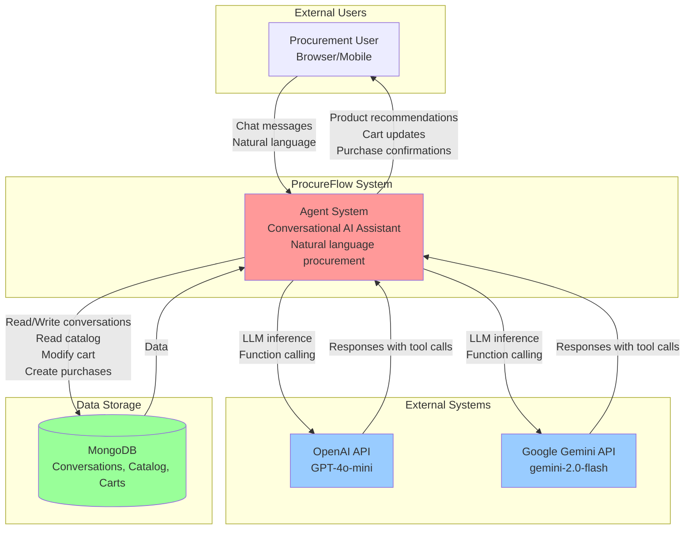
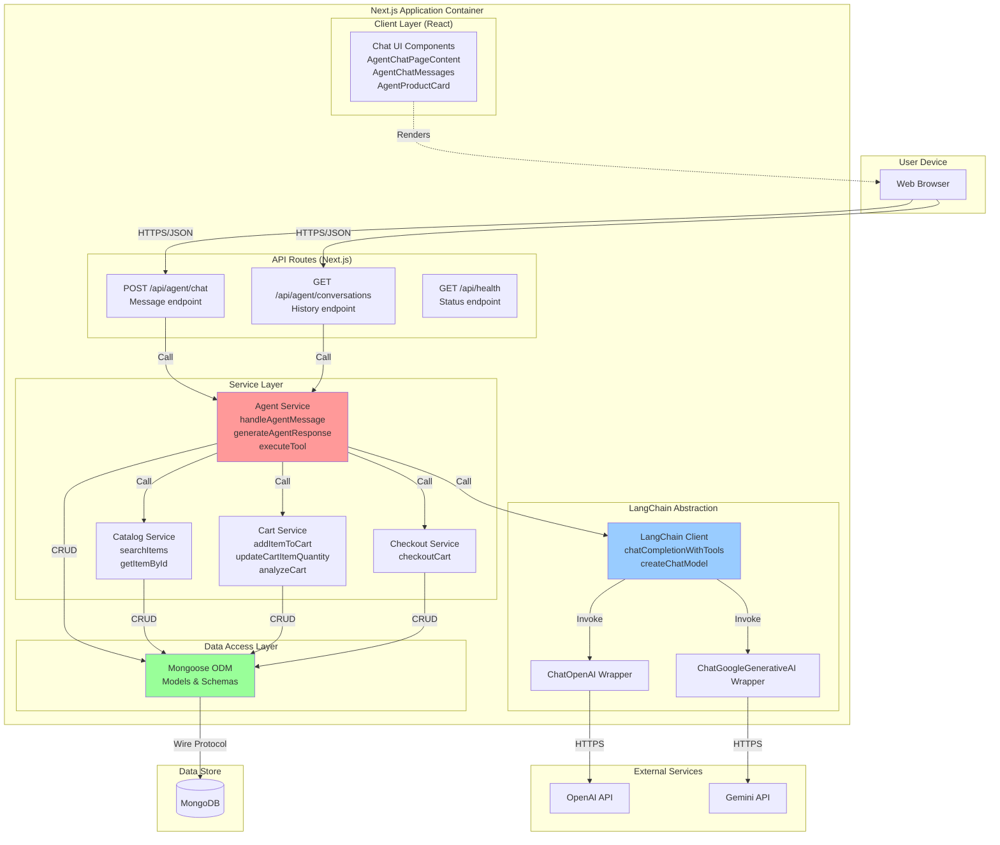
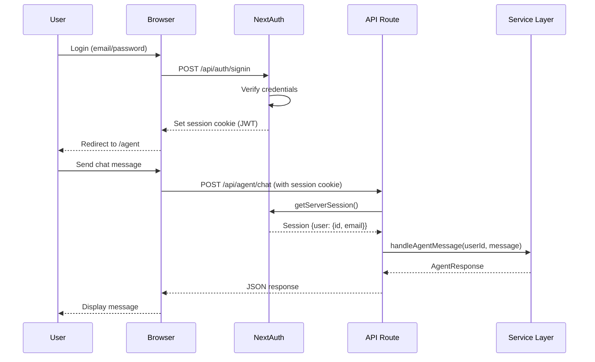

# Agent System - C4 Architecture Diagrams

**Document Version**: 1.0  
**Date**: 2025-11-10  
**Scope**: C4 Level 1 (System Context) and Level 2 (Container) diagrams for ProcureFlow Agent System

---

## C4 Level 1: System Context Diagram

### Purpose

Show how the Agent System fits within the broader ProcureFlow ecosystem and its external dependencies.



### Key Relationships

| From         | To           | Protocol/Interface    | Purpose                                                |
| ------------ | ------------ | --------------------- | ------------------------------------------------------ |
| User         | Agent System | HTTPS/REST            | Send chat messages, receive responses                  |
| Agent System | OpenAI API   | HTTPS/REST            | LLM inference with function calling                    |
| Agent System | Gemini API   | HTTPS/REST            | LLM inference with tool calling (alternative provider) |
| Agent System | MongoDB      | MongoDB Wire Protocol | Persist conversations, read catalog, modify cart       |

### External Dependencies

**OpenAI API**:

- **Service**: `https://api.openai.com/v1/chat/completions`
- **Model**: `gpt-4o-mini`
- **Rate Limits**: Varies by tier (default: 10K RPM, 2M TPM)
- **Authentication**: Bearer token (`OPENAI_API_KEY`)
- **Timeout**: 30s (configured in code)
- **Retries**: ❌ None (single-shot)

**Google Gemini API**:

- **Service**: `https://generativelanguage.googleapis.com/v1beta/models`
- **Model**: `gemini-2.0-flash`
- **Rate Limits**: Free tier: 15 RPM, 1500 RPD
- **Authentication**: API key query parameter
- **Timeout**: ❌ Not explicitly configured
- **Retries**: ❌ None (single-shot)

**MongoDB**:

- **Connection**: `mongodb://localhost:27017/procureflow` (dev)
- **Collections**: `agent_conversations`, `items`, `carts`, `purchase_requests`, `users`
- **Connection Pooling**: ✅ Enabled (Mongoose default)
- **Indexes**: Text index on `items` (required), compound indexes on `agent_conversations`

---

## C4 Level 2: Container Diagram

### Purpose

Show the internal containers (deployable units) within the Agent System and their interactions.



### Container Details

#### 1. Client Layer (React Components)

**Technology**: React 19, TypeScript, Tailwind CSS  
**Purpose**: Render chat interface, display products, show cart

**Key Components**:

- `AgentChatPageContent` - Main chat container
- `AgentChatMessages` - Message list with auto-scroll
- `MessageBubble` - Individual message display (user/agent)
- `AgentProductCard` - Product card with price/availability
- `AgentProductCarousel` - Horizontal scrollable product list
- `AgentCartView` - Cart summary display
- `MarkdownText` - Markdown renderer for agent responses

**State Management**:

- React hooks (`useState`, `useEffect`)
- SWR for conversation history fetching
- Context API for cart state (if needed)

**Communication**:

- Fetch API to backend routes
- JSON request/response format

---

#### 2. API Routes (Next.js Edge Runtime)

**Technology**: Next.js 15 App Router, TypeScript  
**Purpose**: HTTP API endpoints for chat, conversations, health check

**Routes**:

| Route                           | Method | Handler                                           | Authentication | Purpose                       |
| ------------------------------- | ------ | ------------------------------------------------- | -------------- | ----------------------------- |
| `/api/agent/chat`               | POST   | `app/(app)/api/agent/chat/route.ts`               | ✅ Required    | Send message to agent         |
| `/api/agent/conversations`      | GET    | `app/(app)/api/agent/conversations/route.ts`      | ✅ Required    | List user conversations       |
| `/api/agent/conversations/[id]` | GET    | `app/(app)/api/agent/conversations/[id]/route.ts` | ✅ Required    | Get conversation by ID        |
| `/api/health`                   | GET    | `app/(app)/api/health/route.ts`                   | ❌ Public      | Health check (DB + AI status) |

**Responsibilities**:

- Request validation
- Session authentication (NextAuth)
- Error handling & HTTP status mapping
- Response formatting

**Security**:

- ✅ Session-based authentication
- ❌ No rate limiting
- ❌ No request size limits
- ❌ No input sanitization

---

#### 3. Service Layer

**Technology**: TypeScript, feature-based organization  
**Purpose**: Business logic implementation, domain operations

**Services**:

**Agent Service** (`features/agent/lib/agent.service.ts`):

- `handleAgentMessage()` - Main orchestration
- `generateAgentResponse()` - LLM interaction + tool execution
- `executeTool()` - Map tool names to service functions
- `listConversationsForUser()` - Conversation history
- `getConversationById()` - Load conversation with messages

**Catalog Service** (`features/catalog/lib/catalog.service.ts`):

- `searchItems()` - Full-text search with price filter
- `createItem()` - Add item with duplicate detection
- `getItemById()` - Fetch single item
- `updateItem()` - Modify item

**Cart Service** (`features/cart/lib/cart.service.ts`):

- `getCartForUser()` - Load user cart
- `addItemToCart()` - Add item or increment quantity
- `updateCartItemQuantity()` - Set exact quantity
- `removeCartItem()` - Delete item from cart
- `analyzeCart()` - Calculate min/max/avg prices

**Checkout Service** (`features/checkout/lib/checkout.service.ts`):

- `checkoutCart()` - Create purchase request from cart
- `getPurchaseRequestsForUser()` - List user purchases
- `getPurchaseRequestById()` - Get purchase details

**Design Patterns**:

- ✅ Service layer pattern (business logic isolated from routes)
- ✅ Domain entities (framework-agnostic types)
- ✅ Error classes (ValidationError, DuplicateItemError, etc)
- ✅ Dependency injection (services receive userId, not session)

---

#### 4. LangChain Abstraction Layer

**Technology**: LangChain 1.0, TypeScript  
**Purpose**: Normalize ChatModel API across OpenAI and Gemini

**Components**:

**LangChain Client** (`lib/ai/langchainClient.ts`):

- `chatCompletionWithTools()` - Main entry point for function calling
- `createChatModel()` - Factory for ChatOpenAI or ChatGoogleGenerativeAI
- `chatCompletion()` - Simple completion without tools
- `getModelConfig()` - Return active provider config
- `isAIAvailable()` - Check if API keys are configured

**Message Formatting**:

- `SystemMessage` - System prompt (tool definitions, behavior)
- `HumanMessage` - User input
- `AIMessage` - Assistant response (for history)

**Tool Calling**:

- Format tools as OpenAI function definitions
- Extract `tool_calls` from `response.additional_kwargs`
- Parse tool arguments from JSON string

**Error Handling**:

- ✅ API key validation
- ✅ Rate limit detection (429 status)
- ✅ Quota exceeded detection
- ✅ Timeout detection
- ❌ No retries
- ❌ No circuit breaker

---

#### 5. Data Access Layer (Mongoose ODM)

**Technology**: Mongoose 8.10, MongoDB Node.js Driver  
**Purpose**: Schema validation, model abstraction, connection management

**Schemas**:

- `AgentConversationSchema` - Conversation with messages[]
- `ItemSchema` - Catalog items
- `CartSchema` - User carts
- `PurchaseRequestSchema` - Checkout records
- `UserSchema` - User accounts

**Connection Management**:

```typescript
// lib/db/mongoose.ts
let cached = global.mongoose;
if (!cached) {
  cached = global.mongoose = { conn: null, promise: null };
}
```

**Features**:

- ✅ Connection caching (handles Next.js hot reloads)
- ✅ Schema validation
- ✅ Virtual properties
- ✅ Instance methods
- ✅ Indexes (text, compound)
- ❌ No connection pooling config
- ❌ No query logging

---

## Data Flow Across Containers

### Synchronous Flow (Agent Message)

```
Browser
  → POST /api/agent/chat {message, conversationId}
    → AgentService.handleAgentMessage()
      → MongoDB (load conversation)
      → AgentService.generateAgentResponse()
        → LangChainClient.chatCompletionWithTools()
          → ChatOpenAI.invoke() OR ChatGoogleGenerativeAI.invoke()
            → OpenAI API OR Gemini API
          ← LLM response with tool_calls
        ← Parsed tool calls
        → AgentService.executeTool()
          → CatalogService.searchItems() / CartService.addItemToCart() / etc
            → MongoDB (query/mutation)
          ← Tool result
        ← Agent response with metadata
      → MongoDB (save messages)
    ← AgentResponse
  ← JSON response
← Render in Chat UI
```

### Asynchronous Flow (None - all operations are synchronous)

**Missing**: No background jobs, webhooks, or async processing.

---

## Deployment Architecture

### Current State (Development)

```
Local Machine
  ├── Next.js Dev Server (port 3000)
  │   ├── React Client (browser)
  │   ├── API Routes (Node.js)
  │   └── Service Layer (in-process)
  └── MongoDB (port 27017, Docker or local)

External
  ├── OpenAI API (https://api.openai.com)
  └── Gemini API (https://generativelanguage.googleapis.com)
```

### Proposed Production (Cloud Run)

```
GCP Cloud Run
  ├── Container: procureflow-web
  │   ├── Next.js SSR
  │   ├── API Routes
  │   └── Service Layer
  │
  ├── MongoDB Atlas (or Cloud SQL for PostgreSQL)
  │
  └── Secrets Manager
      ├── OPENAI_API_KEY
      ├── GOOGLE_API_KEY
      ├── MONGODB_URI
      └── NEXTAUTH_SECRET

External
  ├── OpenAI API
  └── Gemini API
```

**Infrastructure as Code**: Pulumi (TypeScript) in `infra/pulumi/gcp/`

---

## Scalability & Performance

### Bottlenecks

1. **LLM API Latency** (p95: 2-5s)
   - Blocking synchronous calls
   - No streaming
   - No caching

2. **MongoDB Text Search** (p95: 100-500ms)
   - Full-text search on large catalogs
   - No pagination
   - No result caching

3. **Single-threaded Node.js**
   - No parallelization of tool calls
   - No batch processing

4. **No CDN for Static Assets**
   - All requests go to Next.js server

### Proposed Improvements

1. **Streaming Responses**
   - Use `astream()` instead of `invoke()`
   - Stream LLM output to client (SSE or WebSockets)

2. **Response Caching**
   - Cache common queries (Redis)
   - Invalidate on catalog changes

3. **Horizontal Scaling**
   - Stateless API routes (no session affinity needed)
   - Deploy multiple Cloud Run instances
   - Load balancer in front

4. **Database Optimization**
   - Read replicas for search queries
   - Pagination for large result sets
   - Pre-compute embeddings for semantic search

---

## Security Architecture

### Authentication Flow



### Threat Model

| Threat                      | Mitigations                           | Status             |
| --------------------------- | ------------------------------------- | ------------------ |
| **Prompt Injection**        | Input sanitization, output validation | ❌ Not implemented |
| **PII Leakage**             | PII redaction before storage          | ❌ Not implemented |
| **Rate Limiting Abuse**     | Per-user/IP rate limits               | ❌ Not implemented |
| **Unauthorized Access**     | Session-based auth                    | ✅ Implemented     |
| **SQL Injection** (MongoDB) | Mongoose schema validation            | ✅ Implemented     |
| **XSS**                     | React auto-escaping                   | ✅ Implemented     |
| **CSRF**                    | NextAuth CSRF tokens                  | ✅ Implemented     |
| **API Key Exposure**        | Environment variables only            | ✅ Implemented     |

---

## Document Version

**Version**: 1.0  
**Last Updated**: 2025-11-10  
**Next Review**: After implementation of proposed improvements
