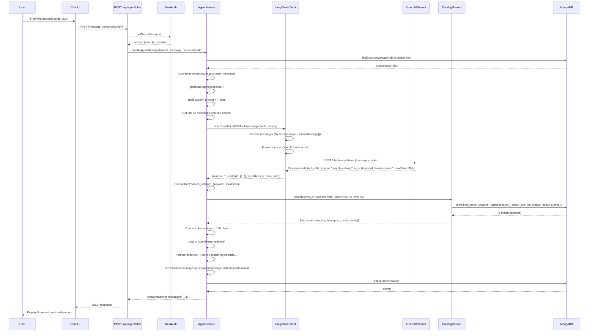
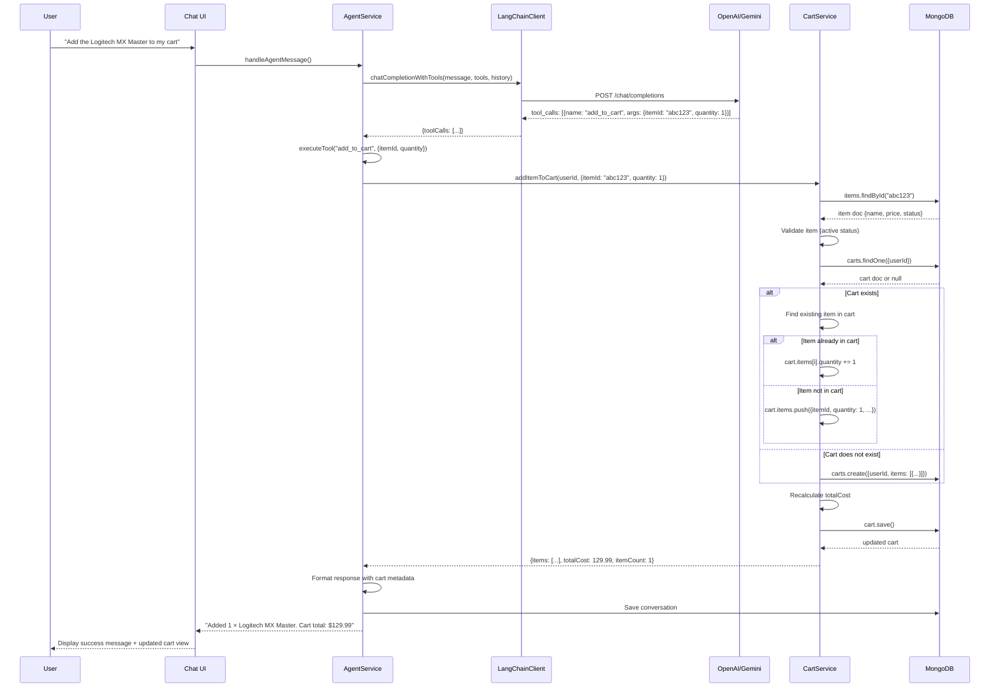
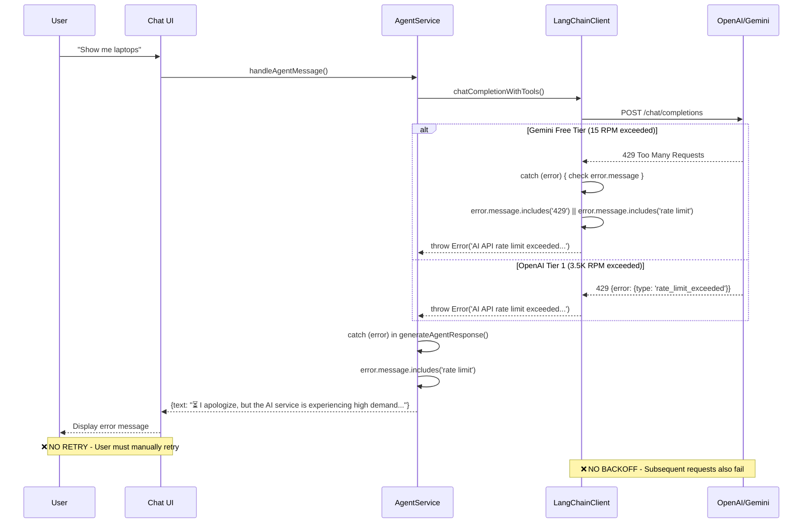
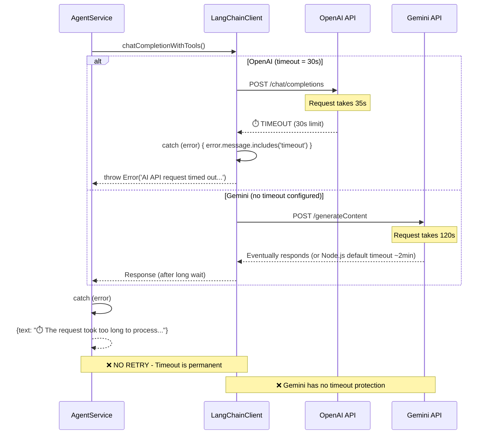
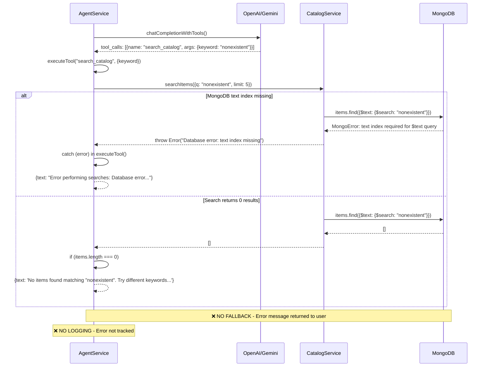
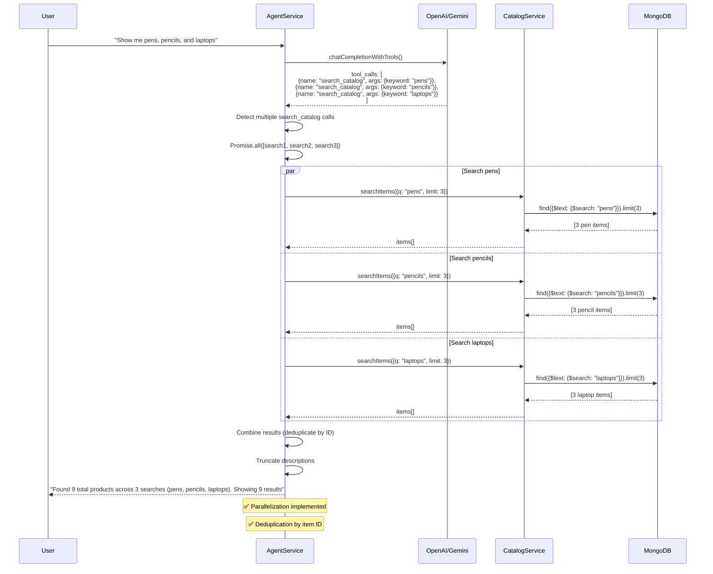
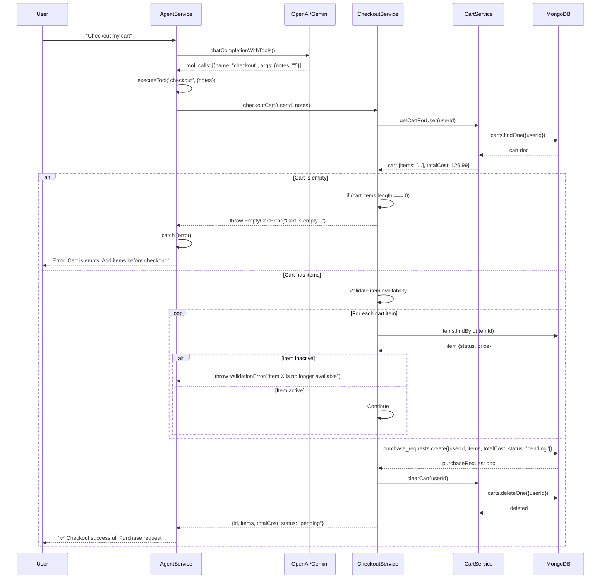
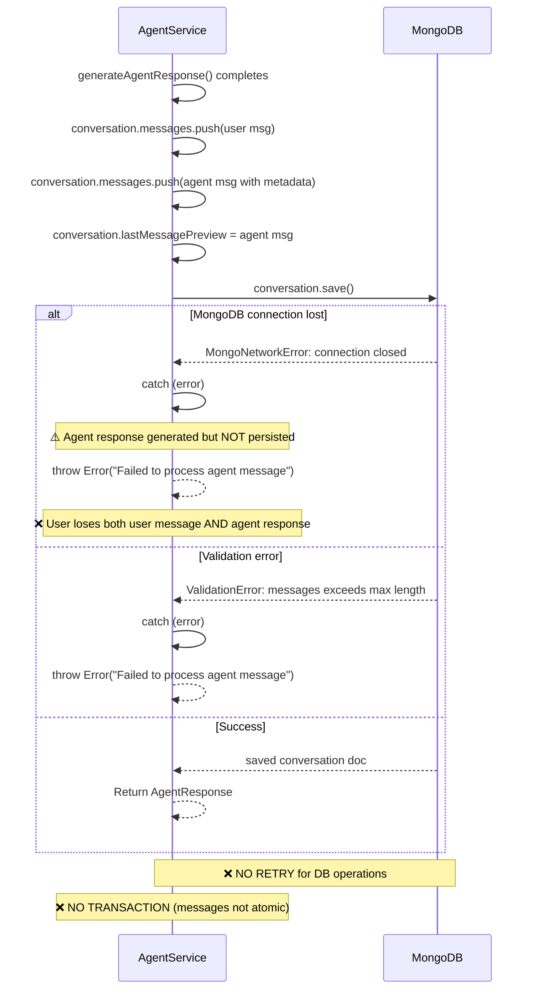

# Agent System - Sequence Flows

**Document Version**: 1.0  
**Date**: 2025-11-10  
**Scope**: Key user journeys with happy path, failure scenarios, and retry branches

---

## 1. Happy Path: Search Catalog

### Sequence Diagram

---

## 2. Happy Path: Add to Cart

### Sequence Diagram

---

## 3. Failure Scenario: Rate Limit Exceeded

### Sequence Diagram

**Current Issues**:

- ❌ No automatic retry
- ❌ No exponential backoff
- ❌ No queueing (request is dropped)
- ❌ No circuit breaker (keeps hitting 429)

---

## 4. Failure Scenario: LLM Timeout

### Sequence Diagram

---

## 5. Failure Scenario: Tool Execution Failure

### Sequence Diagram

---

## 6. Multi-Tool Execution (Parallel Search)

### Sequence Diagram

---

## 7. Checkout Flow with Validation

### Sequence Diagram

---

## 8. Error Recovery: Conversation Save Failure

### Sequence Diagram

**Risk**: Agent response is discarded if save fails.

---

## Performance Metrics

| Flow                   | Avg Latency (p50) | p95 Latency | Bottleneck                         |
| ---------------------- | ----------------- | ----------- | ---------------------------------- |
| Search catalog         | ~2.5s             | ~4s         | LLM API call (1.5-3s)              |
| Add to cart            | ~2s               | ~3.5s       | LLM API call                       |
| View cart              | ~1.8s             | ~3s         | LLM API call (tool has no DB call) |
| Checkout               | ~2.2s             | ~3.8s       | LLM + validation + DB writes       |
| Multi-search (3 items) | ~3s               | ~5s         | LLM + parallel DB queries          |

**Notes**:

- LLM API call: 1.5-3s (OpenAI p50), 2-4s (Gemini p50)
- MongoDB text search: 50-200ms
- Network overhead: 100-300ms

---

## Retry & Error Handling Summary

| Scenario                   | Current Behavior                | Recommended                                |
| -------------------------- | ------------------------------- | ------------------------------------------ |
| LLM rate limit (429)       | ❌ Immediate error to user      | ✅ Retry with exponential backoff          |
| LLM timeout                | ❌ Immediate error to user      | ✅ Retry once, then fail                   |
| LLM quota exceeded         | ❌ Error to user                | ✅ Fallback to alternate provider (Gemini) |
| Tool execution failure     | ❌ Error message in chat        | ✅ Retry tool call, log error              |
| DB connection error        | ❌ Error to user, response lost | ✅ Retry with exponential backoff          |
| DB validation error        | ❌ Error to user                | ✅ Log error, return user-friendly message |
| MongoDB text index missing | ❌ Database error               | ✅ Graceful fallback to keyword search     |

---

**Document Version**: 1.0  
**Last Updated**: 2025-11-10  
**Next Review**: After retry logic implementation
