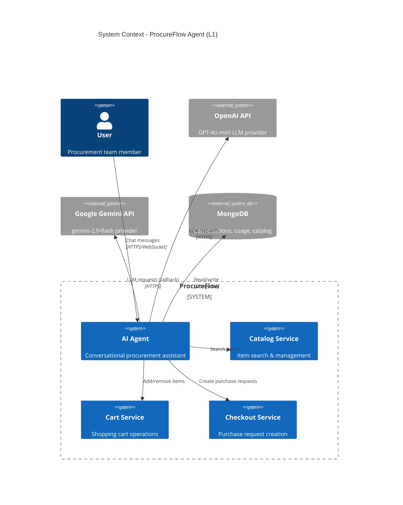
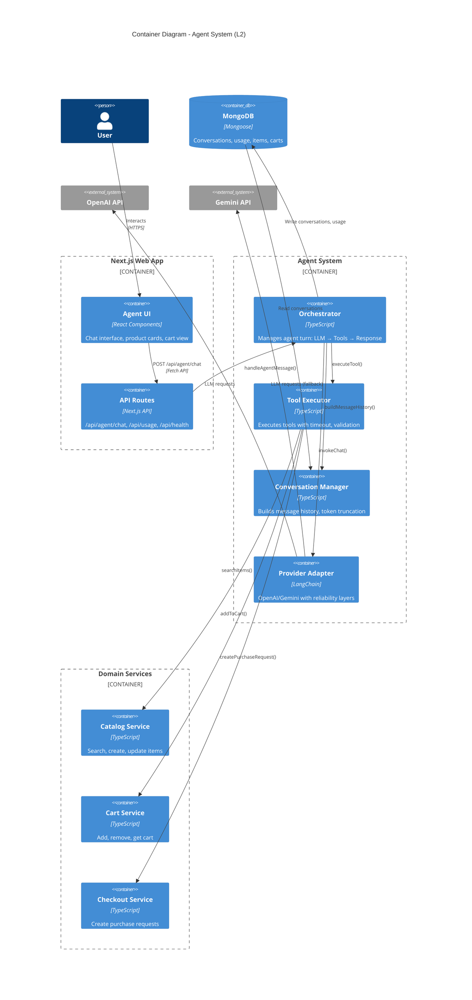
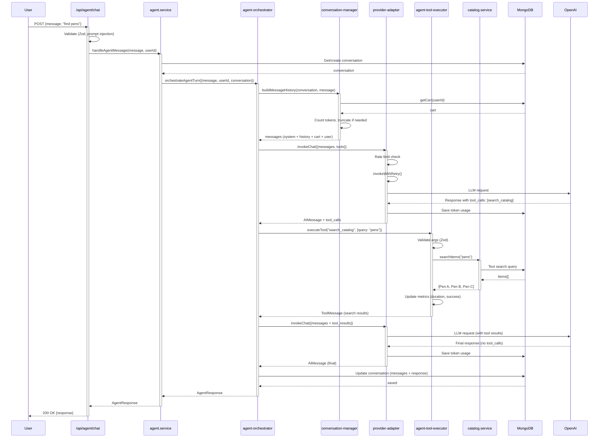
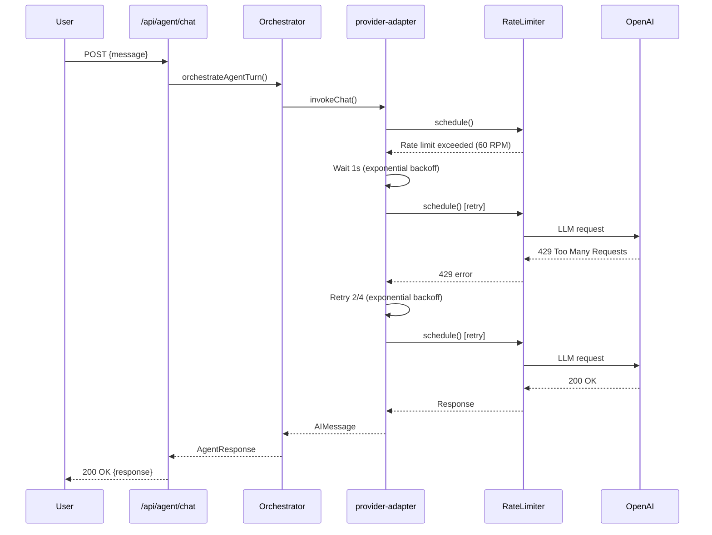
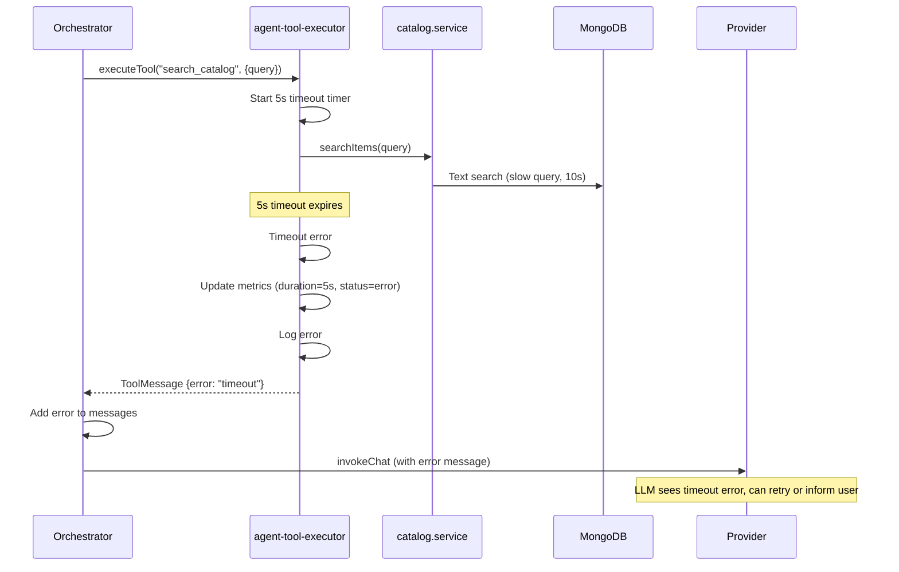
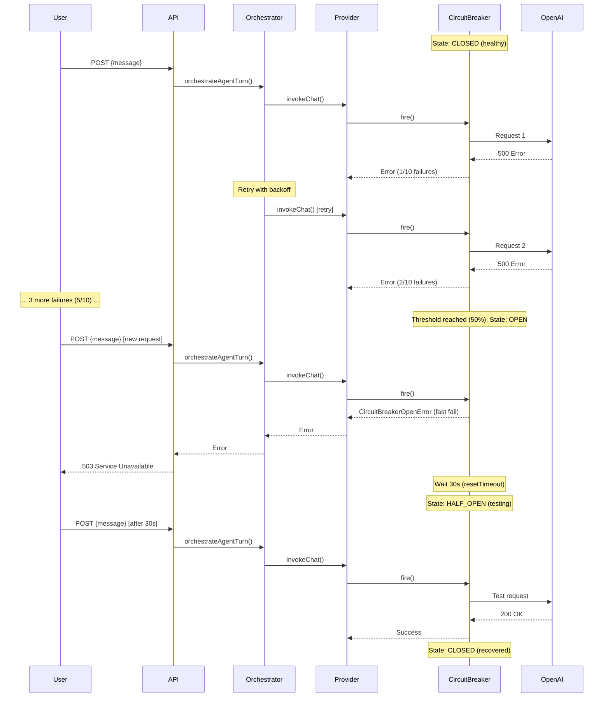

# Agent System - Target Architecture

**Status**: Final Design (Step 7 of 12)  
**Created**: 2025-11-10  
**Purpose**: Document the target architecture for the agent refactor with C4 diagrams and sequence flows

---

## Overview

This document defines the **target architecture** for the ProcureFlow agent system after the Step 8 refactor. The design emphasizes:

- **Separation of concerns**: Orchestrator → Tools → Providers → DB
- **Reliability**: Rate limiting, retries, circuit breakers, timeouts
- **Observability**: Metrics, logging, tracing at every layer
- **Testability**: Service layer isolation, dependency injection
- **Scalability**: Stateless design, token-based truncation

**Key Changes from Current State**:

| Aspect            | Current (Step 6)                       | Target (Step 8+)                                                    |
| ----------------- | -------------------------------------- | ------------------------------------------------------------------- |
| File structure    | Single `agent.service.ts` (500+ lines) | 4 files: orchestrator, tool-executor, conversation-manager, service |
| Tool execution    | Inline in service                      | Dedicated `agent-tool-executor.ts` with timeout                     |
| Memory management | Message count limit (50)               | Token-based truncation (3000 tokens)                                |
| Error handling    | Per-tool try/catch                     | Unified in orchestrator with circuit breaker                        |
| Message history   | Full conversation                      | Token-budgeted with truncation/summarization                        |

---

## C4 Architecture Diagrams

### Level 1: System Context Diagram



**Key External Dependencies**:

- **OpenAI API**: Primary LLM provider (gpt-4o-mini)
- **Google Gemini API**: Fallback provider (gemini-2.0-flash)
- **MongoDB**: Persistence (conversations, token usage, catalog, cart)

**Failure Modes**:

- OpenAI down → Auto-switch to Gemini (provider adapter)
- Both providers down → Circuit breaker opens, error response
- MongoDB down → Health check fails, no conversation persistence

---

### Level 2: Container Diagram



**Container Responsibilities**:

| Container                | Responsibilities                                                              | Dependencies                                                   |
| ------------------------ | ----------------------------------------------------------------------------- | -------------------------------------------------------------- |
| **Orchestrator**         | Agent turn loop (max 10 tool calls), error handling, conversation persistence | Provider Adapter, Tool Executor, Conversation Manager, MongoDB |
| **Tool Executor**        | Tool validation, execution with 5s timeout, error mapping                     | Domain Services (Catalog, Cart, Checkout)                      |
| **Conversation Manager** | Message history building, token counting, truncation/summarization            | MongoDB (AgentConversationModel)                               |
| **Provider Adapter**     | LLM invocation, rate limiting, retries, circuit breaker, provider selection   | OpenAI, Gemini, Reliability layers                             |
| **Domain Services**      | Business logic (search, cart, checkout), DB queries                           | MongoDB models                                                 |

---

## Component Architecture (Step 8 File Split)

### File Structure

```
src/features/agent/lib/
├── agent.service.ts              # Entry point (handleAgentMessage)
├── agent-orchestrator.ts         # NEW: Agent turn orchestration
├── agent-tool-executor.ts        # NEW: Tool execution with timeout
└── conversation-manager.ts       # NEW: Message history & truncation
```

### Component Design

#### 1. `agent.service.ts` (Simplified Entry Point)

**Purpose**: Public API entry point, delegates to orchestrator

```typescript
export async function handleAgentMessage(
  userMessage: string,
  userId: string,
  conversationId?: string
): Promise<AgentResponse> {
  // 1. Validate input (Zod, prompt injection, moderation)
  // 2. Get or create conversation
  // 3. Delegate to orchestrator
  return await orchestrateAgentTurn({
    userMessage,
    userId,
    conversationId,
    conversation,
  });
}
```

**Responsibilities**:

- Input validation (already integrated in Step 5)
- Conversation retrieval/creation
- Delegation to orchestrator
- High-level error handling (500s)

**Lines of Code**: ~150 (down from 500+)

---

#### 2. `agent-orchestrator.ts` (NEW - Core Logic)

**Purpose**: Manage agent turn lifecycle (LLM → Tools → Response)

```typescript
export async function orchestrateAgentTurn(params: {
  userMessage: string;
  userId: string;
  conversationId: string;
  conversation: AgentConversation;
}): Promise<AgentResponse> {
  const { userMessage, userId, conversationId, conversation } = params;

  // 1. Build message history with token budget
  const messages = await buildMessageHistory(conversation, userMessage);

  // 2. Invoke LLM with tools (provider adapter)
  const maxIterations = 10;
  let iteration = 0;
  let finalResponse: AIMessage;

  while (iteration < maxIterations) {
    const response = await invokeChat({
      provider: getCurrentProvider(),
      model: getModel(),
      messages,
      tools: AGENT_TOOLS,
      userId,
      conversationId,
    });

    // 3. Check if LLM wants to call tools
    if (!response.tool_calls || response.tool_calls.length === 0) {
      finalResponse = response;
      break;
    }

    // 4. Execute tools with timeout
    const toolResults = await Promise.all(
      response.tool_calls.map((tc) =>
        executeTool(tc.name, tc.args, userId, conversationId, { timeout: 5000 })
      )
    );

    // 5. Add tool results to messages, continue loop
    messages.push(response);
    messages.push(...toolResults);
    iteration++;
  }

  // 6. Update conversation in DB
  await saveConversation(conversation, messages, finalResponse);

  // 7. Return structured response
  return formatAgentResponse(finalResponse, conversation);
}
```

**Responsibilities**:

- Agent turn loop (max 10 iterations)
- Call LLM via provider adapter
- Execute tools via tool executor
- Persist conversation + usage
- Unified error handling

**Lines of Code**: ~250

**Error Handling**:

- Rate limit exceeded → Retry with backoff (handled in provider adapter)
- Circuit breaker open → Return error, suggest retry later
- Tool timeout → Log error, return error message to LLM
- Max iterations reached → Return partial response with warning

---

#### 3. `agent-tool-executor.ts` (NEW - Tool Execution)

**Purpose**: Execute agent tools with validation, timeout, error mapping

```typescript
export async function executeTool(
  toolName: string,
  args: Record<string, unknown>,
  userId: string,
  conversationId: string,
  options: { timeout: number } = { timeout: 5000 }
): Promise<ToolMessage> {
  const startTime = Date.now();

  try {
    // 1. Validate tool arguments (Zod schemas)
    const validatedArgs = validateToolArgs(toolName, args);

    // 2. Execute with timeout
    const result = await Promise.race([
      executeToolInternal(toolName, validatedArgs, userId, conversationId),
      timeoutPromise(options.timeout),
    ]);

    // 3. Update metrics
    const duration = Date.now() - startTime;
    agentToolDuration.observe(
      { tool: toolName, status: 'success' },
      duration / 1000
    );

    // 4. Return ToolMessage
    return new ToolMessage({
      tool_call_id: args.tool_call_id,
      content: JSON.stringify(result),
    });
  } catch (error) {
    // Log error, update metrics
    const duration = Date.now() - startTime;
    agentToolDuration.observe(
      { tool: toolName, status: 'error' },
      duration / 1000
    );
    agentToolErrors.inc({ tool: toolName, error_type: error.name });

    logger.error('Tool execution failed', {
      toolName,
      error,
      userId,
      conversationId,
    });

    // Return error message to LLM
    return new ToolMessage({
      tool_call_id: args.tool_call_id,
      content: JSON.stringify({ error: error.message }),
    });
  }
}

async function executeToolInternal(
  toolName: string,
  args: Record<string, unknown>,
  userId: string,
  conversationId: string
): Promise<unknown> {
  switch (toolName) {
    case 'search_catalog':
      return await searchItems(args.query, {
        limit: args.limit,
        minPrice: args.minPrice,
        maxPrice: args.maxPrice,
      });

    case 'add_to_cart':
      return await addToCart(userId, args.itemId, args.quantity);

    case 'get_cart':
      return await getCart(userId);

    case 'checkout':
      return await createPurchaseRequest(userId, args.deliveryDate, args.notes);

    default:
      throw new Error(`Unknown tool: ${toolName}`);
  }
}

function timeoutPromise(ms: number): Promise<never> {
  return new Promise((_, reject) =>
    setTimeout(() => reject(new Error(`Tool execution timeout (${ms}ms)`)), ms)
  );
}
```

**Responsibilities**:

- Tool argument validation (Zod)
- Tool execution with timeout (default 5s)
- Error handling (graceful degradation)
- Metrics tracking (duration, error rates)

**Lines of Code**: ~200

**Metrics**:

- `agentToolDuration{tool, status}`: Histogram of tool execution time
- `agentToolErrors{tool, error_type}`: Counter of tool errors

---

#### 4. `conversation-manager.ts` (NEW - Memory Management)

**Purpose**: Build message history with token budget, truncation, summarization

```typescript
export async function buildMessageHistory(
  conversation: AgentConversation,
  newUserMessage: string,
  maxTokens: number = 3000
): Promise<BaseMessage[]> {
  const messages: BaseMessage[] = [];

  // 1. Add system message (always included)
  messages.push(new SystemMessage(SYSTEM_PROMPT));

  // 2. Add cart context (always included)
  const cart = await getCart(conversation.userId);
  if (cart && cart.items.length > 0) {
    messages.push(new SystemMessage(formatCartContext(cart)));
  }

  // 3. Add conversation history (token-budgeted)
  const historyMessages = conversation.messages || [];
  let historyTokens = 0;
  const includedHistory: BaseMessage[] = [];

  // Work backwards from most recent
  for (let i = historyMessages.length - 1; i >= 0; i--) {
    const msg = historyMessages[i];
    const msgTokens = countTokens(msg.content, 'gpt-4o-mini');

    // Check token budget
    if (historyTokens + msgTokens > maxTokens) {
      logger.info('Message history truncated', {
        conversationId: conversation._id,
        totalMessages: historyMessages.length,
        includedMessages: includedHistory.length,
        truncatedMessages: i + 1,
        tokenBudget: maxTokens,
        tokensUsed: historyTokens,
      });
      break;
    }

    historyTokens += msgTokens;
    includedHistory.unshift(convertToBaseMessage(msg));
  }

  messages.push(...includedHistory);

  // 4. Add new user message
  messages.push(new HumanMessage(newUserMessage));

  // 5. Log token usage
  const totalTokens = messages.reduce(
    (sum, msg) => sum + countTokens(msg.content, 'gpt-4o-mini'),
    0
  );
  logger.debug('Message history built', {
    conversationId: conversation._id,
    totalMessages: messages.length,
    totalTokens,
    maxTokens,
  });

  return messages;
}

function convertToBaseMessage(msg: ConversationMessage): BaseMessage {
  switch (msg.sender) {
    case 'user':
      return new HumanMessage(msg.content);
    case 'assistant':
      return new AIMessage(msg.content);
    case 'system':
      return new SystemMessage(msg.content);
    default:
      throw new Error(`Unknown sender: ${msg.sender}`);
  }
}

function formatCartContext(cart: Cart): string {
  const itemList = cart.items
    .map(
      (item) =>
        `- ${item.name} (x${item.quantity}) - $${(item.price * item.quantity).toFixed(2)}`
    )
    .join('\n');

  return `Current cart (${cart.items.length} items, $${cart.totalPrice.toFixed(2)}):\n${itemList}`;
}
```

**Responsibilities**:

- Build message history from conversation
- Token-based truncation (default 3000 tokens)
- Cart context injection
- Summarization hook (stub for future)
- Truncation logging

**Lines of Code**: ~150

**Configuration** (`.env.example`):

```env
# Agent memory limits
AGENT_MAX_INPUT_TOKENS=3000      # Max tokens for message history
AGENT_MAX_TOTAL_TOKENS=4000      # Max tokens for entire request (history + response)
AGENT_MAX_ITERATIONS=10          # Max tool-calling loops per turn
```

---

## Sequence Diagrams

### Happy Path: Successful Agent Turn



**Key Points**:

1. Validation happens at API route (Step 5)
2. Token-based truncation in conversation manager
3. Provider adapter handles rate limiting, retries automatically
4. Tool execution isolated with timeout
5. Token usage tracked for both LLM calls

---

### Error Path: Rate Limit Exceeded



**Resilience Layers**:

1. **Rate limiter** (Bottleneck): Queues requests, 60 RPM limit
2. **Retry** (p-retry): 4 attempts with exponential backoff (1s → 2s → 4s)
3. **Circuit breaker** (Opossum): Opens after 50% failures, prevents cascading failures

---

### Error Path: Tool Timeout



**Timeout Handling**:

- Default: 5s per tool execution
- On timeout: Return error message to LLM (not thrown to user)
- LLM can decide: Retry tool, inform user, or use fallback strategy

---

### Error Path: Circuit Breaker Open



**Circuit Breaker States**:

- **CLOSED**: Normal operation, all requests allowed
- **OPEN**: Fast fail, block all requests (503 error)
- **HALF_OPEN**: Test with single request, if success → CLOSED, if fail → OPEN

**Configuration**:

- Threshold: 50% error rate over 10 requests
- Reset timeout: 30s (wait before testing recovery)

---

## Data Flow

### Message History Token Budget

```
┌─────────────────────────────────────────────────┐
│ Token Budget: 3000 tokens                       │
└─────────────────────────────────────────────────┘
                      │
                      ▼
┌─────────────────────────────────────────────────┐
│ ALWAYS INCLUDED (Priority 1)                    │
│ - System Prompt (~200 tokens)                   │
│ - Cart Context (~100 tokens)                    │
│ - New User Message (~50 tokens)                 │
│ = 350 tokens reserved                           │
└─────────────────────────────────────────────────┘
                      │
                      ▼
┌─────────────────────────────────────────────────┐
│ CONVERSATION HISTORY (Priority 2)               │
│ Budget: 3000 - 350 = 2650 tokens                │
│                                                  │
│ Strategy: Work backwards from most recent       │
│ - Message N (most recent): 200 tokens ✓         │
│ - Message N-1: 180 tokens ✓                     │
│ - Message N-2: 150 tokens ✓                     │
│ - ...                                            │
│ - Message 5: 120 tokens ✓                       │
│ - Message 4: 100 tokens (would exceed budget) ✗ │
│                                                  │
│ Total history: 2500 tokens (5 messages)         │
│ Truncated: 4 oldest messages                    │
└─────────────────────────────────────────────────┘
                      │
                      ▼
┌─────────────────────────────────────────────────┐
│ FINAL MESSAGE ARRAY                              │
│ 1. SystemMessage (system prompt)                 │
│ 2. SystemMessage (cart context)                  │
│ 3. HumanMessage (history message N-4)            │
│ 4. AIMessage (history message N-3)               │
│ 5. HumanMessage (history message N-2)            │
│ 6. AIMessage (history message N-1)               │
│ 7. HumanMessage (history message N)              │
│ 8. HumanMessage (new user message)               │
│                                                   │
│ Total: 2850 tokens (under budget)                │
└─────────────────────────────────────────────────┘
```

**Truncation Logging**:

```json
{
  "level": "info",
  "message": "Message history truncated",
  "conversationId": "conv_123",
  "totalMessages": 20,
  "includedMessages": 5,
  "truncatedMessages": 15,
  "tokenBudget": 3000,
  "tokensUsed": 2850
}
```

---

## Metrics & Observability

### Key Metrics (Prometheus)

| Metric Name                          | Type      | Labels                                  | Purpose                               |
| ------------------------------------ | --------- | --------------------------------------- | ------------------------------------- |
| `llm_requests_total`                 | Counter   | `{provider, model, status}`             | Total LLM requests                    |
| `llm_response_time_seconds`          | Histogram | `{provider, model}`                     | LLM response latency (p50, p95, p99)  |
| `llm_tokens_total`                   | Counter   | `{provider, model, type=input\|output}` | Total tokens consumed                 |
| `llm_cost_usd`                       | Counter   | `{provider, model}`                     | Total estimated cost (USD)            |
| `agent_tool_duration_seconds`        | Histogram | `{tool, status}`                        | Tool execution time                   |
| `agent_tool_errors_total`            | Counter   | `{tool, error_type}`                    | Tool execution errors                 |
| `agent_iterations_total`             | Histogram | `{}`                                    | Number of tool-calling loops per turn |
| `agent_conversation_truncated_total` | Counter   | `{}`                                    | Number of conversations truncated     |

### Logging Events

| Event                     | Level   | Context                                                                             |
| ------------------------- | ------- | ----------------------------------------------------------------------------------- |
| Agent turn started        | `info`  | `{conversationId, userId, messageLength}`                                           |
| Message history truncated | `info`  | `{conversationId, totalMessages, includedMessages, truncatedMessages, tokenBudget}` |
| Tool executed             | `debug` | `{tool, duration, status, userId}`                                                  |
| Tool timeout              | `warn`  | `{tool, timeout, userId, conversationId}`                                           |
| LLM request               | `debug` | `{provider, model, inputTokens, outputTokens, cost}`                                |
| Rate limit hit            | `warn`  | `{provider, retryAfter}`                                                            |
| Circuit breaker opened    | `error` | `{provider, failureCount, threshold}`                                               |
| Agent turn completed      | `info`  | `{conversationId, duration, iterations, toolCalls, cost}`                           |

### LangSmith Tracing

All LLM requests traced with:

- Run name: `agent-chat-{conversationId}`
- Tags: `{userId, conversationId, provider, model}`
- Metadata: `{inputTokens, outputTokens, cost, toolCalls}`

---

## Configuration

### Environment Variables (`.env.example`)

```env
# ============================================================================
# Agent Configuration
# ============================================================================

# Memory Limits
AGENT_MAX_INPUT_TOKENS=3000           # Max tokens for message history
AGENT_MAX_TOTAL_TOKENS=4000           # Max tokens for entire request
AGENT_MAX_ITERATIONS=10               # Max tool-calling loops per turn

# Tool Execution
AGENT_TOOL_TIMEOUT_MS=5000            # Tool execution timeout (5s)

# Reliability (Rate Limiting)
RATE_LIMIT_RPM_OPENAI=60              # OpenAI requests per minute
RATE_LIMIT_RPM_GEMINI=15              # Gemini requests per minute (free tier)

# Reliability (Retries)
RETRY_MAX_ATTEMPTS=4                  # Max retry attempts for LLM requests
RETRY_MIN_TIMEOUT_MS=1000             # Min retry delay (exponential backoff)

# Reliability (Circuit Breaker)
CIRCUIT_BREAKER_TIMEOUT_MS=30000      # Reset timeout (30s)
CIRCUIT_BREAKER_ERROR_THRESHOLD=50    # Error threshold percentage (50%)
CIRCUIT_BREAKER_REQUEST_THRESHOLD=10  # Min requests before opening

# Observability
LANGSMITH_TRACING_ENABLED=true        # Enable LangSmith tracing
LANGSMITH_PROJECT=procureflow-agent   # LangSmith project name
LOG_LEVEL=info                        # Winston log level (debug, info, warn, error)
```

---

## Testing Strategy (Step 10)

### Unit Tests

**File**: `src/features/agent/lib/__tests__/agent-orchestrator.test.ts`

```typescript
describe('orchestrateAgentTurn', () => {
  it('should complete turn with zero tool calls', async () => {
    // Mock: LLM returns final response (no tool_calls)
    // Assert: Response returned, conversation saved
  });

  it('should execute tools and continue loop', async () => {
    // Mock: LLM returns tool_calls, then final response
    // Assert: Tools executed, loop continued, conversation saved
  });

  it('should stop at max iterations', async () => {
    // Mock: LLM always returns tool_calls (infinite loop)
    // Assert: Stops at 10 iterations, returns partial response
  });

  it('should handle tool timeout gracefully', async () => {
    // Mock: Tool execution exceeds 5s timeout
    // Assert: Timeout error returned to LLM, turn continues
  });
});
```

**File**: `src/features/agent/lib/__tests__/agent-tool-executor.test.ts`

```typescript
describe('executeTool', () => {
  it('should validate tool arguments', async () => {
    // Mock: Invalid args (quantity = -1)
    // Assert: Zod validation error, ToolMessage with error
  });

  it('should execute tool successfully', async () => {
    // Mock: Valid args, catalog service returns items
    // Assert: ToolMessage with results, metrics updated
  });

  it('should timeout long-running tools', async () => {
    // Mock: Tool execution takes 10s
    // Assert: Timeout error after 5s, metrics updated
  });
});
```

**File**: `src/features/agent/lib/__tests__/conversation-manager.test.ts`

```typescript
describe('buildMessageHistory', () => {
  it('should include system prompt and cart context', async () => {
    // Mock: Empty conversation, cart with 2 items
    // Assert: SystemMessage (prompt + cart) + user message
  });

  it('should truncate history to token budget', async () => {
    // Mock: Conversation with 20 messages, budget 3000 tokens
    // Assert: Most recent 5 messages included, 15 truncated
  });

  it('should log truncation events', async () => {
    // Mock: Truncation happens
    // Assert: logger.info called with truncation details
  });
});
```

### Integration Test (Optional)

**File**: `src/features/agent/lib/__tests__/agent.integration.test.ts`

```typescript
describe('Agent Integration', () => {
  it('should handle end-to-end agent turn with mocked LLM', async () => {
    // Setup: Mock MongoDB, mock LLM responses
    // Test: handleAgentMessage() → search_catalog → add_to_cart → checkout
    // Assert: Conversation saved, tools executed, response correct
  });
});
```

### Health Check (Step 10)

**File**: `src/app/(app)/api/health/route.ts`

```typescript
export async function GET() {
  const health = {
    status: 'healthy',
    timestamp: new Date().toISOString(),
    checks: {
      mongodb: await checkMongoDB(),
      openai: await pingProvider('openai'),
      gemini: await pingProvider('gemini'),
    },
  };

  const allHealthy = Object.values(health.checks).every(
    (c) => c.status === 'ok'
  );
  const statusCode = allHealthy ? 200 : 503;

  return NextResponse.json(health, { status: statusCode });
}
```

**Response**:

```json
{
  "status": "healthy",
  "timestamp": "2025-11-10T12:00:00Z",
  "checks": {
    "mongodb": { "status": "ok", "latency_ms": 15 },
    "openai": { "status": "ok", "latency_ms": 120 },
    "gemini": { "status": "degraded", "latency_ms": 8000, "error": "Timeout" }
  }
}
```

---

## Migration Plan (Step 8)

### Incremental Refactor Steps

1. **Create `conversation-manager.ts`**
   - Extract `buildMessageHistory()` from `agent.service.ts`
   - Implement token-based truncation
   - Add unit tests
   - Verify no regressions (existing tests pass)

2. **Create `agent-tool-executor.ts`**
   - Extract tool execution logic from `agent.service.ts`
   - Add timeout wrapper (5s default)
   - Add Zod validation integration
   - Add metrics tracking
   - Add unit tests

3. **Create `agent-orchestrator.ts`**
   - Extract agent turn loop from `agent.service.ts`
   - Integrate conversation manager
   - Integrate tool executor
   - Add max iterations limit (10)
   - Add unit tests

4. **Refactor `agent.service.ts`**
   - Keep `handleAgentMessage()` as entry point
   - Delegate to orchestrator
   - Remove old logic (now in orchestrator/tool-executor/conv-manager)
   - Update integration tests

5. **Verify & Deploy**
   - Run all tests (unit + integration)
   - Check lint (zero errors)
   - Manual testing: Search → Add to cart → Checkout
   - Deploy to staging, monitor metrics

---

## Acceptance Criteria

**Step 7 Complete When**:

- ✅ This architecture document created
- ✅ C4 diagrams (System Context, Container) rendered
- ✅ Sequence diagrams (happy path, errors) documented
- ✅ File split design documented (4 files: service, orchestrator, tool-executor, conv-manager)
- ✅ Metrics & observability strategy defined
- ✅ Configuration documented (.env.example)
- ✅ Testing strategy outlined

**Step 8 Complete When** (next step):

- ✅ `agent-orchestrator.ts` created with max 10 iterations
- ✅ `agent-tool-executor.ts` created with 5s timeout
- ✅ `conversation-manager.ts` created with token truncation
- ✅ `agent.service.ts` refactored to delegate
- ✅ All tests pass (unit + integration)
- ✅ Zero lint errors
- ✅ Manual testing successful (search, cart, checkout)

---

## References

- **Step 6 Complete**: Token tracking, usage API, cost estimation
- **Step 5 Complete**: Zod validation, prompt injection, moderation
- **Step 4 Complete**: Rate limiting, retries, circuit breaker
- **Step 3 Complete**: Provider adapter (OpenAI/Gemini)
- **Step 2 Complete**: Observability (winston, prometheus, langsmith)

**Next Step**: Step 8 - Refactor Orchestrator to Adapter-First (8h estimate, largest step)
