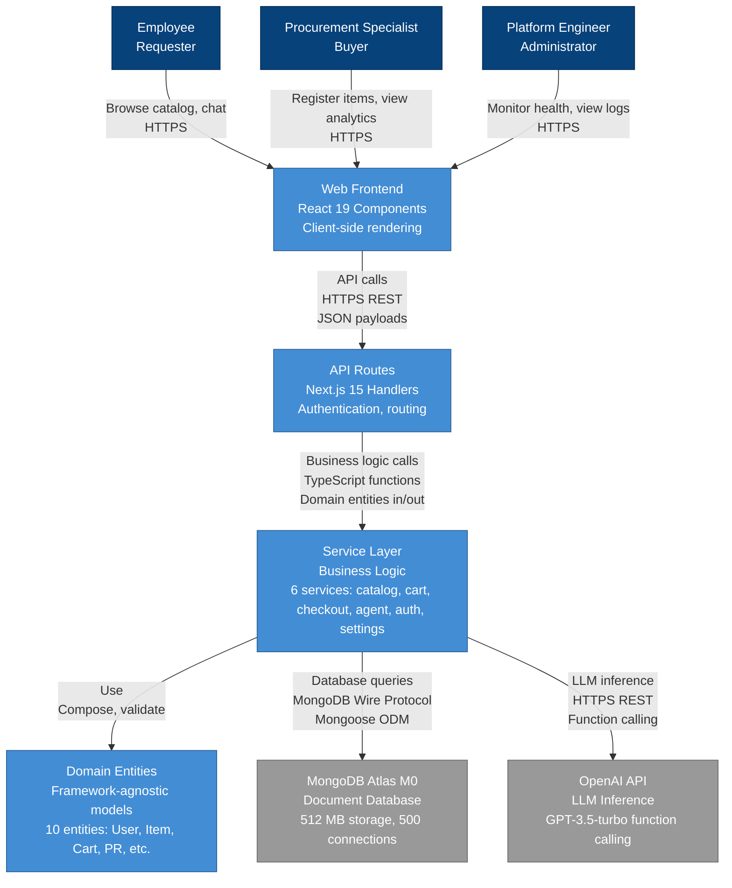
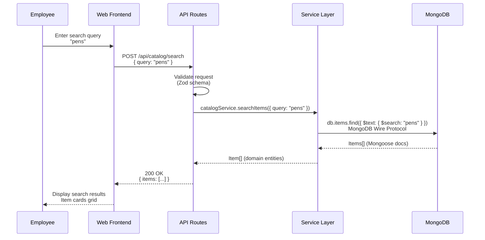
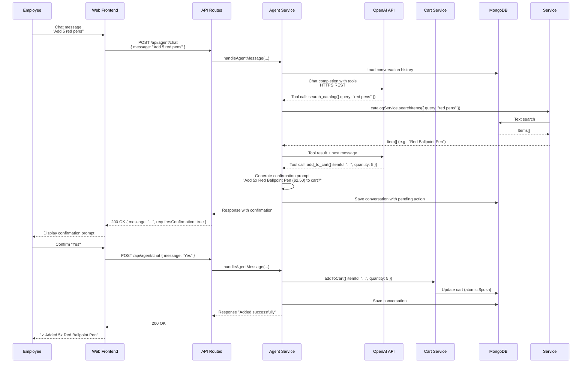
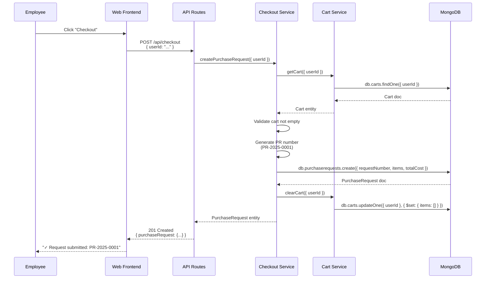

# C4 Container Diagram (Level 2) – ProcureFlow

**Executive Summary**: This Level 2 C4 diagram shows the ProcureFlow system decomposed into runtime containers: Web Frontend (React), API Layer (Next.js routes), Service Layer (business logic), Domain Entities (framework-agnostic models), MongoDB Atlas (persistence), and OpenAI API (LLM inference). Each container has clear responsibilities, and data flows via HTTP/HTTPS, MongoDB Wire Protocol, and REST APIs. The architecture enforces separation of concerns with service-layer business logic isolated from framework code.

---

## Table of Contents

- [Container Diagram](#container-diagram)
- [Container Responsibilities](#container-responsibilities)
- [Data Flows and Protocols](#data-flows-and-protocols)
- [Technology Choices](#technology-choices)
- [Deployment Architecture](#deployment-architecture)
- [Assumptions and Limitations](#assumptions-and-limitations)
- [References](#references)

---

## Container Diagram

---

## Container Responsibilities

### Web Frontend

**Technology**: React 19.2.0 with TypeScript, Tailwind CSS 3, Radix UI  
**Purpose**: User interface and client-side interaction  
**Responsibilities**:

- Render catalog, cart, agent, settings pages with App Router routing
- Handle user input (search queries, cart operations, agent chat)
- Display data from API in responsive layouts (desktop/tablet/mobile)
- Manage client-side state with React Context (CartContext, LayoutContext, BreadcrumbContext)
- Provide real-time feedback (loading states, error messages, success confirmations)
- Ensure accessibility (ARIA labels, keyboard navigation)

**Key Components**:

- Catalog page (`/catalog`) with search and item cards
- Shopping cart page (`/cart`) with CRUD operations
- Agent page (`/agent`) with chat interface and conversational AI
- Authentication pages (login, registration) with NextAuth.js session handling
- Settings page (`/settings`) for user profile management

**Boundaries**:

- No direct database access (all data via API routes)
- No business logic (validation, calculations done in Service Layer)
- No secrets (API keys, connection strings stored server-side only)

---

### API Routes

**Technology**: Next.js 15.0.1 App Router with route handlers (`route.ts`)  
**Purpose**: HTTP request handling, authentication, input validation  
**Responsibilities**:

- Expose REST API endpoints (13 endpoints: catalog, cart, checkout, agent, auth, settings, metrics, health)
- Validate incoming requests with Zod schemas (input sanitization, type checking)
- Enforce authentication with NextAuth.js session validation
- Map HTTP requests to service layer function calls
- Format HTTP responses (JSON payloads, status codes, error messages)
- Handle CORS, rate limiting (future), API versioning (future)

**Key Routes**:

- `POST /api/catalog/search` → `catalogService.searchItems()`
- `POST /api/catalog/items` → `catalogService.createItem()`
- `POST /api/cart` → `cartService.addToCart()`
- `POST /api/checkout` → `checkoutService.createPurchaseRequest()`
- `POST /api/agent/chat` → `agentService.handleAgentMessage()`
- `POST /api/auth/register` → `authService.registerUser()`
- `GET /api/health` → Health check with MongoDB connectivity

**Boundaries**:

- No business logic (defers to Service Layer)
- No direct database queries (all via Service Layer)
- Thin layer focused on HTTP concerns only

---

### Service Layer

**Technology**: TypeScript modules with exported functions (`*.service.ts`)  
**Purpose**: Business logic execution, database-agnostic operations  
**Responsibilities**:

- Implement core business logic (search, item creation, cart operations, checkout, agent orchestration, authentication)
- Validate business rules (BR-2.1: duplicate detection, BR-2.2: quantity limits 1-999, BR-3.1: agent confirmation)
- Orchestrate multi-step workflows (checkout: generate PR number → snapshot cart → clear cart)
- Interact with database via Mongoose models, returning domain entities
- Call external APIs (OpenAI function calling for agent)
- Throw typed errors (ValidationError, DuplicateItemError) for route handlers to catch

**Services and Functions**:

| Service                 | Key Functions                                                                         | Responsibilities                                                                                          |
| ----------------------- | ------------------------------------------------------------------------------------- | --------------------------------------------------------------------------------------------------------- |
| **catalog.service.ts**  | `searchItems()`, `createItem()`, `getItemById()`, `listItems()`                       | Full-text search with MongoDB text index, duplicate detection (case-insensitive name+category), item CRUD |
| **cart.service.ts**     | `addToCart()`, `removeFromCart()`, `updateCartItem()`, `clearCart()`, `getCart()`     | Cart management with quantity validation (1-999), price snapshot, total calculation, atomic updates       |
| **checkout.service.ts** | `createPurchaseRequest()`, `getPurchaseRequests()`, `getPurchaseRequestById()`        | PR generation (PR-YYYY-NNNN), cart snapshot to immutable PR, cart clearing, list/detail views             |
| **agent.service.ts**    | `handleAgentMessage()`, `executeTool()`, `getConversations()`, `deleteConversation()` | LangChain orchestration, OpenAI function calling (8 tools), conversation history, tool logging            |
| **auth.service.ts**     | `registerUser()`, `loginUser()`, `validateSession()`, `refreshSession()`              | User registration with bcrypt, session validation with NextAuth.js, password hashing (10 salt rounds)     |
| **settings.service.ts** | `getUserSettings()`, `updateUserSettings()`                                           | User profile management, preferences (future: theme, language)                                            |

**Boundaries**:

- Framework-agnostic (no Next.js, no Express dependencies)
- Returns domain entities (not Mongoose documents)
- No HTTP concerns (status codes, headers managed by API routes)

---

### Domain Entities

**Technology**: TypeScript interfaces  
**Purpose**: Framework-agnostic business models  
**Responsibilities**:

- Define data structures for core business concepts (User, Item, Cart, PurchaseRequest, AgentConversation, etc.)
- Provide type safety across all layers (Frontend, API routes, Services, Database)
- Enable reusability across different frameworks or platforms (future mobile app, CLI tools)
- Document business rules in type definitions (quantity: number, price: number > 0)

**Entities**:

| Entity                  | File                 | Key Fields                                                                                       |
| ----------------------- | -------------------- | ------------------------------------------------------------------------------------------------ |
| **User**                | `domain/entities.ts` | `_id`, `name`, `email`, `password` (hashed), `createdAt`                                         |
| **Item**                | `domain/entities.ts` | `_id`, `name`, `description`, `category`, `price`, `unit`, `supplier`, `createdBy`, `createdAt`  |
| **Cart**                | `domain/entities.ts` | `_id`, `userId`, `items[]` (itemId, name, price, quantity, addedAt), `totalCost`, `updatedAt`    |
| **CartItem**            | `domain/entities.ts` | `itemId`, `name`, `price`, `quantity`, `addedAt`                                                 |
| **PurchaseRequest**     | `domain/entities.ts` | `_id`, `userId`, `requestNumber` (PR-YYYY-NNNN), `items[]`, `totalCost`, `status`, `submittedAt` |
| **PurchaseRequestItem** | `domain/entities.ts` | `itemId`, `name`, `description`, `category`, `price`, `unit`, `quantity`, `notes`                |
| **AgentConversation**   | `domain/entities.ts` | `_id`, `userId`, `messages[]` (role, content, items, cart, tools), `createdAt`, `updatedAt`      |
| **AgentMessage**        | `domain/entities.ts` | `role` (user/assistant/tool), `content`, `items[]`, `cart`, `tools[]` (name, arguments, result)  |

**Boundaries**:

- No database-specific types (no Mongoose, no MongoDB-specific fields except `_id`)
- No business logic (pure data structures)
- Shared across all layers (imported by Services, API routes, Frontend)

---

### MongoDB Atlas

**Technology**: MongoDB 8.10.6 Atlas M0 Free Tier  
**Purpose**: Persistent data storage  
**Responsibilities**:

- Store users, items, carts, purchase requests, agent conversations
- Provide indexes for fast queries (\_id, userId, text search on items)
- Handle concurrent writes with atomic operations ($inc, $push, $set)
- Enable full-text search with text index on items collection (name:10, category:5, description:1)

**Collections**:

| Collection             | Documents                   | Indexes                                                                                        | Notes                                                        |
| ---------------------- | --------------------------- | ---------------------------------------------------------------------------------------------- | ------------------------------------------------------------ |
| **users**              | User documents              | `_id`, `email` (unique)                                                                        | Passwords hashed with bcrypt (10 rounds)                     |
| **items**              | Item documents              | `_id`, `name+category` (compound for duplicates), **text index** (name, description, category) | Text index required for search (manual creation with script) |
| **carts**              | Cart documents              | `_id`, `userId` (unique)                                                                       | One cart per user, items array embedded                      |
| **purchaserequests**   | PurchaseRequest documents   | `_id`, `userId+createdAt` (compound for list queries)                                          | Immutable after creation                                     |
| **agentconversations** | AgentConversation documents | `_id`, `userId`                                                                                | Messages array embedded, up to 100 messages per conversation |

**Constraints**:

- M0 Free Tier: 512 MB storage, 500 max connections, no backups, no PITR
- Connection pooling: 5-50 per instance (configured in `lib/db/mongoose.ts`)
- No sharding, no replica set control (managed by Atlas)

---

### OpenAI API

**Technology**: OpenAI API v6.8.1 with GPT-3.5-turbo  
**Purpose**: LLM inference for conversational agent  
**Responsibilities**:

- Process user messages and generate natural language responses
- Execute function calling with 8 tools (search_catalog, add_to_cart, view_cart, remove_from_cart, update_cart_quantity, checkout, view_purchase_requests, register_item)
- Provide conversational intelligence (ambiguity resolution, confirmation prompts, multi-turn dialog)
- Cost-efficient inference (GPT-3.5-turbo: $0.0015/$0.002 per 1K tokens)

**Integration Pattern**:

1. User sends message to Agent service via `POST /api/agent/chat`
2. Agent service retrieves conversation history from MongoDB
3. Agent service calls OpenAI API with messages + tool definitions
4. OpenAI returns tool calls (e.g., `search_catalog` with `query: "pens"`)
5. Agent service executes tool via Service Layer (e.g., `catalogService.searchItems({ query: "pens" })`)
6. Agent service sends tool results back to OpenAI for final response
7. Agent service saves conversation to MongoDB and returns to user

**Failure Handling**:

- OpenAI API unavailable → Return fallback message "AI agent is temporarily unavailable. Please use the catalog page to browse items."
- Rate limit exceeded → Circuit breaker pattern (5 failures in 60s → open circuit, retry after 60s)
- Token limit exceeded → Truncate conversation history to last 10 messages

---

## Data Flows and Protocols

### Search Catalog Flow

---

### Add to Cart via Agent Flow

---

### Checkout Flow

---

## Technology Choices

### Frontend Stack

| Technology       | Version | Rationale                                                                                             |
| ---------------- | ------- | ----------------------------------------------------------------------------------------------------- |
| **React**        | 19.2.0  | Industry-standard UI library, Server Components support, large ecosystem                              |
| **Next.js**      | 15.0.1  | Full-stack framework with App Router, server components, API routes, file-based routing, excellent DX |
| **TypeScript**   | 5.9.3   | Type safety across frontend/backend, better IDE support, fewer runtime errors                         |
| **Tailwind CSS** | 3.4.18  | Utility-first CSS, rapid prototyping, consistent design system, no CSS file sprawl                    |
| **Radix UI**     | 1.1.4   | Accessible primitives (Dialog, DropdownMenu, etc.), composable, unstyled (styled with Tailwind)       |
| **NextAuth.js**  | 4.24.13 | Session management, credentials provider, JWT strategy, secure HTTP-only cookies                      |

**Alternatives Considered**:

- Vue.js / Svelte: Smaller ecosystems, less enterprise adoption for procurement tools
- Remix: Strong alternative, but Next.js has more mature App Router and Vercel deployment story
- Chakra UI / MUI: Opinionated styling, harder to customize, larger bundle sizes

---

### Backend Stack

| Technology    | Version | Rationale                                                                                           |
| ------------- | ------- | --------------------------------------------------------------------------------------------------- |
| **Node.js**   | 20.19.4 | JavaScript runtime, large ecosystem, async I/O for high concurrency, native TypeScript support      |
| **Mongoose**  | 8.10.6  | MongoDB ODM, schema validation, query building, middleware hooks, connection pooling                |
| **LangChain** | 1.0.3   | LLM orchestration framework, OpenAI integration, function calling abstractions, conversation memory |
| **Zod**       | 3.24.1  | Runtime schema validation, type inference, composable validators, better error messages than Joi    |
| **Winston**   | 3.17.0  | Structured logging, JSON format, multiple transports (console, file, future: Cloud Logging)         |
| **Vitest**    | 4.0.8   | Fast test runner (native ESM, TypeScript), compatible with Jest API, better DX than Jest            |

**Alternatives Considered**:

- Prisma instead of Mongoose: SQL-first ORM, no MongoDB text search support, migrations overhead for schema evolution
- LlamaIndex instead of LangChain: Less mature, smaller community, fewer OpenAI integrations
- Joi instead of Zod: No TypeScript inference, more verbose schemas

---

### Data and AI Stack

| Technology        | Version       | Rationale                                                                                             |
| ----------------- | ------------- | ----------------------------------------------------------------------------------------------------- |
| **MongoDB Atlas** | 8.10.6 M0     | Free tier (512 MB), document-oriented model fits shopping cart/PR structure, text search capabilities |
| **OpenAI API**    | GPT-3.5-turbo | Cost-efficient ($0.0015/$0.002 per 1K tokens), function calling support, fast inference (< 2s p95)    |

**Alternatives Considered**:

- PostgreSQL: Relational model less suitable for nested cart items, no free-tier managed service like MongoDB Atlas M0
- Gemini 1.5 Flash: No function calling in free tier, requires Google Cloud account setup
- Anthropic Claude: More expensive ($0.25/$1.25 per 1M tokens for Haiku), no free tier

---

## Deployment Architecture

### Development Environment

**Deployment Target**: Local Docker Compose  
**Containers**:

- `web`: Next.js app (http://localhost:3000)
- `mongo`: MongoDB 8.10.6 (mongodb://localhost:27017/procureflow)
- `mongo-express`: MongoDB UI (http://localhost:8081)

**Startup**: `pnpm docker:up` from repository root

---

### Production Environment (Dev/Test/Prod Future)

**Deployment Target**: GCP Cloud Run  
**Components**:

- **Cloud Run Service**: Next.js app container (min: 0, max: 10 dev / 100 prod, concurrency: 80, timeout: 300s)
- **Artifact Registry**: Docker image storage (us-central1)
- **Secret Manager**: Environment variables (MONGODB_URI, NEXTAUTH_SECRET, OPENAI_API_KEY)
- **MongoDB Atlas M0**: Hosted database (free tier, 512 MB)
- **Cloud Logging**: Structured logs (Winston JSON → GCP Logging)
- **Cloud Monitoring**: Prometheus metrics (future: /api/metrics → GCP Monitoring)

**CI/CD**: GitHub Actions on push to `main` → Build Docker image → Pulumi deploy → Health check

**DNS**: Future custom domain (e.g., procureflow-dev.example.com)

---

## Assumptions and Limitations

### Assumptions

1. **Internet connectivity required**: All users access via public internet (no intranet/VPN deployments in v1.0)
2. **Modern browser support**: Chrome/Firefox/Safari/Edge last 2 versions (no IE11)
3. **Single organization**: No multi-tenancy, all users belong to same org
4. **US geography**: Default timezone UTC-5 (Eastern), currency USD, language English
5. **GCP deployment only**: No support for AWS, Azure, on-premises in v1.0
6. **MongoDB Atlas M0 capacity**: < 512 MB data (estimated 5,000 items, 100 users, 1,000 PRs)
7. **OpenAI API availability**: Customer provides API key, accepts OpenAI terms, no on-premises LLM in v1.0
8. **No real-time updates**: Polling-based UI refresh, no WebSockets, no Server-Sent Events

### Limitations

1. **Cold start latency**: Cloud Run min:0 instances → 2-3s first request delay (acceptable for demo, unacceptable for production with min:1)
2. **No offline support**: Frontend requires network connectivity, no service worker caching
3. **MongoDB M0 no backups**: No automated backups, no point-in-time recovery, manual mongodump only
4. **OpenAI dependency**: Agent unavailable if OpenAI API down (fallback message shown, catalog/cart remain functional)
5. **Single region deployment**: All traffic to us-central1, no multi-region, no CDN for static assets
6. **No API versioning**: Breaking changes require coordinated frontend/backend deployment
7. **English language only**: No i18n, no locale switching, all UI/prompts in English
8. **Limited accessibility**: Basic ARIA labels, no screen reader testing, no WCAG 2.1 AA compliance testing

---

## References

### Internal Documents

- [C4 Context Diagram](./c4.context.md) - Level 1 system context with actors and external systems
- [PRD: Functional Requirements](../product/prd.functional-requirements.md) - 28 FRs detailing container interactions
- [PRD: Non-Functional Requirements](../product/prd.non-functional-requirements.md) - Performance, security, reliability targets
- [Technology Stack and Patterns](./stack-and-patterns.md) - Detailed tech choices and decision log (coming soon)
- [Infrastructure Documentation](./infrastructure.md) - Deployment, secrets, observability (coming soon)

### External Resources

- [C4 Model Container Diagrams](https://c4model.com/#ContainerDiagram) - Notation and best practices
- [Next.js 15 App Router](https://nextjs.org/docs/app) - Framework documentation
- [Mongoose Documentation](https://mongoosejs.com/docs/guide.html) - ODM patterns and queries
- [LangChain JavaScript](https://js.langchain.com/docs/) - Agent orchestration framework
- [MongoDB Text Search](https://www.mongodb.com/docs/manual/core/index-text/) - Full-text search indexes

---

**Last Updated**: 2025-11-11  
**Owner**: Architecture Team  
**Reviewers**: Tech Lead, DevOps  
**Next Review**: Quarterly (2025-03-01) or on major architecture changes  
**Status**: ✅ Complete
