# C4 Model: Context Diagram (Level 1)

## Executive Summary

System context for ProcureFlow showing interactions between three primary actors (Employee, Procurement Specialist, Platform Engineer) and the web application, which depends on two external systems (MongoDB Atlas, OpenAI API). Scope: AI-native procurement platform for corporate purchasing workflows. Boundary: Web application owns business logic, UI, and AI orchestration; MongoDB provides persistence; OpenAI provides LLM capabilities. Key assumption: OpenAI API availability required for agent features; catalog/cart features function without it. Limitation: Single deployment region (no geographic redundancy).

---

## Context Diagram

```mermaid
graph TD
    %% Actors
    Employee[👤 Employee/Requester<br/>Internal user purchasing<br/>materials and services]
    Buyer[👤 Procurement Specialist<br/>Buyer managing catalog<br/>quality and approvals]
    Engineer[👤 Platform Engineer<br/>DevOps/SRE deploying<br/>and monitoring system]
    
    %% System Boundary
    ProcureFlow[🎯 ProcureFlow Web App<br/>Next.js 15 / React 19<br/>AI-native procurement platform]
    
    %% External Systems
    MongoDB[(🗄️ MongoDB Atlas M0<br/>Document database<br/>512 MB free tier)]
    OpenAI[🤖 OpenAI API<br/>GPT-3.5-turbo<br/>LLM for agent]
    
    %% Interactions
    Employee -->|HTTP/HTTPS<br/>Browse catalog, chat with agent| ProcureFlow
    Buyer -->|HTTP/HTTPS<br/>Register items, view analytics| ProcureFlow
    Engineer -->|Pulumi/Docker<br/>Deploy and monitor| ProcureFlow
    
    ProcureFlow -->|MongoDB Wire Protocol<br/>Store/retrieve data| MongoDB
    ProcureFlow -->|HTTPS REST API<br/>LLM inference| OpenAI
    
    %% Styling
    classDef actor fill:#E1F5FE,stroke:#01579B,stroke-width:2px
    classDef system fill:#FFF3E0,stroke:#E65100,stroke-width:3px
    classDef external fill:#F3E5F5,stroke:#4A148C,stroke-width:2px
    
    class Employee,Buyer,Engineer actor
    class ProcureFlow system
    class MongoDB,OpenAI external
```

---

## Scope

### In Scope

**Core Capabilities**:
1. Catalog search with MongoDB full-text indexing
2. Item registration with duplicate detection
3. Shopping cart management (add, update, remove, analytics)
4. Purchase request submission and history tracking
5. AI agent with 8 integrated tools for conversational procurement
6. User authentication and session management

**User Journeys**:
- **Employee**: Search catalog → Add to cart → Checkout → Track purchase requests
- **Buyer**: Register new items → Review duplicate warnings → Monitor spending (future analytics)
- **Engineer**: Deploy infrastructure → Monitor health → Rollback on failures

### Out of Scope (v1.0)

1. **Approval Workflows**: Purchase requests auto-submit without buyer approval gates
2. **Real ERP Integration**: Purchase requests logged to MongoDB, not sent to SAP/Oracle
3. **Email Notifications**: No automated emails for status changes
4. **Advanced Analytics**: No dashboards or spending reports
5. **Multi-Tenancy**: Single organization only
6. **Mobile Native Apps**: Web-only (responsive design)

---

## External Systems

### MongoDB Atlas M0

**Purpose**: Primary data store for all application entities

**Data Stored**:
- Users (authentication credentials, profile)
- Catalog items (name, category, description, price, status)
- Shopping carts (user carts with line items)
- Purchase requests (submitted PRs with immutable item snapshots)
- Agent conversations (messages, actions, metadata)
- Token usage analytics (LLM API costs tracking)

**Technology**: MongoDB 8.10.6 (community edition), Atlas M0 free tier

**Connection**: MongoDB Wire Protocol over TLS (mongodb+srv://)

**Limitations**:
- 512 MB storage limit
- 500 max connections (limits horizontal scaling)
- No point-in-time recovery (no automated backups)
- Shared CPU (performance not guaranteed)

**Failure Mode**: Database unavailable → Application returns 503 Service Unavailable for all endpoints requiring data access (catalog, cart, checkout, agent)

---

### OpenAI API

**Purpose**: Large language model inference for AI agent

**Capabilities Used**:
- Chat completion with function calling (tool integration)
- Intent extraction from natural language user queries
- Response generation with context awareness
- Streaming responses for real-time UI updates

**Technology**: OpenAI GPT-3.5-turbo (cost-optimized model)

**Connection**: HTTPS REST API (api.openai.com)

**API Key**: User-provided (configured via `OPENAI_API_KEY` environment variable)

**Cost Model**: Pay-per-token ($0.0015/1K input tokens, $0.002/1K output tokens)

**Limitations**:
- No free tier (requires billing account)
- Rate limits: 60 requests per minute (free tier)
- Context window: 16K tokens (conversation history limits)
- No SLA (best-effort availability)

**Failure Mode**: API unavailable → Agent returns fallback message "I'm having trouble processing your request. Please try using the catalog page.", catalog/cart features remain functional

**Fallback Strategy**: Switch to Google Gemini API if configured (requires `GOOGLE_API_KEY`)

---

## System Boundary

### Inside the Boundary (Owned by ProcureFlow)

1. **Business Logic**: Service layer for all domain operations (catalog, cart, checkout, agent)
2. **API Layer**: REST endpoints for frontend and agent communication
3. **Authentication**: NextAuth.js session management with JWT
4. **AI Orchestration**: LangChain integration for tool calling and conversation flow
5. **Frontend**: Next.js 15 React components with server/client separation
6. **Observability**: Structured logging (Winston), metrics (Prometheus), health checks

### Outside the Boundary (External Dependencies)

1. **Data Persistence**: MongoDB Atlas (not self-hosted)
2. **LLM Inference**: OpenAI API (not self-hosted)
3. **Deployment Infrastructure**: GCP Cloud Run (PaaS, managed by Google)
4. **Infrastructure Provisioning**: Pulumi Cloud (state management)
5. **CI/CD**: GitHub Actions (workflow execution)
6. **Secret Management**: GCP Secret Manager (encrypted storage)

---

## Actor Descriptions

### 👤 Employee/Requester

**Role**: Internal employee purchasing materials and services

**Responsibilities**:
- Search catalog for required items
- Add items to shopping cart
- Submit purchase requests (checkout)
- Interact with AI agent via natural language
- Track purchase request status

**Technical Interaction**:
- Browser (Chrome, Firefox, Safari, Edge)
- HTTP/HTTPS requests to web application
- No direct access to database or APIs

**Authorization**: Authenticated user session required for cart, checkout, agent

---

### 👤 Procurement Specialist (Buyer)

**Role**: Buyer managing catalog quality and purchasing workflows

**Responsibilities**:
- Register new catalog items
- Review and resolve duplicate item warnings
- Monitor spending patterns (future analytics)
- Approve purchase requests (future workflow)

**Technical Interaction**:
- Same as Employee (browser-based)
- Additional permissions for item registration (all authenticated users in v1.0)
- Future: Role-based access control (RBAC) for buyer-only features

**Authorization**: Authenticated user session (no role differentiation in v1.0)

---

### 👤 Platform Engineer (DevOps/SRE)

**Role**: Engineer responsible for deployment, monitoring, and operations

**Responsibilities**:
- Deploy application to GCP Cloud Run via Pulumi or GitHub Actions
- Monitor application health and performance
- Respond to alerts and incidents
- Execute rollback procedures on failures
- Manage infrastructure costs

**Technical Interaction**:
- Pulumi CLI for infrastructure provisioning
- Docker for building and pushing images
- gcloud CLI for GCP resource management
- GitHub UI for CI/CD workflow monitoring
- Grafana/Prometheus for metrics (future)

**Authorization**: GCP project owner or editor role, GitHub repository admin

---

## Assumptions

1. **Internet Connectivity**: All actors have reliable internet access (web app only, no offline mode)
2. **Browser Support**: Modern browsers (Chrome, Firefox, Safari, Edge) within last 2 versions
3. **OpenAI API Key**: Customer provides their own OpenAI API key with billing configured
4. **MongoDB Atlas Account**: Customer creates free MongoDB Atlas M0 cluster
5. **Single Organization**: One deployment serves one organization (no multi-tenancy)
6. **Geographic Location**: Users primarily in US (single GCP region us-central1)
7. **Deployment Environment**: GCP Cloud Run (not AWS, Azure, or on-premises)
8. **Data Residency**: No specific geographic data residency requirements

---

## Limitations

1. **Single Region**: No multi-region deployment or geographic redundancy
2. **No Offline Mode**: Requires internet connectivity for all operations
3. **OpenAI Dependency**: Agent features unavailable if OpenAI API is down (graceful degradation)
4. **MongoDB M0 Limits**: 512 MB storage, 500 connections, no automated backups
5. **Cold Start Latency**: 2-3 seconds when Cloud Run scales from zero
6. **No Real-Time Collaboration**: No WebSockets or real-time updates (HTTP only)
7. **English Only**: No localization or multi-language support
8. **HTTP/HTTPS Only**: No native mobile apps or desktop clients

---

## References

### Internal Documents

- [C4 Container Diagram](./c4.container.md) - Level 2 decomposition
- [Infrastructure Documentation](./infrastructure.md) - Deployment details
- [PRD: Objectives and Features](../product/prd.objective-and-features.md)
- [OpenAPI Specification](../api/openapi.status-and-plan.md)

### External Resources

- [C4 Model Documentation](https://c4model.com/)
- [MongoDB Atlas Documentation](https://www.mongodb.com/docs/atlas/)
- [OpenAI API Reference](https://platform.openai.com/docs/api-reference)
- [GCP Cloud Run Documentation](https://cloud.google.com/run/docs)

---

**Diagram Version**: 1.0.0  
**Last Updated**: 2025-11-11  
**Owner**: Architecture Team  
**Next Review**: 2026-02-11 (Per major release)
