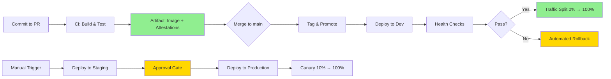

# CI/CD and IaC Target Architecture

**Version**: 1.0  
**Date**: 2025-11-13  
**Status**: Proposed Design  
**Baseline**: [Current State Assessment](../assessment/cicd-iac.current-state.md)

---

## Executive Summary

This document defines the **target reference architecture** for ProcureFlow's CI/CD and Infrastructure as Code (IaC) systems. The design prioritizes **security** (OIDC, attestation), **speed** (build-once-promote-many, caching), and **reliability** (blue/green deployment, automated rollback).

**Key Design Principles**:
1. **Build once, promote many**: Immutable artifacts deployed across environments
2. **Keyless authentication**: OIDC-based (no long-lived service account keys)
3. **Zero-downtime deployments**: Blue/green traffic splitting with health checks
4. **Fast feedback**: Parallel jobs, aggressive caching, <5min CI
5. **Automated rollback**: <1min MTTR via traffic shifting
6. **Least-privilege**: Scoped IAM roles for runtime and CI/CD
7. **Attestation**: SBOM + provenance for supply chain security

**Target Metrics**:
- CI time: **4-5 min** (from 7 min, -30%)
- Deploy time: **6-8 min** (from 15 min, -50%)
- MTTR: **<1 min** (from 15 min, -93%)
- Deployment success rate: **98%+** (from 90%)
- Security posture: **SLSA Level 2** (from Level 0)

---

## Architecture Overview

### High-Level Pipeline Flow



### Workflow Architecture

```
┌─────────────────────────────────────────────────────────────────────┐
│                          GitHub Repository                          │
├─────────────────────────────────────────────────────────────────────┤
│                                                                     │
│  ┌───────────────────────────────────────────────────────────────┐ │
│  │  .github/workflows/                                           │ │
│  │  ├─ ci.yml                 (PR/push: build + test + scan)     │ │
│  │  ├─ promote.yml            (Reusable: tag artifact)           │ │
│  │  ├─ deploy.yml             (Reusable: deploy by digest)       │ │
│  │  ├─ pulumi-preview.yml     (PR: IaC preview comment)          │ │
│  │  └─ drift-check.yml        (Scheduled: detect manual changes) │ │
│  └───────────────────────────────────────────────────────────────┘ │
│                                                                     │
│  ┌───────────────────────────────────────────────────────────────┐ │
│  │  .github/actions/                                             │ │
│  │  ├─ setup-pnpm/           (Composite: Node + pnpm + cache)    │ │
│  │  ├─ docker-build-push/    (Composite: BuildKit + GAR)         │ │
│  │  └─ health-check/         (Composite: smoke tests)            │ │
│  └───────────────────────────────────────────────────────────────┘ │
│                                                                     │
└─────────────────────────────────────────────────────────────────────┘
                                   │
                                   ├─ OIDC Auth (keyless)
                                   ↓
┌─────────────────────────────────────────────────────────────────────┐
│                        Google Cloud Platform                        │
├─────────────────────────────────────────────────────────────────────┤
│                                                                     │
│  ┌──────────────────────┐   ┌──────────────────────────────────┐  │
│  │  Artifact Registry   │   │  Workload Identity Federation    │  │
│  │  ├─ Image + Digest   │   │  ├─ Pool: github                 │  │
│  │  ├─ SBOM             │   │  ├─ Provider: github-oidc        │  │
│  │  └─ Provenance       │   │  └─ Bindings: repo + branch      │  │
│  └──────────────────────┘   └──────────────────────────────────┘  │
│                                                                     │
│  ┌──────────────────────────────────────────────────────────────┐  │
│  │  Cloud Run (Gen2)                                            │  │
│  │  ├─ Revisions: web-{sha} (immutable)                        │  │
│  │  ├─ Traffic: blue (50%) / green (50%)                       │  │
│  │  ├─ Auto-scaling: 0-2 instances                             │  │
│  │  └─ Health: /api/health, /api/items                         │  │
│  └──────────────────────────────────────────────────────────────┘  │
│                                                                     │
│  ┌──────────────────────┐   ┌──────────────────────────────────┐  │
│  │  Secret Manager      │   │  Cloud Monitoring                │  │
│  │  ├─ NEXTAUTH_SECRET  │   │  ├─ Uptime checks               │  │
│  │  ├─ OPENAI_API_KEY   │   │  ├─ Budget alerts               │  │
│  │  └─ MONGODB_URI      │   │  └─ Deployment tracking         │  │
│  └──────────────────────┘   └──────────────────────────────────┘  │
│                                                                     │
└─────────────────────────────────────────────────────────────────────┘
                                   ↑
                                   │ State + Policies
                                   ↓
┌─────────────────────────────────────────────────────────────────────┐
│                           Pulumi Cloud                              │
│  ├─ Stacks: dev, staging, prod                                     │
│  ├─ State: Encrypted, versioned                                    │
│  └─ Policies: CrossGuard (cost caps, security)                     │
└─────────────────────────────────────────────────────────────────────┘
```

---

## Component Details

### 1. Continuous Integration (ci.yml)

**Triggers**:
- Pull requests to `main`, `dev`
- Pushes to `main`, `dev`
- Path filters: Exclude `docs/**`, `*.md` (unless API/IaC changes)

**Jobs** (parallel):

#### Job: `lint` (parallel)
```yaml
lint:
  runs-on: ubuntu-latest
  steps:
    - uses: actions/checkout@v4
    - uses: ./.github/actions/setup-pnpm
    - run: pnpm lint
```

#### Job: `test` (parallel)
```yaml
test:
  runs-on: ubuntu-latest
  steps:
    - uses: actions/checkout@v4
    - uses: ./.github/actions/setup-pnpm
    - run: pnpm test:run
    - uses: actions/upload-artifact@v4
      with:
        name: coverage
        path: packages/web/coverage/
```

#### Job: `build-and-scan` (depends on lint + test)
```yaml
build-and-scan:
  needs: [lint, test]
  runs-on: ubuntu-latest
  permissions:
    contents: read
    id-token: write  # OIDC
    packages: write
    security-events: write  # SARIF upload
  outputs:
    image-digest: ${{ steps.build.outputs.digest }}
    image-tag: ${{ steps.meta.outputs.tags }}
  steps:
    - uses: actions/checkout@v4
    
    # OIDC Authentication
    - uses: google-github-actions/auth@v2
      with:
        workload_identity_provider: ${{ vars.GCP_WORKLOAD_IDENTITY_PROVIDER }}
        service_account: ${{ vars.GCP_CI_SERVICE_ACCOUNT }}
    
    # Docker Build (with BuildKit cache)
    - uses: ./.github/actions/docker-build-push
      id: build
      with:
        registry: us-central1-docker.pkg.dev
        repository: procureflow-dev/procureflow/web
        tags: |
          git-${{ github.sha }}
          ${{ github.ref_name }}-latest
        cache-from: type=gha
        cache-to: type=gha,mode=max
        provenance: true
        sbom: true
    
    # Vulnerability Scanning
    - uses: aquasecurity/trivy-action@master
      with:
        image-ref: ${{ steps.build.outputs.image }}
        format: 'sarif'
        output: 'trivy-results.sarif'
        severity: 'CRITICAL,HIGH'
    
    - uses: github/codeql-action/upload-sarif@v3
      with:
        sarif_file: 'trivy-results.sarif'
```

**Duration**: ~4-5 minutes (parallel lint/test: 2 min, build: 2-3 min)

**Caching**:
- pnpm store: `actions/cache@v4`
- Docker layers: BuildKit GitHub Actions cache
- Next.js build: `.next/cache` directory

**Concurrency**:
```yaml
concurrency:
  group: ci-${{ github.workflow }}-${{ github.ref }}
  cancel-in-progress: true  # Cancel old runs on new push
```

---

### 2. Promotion and Tagging (promote.yml)

**Reusable workflow** called on merge to `main` or manual trigger.

```yaml
on:
  workflow_call:
    inputs:
      source-tag:
        required: true
        type: string
      target-environment:
        required: true
        type: string  # dev, staging, prod
    outputs:
      promoted-digest:
        value: ${{ jobs.promote.outputs.digest }}

jobs:
  promote:
    runs-on: ubuntu-latest
    permissions:
      id-token: write
    outputs:
      digest: ${{ steps.tag.outputs.digest }}
    steps:
      - uses: google-github-actions/auth@v2
        with:
          workload_identity_provider: ${{ vars.GCP_WORKLOAD_IDENTITY_PROVIDER }}
          service_account: ${{ vars.GCP_CI_SERVICE_ACCOUNT }}
      
      - name: Tag for environment
        id: tag
        run: |
          IMAGE_URL="us-central1-docker.pkg.dev/procureflow-${{ inputs.target-environment }}/procureflow/web"
          
          # Pull by source tag
          gcloud artifacts docker images describe \
            $IMAGE_URL:${{ inputs.source-tag }} \
            --format='value(image_summary.digest)' > digest.txt
          
          DIGEST=$(cat digest.txt)
          echo "digest=$DIGEST" >> $GITHUB_OUTPUT
          
          # Tag for environment (mutable promotion tag)
          gcloud artifacts docker tags add \
            $IMAGE_URL@$DIGEST \
            $IMAGE_URL:${{ inputs.target-environment }}-latest
```

---

### 3. Deployment (deploy.yml)

**Reusable workflow** for deploying to any environment.

```yaml
on:
  workflow_call:
    inputs:
      environment:
        required: true
        type: string  # dev, staging, prod
      image-digest:
        required: true
        type: string
      pulumi-stack:
        required: true
        type: string
    secrets:
      PULUMI_ACCESS_TOKEN:
        required: true

jobs:
  deploy:
    runs-on: ubuntu-latest
    environment:
      name: ${{ inputs.environment }}
      url: ${{ steps.pulumi.outputs.service-url }}
    permissions:
      id-token: write
      contents: read
    steps:
      - uses: actions/checkout@v4
      
      - uses: google-github-actions/auth@v2
        with:
          workload_identity_provider: ${{ vars.GCP_WORKLOAD_IDENTITY_PROVIDER }}
          service_account: ${{ vars.GCP_DEPLOY_SERVICE_ACCOUNT }}
      
      - uses: ./.github/actions/setup-pnpm
      
      - uses: pulumi/actions@v5
        id: pulumi
        with:
          command: up
          stack-name: ${{ inputs.pulumi-stack }}
          work-dir: packages/infra/pulumi/gcp
          comment-on-pr: true
        env:
          PULUMI_ACCESS_TOKEN: ${{ secrets.PULUMI_ACCESS_TOKEN }}
          IMAGE_DIGEST: ${{ inputs.image-digest }}
      
      # Deploy new revision with 0% traffic
      - name: Deploy new revision (canary)
        run: |
          SERVICE_URL="${{ steps.pulumi.outputs.service-url }}"
          echo "service_url=$SERVICE_URL" >> $GITHUB_OUTPUT
      
      # Health checks on new revision
      - uses: ./.github/actions/health-check
        with:
          service-url: ${{ steps.pulumi.outputs.service-url }}
          endpoints: |
            /api/health
            /api/items?limit=1
      
      # Gradual traffic shift (canary)
      - name: Canary rollout
        run: |
          gcloud run services update-traffic procureflow-web \
            --region=us-central1 \
            --to-revisions=LATEST=10
          
          sleep 60  # Monitor for 1 minute
          
          gcloud run services update-traffic procureflow-web \
            --region=us-central1 \
            --to-revisions=LATEST=50
          
          sleep 60
          
          gcloud run services update-traffic procureflow-web \
            --region=us-central1 \
            --to-revisions=LATEST=100
      
      # Automated rollback on failure
      - name: Rollback on failure
        if: failure()
        run: |
          PREVIOUS=$(gcloud run revisions list \
            --service=procureflow-web \
            --region=us-central1 \
            --sort-by=~deployed \
            --limit=2 \
            --format='value(name)' | tail -n1)
          
          gcloud run services update-traffic procureflow-web \
            --region=us-central1 \
            --to-revisions=$PREVIOUS=100
          
          echo "⚠️ Deployment failed. Rolled back to $PREVIOUS"
```

---

### 4. Pulumi IaC Architecture

#### Stack Organization

| Stack | Environment | Auto-Deploy | Approval | Branch | Notes |
|-------|-------------|-------------|----------|--------|-------|
| `dev` | Development | ✅ | None | `main` | Auto-deploy on merge |
| `staging` | Staging | ❌ | 1 reviewer | `main` | Manual trigger + approval |
| `prod` | Production | ❌ | 2 reviewers | `main` | Manual trigger + 2 approvals |

#### Resource Management

**Managed Resources**:
```typescript
// packages/infra/pulumi/gcp/index.ts

// 1. Artifact Registry (now managed)
const registry = new gcp.artifactregistry.Repository('procureflow', {
  repositoryId: 'procureflow',
  location: region,
  format: 'DOCKER',
  cleanupPolicies: [{
    id: 'keep-30-days',
    action: 'DELETE',
    condition: { olderThan: '30d', tagState: 'UNTAGGED' }
  }]
});

// 2. Cloud Run with traffic splitting
const service = new gcp.cloudrun.Service('procureflow-web', {
  location: region,
  template: {
    metadata: {
      annotations: {
        'autoscaling.knative.dev/minScale': '0',
        'autoscaling.knative.dev/maxScale': '2',
        'run.googleapis.com/execution-environment': 'gen2',
      },
      name: `web-${imageDigest.substring(0, 12)}`  // Immutable revision name
    },
    spec: {
      serviceAccountName: serviceAccount.email,
      containers: [{
        image: pulumi.interpolate`${registry.location}-docker.pkg.dev/${projectId}/${registry.repositoryId}/web@${imageDigest}`,
        envs: [
          { name: 'NODE_ENV', value: 'production' },
          { name: 'NEXTAUTH_URL', value: pulumi.interpolate`https://${service.statuses[0].url}` },
          // Secrets from Secret Manager
        ]
      }]
    }
  },
  // Traffic management (blue/green)
  traffics: [
    { revisionName: 'web-abc123', percent: 50 },  // Blue (previous)
    { latestRevision: true, percent: 50 }          // Green (current)
  ]
});

// 3. Uptime monitoring
const uptimeCheck = new gcp.monitoring.UptimeCheckConfig('procureflow-uptime', {
  displayName: 'ProcureFlow Web',
  monitoredResource: {
    type: 'uptime_url',
    labels: { host: service.statuses[0].url }
  },
  httpCheck: {
    path: '/api/health',
    port: 443,
    useSsl: true
  },
  period: '60s',
  timeout: '10s'
});

// 4. Budget alert
const budget = new gcp.billing.Budget('monthly-budget', {
  billingAccount: billingAccountId,
  amount: { specifiedAmount: { units: '10' } },
  thresholdRules: [
    { thresholdPercent: 0.5 },
    { thresholdPercent: 0.75 },
    { thresholdPercent: 0.9 }
  ]
});
```

#### Policy as Code (CrossGuard)

```typescript
// packages/infra/pulumi/gcp/policies/index.ts
import { PolicyPack, validateResourceOfType } from '@pulumi/policy';

new PolicyPack('procureflow-policies', {
  policies: [
    {
      name: 'cloud-run-max-instances',
      description: 'Cloud Run max instances must not exceed 5 (cost cap)',
      enforcementLevel: 'mandatory',
      validateResource: validateResourceOfType(gcp.cloudrun.Service, (service, args, reportViolation) => {
        const maxScale = service.template?.metadata?.annotations?.['autoscaling.knative.dev/maxScale'];
        if (parseInt(maxScale) > 5) {
          reportViolation('Max instances exceeds 5 (cost cap)');
        }
      })
    },
    {
      name: 'secret-manager-auto-replication',
      description: 'Secrets must use automatic replication',
      enforcementLevel: 'mandatory',
      validateResource: validateResourceOfType(gcp.secretmanager.Secret, (secret, args, reportViolation) => {
        if (!secret.replication?.auto) {
          reportViolation('Secrets must use automatic replication');
        }
      })
    },
    {
      name: 'cloud-run-non-root-user',
      description: 'Cloud Run containers must run as non-root',
      enforcementLevel: 'advisory',
      validateResource: validateResourceOfType(gcp.cloudrun.Service, (service, args, reportViolation) => {
        // Check Dockerfile for USER directive (advisory only)
      })
    }
  ]
});
```

---

### 5. Authentication & IAM

#### OIDC Configuration

**Workload Identity Pool** (GCP setup):
```bash
# Create pool
gcloud iam workload-identity-pools create github \
  --location=global \
  --display-name="GitHub Actions"

# Create provider
gcloud iam workload-identity-pools providers create-oidc github-oidc \
  --workload-identity-pool=github \
  --location=global \
  --issuer-uri=https://token.actions.githubusercontent.com \
  --attribute-mapping="google.subject=assertion.sub,attribute.actor=assertion.actor,attribute.repository=assertion.repository" \
  --attribute-condition="assertion.repository == 'guiofsaints/procureflow'"
```

**Service Account Bindings**:
```bash
# CI/CD service account (build + push)
gcloud iam service-accounts create github-actions-ci \
  --display-name="GitHub Actions CI"

gcloud projects add-iam-policy-binding procureflow-dev \
  --member="principalSet://iam.googleapis.com/projects/${PROJECT_NUMBER}/locations/global/workloadIdentityPools/github/attribute.repository/guiofsaints/procureflow" \
  --role="roles/artifactregistry.writer"

# Deploy service account (Cloud Run + Pulumi)
gcloud iam service-accounts create github-actions-deploy \
  --display-name="GitHub Actions Deploy"

gcloud projects add-iam-policy-binding procureflow-dev \
  --member="principalSet://iam.googleapis.com/projects/${PROJECT_NUMBER}/locations/global/workloadIdentityPools/github/attribute.repository/guiofsaints/procureflow" \
  --role="roles/run.developer"

gcloud projects add-iam-policy-binding procureflow-dev \
  --member="principalSet://iam.googleapis.com/projects/${PROJECT_NUMBER}/locations/global/workloadIdentityPools/github/attribute.repository/guiofsaints/procureflow" \
  --role="roles/secretmanager.viewer"
```

**Least-Privilege IAM**:
- **CI service account**: `artifactregistry.writer` only
- **Deploy service account**: `run.developer`, `secretmanager.viewer`, `iam.serviceAccountUser` (scoped to `procureflow-cloudrun` SA)
- **Runtime service account**: `secretmanager.secretAccessor` on specific secrets

---

### 6. Composite Actions

#### setup-pnpm (`.github/actions/setup-pnpm/action.yml`)
```yaml
name: 'Setup pnpm with caching'
description: 'Setup Node.js, pnpm, and restore/save pnpm cache'
runs:
  using: 'composite'
  steps:
    - uses: actions/setup-node@v4
      with:
        node-version: '20'
    
    - uses: pnpm/action-setup@v4
      with:
        version: '10.21.0'
    
    - name: Get pnpm store path
      shell: bash
      run: echo "STORE_PATH=$(pnpm store path --silent)" >> $GITHUB_ENV
    
    - uses: actions/cache@v4
      with:
        path: ${{ env.STORE_PATH }}
        key: ${{ runner.os }}-pnpm-${{ hashFiles('**/pnpm-lock.yaml') }}
        restore-keys: ${{ runner.os }}-pnpm-
    
    - shell: bash
      run: pnpm install --frozen-lockfile
```

#### docker-build-push (`.github/actions/docker-build-push/action.yml`)
```yaml
name: 'Docker build and push with BuildKit cache'
description: 'Build Docker image with BuildKit cache and push to Artifact Registry'
inputs:
  registry:
    required: true
  repository:
    required: true
  tags:
    required: true
  cache-from:
    default: 'type=gha'
  cache-to:
    default: 'type=gha,mode=max'
  provenance:
    default: 'true'
  sbom:
    default: 'true'
outputs:
  digest:
    value: ${{ steps.build.outputs.digest }}
  image:
    value: ${{ steps.build.outputs.image }}
runs:
  using: 'composite'
  steps:
    - uses: docker/setup-buildx-action@v3
    
    - uses: docker/login-action@v3
      with:
        registry: ${{ inputs.registry }}
        username: _json_key
        password: ${{ steps.auth.outputs.access_token }}
    
    - uses: docker/build-push-action@v5
      id: build
      with:
        context: .
        file: packages/infra/docker/Dockerfile.web
        push: true
        tags: ${{ inputs.tags }}
        cache-from: ${{ inputs.cache-from }}
        cache-to: ${{ inputs.cache-to }}
        provenance: ${{ inputs.provenance }}
        sbom: ${{ inputs.sbom }}
```

#### health-check (`.github/actions/health-check/action.yml`)
```yaml
name: 'Health Check'
description: 'Run smoke tests against deployed service'
inputs:
  service-url:
    required: true
  endpoints:
    required: true
runs:
  using: 'composite'
  steps:
    - name: Wait for service ready
      shell: bash
      run: sleep 30
    
    - name: Health check
      shell: bash
      run: |
        while IFS= read -r endpoint; do
          echo "Testing ${{ inputs.service-url }}$endpoint"
          curl -f -s -o /dev/null -w "%{http_code}" "${{ inputs.service-url }}$endpoint" || exit 1
        done <<< "${{ inputs.endpoints }}"
```

---

## Responsibility Boundaries

### CI vs IaC vs Runtime

| Responsibility | Owner | Notes |
|----------------|-------|-------|
| **Build artifacts** | CI (GitHub Actions) | Docker image, SBOM, provenance |
| **Store artifacts** | Artifact Registry | Immutable storage by digest |
| **Deploy infrastructure** | Pulumi (via GitHub Actions) | Cloud Run, secrets, monitoring |
| **Manage state** | Pulumi Cloud | Encrypted, versioned |
| **Traffic management** | Cloud Run | Blue/green, canary rollout |
| **Secrets injection** | Secret Manager → Cloud Run | Runtime secret access |
| **Monitoring** | Cloud Monitoring | Uptime, metrics, logs |
| **Policy enforcement** | Pulumi CrossGuard | Cost caps, security guardrails |

---

## Environment Strategy

| Environment | Stack | Deploy | Approval | Branch | Config |
|-------------|-------|--------|----------|--------|--------|
| **Development** | `dev` | Auto | None | `main` | `procureflow-dev` project |
| **Staging** | `staging` | Manual | 1 reviewer | `main` | `procureflow-staging` project |
| **Production** | `prod` | Manual | 2 reviewers | `main` | `procureflow-prod` project |

**GitHub Environments**:
- **dev**: No restrictions, auto-deploy on merge
- **staging**: Require 1 approval, branch: `main` only
- **production**: Require 2 approvals, branch: `main` only, delay: 5 min

---

## Rollback Strategy

### Automated Rollback (Instant)

**Trigger**: Health check failure post-deploy

**Mechanism**: Traffic shift to previous revision
```bash
gcloud run services update-traffic procureflow-web \
  --to-revisions=$PREVIOUS_REVISION=100
```

**MTTR**: <1 minute

### Manual Rollback (Emergency)

**Trigger**: Production issue discovered post-deploy

**Procedure**:
1. Identify last known-good revision:
   ```bash
   gcloud run revisions list --service=procureflow-web --sort-by=~deployed --limit=5
   ```

2. Shift traffic:
   ```bash
   gcloud run services update-traffic procureflow-web \
     --to-revisions=web-abc123=100
   ```

3. Verify service health

4. (Optional) Redeploy previous image digest via Pulumi

**MTTR**: 2-3 minutes

---

## Success Metrics

### Performance

| Metric | Baseline | Target | Measurement |
|--------|----------|--------|-------------|
| CI duration (PR) | 7 min | 4-5 min | GitHub Actions logs |
| Deploy duration | 15 min | 6-8 min | GitHub Actions logs |
| MTTR (rollback) | 15 min | <1 min | Manual drill |
| Cache hit rate (pnpm) | 85% | 90% | Actions cache metrics |
| Cache hit rate (Docker) | 0% | 75% | BuildKit logs |

### Reliability

| Metric | Baseline | Target | Measurement |
|--------|----------|--------|-------------|
| Deployment success rate | 90% | 98% | Deploy workflow pass rate |
| Downtime per deploy | 0s | 0s | Monitoring (no change expected) |
| Rollback execution time | Manual | <60s | Automated health checks |

### Security

| Metric | Baseline | Target | Measurement |
|--------|----------|--------|-------------|
| SLSA provenance level | 0 | 2 | Attestation presence |
| Long-lived keys in CI | 1 | 0 | Secrets audit |
| Vulnerability scan coverage | 0% | 100% | Trivy reports |
| Least-privilege IAM | Partial | Full | IAM audit |

---

## Migration Path

See [Improvement Plan](../operation/cicd-iac.improvement-plan.md) for phased implementation roadmap.

**Key Milestones**:
1. **Phase 0 (Week 1)**: OIDC, concurrency, skip redundant tests → Immediate security + speed wins
2. **Phase 1 (Week 2)**: Docker caching, build-once-promote-many → 50% faster deploys
3. **Phase 2 (Week 3)**: Blue/green deployment, automated rollback → Zero-downtime, <1min MTTR
4. **Phase 3 (Week 4)**: SBOM/provenance, policy as code → SLSA Level 2 compliance

---

**Document Version**: 1.0  
**Last Updated**: 2025-11-13  
**Next Review**: 2025-12-13  
**Owner**: DevOps Team
