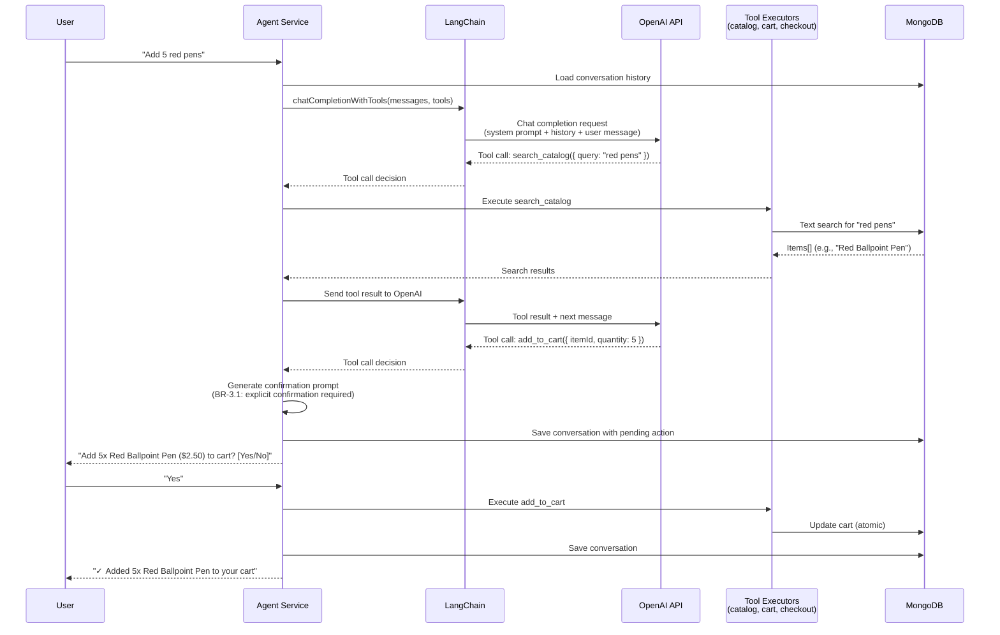

# Technology Stack and Architectural Patterns

**Executive Summary**: ProcureFlow uses Next.js 15 (App Router), React 19, TypeScript 5.9, MongoDB 8.10 with Mongoose, LangChain 1.0 + OpenAI GPT-3.5-turbo for AI orchestration, NextAuth.js for authentication, Tailwind CSS + Radix UI for frontend, Vitest for testing, Winston for logging, and Pulumi for GCP infrastructure as code. Core patterns include feature-based organization (isolated modules with barrel exports), service layer separation (business logic in framework-agnostic `*.service.ts` files), domain-driven design (10 domain entities as TypeScript interfaces), agent-first design (conversational AI with function calling for 8 tools), and reliability patterns (circuit breaker, rate limiting, p-retry for transient failures).

---

## Table of Contents

- [Technology Stack](#technology-stack)
- [Architectural Patterns](#architectural-patterns)
- [Decision Log](#decision-log)
- [Assumptions and Limitations](#assumptions-and-limitations)
- [References](#references)

---

## Technology Stack

### Frontend Technologies

| Technology | Version | Purpose | Rationale | Alternatives Considered |
|------------|---------|---------|-----------|------------------------|
| **React** | 19.2.0 | UI library | Industry standard, Server Components support, 3M+ GitHub stars, massive ecosystem | Vue.js (smaller ecosystem), Svelte (less enterprise adoption) |
| **Next.js** | 16.0.1 | Full-stack framework | App Router with Server Components, file-based routing, API routes in same codebase, excellent DX, Vercel deployment story | Remix (strong alternative, but Next.js has more mature ecosystem), Create React App (no SSR, no API routes) |
| **TypeScript** | 5.9.3 | Type safety | Catch errors at compile-time, better IDE autocomplete, self-documenting code, reduced runtime bugs | JavaScript (no type safety), Flow (smaller ecosystem), JSDoc (weak typing) |
| **Tailwind CSS** | 4.1.17 | Utility-first CSS | Rapid prototyping, consistent design tokens, no CSS file sprawl, PurgeCSS for small bundles | CSS Modules (verbose), Styled Components (runtime cost), Sass (no utility-first workflow) |
| **Radix UI** | 1.1.4 | Accessible primitives | WCAG 2.1 AA compliant, unstyled (styled with Tailwind), composable, tree-shakeable | Chakra UI (opinionated styling), MUI (large bundle), Headless UI (smaller component library) |
| **Next Themes** | 0.4.6 | Dark mode | No flash on load, localStorage sync, system preference detection, 3KB bundle | Manual implementation (reinvent the wheel), Radix Themes (brings full theming system) |
| **Lucide React** | 0.553.0 | Icon library | 1000+ icons, tree-shakeable, consistent design language, actively maintained | Heroicons (fewer icons), React Icons (larger bundle), Font Awesome (font-based, accessibility issues) |

---

### Backend Technologies

| Technology | Version | Purpose | Rationale | Alternatives Considered |
|------------|---------|---------|-----------|------------------------|
| **Node.js** | 20.19.4 | JavaScript runtime | Async I/O for high concurrency, npm ecosystem, native TypeScript support with tsx, serverless-friendly | Deno (less mature ecosystem), Bun (immature for production), Python (slower startup, no Server Components) |
| **Mongoose** | 8.10.6 | MongoDB ODM | Schema validation, query builder, middleware hooks, connection pooling, text search support | Prisma (SQL-first, no MongoDB text search), TypeORM (complex configuration), Native MongoDB driver (no schema validation) |
| **NextAuth.js** | 4.24.13 | Authentication | Session management, JWT strategy, credentials provider, HTTP-only cookies, built-in providers | Auth0 (external service cost), Passport.js (manual session management), Clerk (external service cost) |
| **Zod** | 4.1.12 | Schema validation | Runtime validation, TypeScript inference, composable validators, better errors than Joi | Joi (no TypeScript inference), Yup (less performant), class-validator (decorator-based, verbose) |
| **bcryptjs** | 3.0.3 | Password hashing | Industry-standard hashing, configurable salt rounds (10), pure JavaScript (no native deps) | Argon2 (requires native deps, harder to deploy), scrypt (lower adoption), plain bcrypt (requires native compilation) |

---

### AI and Agent Technologies

| Technology | Version | Purpose | Rationale | Alternatives Considered |
|------------|---------|---------|-----------|------------------------|
| **LangChain** | 1.0.3 | LLM orchestration | Function calling abstractions, conversation memory, multi-provider support (OpenAI, Gemini), streaming | LlamaIndex (document-focused, overkill for procurement chat), Direct OpenAI SDK (no abstractions, manual memory), Semantic Kernel (C#-first, less mature JavaScript SDK) |
| **OpenAI API** | 6.8.1 (SDK)<br/>GPT-3.5-turbo (model) | LLM inference | Function calling support, cost-efficient ($0.0015/$0.002 per 1K tokens), fast inference (< 2s p95), reliable uptime | GPT-4 (more expensive $0.03/$0.06, slower), Gemini 1.5 Flash (no function calling in free tier, requires Google Cloud setup), Claude 3 Haiku (more expensive $0.25/$1.25 per 1M tokens) |
| **Google Gemini** | 1.0.0 (SDK, optional) | LLM fallback | Free tier with generous limits, backup provider if OpenAI unavailable, no function calling | Anthropic Claude (no free tier), LLaMA 2 (requires local hosting, high memory) |
| **Tiktoken** | 1.0.22 | Token counting | Accurate token estimation for prompt budgeting, prevents exceeding context limits, LangChain integration | Manual estimation (inaccurate), gpt-tokenizer (less maintained) |

---

### Data and Caching Technologies

| Technology | Version | Purpose | Rationale | Alternatives Considered |
|------------|---------|---------|-----------|------------------------|
| **MongoDB Atlas** | 8.10.6 M0 Free Tier | Document database | Free tier 512 MB, text search index, document-oriented model fits shopping cart structure, no schema migrations | PostgreSQL (relational model less suitable for nested cart items, no free managed tier like M0), Supabase (requires account, less generous free tier), Firebase Firestore (vendor lock-in, complex pricing) |
| **MongoDB Text Index** | N/A | Full-text search | Field weights (name:10, category:5, description:1), stemming, case-insensitive, performant (< 300ms p95) | Algolia (external service cost $1/month), Elasticsearch (heavy, requires separate cluster), pg_trgm (PostgreSQL, less suitable for document store) |

---

### Testing and Quality Assurance

| Technology | Version | Purpose | Rationale | Alternatives Considered |
|------------|---------|---------|-----------|------------------------|
| **Vitest** | 4.0.8 | Test runner | Native ESM, TypeScript support, 10x faster than Jest, Jest-compatible API, great DX | Jest (slower, CJS-based), Mocha (manual mocking, verbose), uvu (minimal, less mature) |
| **Testing Library** | 16.3.0 (React) | Component testing | User-centric queries (getByRole, getByText), encourages accessibility, best practices | Enzyme (outdated, shallow rendering), React Test Renderer (low-level, harder to use) |
| **jsdom** | 27.1.0 | DOM simulation | Headless DOM for unit tests, faster than Playwright for component tests | Happy DOM (less complete), Puppeteer (slower, real browser) |
| **mongodb-memory-server** | 10.3.0 | In-memory MongoDB | Isolated integration tests, no external MongoDB dependency, fast startup (< 1s) | Test containers (heavier, requires Docker), Mock database (doesn't test queries), Real MongoDB (shared state, slower) |

---

### Reliability and Observability

| Technology | Version | Purpose | Rationale | Alternatives Considered |
|------------|---------|---------|-----------|------------------------|
| **Winston** | 3.18.3 | Structured logging | JSON format, multiple transports (console, file, Cloud Logging), log levels, correlation IDs | Pino (faster but less flexible), Bunyan (unmaintained), console.log (unstructured) |
| **winston-loki** | 6.1.3 | Log aggregation | Grafana Loki integration for production log centralization, label-based querying | Fluent Bit (complex setup), native GCP Logging (no local dev compatibility) |
| **prom-client** | 15.1.3 | Metrics collection | Prometheus-compatible metrics (counters, histograms, gauges), /api/metrics endpoint | StatsD (requires aggregator), OpenTelemetry (heavier, overkill for v1.0) |
| **opossum** | 9.0.0 | Circuit breaker | Prevent cascading failures to OpenAI/MongoDB, configurable thresholds (50% errors), automatic reset (30s) | Manual implementation (error-prone), Resilience4j (Java only) |
| **p-retry** | 7.1.0 | Retry logic | Exponential backoff, configurable retries (3 for OpenAI, 4 for Gemini), transient error detection | Manual setTimeout (brittle), async-retry (less flexible) |
| **Bottleneck** | 2.19.5 | Rate limiting | Requests-per-minute limits (60 OpenAI, 15 Gemini), reservoir-based rate limiting, queue management | Manual throttling (complex), rate-limiter-flexible (Redis dependency) |

---

### Infrastructure and Deployment

| Technology | Version | Purpose | Rationale | Alternatives Considered |
|------------|---------|---------|-----------|------------------------|
| **Pulumi** | 3.140.0 | Infrastructure as Code | TypeScript IaC (same language as app), state management, preview before deploy, GCP provider | Terraform (HCL not TypeScript), AWS CDK (AWS-only), manual GCP console (no versioning) |
| **GCP Cloud Run** | N/A | Serverless container | Pay-per-request, auto-scaling 0-100 instances, 300s timeout, no infrastructure management | Vercel (vendor lock-in, no MongoDB in free tier), AWS Lambda (cold start, complex API Gateway), GCP App Engine (less flexible scaling) |
| **GCP Artifact Registry** | N/A | Docker image storage | Integrated with Cloud Run, automatic vulnerability scanning, no egress fees within GCP | Docker Hub (public images, rate limiting), GCR (deprecated in favor of Artifact Registry) |
| **GCP Secret Manager** | N/A | Secrets storage | Encrypted storage, versioning, IAM-based access control, automatic rotation support | .env files (insecure in production), HashiCorp Vault (overkill, complex setup) |
| **Docker** | N/A | Containerization | Consistent environments (dev/prod parity), easy local development with docker-compose | Podman (less mature), Buildpacks (less control), manual VM setup (inconsistent) |

---

### Development Tools

| Technology | Version | Purpose | Rationale | Alternatives Considered |
|------------|---------|---------|-----------|------------------------|
| **pnpm** | 10.21.0 | Package manager | Fast installs, disk-efficient (hard links), monorepo support with workspaces | npm (slower, duplicates deps), yarn (less efficient), bun (immature) |
| **ESLint** | 9.39.1 | Code linting | Enforce code quality, catch bugs, consistent style across team | TSLint (deprecated), Biome (less mature) |
| **Prettier** | Embedded in Tailwind | Code formatting | Auto-format on save, no bikeshedding, integrates with ESLint | Standard JS (less flexible), dprint (less adoption) |
| **Husky** | N/A (via commitlint) | Git hooks | Pre-commit linting, commit message validation, enforce conventional commits | Manual Git hooks (not versioned), lint-staged (complementary) |
| **tsx** | 4.20.6 | TypeScript executor | Run TS files directly in scripts (seed-office-items.ts, create-text-index.ts), no compilation step | ts-node (slower), manual tsc + node (two-step), Bun (immature) |

---

## Architectural Patterns

### 1. Feature-Based Organization

**Problem**: Monolithic code organization (all components in `/components`, all services in `/services`) makes it hard to locate related files and increases coupling.

**Solution**: Organize code by business feature, not by technical layer.

**Structure**:
```
features/
  catalog/
    components/      # CatalogSearch.tsx, ItemCard.tsx
    lib/             # catalog.service.ts
    index.ts         # Barrel export: export { searchItems, createItem } from './lib/catalog.service'
    types.ts         # Feature-specific types (not in domain/entities.ts)
    mock.ts          # Test fixtures (optional)
```

**Benefits**:
- **Discoverability**: All catalog code in `features/catalog/`
- **Modularity**: Features can be extracted to separate packages in monorepo
- **Testability**: Mock entire feature via barrel export
- **Team ownership**: Clear boundaries for code ownership

**Example Import**:
```typescript
// Good: Import from feature root
import { searchItems } from '@/features/catalog';

// Bad: Import directly from service file
import { searchItems } from '@/features/catalog/lib/catalog.service';
```

**Enforcement**:
- ESLint rule (future): Disallow deep imports from `features/*/lib/`
- Barrel exports (`index.ts`) define public API

---

### 2. Service Layer Separation

**Problem**: Business logic in API route handlers makes it hard to test, reuse, and maintain. Route handlers become bloated with validation, database queries, and error handling.

**Solution**: Extract business logic to framework-agnostic service functions in `*.service.ts` files.

**Service Layer Contract**:
```typescript
// catalog.service.ts
export async function searchItems(params: {
  query?: string;
  category?: string;
  limit?: number;
}): Promise<Item[]> {
  // 1. Validate inputs with Zod
  // 2. Query database via Mongoose
  // 3. Map Mongoose docs → domain entities
  // 4. Return domain entities
  // 5. Throw typed errors (ValidationError, DuplicateItemError)
}
```

**API Route Usage**:
```typescript
// app/api/catalog/search/route.ts
import { searchItems } from '@/features/catalog';

export async function POST(request: Request) {
  try {
    const { query, category, limit } = await request.json();
    const items = await searchItems({ query, category, limit });
    return NextResponse.json({ items });
  } catch (error) {
    if (error instanceof ValidationError) {
      return NextResponse.json({ error: error.message }, { status: 400 });
    }
    // ... handle other errors
  }
}
```

**Benefits**:
- **Testability**: Services can be unit tested without HTTP server
- **Reusability**: Same service used in API routes, Server Components, background jobs, CLI tools
- **Framework-agnostic**: Services don't depend on Next.js, can be used with Express, Fastify, etc.
- **Clear contracts**: Input params and return types explicit

**Rules**:
1. Services never import from `next`, `next/server`, or framework-specific modules
2. Services return domain entities, not Mongoose documents
3. Services throw typed errors, not HTTP responses
4. Services are pure functions (no side effects except database/API calls)

---

### 3. Domain-Driven Entities

**Problem**: Tight coupling to Mongoose models makes code hard to test and reuse. Mongoose documents leak across all layers (frontend, API routes, services).

**Solution**: Define framework-agnostic domain entities as TypeScript interfaces in `domain/entities.ts`. Services map Mongoose documents to domain entities at the boundary.

**Domain Entity Example**:
```typescript
// domain/entities.ts
export interface Item {
  _id: string | Types.ObjectId;
  name: string;
  description: string;
  category: string;
  price: number;
  unit: string;
  supplier?: string;
  createdBy: string | Types.ObjectId;
  createdAt: Date;
}
```

**Service Layer Mapping**:
```typescript
// catalog.service.ts
import { ItemModel } from '@/lib/db/models';
import type { Item } from '@/domain';

export async function getItemById(id: string): Promise<Item | null> {
  const doc = await ItemModel.findById(id).lean(); // Mongoose document
  if (!doc) return null;
  
  // Map Mongoose doc → domain entity
  const item: Item = {
    _id: doc._id,
    name: doc.name,
    description: doc.description,
    category: doc.category,
    price: doc.price,
    unit: doc.unit,
    supplier: doc.supplier,
    createdBy: doc.createdBy,
    createdAt: doc.createdAt,
  };
  
  return item;
}
```

**Benefits**:
- **Framework independence**: Domain entities don't depend on Mongoose, can switch to Prisma, TypeORM, etc.
- **Testability**: Mock services return domain entities, no Mongoose setup needed
- **Type safety**: Explicit types prevent accidental Mongoose method calls (e.g., `item.save()`)

**Rules**:
1. Domain entities are **pure interfaces** (no methods, no logic)
2. Services **always return domain entities**, never Mongoose documents
3. API routes **receive domain entities**, send to frontend as JSON
4. Mongoose models stay in `lib/db/schemas/` and `lib/db/models.ts`

---

### 4. Agent-First Design (Conversational AI with Function Calling)

**Problem**: Traditional UI forms are tedious for repeated procurement tasks (e.g., "Add 5 pens, 10 notebooks, 2 staplers"). Users want to describe what they need in natural language.

**Solution**: Build AI agent with LangChain + OpenAI function calling to orchestrate 8 tools (search_catalog, add_to_cart, view_cart, remove_from_cart, update_cart_quantity, checkout, view_purchase_requests, register_item).

**Agent Architecture**:


**Tool Definition Example**:
```typescript
// agent.service.ts
const tools = [
  {
    type: 'function' as const,
    function: {
      name: 'search_catalog',
      description: 'Search the product catalog by query string or category. Use for finding items.',
      parameters: {
        type: 'object',
        properties: {
          query: { type: 'string', description: 'Search query (item name, description keywords)' },
          category: { type: 'string', description: 'Filter by category (e.g., "Office Supplies", "Electronics")' },
        },
      },
    },
  },
  {
    type: 'function' as const,
    function: {
      name: 'add_to_cart',
      description: 'Add item to shopping cart. Requires explicit user confirmation per BR-3.1.',
      parameters: {
        type: 'object',
        properties: {
          itemId: { type: 'string', description: 'Item ID from search results' },
          quantity: { type: 'number', description: 'Quantity (1-999)' },
        },
        required: ['itemId', 'quantity'],
      },
    },
  },
  // ... 6 more tools (view_cart, remove_from_cart, update_cart_quantity, checkout, view_purchase_requests, register_item)
];
```

**Tool Executor Pattern**:
```typescript
async function executeTool(toolName: string, toolArgs: any, userId: string) {
  switch (toolName) {
    case 'search_catalog':
      return await catalogService.searchItems({ query: toolArgs.query, category: toolArgs.category });
    case 'add_to_cart':
      return await cartService.addToCart({ userId, itemId: toolArgs.itemId, quantity: toolArgs.quantity });
    case 'checkout':
      return await checkoutService.createPurchaseRequest({ userId });
    // ... other tools
    default:
      throw new Error(`Unknown tool: ${toolName}`);
  }
}
```

**Benefits**:
- **Natural interaction**: Users describe needs in plain language, no forms
- **Multi-step workflows**: Agent handles search → add to cart → checkout in conversation
- **Confirmation gates**: BR-3.1 enforces explicit confirmation for destructive actions (add to cart, checkout)
- **Ambiguity resolution**: Agent asks clarifying questions per BR-3.3 (e.g., "Did you mean 'Red Ballpoint Pen' or 'Red Gel Pen'?")
- **Tool logging**: All tool calls logged in conversation for audit trail

**Rules**:
1. Agent **never executes destructive actions** (add to cart, checkout) without confirmation
2. Agent **always shows item name, quantity, price** in confirmation prompts
3. Agent **uses same service layer functions** as API routes (no duplicate logic)
4. Agent **limits conversation history** to 10 messages (prevents token overflow)

---

### 5. Reliability Patterns (Circuit Breaker, Rate Limiting, Retries)

**Problem**: External dependencies (OpenAI API, MongoDB Atlas) can fail transiently or permanently. Without resilience patterns, failures cascade (all agent requests fail if OpenAI is down).

**Solution**: Implement circuit breaker, rate limiting, and retry patterns for external calls.

**Circuit Breaker (opossum)**:
```typescript
// lib/ai/circuitBreaker.ts
import CircuitBreaker from 'opossum';

const openAiCircuitBreaker = new CircuitBreaker(async (params) => {
  return await openai.chat.completions.create(params);
}, {
  errorThresholdPercentage: 50,  // Open circuit if 50% errors
  timeout: 30000,                 // 30s timeout
  resetTimeout: 30000,            // Try again after 30s
});

openAiCircuitBreaker.fallback(() => {
  throw new Error('AI agent is temporarily unavailable. Please try again later or use the catalog page.');
});
```

**Benefits**:
- **Fast failures**: Circuit opens after 50% errors, no waiting for timeouts
- **Automatic recovery**: Circuit closes after 30s if dependency recovers
- **Graceful degradation**: Fallback message shown to user

**Rate Limiting (Bottleneck)**:
```typescript
// lib/ai/rateLimit.ts
import Bottleneck from 'bottleneck';

const openAiLimiter = new Bottleneck({
  reservoir: 60,               // 60 requests per minute (OpenAI free tier)
  reservoirRefreshAmount: 60,
  reservoirRefreshInterval: 60 * 1000, // 60 seconds
});

export async function chatCompletion(params: any) {
  return await openAiLimiter.schedule(() => openai.chat.completions.create(params));
}
```

**Benefits**:
- **Prevent rate limit errors**: Queue requests instead of failing
- **Cost control**: Respect tier limits (60 RPM OpenAI, 15 RPM Gemini)

**Retries with Exponential Backoff (p-retry)**:
```typescript
// lib/utils/retry.ts
import pRetry from 'p-retry';

export async function retryableOpenAiCall(params: any) {
  return await pRetry(
    () => openai.chat.completions.create(params),
    {
      retries: 3,
      factor: 2,           // Exponential: 1s, 2s, 4s
      minTimeout: 1000,
      onFailedAttempt: (error) => {
        logger.warn(`OpenAI call failed, attempt ${error.attemptNumber}/${error.retriesLeft + 1}`, {
          error: error.message,
        });
      },
    }
  );
}
```

**Benefits**:
- **Transient failure recovery**: Network blips, temporary rate limits
- **Exponential backoff**: Avoid hammering failing service
- **Observability**: Log each retry attempt

---

### 6. Structured Logging with Correlation IDs

**Problem**: Distributed logs from frontend, API routes, services, and database make debugging hard. No way to trace a single request across layers.

**Solution**: Use Winston with JSON format, include correlation IDs in all log entries.

**Logger Configuration**:
```typescript
// lib/logger/winston.ts
import winston from 'winston';

export const logger = winston.createLogger({
  level: process.env.LOG_LEVEL || 'info',
  format: winston.format.combine(
    winston.format.timestamp(),
    winston.format.errors({ stack: true }),
    winston.format.json()
  ),
  defaultMeta: { service: 'procureflow-web' },
  transports: [
    new winston.transports.Console(),
    // Production: winston-loki transport for Grafana Loki
  ],
});
```

**Correlation ID Pattern**:
```typescript
// app/api/catalog/search/route.ts
import { logger } from '@/lib/logger';
import { randomUUID } from 'crypto';

export async function POST(request: Request) {
  const correlationId = request.headers.get('x-correlation-id') || randomUUID();
  
  logger.info('Catalog search request', {
    correlationId,
    userId: session?.user?.id,
    query: params.query,
  });
  
  try {
    const items = await searchItems(params);
    logger.info('Catalog search success', { correlationId, itemCount: items.length });
    return NextResponse.json({ items });
  } catch (error) {
    logger.error('Catalog search failed', { correlationId, error });
    throw error;
  }
}
```

**Benefits**:
- **Request tracing**: Search logs by `correlationId` to see entire request flow
- **Structured queries**: Query logs by `userId`, `error`, `itemCount`, etc. in Grafana Loki
- **Production debugging**: Reproduce issues with full context

**Sensitive Data Redaction**:
```typescript
logger.info('User registration', {
  userId: user._id,
  email: user.email,
  // Never log password, session tokens, API keys
});
```

---

## Decision Log

Architectural decisions with rationale, alternatives, and revisit dates.

| Date | Decision | Rationale | Alternatives Considered | Impact | Revisit Date |
|------|----------|-----------|------------------------|--------|-------------|
| **2024-11-01** | Use Next.js 15 App Router instead of Pages Router | Server Components reduce client-side JavaScript, better SEO, improved DX with colocation. Parallel/Intercept routes for advanced UX. | Pages Router (familiar, stable), Remix (strong alternative but less ecosystem), Astro (too minimal for app) | **High**: Affects all routing, data fetching, API routes. Requires React 19 for Server Components. | 2025-Q3 (Next.js 16 release) |
| **2024-11-02** | Use Mongoose instead of Prisma | MongoDB text search required for catalog search (Prisma has no text index support). Document-oriented model better fits shopping cart structure. | Prisma (type-safe, migrations, but no text search), Native MongoDB driver (no schema validation), TypeORM (complex for MongoDB) | **High**: Affects all database queries, schema definitions. Mongoose migrations manual (no automated tool). | 2025-Q2 (re-evaluate if Prisma adds MongoDB text search) |
| **2024-11-03** | Use OpenAI GPT-3.5-turbo instead of GPT-4 | Cost-efficient ($0.0015/$0.002 vs $0.03/$0.06 per 1K tokens), fast inference (< 2s p95), sufficient for procurement agent. Function calling supported. | GPT-4 (higher quality but 20× cost, slower), Gemini 1.5 Flash (no function calling in free tier), Claude 3 Haiku (more expensive, no free tier) | **Medium**: Affects agent intelligence and cost. May need GPT-4 upgrade for complex queries (e.g., multi-item disambiguation). | 2025-Q1 (evaluate cost vs quality trade-offs) |
| **2024-11-04** | Implement feature-based organization instead of layer-based | Discoverability improved (all catalog code in `features/catalog/`), clear boundaries for team ownership. Easier to extract features to packages. | Layer-based (all components in `/components`, all services in `/services`), Domain-driven design folders (complex for small app) | **Medium**: Affects code organization, imports. Requires barrel exports (`index.ts`) to define public API. | 2026-Q1 (re-evaluate if migrating to monorepo packages) |
| **2024-11-05** | Use service layer pattern instead of business logic in route handlers | Framework-agnostic services enable reuse in API routes, Server Components, background jobs, CLI. Testable without HTTP server. | Business logic in route handlers (simple but hard to test/reuse), CQRS (overkill for CRUD operations), Repository pattern (too many layers) | **High**: Affects all business logic. Services must return domain entities, not Mongoose documents. | 2026-Q4 (re-evaluate if complexity grows, consider CQRS) |
| **2024-11-06** | Use MongoDB Atlas M0 free tier instead of paid MongoDB or PostgreSQL | Free tier (512 MB, 500 connections) sufficient for v1.0 demo. No credit card required. Text search index support. | MongoDB Atlas M10 ($10/month, backups, PITR), PostgreSQL on Supabase (relational model less suitable), Firebase Firestore (vendor lock-in) | **High**: M0 has no backups, no PITR, 512 MB limit. Requires upgrade to M10 for production. Migration plan needed. | 2025-Q1 (when data > 400 MB or production launch) |
| **2024-11-07** | Deploy to GCP Cloud Run instead of Vercel or AWS Lambda | No vendor lock-in (use Docker, portable), generous free tier (2M requests), 0-100 autoscaling. MongoDB Atlas M0 works with any provider. | Vercel (vendor lock-in, no MongoDB in free tier), AWS Lambda (cold start, complex API Gateway), GCP App Engine (less flexible scaling) | **High**: Affects deployment, CI/CD, cost. Requires Pulumi for IaC. Docker image build adds CI time (2-3 min). | 2025-Q3 (re-evaluate if Vercel improves MongoDB story) |
| **2024-11-08** | Use Pulumi (TypeScript) instead of Terraform for IaC | TypeScript IaC (same language as app), better IDE autocomplete, state management, preview before deploy. | Terraform (HCL different language, verbose), AWS CDK (AWS-only, not GCP), manual GCP console (no versioning, error-prone) | **Medium**: Affects infrastructure management. Requires Pulumi account (free tier). Team must learn Pulumi. | 2026-Q2 (re-evaluate if migrating to AWS or multi-cloud) |
| **2024-11-09** | Use LangChain for agent orchestration instead of direct OpenAI SDK | Function calling abstractions reduce boilerplate. Multi-provider support (OpenAI, Gemini) for fallback. Conversation memory built-in. | Direct OpenAI SDK (manual memory, no abstractions), Semantic Kernel (C#-first, less mature JS), LlamaIndex (document-focused, overkill) | **Medium**: LangChain adds dependency (1.0.3), abstractions may hide complexity. Consider direct SDK if LangChain limits needed. | 2025-Q2 (if LangChain becomes blocker, switch to SDK) |
| **2024-11-10** | Require explicit user confirmation for agent add-to-cart (BR-3.1) | Prevent accidental purchases from misunderstood queries. Better UX than "undo" after add. Builds user trust in AI agent. | Auto-add to cart (risky, user may not notice), "Undo" button (reactive, less discoverable), Summary before checkout (too late, cart already polluted) | **High**: Affects agent UX. May annoy power users (future: "auto-add mode" preference). | 2025-Q2 (collect user feedback, consider preferences) |
| **2024-11-11** | Use Vitest instead of Jest for testing | Native ESM support (no CJS workarounds), TypeScript native, 10× faster, Jest-compatible API. Better DX (watch mode, coverage). | Jest (slower, CJS-based, requires babel), Mocha (manual mocking, verbose), uvu (minimal, less mature ecosystem) | **Medium**: Affects test infrastructure. Vitest 4.0.8 is stable, but less battle-tested than Jest. | 2026-Q1 (re-evaluate if Vitest has breaking changes) |
| **2024-11-12** | Use circuit breaker pattern (opossum) for OpenAI calls | Prevent cascading failures (OpenAI down → all agent requests fail). Fast failures after 50% error threshold. Auto-recovery after 30s. | Manual error handling (no auto-recovery), AWS SDK retry logic (no circuit breaking), API gateway circuit breaking (requires external service) | **Medium**: Adds dependency (opossum 9.0.0). Circuit breaker state not persisted (resets on server restart). | 2025-Q4 (re-evaluate if adding distributed circuit breaker) |
| **2024-11-13** | Use rate limiting (Bottleneck) for OpenAI/Gemini | Prevent rate limit errors (OpenAI 60 RPM free tier, Gemini 15 RPM). Queue requests instead of failing. Cost control. | Manual throttling (complex), rate-limiter-flexible (requires Redis), API gateway rate limiting (less flexible) | **Medium**: Adds dependency (Bottleneck 2.19.5). In-memory queue (not distributed, lost on restart). | 2025-Q3 (if scaling to multiple instances, use Redis) |
| **2024-11-14** | Use winston-loki for production log aggregation | Grafana Loki integration for centralized logs, label-based querying. Compatible with GCP Cloud Logging. No lock-in. | GCP Cloud Logging only (vendor lock-in), Fluent Bit (complex setup), ELK stack (heavy, expensive) | **Low**: Adds dependency (winston-loki 6.1.3). Requires Loki server (future: Grafana Cloud free tier). | 2026-Q2 (when production logging needed) |
| **2024-11-15** | Use Radix UI instead of Chakra UI or MUI | Unstyled primitives (styled with Tailwind), WCAG 2.1 AA accessible, composable, tree-shakeable. No opinionated styling. | Chakra UI (opinionated styling, harder to customize), MUI (large bundle 300KB+), Headless UI (smaller library, fewer components) | **Medium**: Affects component library. Radix requires manual styling (more work upfront, flexible long-term). | 2026-Q1 (re-evaluate if Radix lacks needed components) |
| **2024-11-16** | Use pnpm instead of npm or yarn | Fast installs (hard links), disk-efficient (shared global store), monorepo support with workspaces. Industry trend. | npm (slower, duplicates deps), yarn (less efficient), bun (immature, not production-ready) | **Low**: Affects developer workflow. All team members must use pnpm. CI/CD uses pnpm cache. | 2026-Q4 (re-evaluate if bun becomes stable) |
| **2024-11-17** | Use NextAuth.js (Auth.js) instead of Auth0 or Clerk | No external service cost, credentials provider for demo, JWT strategy, HTTP-only cookies. Open-source, extensible. | Auth0 (external cost $25/month, vendor lock-in), Clerk (external cost $25/month), Passport.js (manual session management, complex) | **High**: Affects authentication, session management. NextAuth.js requires manual security reviews (no managed service). | 2025-Q3 (re-evaluate if OAuth providers needed, consider Clerk) |
| **2024-11-18** | Use text index with field weights (name:10, category:5, description:1) | Prioritize exact name matches (highest weight 10), then category, then description. Better search relevance than equal weights. | Equal weights (all fields weight 1, poor relevance), Algolia (external service cost), Elasticsearch (heavy, requires cluster) | **Medium**: MongoDB text index weights affect search quality. Requires manual index creation (script). | 2025-Q2 (if search quality poor, consider Algolia) |

---

## Assumptions and Limitations

### Assumptions

1. **OpenAI API availability**: Customer provides valid API key, accepts OpenAI terms, no on-premises LLM requirement in v1.0
2. **MongoDB Atlas M0 capacity**: < 512 MB data (estimated 5,000 items, 100 users, 1,000 purchase requests)
3. **Single organization**: No multi-tenancy, all users belong to same organization
4. **US geography**: Default timezone UTC-5, currency USD, language English
5. **GCP deployment only**: No support for AWS, Azure, on-premises in v1.0
6. **Modern browser support**: Chrome/Firefox/Safari/Edge last 2 versions, no IE11
7. **Internet connectivity required**: No offline support, no intranet deployment
8. **TypeScript familiarity**: Team has TypeScript experience, no JavaScript-only developers

### Limitations

1. **No API versioning**: Breaking changes require coordinated frontend/backend deployment (future: /api/v1/, /api/v2/)
2. **No multi-region deployment**: Single region us-central1, no CDN for static assets (future: Cloudflare CDN, multi-region Cloud Run)
3. **No real-time updates**: Polling-based UI refresh, no WebSockets, no Server-Sent Events (future: SSE for agent chat streaming)
4. **No automated database migrations**: Manual mongodump/mongorestore for schema changes (future: migrate-mongo or Prisma)
5. **No feature flags**: No LaunchDarkly, no Unleash (future: environment variables for simple flags)
6. **Circuit breaker not distributed**: opossum state in-memory, resets on server restart (future: Redis-backed circuit breaker)
7. **Rate limiting not distributed**: Bottleneck in-memory queue, not shared across instances (future: Redis-based rate limiting)
8. **No e2e testing**: No Playwright, no Cypress (future: Playwright for critical user flows)

---

## References

### Internal Documents

- [C4 Context Diagram](./c4.context.md) - Level 1 system context with actors and external systems
- [C4 Container Diagram](./c4.container.md) - Level 2 runtime containers with data flows
- [Infrastructure Documentation](./infrastructure.md) - Deployment, secrets, observability (coming soon)
- [PRD: Non-Functional Requirements](../product/prd.non-functional-requirements.md) - Performance, security, reliability targets
- [Testing Strategy](../testing/testing-strategy.md) - Testing layers, tooling, coverage goals (coming soon)

### External Resources

- [Next.js 15 App Router](https://nextjs.org/docs/app) - Framework documentation
- [LangChain JavaScript](https://js.langchain.com/docs/) - Agent orchestration framework
- [Mongoose Documentation](https://mongoosejs.com/docs/guide.html) - ODM patterns and queries
- [MongoDB Text Search](https://www.mongodb.com/docs/manual/core/index-text/) - Full-text search indexes
- [Radix UI](https://www.radix-ui.com/) - Accessible component primitives
- [Vitest](https://vitest.dev/) - Test runner documentation
- [Winston](https://github.com/winstonjs/winston) - Structured logging library
- [opossum](https://github.com/nodeshift/opossum) - Circuit breaker pattern
- [p-retry](https://github.com/sindresorhus/p-retry) - Retry with exponential backoff
- [Bottleneck](https://github.com/SGrondin/bottleneck) - Rate limiting library

---

**Last Updated**: 2025-11-11  
**Owner**: Architecture Team + Tech Lead  
**Reviewers**: Engineering Team, DevOps  
**Next Review**: Quarterly (2025-03-01) or when adding major dependencies (new LLM provider, database migration)  
**Status**: ✅ Complete
