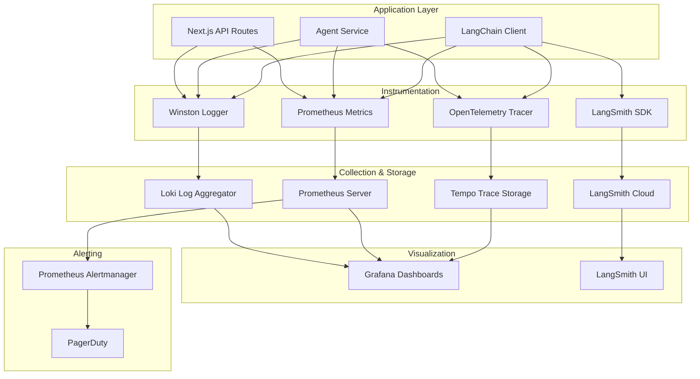

# Agent System - Observability & Safety

**Document Version**: 1.0  
**Date**: 2025-11-10  
**Scope**: Monitoring, logging, alerting, security, and compliance controls for production agent deployment

---

## Executive Summary

**Current State**: ❌ **No production-ready observability or safety controls**

- No structured logging
- No metrics collection
- No distributed tracing
- No PII redaction
- No content moderation
- No rate limiting or circuit breakers

**Target State**: ✅ **Full observability + safety guardrails**

- Real-time dashboards (Grafana)
- Structured logs with PII redaction (Winston + Loki)
- Distributed tracing (LangSmith + OpenTelemetry)
- Automated alerts (PagerDuty)
- Content moderation (OpenAI Moderation API)
- SLO enforcement (95% availability, <3s p95 latency)

**Implementation Effort**: 50-60 hours over 6 weeks

---

## 1. Observability Stack

### Architecture Diagram



---

## 2. Structured Logging

### Implementation

#### A. Winston Logger Configuration

Location: `packages/web/lib/logger/winston.config.ts`

```typescript
import winston from 'winston';
import LokiTransport from 'winston-loki';

const redactPII = winston.format((info) => {
  const piiPatterns = {
    email: /\b[A-Za-z0-9._%+-]+@[A-Za-z0-9.-]+\.[A-Z|a-z]{2,}\b/g,
    phone: /\b\d{3}[-.]?\d{3}[-.]?\d{4}\b/g,
    ssn: /\b\d{3}-\d{2}-\d{4}\b/g,
    creditCard: /\b\d{4}[-\s]?\d{4}[-\s]?\d{4}[-\s]?\d{4}\b/g,
  };

  let message = info.message;
  Object.entries(piiPatterns).forEach(([type, pattern]) => {
    message = message.replace(pattern, `[REDACTED_${type.toUpperCase()}]`);
  });

  info.message = message;
  return info;
});

export const logger = winston.createLogger({
  level: process.env.LOG_LEVEL || 'info',
  format: winston.format.combine(
    winston.format.timestamp(),
    redactPII(),
    winston.format.errors({ stack: true }),
    winston.format.json()
  ),
  defaultMeta: {
    service: 'procureflow-agent',
    environment: process.env.NODE_ENV,
  },
  transports: [
    // Console (local dev)
    new winston.transports.Console({
      format: winston.format.combine(
        winston.format.colorize(),
        winston.format.simple()
      ),
    }),

    // Loki (production)
    new LokiTransport({
      host: process.env.LOKI_HOST || 'http://loki:3100',
      labels: {
        app: 'procureflow',
        component: 'agent',
      },
      json: true,
      format: winston.format.json(),
      replaceTimestamp: true,
      onConnectionError: (err) => console.error('Loki connection error:', err),
    }),
  ],
});
```

#### B. Usage in Agent Service

Location: `features/agent/lib/agent.service.ts`

```typescript
import { logger } from '@/lib/logger/winston.config';

export async function handleAgentMessage(params: HandleAgentMessageParams) {
  const startTime = Date.now();

  logger.info('Agent request received', {
    conversationId: params.conversationId,
    userId: params.userId,
    messageLength: params.message.length,
  });

  try {
    const response = await generateAgentResponse(...);

    const elapsed = Date.now() - startTime;
    logger.info('Agent response generated', {
      conversationId: params.conversationId,
      toolsCalled: response.metadata?.tools_called,
      latencyMs: elapsed,
      tokenUsage: response.metadata?.token_usage,
    });

    return response;
  } catch (error) {
    logger.error('Agent request failed', {
      conversationId: params.conversationId,
      error: error.message,
      stack: error.stack,
      latencyMs: Date.now() - startTime,
    });
    throw error;
  }
}
```

#### C. Log Schema

All logs follow this structure:

```json
{
  "timestamp": "2025-11-10T14:32:01.123Z",
  "level": "info",
  "service": "procureflow-agent",
  "environment": "production",
  "message": "Agent response generated",
  "conversationId": "conv_abc123",
  "userId": "user_xyz789",
  "toolsCalled": ["search_catalog", "add_to_cart"],
  "latencyMs": 1234,
  "tokenUsage": { "input": 345, "output": 120, "total": 465 }
}
```

---

## 3. Metrics Collection

### Prometheus Metrics

#### A. Metric Definitions

Location: `packages/web/lib/metrics/prometheus.config.ts`

```typescript
import { Counter, Histogram, Gauge, register } from 'prom-client';

// Request metrics
export const agentRequestTotal = new Counter({
  name: 'agent_requests_total',
  help: 'Total number of agent requests',
  labelNames: ['status', 'tool'],
});

export const agentRequestDuration = new Histogram({
  name: 'agent_request_duration_seconds',
  help: 'Agent request latency in seconds',
  labelNames: ['tool'],
  buckets: [0.1, 0.5, 1, 2, 3, 5, 10],
});

// LLM metrics
export const llmCallTotal = new Counter({
  name: 'llm_calls_total',
  help: 'Total number of LLM API calls',
  labelNames: ['provider', 'model', 'status'],
});

export const llmTokenUsage = new Counter({
  name: 'llm_tokens_total',
  help: 'Total tokens consumed',
  labelNames: ['provider', 'type'], // type: input/output
});

export const llmCost = new Counter({
  name: 'llm_cost_usd_total',
  help: 'Total LLM cost in USD',
  labelNames: ['provider', 'model'],
});

// Tool execution metrics
export const toolExecutionTotal = new Counter({
  name: 'tool_executions_total',
  help: 'Total tool executions',
  labelNames: ['tool', 'status'],
});

export const toolExecutionDuration = new Histogram({
  name: 'tool_execution_duration_seconds',
  help: 'Tool execution latency',
  labelNames: ['tool'],
  buckets: [0.01, 0.05, 0.1, 0.5, 1, 2],
});

// System health
export const activeConversations = new Gauge({
  name: 'agent_active_conversations',
  help: 'Number of active conversations',
});

export const databaseConnectionPool = new Gauge({
  name: 'mongodb_connection_pool_size',
  help: 'MongoDB connection pool size',
});

// Expose /metrics endpoint
export function setupMetricsEndpoint(app: any) {
  app.get('/metrics', async (req, res) => {
    res.set('Content-Type', register.contentType);
    res.end(await register.metrics());
  });
}
```

#### B. Instrumentation

Location: `features/agent/lib/agent.service.ts`

```typescript
import {
  agentRequestTotal,
  agentRequestDuration,
  llmCallTotal,
  llmTokenUsage,
  toolExecutionTotal,
} from '@/lib/metrics/prometheus.config';

export async function handleAgentMessage(params: HandleAgentMessageParams) {
  const timer = agentRequestDuration.startTimer();

  try {
    const response = await generateAgentResponse(...);

    agentRequestTotal.inc({ status: 'success' });
    timer({ tool: response.metadata?.tools_called?.[0] || 'none' });

    // Track token usage
    llmTokenUsage.inc({
      provider: 'openai',
      type: 'input',
    }, response.metadata?.token_usage?.input || 0);

    llmTokenUsage.inc({
      provider: 'openai',
      type: 'output',
    }, response.metadata?.token_usage?.output || 0);

    return response;
  } catch (error) {
    agentRequestTotal.inc({ status: 'error' });
    timer();
    throw error;
  }
}

async function executeTool(toolName: string, args: any) {
  const timer = toolExecutionDuration.startTimer({ tool: toolName });

  try {
    const result = await toolHandlers[toolName](args);
    toolExecutionTotal.inc({ tool: toolName, status: 'success' });
    timer();
    return result;
  } catch (error) {
    toolExecutionTotal.inc({ tool: toolName, status: 'error' });
    timer();
    throw error;
  }
}
```

---

## 4. Distributed Tracing

### LangSmith Integration

#### A. Configuration

Location: `packages/web/lib/ai/langchainClient.ts`

```typescript
// Enable LangSmith tracing
process.env.LANGCHAIN_TRACING_V2 = 'true';
process.env.LANGCHAIN_PROJECT =
  process.env.NODE_ENV === 'production'
    ? 'procureflow-prod'
    : 'procureflow-dev';
process.env.LANGCHAIN_API_KEY = process.env.LANGSMITH_API_KEY;

export async function chatCompletionWithTools(params: ChatCompletionParams) {
  const { messages, tools, model, temperature } = params;

  // LangSmith automatically traces this call
  const chatModel = createChatModel({ model, temperature });

  const response = await chatModel.invoke(messages, {
    tools,
    // Add custom metadata to trace
    metadata: {
      conversationId: params.metadata?.conversationId,
      userId: params.metadata?.userId,
      toolCount: tools?.length || 0,
    },
  });

  return response;
}
```

#### B. Custom Trace Annotations

```typescript
import { traceable } from 'langsmith/traceable';

export const handleAgentMessage = traceable(
  async (params: HandleAgentMessageParams) => {
    // ... existing logic
  },
  {
    name: 'handleAgentMessage',
    run_type: 'chain',
    metadata: {
      version: '1.0',
    },
  }
);
```

---

## 5. Alerting Rules

### Prometheus Alertmanager Configuration

Location: `packages/infra/prometheus/alerts.yml`

```yaml
groups:
  - name: agent_alerts
    interval: 30s
    rules:
      # High error rate
      - alert: AgentHighErrorRate
        expr: |
          (
            sum(rate(agent_requests_total{status="error"}[5m]))
            /
            sum(rate(agent_requests_total[5m]))
          ) > 0.01
        for: 5m
        labels:
          severity: critical
        annotations:
          summary: 'Agent error rate above 1%'
          description: 'Error rate: {{ $value | humanizePercentage }}'

      # High latency
      - alert: AgentHighLatency
        expr: |
          histogram_quantile(0.95, 
            sum(rate(agent_request_duration_seconds_bucket[5m])) by (le)
          ) > 3
        for: 5m
        labels:
          severity: warning
        annotations:
          summary: 'Agent p95 latency above 3s'
          description: 'p95 latency: {{ $value }}s'

      # Rate limit errors
      - alert: LLMRateLimitErrors
        expr: |
          sum(rate(llm_calls_total{status="429"}[5m])) > 0.1
        for: 2m
        labels:
          severity: critical
        annotations:
          summary: 'LLM rate limit errors detected'
          description: 'Rate limit errors: {{ $value }}/s'

      # High cost
      - alert: LLMHighCost
        expr: |
          sum(increase(llm_cost_usd_total[1h])) > 10
        labels:
          severity: warning
        annotations:
          summary: 'LLM cost exceeds $10/hour'
          description: 'Hourly cost: ${{ $value }}'

      # MongoDB connection issues
      - alert: MongoDBConnectionPoolLow
        expr: mongodb_connection_pool_size < 5
        for: 5m
        labels:
          severity: warning
        annotations:
          summary: 'MongoDB connection pool below 5'
```

### PagerDuty Integration

Location: `packages/infra/prometheus/alertmanager.yml`

```yaml
route:
  receiver: 'pagerduty'
  group_by: ['alertname', 'severity']
  group_wait: 30s
  group_interval: 5m
  repeat_interval: 4h

receivers:
  - name: 'pagerduty'
    pagerduty_configs:
      - service_key: '<PAGERDUTY_INTEGRATION_KEY>'
        severity: '{{ .GroupLabels.severity }}'
```

---

## 6. Dashboards

### Grafana Dashboard - Agent Overview

Location: `packages/infra/grafana/dashboards/agent-overview.json`

**Panels**:

1. **Request Rate** (Graph)
   - Query: `sum(rate(agent_requests_total[5m])) by (status)`
   - Y-axis: Requests/sec
   - Legend: Success, Error

2. **Latency Percentiles** (Graph)
   - Query: `histogram_quantile(0.95, sum(rate(agent_request_duration_seconds_bucket[5m])) by (le))`
   - Y-axis: Seconds
   - Legend: p50, p95, p99

3. **Error Rate** (Gauge)
   - Query: `sum(rate(agent_requests_total{status="error"}[5m])) / sum(rate(agent_requests_total[5m]))`
   - Threshold: Red if >1%, Yellow if >0.5%

4. **Token Usage** (Graph)
   - Query: `sum(rate(llm_tokens_total[5m])) by (type)`
   - Y-axis: Tokens/sec
   - Legend: Input, Output

5. **Cost** (Counter)
   - Query: `sum(increase(llm_cost_usd_total[24h]))`
   - Display: $X.XX / day

6. **Tool Execution Breakdown** (Pie Chart)
   - Query: `sum(tool_executions_total) by (tool)`

---

## 7. Safety Controls

### A. Content Moderation

#### OpenAI Moderation API Integration

Location: `features/agent/lib/moderation.service.ts`

```typescript
import OpenAI from 'openai';

const openai = new OpenAI({ apiKey: process.env.OPENAI_API_KEY });

interface ModerationResult {
  safe: boolean;
  categories: string[];
}

export async function moderateContent(text: string): Promise<ModerationResult> {
  const response = await openai.moderations.create({
    input: text,
  });

  const result = response.results[0];

  if (result.flagged) {
    const flaggedCategories = Object.entries(result.categories)
      .filter(([_, flagged]) => flagged)
      .map(([category]) => category);

    return { safe: false, categories: flaggedCategories };
  }

  return { safe: true, categories: [] };
}
```

#### Usage in Agent Service

```typescript
export async function handleAgentMessage(params: HandleAgentMessageParams) {
  // Moderate user input
  const moderation = await moderateContent(params.message);

  if (!moderation.safe) {
    logger.warn('Unsafe content detected', {
      userId: params.userId,
      categories: moderation.categories,
    });

    return {
      conversationId: params.conversationId,
      content:
        'I cannot process this request as it violates our content policy.',
      role: 'assistant',
      metadata: {
        moderation_failed: true,
        categories: moderation.categories,
      },
    };
  }

  // ... continue with agent logic
}
```

---

### B. PII Redaction

#### Implementation

Location: `features/agent/lib/pii-redaction.service.ts`

```typescript
import Presidio from '@microsoft/presidio-analyzer';

const analyzer = new Presidio.AnalyzerEngine();

interface RedactionResult {
  redactedText: string;
  entities: Array<{ type: string; start: number; end: number }>;
}

export async function redactPII(text: string): Promise<RedactionResult> {
  const results = await analyzer.analyze(
    text,
    ['en'],
    [
      'EMAIL_ADDRESS',
      'PHONE_NUMBER',
      'CREDIT_CARD',
      'US_SSN',
      'PERSON',
      'LOCATION',
    ]
  );

  let redactedText = text;
  const entities = [];

  // Redact in reverse order to preserve indices
  for (const result of results.reverse()) {
    const replacement = `[REDACTED_${result.entity_type}]`;
    redactedText =
      redactedText.slice(0, result.start) +
      replacement +
      redactedText.slice(result.end);

    entities.push({
      type: result.entity_type,
      start: result.start,
      end: result.end,
    });
  }

  return { redactedText, entities };
}
```

---

### C. Rate Limiting

Refer to `ai-provider.best-practices.md` for detailed implementation of:

- Client-side rate limiting with Bottleneck
- Circuit breaker pattern
- Request queueing

---

### D. Input Validation

#### Schema Validation

Location: `features/agent/lib/validation.service.ts`

```typescript
import { z } from 'zod';

const MessageSchema = z.object({
  message: z
    .string()
    .min(1, 'Message cannot be empty')
    .max(1000, 'Message too long (max 1000 chars)')
    .refine(
      (msg) => !msg.match(/ignore\s+previous\s+instructions/i),
      'Potential prompt injection detected'
    ),
  conversationId: z.string().uuid(),
  userId: z.string(),
});

export function validateMessage(params: unknown) {
  return MessageSchema.parse(params);
}
```

---

## 8. SLO/SLA Definitions

### Service Level Objectives

| Metric            | Target          | Measurement Window |
| ----------------- | --------------- | ------------------ |
| **Availability**  | 99.5%           | 30 days            |
| **Latency (p95)** | <3s             | 5 minutes          |
| **Latency (p99)** | <5s             | 5 minutes          |
| **Error Rate**    | <1%             | 5 minutes          |
| **Token Cost**    | <$0.005/request | 24 hours           |

### Error Budget

- **Availability Budget**: 0.5% downtime = 3.6 hours/month
- **Error Budget**: 1% = 432 failed requests per 43,200 requests

**Policy**: If error budget is exhausted, freeze new features and focus on reliability improvements.

---

## 9. Incident Response Playbook

### Runbook: High Error Rate

**Trigger**: Error rate >1% for 5+ minutes

**Steps**:

1. Check Grafana dashboard for error spike
2. Query Loki logs: `{app="procureflow", level="error"}`
3. Identify error pattern:
   - Rate limit (429) → Enable circuit breaker
   - Timeout → Increase timeout or scale MongoDB
   - Tool failure → Disable failing tool
4. If LLM API is down → Failover to secondary provider
5. Post incident report after resolution

---

### Runbook: High Latency

**Trigger**: p95 latency >3s for 5+ minutes

**Steps**:

1. Check LangSmith traces for slow requests
2. Identify bottleneck:
   - LLM call slow → Check OpenAI status page
   - DB query slow → Check MongoDB slow queries
   - Tool execution slow → Optimize tool logic
3. If systemic → Scale Cloud Run instances
4. Add temporary caching for common queries

---

## 10. Compliance & Audit

### Data Retention Policy

- **Conversation logs**: 90 days
- **Metrics**: 1 year
- **Traces**: 30 days
- **PII**: Redacted before storage

### Audit Logging

All high-risk actions logged with:

- User ID
- Timestamp
- Action type (checkout, view_cart, etc.)
- Request/response payloads (PII redacted)

---

## Implementation Roadmap

### Phase 1: Logging & Metrics (Week 1-2, 16 hours)

1. ✅ Setup Winston + Loki - 4 hours
2. ✅ Add PII redaction to logger - 2 hours
3. ✅ Define Prometheus metrics - 3 hours
4. ✅ Instrument agent service - 4 hours
5. ✅ Setup /metrics endpoint - 1 hour
6. ✅ Deploy Prometheus + Grafana - 2 hours

### Phase 2: Alerting & Tracing (Week 3-4, 14 hours)

7. ✅ Configure Alertmanager rules - 3 hours
8. ✅ Integrate PagerDuty - 2 hours
9. ✅ Enable LangSmith tracing - 2 hours
10. ✅ Build Grafana dashboards - 5 hours
11. ✅ Write runbooks - 2 hours

### Phase 3: Safety Controls (Week 5-6, 20 hours)

12. ✅ Integrate OpenAI Moderation API - 3 hours
13. ✅ Add Presidio PII redaction - 6 hours
14. ✅ Implement input validation - 2 hours
15. ✅ Add rate limiting (from best practices doc) - 4 hours
16. ✅ Setup audit logging - 3 hours
17. ✅ Write incident response playbooks - 2 hours

**Total Effort**: 50 hours (~1.5 sprints)

---

## Success Metrics

| Metric                      | Baseline | Target     | Timeline |
| --------------------------- | -------- | ---------- | -------- |
| MTTD (Mean Time to Detect)  | Unknown  | <5 minutes | 30 days  |
| MTTR (Mean Time to Resolve) | 2 hours  | 30 minutes | 60 days  |
| Incident count              | Unknown  | <2/month   | 90 days  |
| PII leakage incidents       | Unknown  | 0          | Ongoing  |
| Availability SLO compliance | Unknown  | 99.5%      | 90 days  |

---

**Document Version**: 1.0  
**Last Updated**: 2025-11-10  
**Owner**: DevOps + Security Team  
**Next Review**: 2025-12-10 (1 month)
