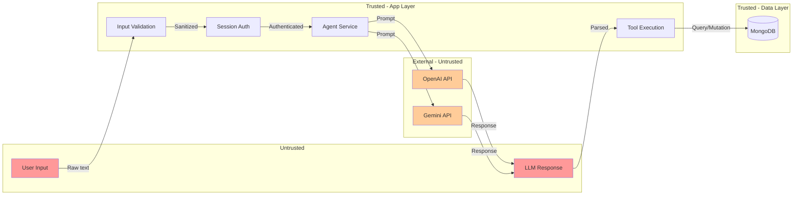
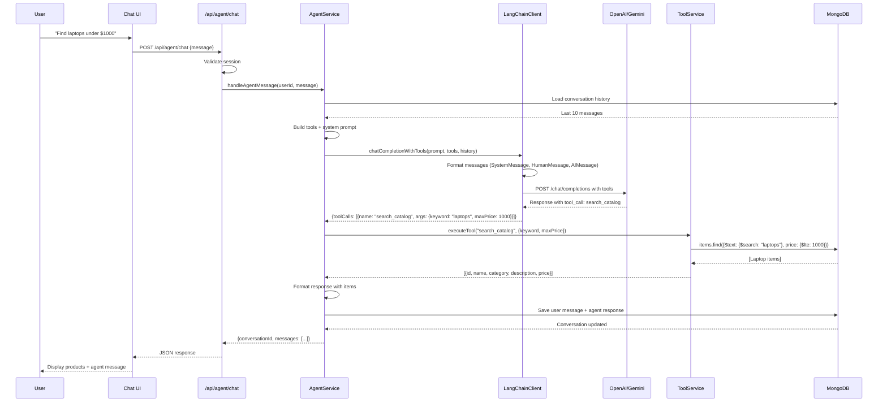

# Agent System Overview

**Assessment Date**: 2025-11-10  
**Version**: 1.0  
**System**: ProcureFlow Agent System  
**Scope**: End-to-end agent architecture, LangChain usage, AI provider integration

---

## Executive Summary

The ProcureFlow agent system is a **conversational procurement assistant** that enables users to search catalog, manage cart, and complete purchases through natural language. The architecture leverages **LangChain** as a thin abstraction layer over OpenAI/Gemini APIs, implementing **function calling** for tool orchestration.

**Key Characteristics**:

- **Thin LangChain wrapper**: Uses only ChatModel abstractions, not advanced LCEL/Agents framework
- **Custom agent logic**: Orchestration implemented in application layer (`agent.service.ts`)
- **Dual provider support**: OpenAI GPT-4o-mini (default) or Google Gemini 2.0-flash (free tier)
- **Function calling**: 7 tools for catalog search, cart operations, and checkout
- **MongoDB persistence**: Conversation history with message metadata
- **No advanced observability**: Missing metrics, traces, LangSmith integration

---

## High-Level Architecture Diagram

```mermaid
graph TB
    subgraph "User Layer"
        User[User Browser]
        ChatUI[Chat UI Components]
    end

    subgraph "API Layer"
        ChatRoute[POST /api/agent/chat]
        ConvRoute[GET /api/agent/conversations]
        HealthRoute[GET /api/health]
    end

    subgraph "Service Layer"
        AgentService[agent.service.ts<br/>handleAgentMessage<br/>generateAgentResponse<br/>executeTool]
        CatalogService[catalog.service.ts<br/>searchItems]
        CartService[cart.service.ts<br/>addItemToCart<br/>updateCartItemQuantity]
        CheckoutService[checkout.service.ts<br/>checkoutCart]
    end

    subgraph "LangChain Layer"
        LCClient[langchainClient.ts<br/>chatCompletionWithTools<br/>createChatModel]
        OpenAI[ChatOpenAI<br/>@langchain/openai]
        Gemini[ChatGoogleGenerativeAI<br/>@langchain/google-genai]
    end

    subgraph "External Services"
        OpenAIAPI[OpenAI API<br/>gpt-4o-mini]
        GeminiAPI[Gemini API<br/>gemini-2.0-flash]
    end

    subgraph "Data Layer"
        MongoDB[(MongoDB)]
        ConvSchema[agent_conversations<br/>Collection]
        ItemSchema[items<br/>Collection]
        CartSchema[carts<br/>Collection]
    end

    User --> ChatUI
    ChatUI --> ChatRoute
    ChatRoute --> AgentService
    AgentService --> LCClient
    AgentService --> CatalogService
    AgentService --> CartService
    AgentService --> CheckoutService

    LCClient --> OpenAI
    LCClient --> Gemini
    OpenAI --> OpenAIAPI
    Gemini --> GeminiAPI

    AgentService --> ConvSchema
    CatalogService --> ItemSchema
    CartService --> CartSchema

    ConvSchema --> MongoDB
    ItemSchema --> MongoDB
    CartSchema --> MongoDB

    ChatRoute --> ConvRoute
    ChatRoute --> HealthRoute

    style AgentService fill:#ff9999
    style LCClient fill:#99ccff
    style MongoDB fill:#99ff99
```

---

## Component Inventory

### 1. LangChain Components

| Component                | Package                    | Version | Usage                     | File                           |
| ------------------------ | -------------------------- | ------- | ------------------------- | ------------------------------ |
| `ChatOpenAI`             | `@langchain/openai`        | 1.0.0   | OpenAI chat model wrapper | `lib/ai/langchainClient.ts:86` |
| `ChatGoogleGenerativeAI` | `@langchain/google-genai`  | 1.0.0   | Gemini chat model wrapper | `lib/ai/langchainClient.ts:67` |
| `HumanMessage`           | `@langchain/core/messages` | 1.0.3   | User message type         | `lib/ai/langchainClient.ts:1`  |
| `AIMessage`              | `@langchain/core/messages` | 1.0.3   | Assistant message type    | `lib/ai/langchainClient.ts:1`  |
| `SystemMessage`          | `@langchain/core/messages` | 1.0.3   | System prompt type        | `lib/ai/langchainClient.ts:1`  |

**NOT Used**:

- ❌ LCEL (LangChain Expression Language) chains
- ❌ Runnables composition (`.pipe()`, `.batch()`, etc)
- ❌ Agents framework (ReAct, Structured, Tool-calling agent)
- ❌ Memory abstractions (BufferMemory, ConversationSummaryMemory)
- ❌ Retrievers or VectorStores
- ❌ Output parsers (StructuredOutputParser, etc)
- ❌ Callbacks or LangSmith tracing
- ❌ Streaming (no `stream()` or `astream()`)

**Conclusion**: LangChain is used as a **minimal abstraction layer** for ChatModel API normalization across providers. Agent logic is **fully custom-built** in application code.

---

### 2. Agent Service Components

| Component                    | File                                       | Lines                  | Purpose                                 |
| ---------------------------- | ------------------------------------------ | ---------------------- | --------------------------------------- |
| `handleAgentMessage()`       | `features/agent/lib/agent.service.ts:99`   | Main entry point       | Orchestrates user message processing    |
| `generateAgentResponse()`    | `features/agent/lib/agent.service.ts:229`  | Agent core logic       | Builds tools, calls LLM, executes tools |
| `executeTool()`              | `features/agent/lib/agent.service.ts:868`  | Tool execution         | Maps tool names to service functions    |
| `listConversationsForUser()` | `features/agent/lib/agent.service.ts:990`  | Conversation history   | Fetches user conversations from DB      |
| `getConversationById()`      | `features/agent/lib/agent.service.ts:1100` | Conversation retrieval | Loads full conversation with messages   |

**Tool Definitions** (7 tools):

1. `search_catalog` - Search products by keyword + price filter
2. `add_to_cart` - Add NEW items to cart
3. `update_cart_quantity` - Change quantity of EXISTING cart items
4. `view_cart` - Display current cart contents
5. `analyze_cart` - Get cart analytics (highest/lowest price, avg, etc)
6. `remove_from_cart` - Remove item completely from cart
7. `checkout` - Complete purchase with current cart

---

### 3. Database Schemas

| Collection            | Schema File                                   | Purpose                  | Key Fields                                 |
| --------------------- | --------------------------------------------- | ------------------------ | ------------------------------------------ |
| `agent_conversations` | `lib/db/schemas/agent-conversation.schema.ts` | Conversation persistence | userId, title, messages[], status          |
| `items`               | `lib/db/schemas/item.schema.ts`               | Catalog items            | name, category, price, description, status |
| `carts`               | `lib/db/schemas/cart.schema.ts`               | User carts               | userId, items[], totalCost                 |
| `purchase_requests`   | `lib/db/schemas/purchase-request.schema.ts`   | Checkout records         | userId, items[], status, totalCost         |
| `users`               | `lib/db/schemas/user.schema.ts`               | User accounts            | email, passwordHash, name                  |

**Indexes**:

- `items`: Text index on `name` + `description` (required for `$text` search)
- `agent_conversations`: Compound index on `userId` + `updatedAt` (for history list)
- `carts`: Index on `userId` (for cart retrieval)

---

### 4. API Routes

| Endpoint                        | Method   | Handler                                           | Purpose                  |
| ------------------------------- | -------- | ------------------------------------------------- | ------------------------ |
| `/api/agent/chat`               | POST     | `app/(app)/api/agent/chat/route.ts`               | Send message to agent    |
| `/api/agent/conversations`      | GET      | `app/(app)/api/agent/conversations/route.ts`      | List user conversations  |
| `/api/agent/conversations/[id]` | GET      | `app/(app)/api/agent/conversations/[id]/route.ts` | Get conversation details |
| `/api/health`                   | GET      | `app/(app)/api/health/route.ts`                   | Health check (DB + AI)   |
| `/api/catalog`                  | GET      | `app/(app)/api/catalog/route.ts`                  | Search catalog items     |
| `/api/cart`                     | GET/POST | `app/(app)/api/cart/route.ts`                     | Cart operations          |
| `/api/checkout`                 | POST     | `app/(app)/api/checkout/route.ts`                 | Complete purchase        |

---

### 5. UI Components

**Agent Chat UI** (`features/agent/components/`):

- `AgentChatPageContent.tsx` - Main chat page container
- `AgentChatMessages.tsx` - Message list renderer
- `AgentChatInput.tsx` - User input field
- `MessageBubble.tsx` - Individual message display
- `AgentProductCard.tsx` - Product card in chat
- `AgentProductCarousel.tsx` - Product carousel for multiple items
- `AgentCartView.tsx` - Cart display in chat
- `AgentWelcome.tsx` - Welcome screen
- `MarkdownText.tsx` - Markdown renderer for messages
- `CheckoutConfirmationDialog.tsx` - Checkout confirmation modal

**Hooks**:

- `useAgentConversations.ts` - Fetch conversation history with SWR

---

## System Boundaries

### Trust Boundaries



**Security Considerations**:

- ❌ **No input sanitization** for prompt injection (user messages passed as-is)
- ❌ **No output validation** (LLM responses not checked for malicious content)
- ❌ **No PII redaction** (user messages stored in plaintext)
- ❌ **No rate limiting** (vulnerable to abuse/DoS)
- ✅ **Session authentication** (requires valid NextAuth session)
- ✅ **Tool authorization** (userId validated before cart/checkout operations)

---

## Data Flow

### Typical Agent Interaction



---

## Token Flow & Optimization

**Token Budget per Request**:

- **System prompt**: ~500 tokens (hardcoded in `agent.service.ts`)
- **Tool definitions**: ~800 tokens (7 tools with JSON schemas)
- **Conversation history**: ~1500 tokens (last 10 messages, variable)
- **User message**: ~50-200 tokens (variable)
- **LLM response**: ~100-500 tokens (variable)

**Total Input**: ~2850-3000 tokens per request  
**Total Output**: ~100-500 tokens per request

**Optimizations Implemented** (see `TOKEN_OPTIMIZATION.md`):

1. ✅ Reduced default search limit from 50 to 10 items
2. ✅ Truncated item descriptions to 150 chars (from 400+ avg)
3. ✅ Added `maxResults` parameter to search tool (default 5, max 10)
4. ✅ Multi-search optimization (3-5 items per keyword vs 50)

**Result**: 85-90% token reduction for search queries

**Missing Optimizations**:

- ❌ No prompt caching (repeated system prompt + tools)
- ❌ No response caching (identical queries not cached)
- ❌ No context window management (no truncation by token count)
- ❌ No summarization for long conversations

---

## Environment Configuration

### Required Environment Variables

```bash
# Database
MONGODB_URI=mongodb://localhost:27017/procureflow

# Authentication
NEXTAUTH_SECRET=<secret-key>
NEXTAUTH_URL=http://localhost:3000

# AI Provider (choose one or both)
OPENAI_API_KEY=sk-...          # OpenAI GPT-4o-mini
# OR
GOOGLE_API_KEY=...             # Google Gemini 2.0-flash

# Optional: Force specific provider
AI_PROVIDER=openai             # or 'gemini'
```

### Provider Selection Logic

```typescript
AI_PROVIDER =
  AI_PROVIDER env var (if set)
  || (OPENAI_API_KEY ? 'openai' : null)
  || (GOOGLE_API_KEY ? 'gemini' : null)
  || 'openai' (default, even if unconfigured)
```

**Implication**: If both keys are set, **OpenAI is preferred** unless `AI_PROVIDER=gemini` is explicitly set.

---

## Ownership & Responsibilities

| Component                      | Owner         | Responsibilities                                            |
| ------------------------------ | ------------- | ----------------------------------------------------------- |
| `langchainClient.ts`           | AI Team       | LangChain abstraction, provider management, error handling  |
| `agent.service.ts`             | Agent Team    | Tool orchestration, conversation management, business logic |
| `catalog.service.ts`           | Catalog Team  | Search, item CRUD, duplicate detection                      |
| `cart.service.ts`              | Cart Team     | Cart operations, analytics, validation                      |
| `checkout.service.ts`          | Checkout Team | Purchase request creation, validation                       |
| `agent-conversation.schema.ts` | DB Team       | Schema design, indexes, validation                          |
| Agent UI components            | Frontend Team | Chat interface, product display, cart views                 |

---

## Key Metrics (Missing - Recommendations)

**Proposed Metrics**:

1. **Request Latency** (p50, p95, p99)
   - Agent message processing time
   - LLM API call duration
   - Tool execution time

2. **Token Usage**
   - Input tokens per request
   - Output tokens per request
   - Total tokens per user/day

3. **Cost Tracking**
   - Cost per request (based on tokens)
   - Cost per user/month
   - Total spend

4. **Error Rates**
   - LLM API errors (4xx, 5xx)
   - Tool execution failures
   - Conversation save failures

5. **Tool Usage**
   - Tool invocation counts
   - Tool success/failure rates
   - Most used tools

6. **Conversation Metrics**
   - Messages per conversation (avg, max)
   - Conversations per user (avg)
   - Active conversations

**Current State**: ❌ None of these are implemented.

---

## Next Steps

This overview provides the foundation for deeper analysis in subsequent documents:

1. C4 architecture diagrams (context + container views)
2. Sequence flows (happy path + failure scenarios)
3. LangChain usage deep-dive
4. Prompt system analysis
5. Tools layer documentation
6. Observability & safety assessment
7. AI provider best practices
8. Code quality review
9. Risk assessment + ADR proposals
10. Improvement backlog (RICE-scored)

---

**Document Version**: 1.0  
**Last Updated**: 2025-11-10  
**Next Review**: After architecture deep-dive
