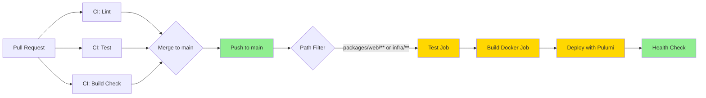

# CI/CD and IaC Current State Assessment

**Assessment Date**: 2025-11-13  
**Project**: ProcureFlow  
**Scope**: GitHub Actions CI/CD + Pulumi GCP Infrastructure

---

## Executive Summary

ProcureFlow uses a **basic but functional** CI/CD pipeline with GitHub Actions and Pulumi for GCP deployment. The current setup achieves continuous deployment to Cloud Run but has **significant opportunities** for improvement in security (no OIDC), speed (sequential jobs, no build caching), and reliability (no rollback strategy, single-stage deploy).

**Key Strengths**:
- ✅ Automated CI (lint, test, build) on PRs and pushes
- ✅ Automated CD to GCP Cloud Run on main branch
- ✅ Pulumi IaC with encrypted secrets in state
- ✅ Free-tier optimized (Cloud Run scales to zero)
- ✅ Multi-stage Docker build with docs bundling

**Critical Gaps**:
- ❌ **No OIDC**: Uses long-lived service account keys (`GCP_SA_KEY`)
- ❌ **No build-once-promote-many**: Rebuilds/retests in deploy workflow
- ❌ **No rollback procedure**: Only "deploy forward" approach
- ❌ **No image attestation**: Missing SBOM, provenance, vulnerability scanning
- ❌ **Limited caching**: No Docker layer cache, only pnpm store cache
- ❌ **No environment strategy**: Single dev environment, no staging/prod isolation

---

## Current Pipeline Architecture

### Workflow Diagram



### Workflow Inventory

| Workflow | Trigger | Jobs | Duration (Estimated) | Status |
|----------|---------|------|---------------------|--------|
| **ci.yml** | PR, push to main/dev | 3 sequential (lint, test, build) | ~5-7 min | ✅ Active |
| **deploy-gcp.yml** | Push to main (path filter), manual | 4 sequential (test, build, deploy, health) | ~12-15 min | ✅ Active |

---

## Detailed Component Analysis

### 1. GitHub Actions Workflows

#### **ci.yml** - Continuous Integration

**Triggers**:
- Pull requests to `main`, `dev`, `feat/**`
- Pushes to `main`, `dev`

**Jobs**:

| Job | Steps | Caching | Estimated Duration |
|-----|-------|---------|-------------------|
| **lint** | checkout, setup-node, setup-pnpm, cache pnpm, install, eslint, prettier | ✅ pnpm store | ~2 min |
| **test** | checkout, setup-node, setup-pnpm, cache pnpm, install, vitest, upload coverage | ✅ pnpm store | ~2 min |
| **build** | checkout, setup-node, setup-pnpm, cache pnpm, install, Next.js build, docs build | ✅ pnpm store | ~3 min |

**Total Duration**: ~7 minutes (sequential execution)

**Concurrency Control**: ❌ None (multiple runs can execute in parallel)

**Environment Variables**:
```yaml
NODE_VERSION: '20'
PNPM_VERSION: '10.21.0'
```

**Caching Strategy**:
- ✅ Uses `actions/cache@v4` for pnpm store
- ✅ Cache key: `${{ runner.os }}-pnpm-store-${{ hashFiles('**/pnpm-lock.yaml') }}`
- ✅ Restore keys for partial matches
- ❌ No Next.js build cache
- ❌ No Docker layer cache

**Observations**:
- Jobs run sequentially with `needs: [lint, test]` for build job
- Could parallelize lint and test for ~30% speed improvement
- Uploads coverage artifacts (retention: 7 days)
- No artifact sharing between workflows (rebuild in deploy)

---

#### **deploy-gcp.yml** - Deployment Pipeline

**Triggers**:
- Push to `main` with path filters: `packages/web/**`, `packages/infra/**`, `.github/workflows/deploy-gcp.yml`
- Manual dispatch with environment selection (dev/staging/production)

**Jobs**:

| Job | Steps | Dependencies | Estimated Duration |
|-----|-------|--------------|-------------------|
| **test** | lint + test (duplicate of ci.yml) | None | ~4 min |
| **build** | Docker build, push to Artifact Registry | `needs: test` | ~5-7 min |
| **deploy** | Pulumi up, configure stack | `needs: build` | ~3-5 min |
| **health-check** | curl health endpoint | `needs: deploy` | ~1 min |

**Total Duration**: ~13-17 minutes (fully sequential)

**Environment Strategy**:
- GitHub Environment: `${{ github.event.inputs.environment || 'dev' }}`
- ❌ No protection rules configured
- ❌ No required reviewers for production
- ❌ No branch restrictions

**Secrets Used**:
| Secret | Type | Usage | Risk Level |
|--------|------|-------|-----------|
| `GCP_SA_KEY` | Service Account JSON | Authentication to GCP | 🔴 **HIGH** (long-lived key) |
| `GCP_PROJECT_ID` | Project ID | GCP resource targeting | 🟢 Low |
| `PULUMI_ACCESS_TOKEN` | API Token | Pulumi Cloud authentication | 🟡 Medium |
| `NEXTAUTH_SECRET` | Application Secret | Session encryption | 🟡 Medium |
| `OPENAI_API_KEY` | API Key | OpenAI integration | 🟡 Medium |
| `MONGODB_CONNECTION_STRING` | Connection String | Database access | 🟡 Medium |

**Authentication Flow**:
```yaml
- uses: google-github-actions/auth@v2
  with:
    credentials_json: ${{ secrets.GCP_SA_KEY }}  # ❌ Long-lived key, no OIDC
```

**Docker Build**:
```yaml
docker build \
  -f packages/infra/docker/Dockerfile.web \
  --build-arg GIT_COMMIT_SHA=$GIT_COMMIT_SHA \
  --build-arg BUILD_DATE=$(date -u) \
  --build-arg VERSION=sha-${SHORT_SHA} \
  -t $IMAGE_URL:sha-${SHORT_SHA} \
  -t $IMAGE_URL:latest \
  .
```

**Observations**:
- ❌ **Duplicate testing**: Re-runs lint/test that already passed in ci.yml
- ❌ **No BuildKit cache**: Builds from scratch every time
- ❌ **No image digest export**: Uses tags, not immutable digests
- ❌ **No SBOM/provenance**: Missing security attestations
- ✅ **Multi-stage Dockerfile**: Docs bundled into final image
- ⚠️ **Image tags**: Uses `latest` + `sha-${SHORT_SHA}` (should use full SHA digest)

---

### 2. Pulumi Infrastructure as Code

#### **Stack Configuration**

**Pulumi Project**: `procureflow-gcp`  
**State Backend**: Pulumi Cloud (SaaS, free tier)  
**Stacks**: `dev` (only stack configured)

**Stack Configuration** (`Pulumi.dev.yaml`):
```yaml
config:
  gcp:project: procureflow-dev
  gcp:region: us-central1
  procureflow-gcp:environment: dev
  procureflow-gcp:image-tag: latest  # ⚠️ Mutable tag, should be digest
  
  # Encrypted secrets (stored in Pulumi state)
  procureflow-gcp:nextauth-secret: [encrypted]
  procureflow-gcp:openai-api-key: [encrypted]
  procureflow-gcp:mongodb-connection-string: [encrypted]
```

#### **Resources Managed**

| Resource Type | Resource Name | Protection | Import Support | Notes |
|--------------|---------------|------------|----------------|-------|
| **Service Account** | `procureflow-cloudrun` | ❌ | ✅ (manual import) | Least-privilege for Cloud Run |
| **Secret Manager (3)** | `nextauth-secret`, `openai-api-key`, `mongodb-uri` | ❌ | ✅ | Auto-replication, free tier |
| **Secret IAM (3)** | Secret accessor bindings | ❌ | ❌ | Grants Cloud Run access |
| **Cloud Run Service** | `procureflow-web` | ❌ | ❌ | Gen2, scales to zero |
| **Cloud Run IAM** | `allUsers` invoker role | ❌ | ❌ | Public access (no auth) |
| **Artifact Registry** | `procureflow` | ❌ (manual) | N/A | Managed outside Pulumi |

**Total Resources**: 9 (8 Pulumi-managed + 1 manual)

#### **Deployment Flow**

```yaml
# In deploy-gcp.yml
- name: Configure Pulumi stack
  run: |
    pulumi config set gcp:project ${{ secrets.GCP_PROJECT_ID }}
    pulumi config set environment dev
    pulumi config set image-tag ${{ needs.build.outputs.image-tag }}
    pulumi config set --secret nextauth-secret "${{ secrets.NEXTAUTH_SECRET }}"
    # ... more secrets

- name: Pulumi Preview
  run: pulumi preview  # ❌ No preview comment on PRs

- name: Pulumi Up
  run: pulumi up --yes  # ⚠️ Auto-approve, no manual gate

- name: Update NEXTAUTH_URL
  run: |
    gcloud run services update procureflow-web \
      --update-env-vars="NEXTAUTH_URL=$SERVICE_URL"
    # ⚠️ Post-deployment patch via gcloud (should be in Pulumi)
```

**Observations**:
- ✅ **Secrets encrypted in state**: Pulumi manages sensitive config securely
- ✅ **Resource import support**: Existing resources imported to avoid recreate
- ✅ **Automatic preview**: Runs `pulumi preview` before deploy
- ❌ **No PR preview comments**: Pulumi preview output not posted to PRs
- ❌ **No drift detection**: No scheduled `pulumi refresh` to detect manual changes
- ❌ **No policy as code**: No Pulumi CrossGuard policies for compliance
- ⚠️ **Manual GAR management**: Artifact Registry created manually due to permission issues
- ⚠️ **Post-deploy patch**: `NEXTAUTH_URL` updated via `gcloud` instead of Pulumi

#### **Pulumi Resource Definitions**

**Cloud Run Service** (`compute/cloudrun.ts`):
```typescript
new gcp.cloudrun.Service('procureflow-web', {
  location: 'us-central1',
  template: {
    metadata: {
      annotations: {
        'autoscaling.knative.dev/minScale': '0',  // ✅ Scales to zero
        'autoscaling.knative.dev/maxScale': '2',  // ✅ Cost cap
        'run.googleapis.com/execution-environment': 'gen2',  // ✅ Modern runtime
      }
    },
    spec: {
      containers: [{
        image: imageUrl,  // ⚠️ Uses tag, not digest
        resources: {
          limits: { cpu: '1000m', memory: '512Mi' }  // ✅ Free tier optimized
        },
        envs: [
          // Secrets from Secret Manager (✅ secure injection)
          { name: 'NEXTAUTH_SECRET', valueFrom: { secretKeyRef: { ... } } },
          // ❌ NEXTAUTH_URL missing, patched post-deploy
        ]
      }]
    }
  },
  traffics: [{ percent: 100, latestRevision: true }]  // ❌ No blue/green, no rollback
})
```

**Secret Manager** (`security/secrets.ts`):
```typescript
new gcp.secretmanager.Secret('nextauth-secret', {
  secretId: 'nextauth-secret',
  replication: { auto: {} },  // ✅ Auto-replication
  // ... options with import support
})
```

**IAM Roles**:
- Cloud Run service account: `procureflow-cloudrun@procureflow-dev.iam.gserviceaccount.com`
- Secrets: `roles/secretmanager.secretAccessor` (read-only, ✅ least-privilege)
- Public access: `roles/run.invoker` to `allUsers` (⚠️ no auth layer)

---

### 3. Docker and Artifact Registry

#### **Dockerfile Analysis** (`packages/infra/docker/Dockerfile.web`)

**Base Image**: `node:20-alpine@sha256:6178e78b972f79c335df281f4b7674a2d85071aae2af020ffa39f0a770265435`  
✅ **Pinned to SHA256 digest** for reproducibility and security

**Multi-Stage Build**:
```dockerfile
# Stage 1: Base (Node 20 Alpine + corepack + pnpm)
FROM node:20-alpine AS base

# Stage 2: Docs Builder (Nextra documentation)
FROM base AS docs-builder
RUN --mount=type=cache,target=/root/.local/share/pnpm/store \
  pnpm install --filter @procureflow/docs --frozen-lockfile
RUN pnpm build:prod  # Outputs to packages/docs/out

# Stage 3: App Builder (Next.js with hoisted modules)
FROM base AS builder
RUN --mount=type=cache,target=/root/.local/share/pnpm/store \
  pnpm install --frozen-lockfile --shamefully-hoist
COPY --from=docs-builder /app/packages/docs/out ./packages/web/public/docs
RUN pnpm build  # Next.js standalone output

# Stage 4: Runner (Minimal production runtime)
FROM node:20-alpine AS runner
COPY --from=builder /app/packages/web/.next/standalone ./
COPY --from=builder /app/packages/web/.next/static ./packages/web/.next/static
COPY --from=builder /app/packages/web/public ./packages/web/public
USER nextjs  # ✅ Non-root user
CMD ["node", "packages/web/server.js"]
```

**Build Optimizations**:
- ✅ **BuildKit cache mounts**: `--mount=type=cache,target=/root/.local/share/pnpm/store`
- ✅ **Multi-stage**: Docs + app built separately, final image minimal
- ✅ **Next.js standalone**: Minimal dependencies, smaller image
- ✅ **Non-root user**: Security best practice
- ✅ **SHA256-pinned base**: Immutable base image
- ❌ **No layer cache in CI**: BuildKit cache not persisted between runs
- ❌ **No SBOM generation**: Missing software bill of materials
- ❌ **No vulnerability scanning**: No Trivy/Grype in pipeline

**Estimated Image Size**: ~200-250 MB (Alpine + Next.js standalone + docs)

#### **Artifact Registry**

**Registry URL**: `us-central1-docker.pkg.dev/procureflow-dev/procureflow`

**Management**: ⚠️ **Manually created** (not in Pulumi due to permission constraints)

**Tagging Strategy**:
```bash
# Current (in deploy-gcp.yml)
IMAGE_TAG="sha-$(git rev-parse --short HEAD)"  # ⚠️ 7-char SHA, not immutable
docker tag $IMAGE_URL:$IMAGE_TAG
docker tag $IMAGE_URL:latest  # ❌ Mutable tag
docker push $IMAGE_URL:$IMAGE_TAG
docker push $IMAGE_URL:latest
```

**Issues**:
- ❌ **No image digest export**: Uses tags, not `@sha256:...` digests
- ❌ **Mutable `latest` tag**: Breaks "build once, promote many"
- ❌ **Short SHA**: Should use full 40-char commit SHA
- ❌ **No retention policy**: Images accumulate indefinitely
- ❌ **No vulnerability scanning**: GCP Artifact Analysis not enabled

**Recommended Tagging**:
```bash
# Immutable tags
$IMAGE_URL:git-$FULL_SHA          # Source tracking
$IMAGE_URL:v1.2.3                 # Semantic version (if tagged)
$IMAGE_URL:$ENV-$TIMESTAMP        # Environment-specific
# Mutable tags (promotion only)
$IMAGE_URL:dev-latest             # Dev environment
$IMAGE_URL:prod-latest            # Production environment
```

---

### 4. GCP Resources and Configuration

#### **Cloud Run Service**

**Service Name**: `procureflow-web`  
**Region**: `us-central1`  
**Execution Environment**: Generation 2 (gen2)

**Scaling Configuration**:
```yaml
minScale: 0       # ✅ Scales to zero (free tier friendly)
maxScale: 2       # ✅ Cost cap
concurrency: 80   # Max requests per instance
timeout: 300s     # 5 minutes (max allowed)
```

**Resources**:
```yaml
cpu: 1000m        # 1 vCPU (within 180k vCPU-seconds/month free)
memory: 512Mi     # 512 MB (within 360k GB-seconds/month free)
cpu-throttling: true  # ✅ Throttle when idle to save costs
```

**Environment Variables**:
- `NODE_ENV=production`
- `NEXT_TELEMETRY_DISABLED=1`
- `NEXTAUTH_URL` (⚠️ patched post-deploy via gcloud)

**Secrets** (from Secret Manager):
- `NEXTAUTH_SECRET`
- `OPENAI_API_KEY`
- `MONGODB_URI`

**Traffic Configuration**:
```yaml
traffics:
  - percent: 100
    latestRevision: true  # ❌ No blue/green, all-or-nothing deploy
```

**Public Access**:
```yaml
IAM: roles/run.invoker -> allUsers  # ⚠️ Public access, no auth
```

**Deployment Strategy**: ❌ **None** (immediate 100% traffic to new revision)

**Rollback Capability**: ⚠️ **Manual only** (via `gcloud run services update-traffic`)

---

#### **Service Account and IAM**

**Cloud Run Service Account**:
- Email: `procureflow-cloudrun@procureflow-dev.iam.gserviceaccount.com`
- Roles: ✅ **Least-privilege** (no project-level roles)
- Secret Access: `roles/secretmanager.secretAccessor` on 3 secrets

**CI/CD Service Account** (GitHub Actions):
- Name: `github-actions` (assumed, not visible in code)
- Key: `GCP_SA_KEY` (❌ long-lived JSON key)
- Roles (from deploy workflow comments):
  - `roles/run.admin` (Cloud Run management)
  - `roles/iam.serviceAccountUser` (impersonate service accounts)
  - `roles/artifactregistry.writer` (push images)
  - `roles/secretmanager.admin` (manage secrets)
  - `roles/iam.serviceAccountAdmin` (manage service accounts)
  - `roles/compute.viewer` (list regions)

**Security Observations**:
- ❌ **Overly permissive**: `secretmanager.admin` instead of `secretAccessor`
- ❌ **No OIDC**: Uses long-lived key stored in GitHub Secrets
- ❌ **No key rotation**: No expiration or rotation policy
- ✅ **Runtime least-privilege**: Cloud Run service account has minimal access

---

### 5. Timing Analysis

#### **Step Durations (Estimated)**

| Pipeline Stage | Steps | Estimated Duration | Notes |
|----------------|-------|-------------------|-------|
| **CI Workflow (ci.yml)** | | | |
| Checkout | git clone | 10-15s | Shallow clone |
| Setup Node + pnpm | install runtime | 20-30s | Cached runner |
| Cache pnpm store | restore cache | 5-10s (hit), 0s (miss) | ~300-500 MB |
| Install dependencies | pnpm install | 60-90s (cold), 20-30s (warm) | Monorepo with frozen lockfile |
| Lint (ESLint + Prettier) | static analysis | 30-45s | ~200 files |
| Test (Vitest) | unit tests | 15-30s | 6 tests currently |
| Build (Next.js) | next build | 90-120s | Turbopack, no cache |
| Build (Nextra docs) | next build | 30-45s | Static export |
| **Total CI** | | **~5-7 minutes** | Parallelizable (lint + test) |
| | | | |
| **Deploy Workflow (deploy-gcp.yml)** | | | |
| Test (duplicate) | lint + test | 4-5 min | ❌ Redundant |
| Docker build | multi-stage build | 5-7 min | No layer cache |
| Docker push | upload to GAR | 30-60s | ~200 MB image |
| Pulumi dependencies | pnpm install | 15-30s | Small project |
| Pulumi preview | plan changes | 30-60s | API calls to GCP |
| Pulumi up | apply changes | 2-4 min | Cloud Run update |
| Post-deploy patch | gcloud update | 30-60s | NEXTAUTH_URL fix |
| Health check | curl + sleep | 45s | 30s sleep + requests |
| **Total Deploy** | | **~13-17 minutes** | Fully sequential |
| | | | |
| **Full Pipeline (PR + Deploy)** | | **~18-24 minutes** | From commit to production |

#### **Cache Hit Rates (Estimated)**

| Cache Type | Hit Rate | Impact |
|-----------|----------|--------|
| pnpm store | ~80-90% | -60s install time |
| Next.js build | 0% (not cached) | No impact |
| Docker layers | 0% (not cached) | No impact |

---

### 6. Triggers and Concurrency

#### **Workflow Triggers**

**ci.yml**:
```yaml
on:
  pull_request:
    branches: [main, dev, feat/**]
  push:
    branches: [main, dev]
```
- ✅ Runs on all relevant branches
- ❌ No concurrency control (multiple runs can overlap)
- ❌ No path filters (runs even for docs-only changes)

**deploy-gcp.yml**:
```yaml
on:
  push:
    branches: [main]
    paths:
      - 'packages/web/**'
      - 'packages/infra/**'
      - '.github/workflows/deploy-gcp.yml'
  workflow_dispatch:
    inputs:
      environment: [dev, staging, production]
```
- ✅ Path filters avoid unnecessary deploys
- ✅ Manual dispatch for emergency deploys
- ❌ No concurrency control (parallel deploys possible)
- ❌ No environment protection rules

#### **Concurrency Strategy**

**Current**: ❌ None defined

**Recommended**:
```yaml
concurrency:
  group: ${{ github.workflow }}-${{ github.ref }}
  cancel-in-progress: true  # Cancel old runs on new push
```

---

### 7. Secrets and Configuration Management

#### **GitHub Secrets**

| Secret | Scope | Rotation | Risk | Recommendation |
|--------|-------|----------|------|----------------|
| `GCP_SA_KEY` | Org/Repo | ❌ Never | 🔴 High | Migrate to OIDC |
| `GCP_PROJECT_ID` | Repo | N/A | 🟢 Low | Move to workflow vars |
| `PULUMI_ACCESS_TOKEN` | Repo | ❌ Manual | 🟡 Medium | Add expiration |
| `NEXTAUTH_SECRET` | Repo | ❌ Manual | 🟡 Medium | OK (app secret) |
| `OPENAI_API_KEY` | Repo | ❌ Manual | 🟡 Medium | OK (3rd party) |
| `MONGODB_CONNECTION_STRING` | Repo | ❌ Manual | 🟡 Medium | Use Atlas API key |

**Environment Secrets**: ❌ Not using GitHub Environments for per-env secrets

**Pulumi Secrets**:
- ✅ Encrypted in state file
- ✅ Set via `pulumi config set --secret`
- ❌ Duplicated in GitHub Secrets (single source of truth issue)

---

### 8. Monitoring and Observability

**Current State**:
- ❌ No workflow metrics collection
- ❌ No build time tracking
- ❌ No failure rate monitoring
- ❌ No deployment frequency metrics
- ✅ Artifacts: Coverage reports uploaded (retention: 7 days)
- ❌ No log aggregation
- ❌ No alerting on failures

**Cloud Run Monitoring**:
- ✅ Default metrics (requests, latency, CPU, memory) in Cloud Console
- ❌ No custom metrics or dashboards
- ❌ No uptime monitoring
- ❌ No cost alerts

---

## Summary: Current State Snapshot

### Configuration Matrix

| Aspect | Current State | Compliance | Notes |
|--------|--------------|------------|-------|
| **Authentication** | Service Account Key | 🔴 Poor | No OIDC, long-lived key |
| **Build Caching** | pnpm only | 🟡 Fair | No Docker or Next.js cache |
| **Artifact Strategy** | Tag-based | 🔴 Poor | No digest, mutable `latest` |
| **Deploy Strategy** | All-or-nothing | 🔴 Poor | No blue/green, no rollback |
| **Environment Isolation** | Single env | 🔴 Poor | No staging, no protection |
| **IaC State** | Pulumi Cloud | 🟢 Good | Encrypted, version controlled |
| **IaC Preview** | On deploy | 🟡 Fair | No PR comments |
| **Policy as Code** | None | 🔴 Poor | No CrossGuard |
| **SBOM/Provenance** | None | 🔴 Poor | No attestations |
| **Vulnerability Scanning** | None | 🔴 Poor | No Trivy/Grype |
| **Rollback Procedure** | Manual | 🟡 Fair | No automated rollback |
| **Monitoring** | Basic | 🟡 Fair | Cloud Console only |
| **Cost Optimization** | Free tier | 🟢 Good | Scales to zero |

### Resource Inventory

**GitHub Actions**:
- Workflows: 2 (ci.yml, deploy-gcp.yml)
- Jobs: 7 total (3 CI + 4 deploy)
- Secrets: 6
- Environments: 1 (dev, no protection)

**Pulumi**:
- Projects: 1 (procureflow-gcp)
- Stacks: 1 (dev)
- Resources: 9 (8 managed + 1 manual)
- State: Pulumi Cloud (free tier)

**GCP Resources**:
- Cloud Run Services: 1 (procureflow-web)
- Service Accounts: 2 (cloudrun, github-actions)
- Secrets: 3 (Secret Manager)
- Artifact Registry Repos: 1 (procureflow)
- Regions: 1 (us-central1)

---

## Next Steps

This current state assessment provides the foundation for:

1. **[cicd-iac.opportunities.md](./cicd-iac.opportunities.md)** - Detailed improvement opportunities
2. **[cicd-iac.metrics.json](./cicd-iac.metrics.json)** - Machine-readable metrics
3. **[cicd-iac.target-design.md](../architecture/cicd-iac.target-design.md)** - Target architecture
4. **[cicd-iac.improvement-plan.md](../operation/cicd-iac.improvement-plan.md)** - Prioritized roadmap

---

**Document Version**: 1.0  
**Last Updated**: 2025-11-13  
**Maintained By**: DevOps Team
