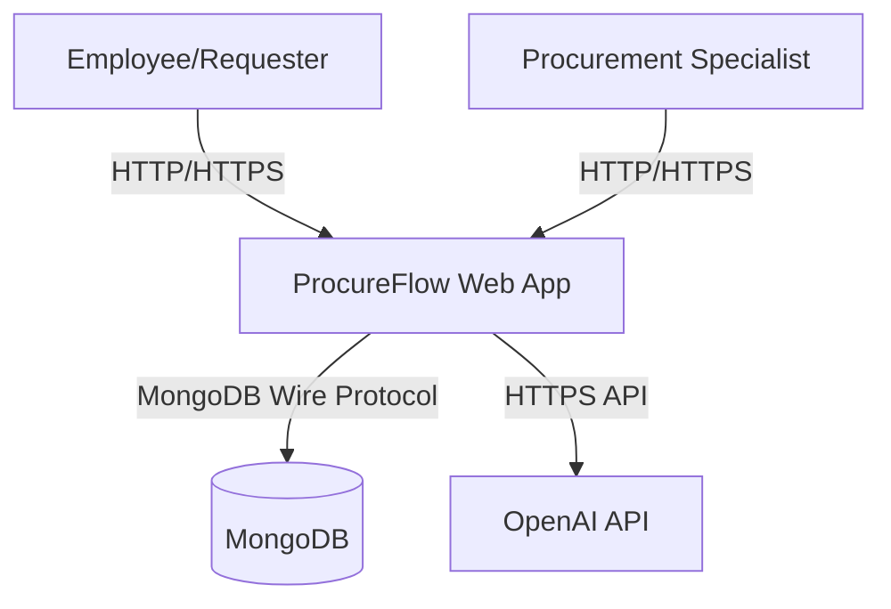

# Information Architecture

## Executive Summary

Minimal documentation structure for ProcureFlow organized into 5 primary sections: Product (PRD), Architecture (C4, stack, infrastructure), API (OpenAPI), Testing (strategy), and Operations (deployment, rollback, autoscaling, runbooks). Each document includes ownership, update SLA, and cross-links. Navigation optimized for developers, operators, and product teams. All documents follow standard format: Executive Summary (8 lines max), structured content with headings/tables, Mermaid diagrams where applicable, assumptions/limitations, and references.

---

## Navigation Table

| Document | Purpose | Owner | Update SLA | Status |
|----------|---------|-------|------------|--------|
| **Overview** | | | | |
| `.guided/README.md` | Entry point, navigation, quick start | Tech Lead | Monthly | To Create |
| **Product** | | | | |
| `.guided/product/prd.objective-and-features.md` | Problem, vision, must-have/nice-to-have features | Product | Per release | To Create |
| `.guided/product/prd.functional-requirements.md` | FR-xx entries with acceptance criteria | Product | Per release | To Create |
| `.guided/product/prd.non-functional-requirements.md` | Performance, security, reliability targets | Product + Eng | Quarterly | To Create |
| **Architecture** | | | | |
| `.guided/architecture/c4.context.md` | C1 diagram, scope, external systems | Architecture | Per major release | To Create |
| `.guided/architecture/c4.container.md` | C2 diagram, runtime containers, data flows | Architecture | Per major release | To Create |
| `.guided/architecture/c4.component.md` | C3 diagram (optional), component responsibilities | Architecture | As needed | Optional |
| `.guided/architecture/stack-and-patterns.md` | Tech stack, patterns, decision log | Architecture | Per release | To Create |
| `.guided/architecture/infrastructure.md` | Environments, deploy targets, secrets, observability | DevOps | Quarterly | To Create |
| **API** | | | | |
| `.guided/api/openapi.status-and-plan.md` | OpenAPI source of truth, generation, gaps | API Team | Per release | To Create |
| `.guided/api/openapi.yaml` | OpenAPI 3.0 spec (generated) | API Team | Per API change | To Create |
| **Testing** | | | | |
| `.guided/testing/testing-strategy.md` | Layers, tooling, coverage, CI gates | QA + Eng | Per release | To Create |
| **Operations** | | | | |
| `.guided/operations/deployment-strategy.md` | Deploy targets, promotion, checks | DevOps | Per release | To Create |
| `.guided/operations/rollback-strategy.md` | Rollback decision tree, validation | DevOps | Per release | To Create |
| `.guided/operations/autoscaling-policy.md` | Metrics, triggers, guardrails | DevOps | Quarterly | To Create |
| `.guided/operation/runbooks.plan.md` | Initial runbook inventory | DevOps | Per release | To Create |
| `.guided/operation/runbooks/local-dev.md` | Local development setup | DevOps | Monthly | To Create |
| `.guided/operation/runbooks/build-and-deploy.md` | CI/CD workflow execution | DevOps | Per workflow change | To Create |
| `.guided/operation/runbooks/rollback.md` | Execute rollback procedure | DevOps | Per release | To Create |
| `.guided/operation/runbooks/autoscaling-check.md` | Monitor and adjust autoscaling | DevOps | Monthly | To Create |
| `.guided/operation/runbooks/troubleshooting.md` | Common failures and resolutions | DevOps + Eng | Monthly | To Create |
| **Supporting** | | | | |
| `CONTRIBUTING.md` | Contribution workflow, commit conventions | Eng Lead | Per release | Exists |
| `.guided/glossary.md` | Terms, acronyms, definitions | Documentation | Quarterly | To Create |
| `.guided/references.md` | External docs, tools, resources | Documentation | As needed | To Create |

---

## Directory Structure

```
.guided/
├── README.md                           # Entry point and navigation
├── assessment/                         # Discovery and planning artifacts
│   ├── docs.discovery-summary.md       # This assessment
│   └── docs.information-architecture.md # This file
├── product/                            # Product requirements
│   ├── prd.objective-and-features.md
│   ├── prd.functional-requirements.md
│   └── prd.non-functional-requirements.md
├── architecture/                       # Technical architecture
│   ├── c4.context.md                   # C1 diagram
│   ├── c4.container.md                 # C2 diagram
│   ├── c4.component.md                 # C3 diagram (optional)
│   ├── stack-and-patterns.md           # Tech stack and design patterns
│   └── infrastructure.md               # Infrastructure as code
├── api/                                # API documentation
│   ├── openapi.status-and-plan.md      # OpenAPI strategy
│   └── openapi.yaml                    # OpenAPI 3.0 spec (generated)
├── testing/                            # Testing documentation
│   └── testing-strategy.md
├── operations/                         # Deployment and operations
│   ├── deployment-strategy.md
│   ├── rollback-strategy.md
│   └── autoscaling-policy.md
├── operation/                          # Operational runbooks
│   ├── runbooks.plan.md                # Runbook inventory
│   └── runbooks/
│       ├── local-dev.md
│       ├── build-and-deploy.md
│       ├── rollback.md
│       ├── autoscaling-check.md
│       └── troubleshooting.md
├── glossary.md                         # Terminology reference
└── references.md                       # External resources
```

---

## Ownership Model

### Roles and Responsibilities

| Role | Primary Responsibility | Documents Owned |
|------|------------------------|-----------------|
| **Product** | Feature requirements, user stories | PRD files (3) |
| **Architecture** | System design, tech decisions | C4 diagrams (3), stack-and-patterns.md |
| **API Team** | API contracts, OpenAPI spec | openapi.status-and-plan.md, openapi.yaml |
| **DevOps** | Infrastructure, deployment, operations | infrastructure.md, deployment/rollback/autoscaling strategies, runbooks (5) |
| **QA + Eng** | Testing strategy, coverage | testing-strategy.md |
| **Tech Lead** | Cross-functional coordination | README.md, oversight of all sections |
| **Documentation** | Supporting materials | glossary.md, references.md |

### Update SLA Definitions

| SLA | Frequency | Trigger |
|-----|-----------|---------|
| **Per release** | Every version bump | Tag creation (e.g., v1.1.0) |
| **Per major release** | Major version change | Breaking changes (e.g., v2.0.0) |
| **Per API change** | API modification | Endpoint added/modified/removed |
| **Per workflow change** | CI/CD update | GitHub Actions workflow modified |
| **Quarterly** | Every 3 months | Calendar-based review |
| **Monthly** | Every month | Calendar-based review |
| **As needed** | On demand | Significant external changes |

---

## Document Templates

### Standard Document Format

All `.guided/` documents must include:

1. **Executive Summary** (required, ≤8 lines)
   - Purpose, scope, key takeaways in 2-3 sentences
   - No fluff, actionable insights only

2. **Table of Contents** (optional, for docs >500 lines)
   - Auto-generated or manual for navigation

3. **Main Content**
   - Clear headings (## H2, ### H3 max depth)
   - Tables for lists/comparisons
   - Mermaid diagrams for visuals
   - Code blocks with language tags

4. **Assumptions and Limitations** (required)
   - Constraints, known gaps, future work

5. **References** (required)
   - Links to related .guided/ docs
   - External resources (with URLs)
   - Date of last update

### Mermaid Diagram Guidelines

**Allowed Types**:
- C4 Context: `graph TD`
- C4 Container: `graph TD`
- C4 Component: `graph TD`
- Sequence diagrams: `sequenceDiagram`
- Flowcharts: `flowchart TD`
- State diagrams: `stateDiagram-v2`

**Example C4 Context**:


---

## Navigation Flows

### For Developers (New to Codebase)

1. Start: `.guided/README.md`
2. Understand product: `.guided/product/prd.objective-and-features.md`
3. Learn architecture: `.guided/architecture/c4.context.md` → `.guided/architecture/c4.container.md`
4. Study tech stack: `.guided/architecture/stack-and-patterns.md`
5. Review API: `.guided/api/openapi.status-and-plan.md` + `/api/openapi` endpoint
6. Local setup: `.guided/operation/runbooks/local-dev.md`
7. Contribute: `CONTRIBUTING.md`

### For Operators (DevOps/SRE)

1. Start: `.guided/README.md`
2. Understand infrastructure: `.guided/architecture/infrastructure.md`
3. Learn deployment: `.guided/operations/deployment-strategy.md`
4. Study rollback: `.guided/operations/rollback-strategy.md`
5. Configure autoscaling: `.guided/operations/autoscaling-policy.md`
6. Execute runbooks: `.guided/operation/runbooks/*.md`
7. Troubleshoot: `.guided/operation/runbooks/troubleshooting.md`

### For Product Teams

1. Start: `.guided/README.md`
2. Review PRD: `.guided/product/prd.objective-and-features.md`
3. Understand requirements: `.guided/product/prd.functional-requirements.md`, `prd.non-functional-requirements.md`
4. Check system context: `.guided/architecture/c4.context.md`
5. Review API capabilities: `.guided/api/openapi.status-and-plan.md`
6. Understand testing: `.guided/testing/testing-strategy.md`

---

## Cross-Linking Strategy

### Internal Links (Within .guided/)

**Format**: Relative path from current document

Example from `prd.functional-requirements.md`:
```markdown
See [C4 Container Diagram](../architecture/c4.container.md) for component interactions.
```

### External Links (Outside .guided/)

**Format**: Absolute path from repo root

Example:
```markdown
See [GitHub Actions Workflow](/.github/workflows/deploy-gcp.yml) for CI/CD configuration.
```

### Common Reference Points

| Reference Type | Link Target |
|----------------|-------------|
| OpenAPI Spec | `/api/openapi` (live endpoint) or `.guided/api/openapi.yaml` (static) |
| CHANGELOG | `/CHANGELOG.md` |
| CONTRIBUTING | `/CONTRIBUTING.md` |
| Environment Config | `/packages/web/.env.example` |
| Pulumi Infra | `/packages/infra/pulumi/gcp/index.ts` |
| Docker Compose | `/packages/infra/compose.yaml` |
| CI/CD Workflow | `/.github/workflows/deploy-gcp.yml` |

---

## Quality Criteria

### For PRD Files

- [ ] Executive Summary describes problem and solution in ≤8 lines
- [ ] Must-have features have measurable acceptance criteria
- [ ] NFRs include specific targets (e.g., "p95 latency < 500ms")
- [ ] Edge cases documented for critical flows
- [ ] No feature described without FR-xx identifier

### For Architecture Files

- [ ] C1 and C2 diagrams use Mermaid syntax
- [ ] Each container has clear responsibility statement
- [ ] Decision log includes date, decision, rationale, alternatives, impact
- [ ] External dependencies documented with failure modes
- [ ] Assumptions and limitations section present

### For API Files

- [ ] OpenAPI generation process documented step-by-step
- [ ] Coverage gaps identified with remediation plan
- [ ] API versioning strategy defined
- [ ] Authentication/authorization model explained

### For Operations Files

- [ ] Deployment strategy includes rollback triggers
- [ ] Autoscaling policy defines min/max instances and cost guardrails
- [ ] Runbooks include prerequisites, steps, verification, and owner
- [ ] All procedures tested and verified

### For Testing Files

- [ ] Testing layers defined (unit, integration, e2e)
- [ ] Coverage thresholds justified (not arbitrary)
- [ ] CI gates documented with failure handling
- [ ] Flakiness mitigation strategies included

---

## Maintenance Process

### Quarterly Review Cycle

**Week 1-2 of Quarter**:
1. Review all "Quarterly" SLA documents
2. Update based on recent changes
3. Verify links and references
4. Check Mermaid diagrams render correctly

**Week 4 of Quarter**:
1. Archive outdated documents to `.guided/archive/YYYY-QN/`
2. Update `.guided/README.md` with recent changes
3. Send summary to stakeholders

### Per-Release Updates

**Before Release Tag**:
1. Update CHANGELOG.md
2. Update PRD files if features changed
3. Regenerate OpenAPI spec
4. Update deployment strategy if CI/CD changed

**After Release Tag**:
1. Update infrastructure.md if new environment added
2. Update runbooks if procedures changed
3. Archive old runbook versions

### Ad-Hoc Updates

- **Immediate**: Fix broken links, typos, factual errors
- **Within 1 week**: Document new architectural decisions in stack-and-patterns.md
- **Within 1 month**: Add new runbooks for recurring incidents

---

## Success Metrics

### Documentation Adoption

- [ ] 80%+ of developers reference .guided/ during onboarding
- [ ] 100% of runbooks executed successfully without clarification questions
- [ ] 90%+ of architectural decisions logged in decision log
- [ ] 0 critical deployment failures due to missing documentation

### Documentation Quality

- [ ] All documents have Executive Summary ≤8 lines
- [ ] All diagrams render correctly in GitHub and VSCode
- [ ] 100% of internal links resolve correctly
- [ ] All runbooks include owner and last verification date

### Documentation Freshness

- [ ] 0 documents exceed SLA staleness threshold
- [ ] 100% of quarterly reviews completed on time
- [ ] Per-release updates completed before tag creation

---

## Assumptions and Limitations

### Assumptions

1. Single repository (monorepo) structure maintained
2. GitHub as primary documentation platform (Markdown + Mermaid)
3. English language for all documentation
4. VSCode as primary editor (affects Mermaid preview)
5. Owners have write access to update their documents

### Limitations

1. No interactive documentation (static Markdown only)
2. Mermaid diagrams limited to supported types (no PlantUML, Graphviz)
3. No automated documentation generation (manual updates required)
4. No versioning of documentation (Git history only)
5. No approval workflow (owners update directly)

### Known Gaps

1. No API reference generator (OpenAPI static)
2. No automated link checker in CI
3. No documentation coverage metrics
4. No localization support (English only)

---

## References

### Internal Documents

- [Discovery Summary](.guided/assessment/docs.discovery-summary.md)
- [CHANGELOG](/CHANGELOG.md)
- [CONTRIBUTING](/CONTRIBUTING.md)

### External Resources

- [C4 Model](https://c4model.com/) - Architecture diagram standard
- [Keep a Changelog](https://keepachangelog.com/) - Changelog format
- [Semantic Versioning](https://semver.org/) - Version numbering
- [OpenAPI 3.0](https://swagger.io/specification/) - API specification
- [Mermaid Syntax](https://mermaid.js.org/) - Diagram syntax

### Tools

- [VSCode Mermaid Preview](https://marketplace.visualstudio.com/items?itemName=bierner.markdown-mermaid) - Diagram preview
- [GitHub Mermaid Support](https://github.blog/2022-02-14-include-diagrams-markdown-files-mermaid/) - Native rendering

---

**Last Updated**: 2025-11-11  
**Owner**: Tech Lead  
**Next Review**: 2026-02-11 (Quarterly)
