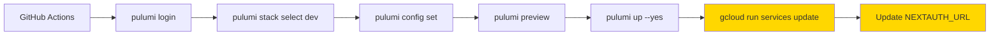

# Pulumi Infrastructure Review

**Assessment Date**: 2025-11-13  
**Project**: procureflow-gcp  
**Pulumi Version**: 3.140.0  
**Provider**: @pulumi/gcp 8.11.1

---

## Executive Summary

Pulumi IaC is **functionally sound** but has **opportunities for improvement** in drift detection, policy enforcement, and operational maturity. Current setup manages 8 resources across a single `dev` stack with encrypted state in Pulumi Cloud (free tier).

**Strengths**:
- ✅ Encrypted secrets in Pulumi state
- ✅ Resource import support (avoids recreate)
- ✅ Free-tier optimized (Cloud Run scales to zero)
- ✅ Automatic preview before deploy

**Gaps**:
- ❌ No policy as code (CrossGuard)
- ❌ No drift detection (manual `pulumi refresh`)
- ❌ Single environment (no staging/prod stacks)
- ❌ Artifact Registry managed manually
- ❌ No PR preview comments

**Risk Level**: 🟡 **Medium** (functional but not production-ready)

---

## Project Configuration

### Project Metadata

**File**: `packages/infra/pulumi/gcp/Pulumi.yaml`
```yaml
name: procureflow-gcp
runtime: nodejs
description: ProcureFlow infrastructure on Google Cloud Platform (FREE TIER)
```

**Dependencies** (`package.json`):
- `@pulumi/pulumi`: 3.140.0
- `@pulumi/gcp`: 8.11.1
- TypeScript: 5.9.3

---

## Stack Analysis

### Stack: `dev`

**File**: `Pulumi.dev.yaml`

**Configuration**:
```yaml
config:
  gcp:project: procureflow-dev
  gcp:region: us-central1
  
  # Application config
  procureflow-gcp:environment: dev
  procureflow-gcp:image-tag: latest  # ⚠️ Mutable tag
  
  # Encrypted secrets (stored in Pulumi state, AES-256 GCM)
  procureflow-gcp:nextauth-secret: [encrypted]
  procureflow-gcp:openai-api-key: [encrypted]
  procureflow-gcp:mongodb-connection-string: [encrypted]
  procureflow-gcp:mongodb-project-id: 6913b7cf8e8db76c8799c1ea
```

**Issues**:
1. **Mutable image tag**: Uses `latest` instead of immutable digest
2. **Single stack**: No separation for staging/production
3. **Secrets duplication**: Same secrets stored in GitHub Secrets and Pulumi config

**Recommendations**:
1. Use `image-digest` config instead of `image-tag`
2. Create separate stacks: `staging`, `prod`
3. Source secrets from Pulumi only (single source of truth)

---

## State Backend

**Backend**: Pulumi Cloud (SaaS)  
**URL**: `https://app.pulumi.com/[org]/procureflow-gcp/dev`  
**Tier**: Free (5,000 resources, unlimited stacks)

**State Security**:
- ✅ Encrypted at rest (AES-256)
- ✅ Encrypted in transit (TLS 1.3)
- ✅ Access controlled via Pulumi token
- ✅ Version history retained (rollback capability)
- ✅ Audit logs available (Enterprise tier)

**State Operations**:
```bash
# View state
pulumi stack --show-ids

# Refresh state (detect drift)
pulumi refresh

# Export state (backup)
pulumi stack export > backup.json

# Import state (restore)
pulumi stack import --file backup.json
```

**Backup Strategy**: ❌ **No automated backups**

**Recommendation**: Schedule weekly state exports to Cloud Storage
```bash
# Add to cron or GitHub Actions
pulumi stack export | gcloud storage cp - gs://procureflow-backups/pulumi/dev-$(date +%Y%m%d).json
```

---

## Resource Management

### Managed Resources (8 total)

| Resource Type | Count | Name Pattern | Import Support | Protection |
|--------------|-------|--------------|----------------|------------|
| **Service Account** | 1 | `procureflow-cloudrun` | ✅ Manual | ❌ No |
| **Secret Manager** | 3 | `nextauth-secret`, `openai-api-key`, `mongodb-uri` | ✅ Manual | ❌ No |
| **Secret IAM Bindings** | 3 | One per secret | ❌ No | ❌ No |
| **Cloud Run Service** | 1 | `procureflow-web` | ❌ No | ❌ No |
| **Cloud Run IAM Policy** | 1 | `allUsers` invoker | ❌ No | ❌ No |

**Total**: 9 resources (8 Pulumi-managed + 1 manual GAR)

### Unmanaged Resources (Manual)

| Resource | Reason | Risk | Recommendation |
|----------|--------|------|----------------|
| **Artifact Registry** | Permission constraint during setup | 🟡 Medium | Import into Pulumi (see IT2-9) |
| **GitHub Actions SA** | Created manually | 🟡 Medium | Add to Pulumi stack |
| **Budget alerts** | Not configured | 🟢 Low | Add via Pulumi |
| **Uptime checks** | Not configured | 🟢 Low | Add via Pulumi |

---

## Resource Configurations

### 1. Service Account

**File**: `compute/cloudrun.ts`

```typescript
new gcp.serviceaccount.Account('cloudrun-sa', {
  accountId: 'procureflow-cloudrun',
  displayName: 'ProcureFlow Cloud Run Service Account',
}, {
  import: `projects/${projectId}/serviceAccounts/procureflow-cloudrun@${projectId}.iam.gserviceaccount.com`,
  ignoreChanges: ['displayName', 'description']  // ⚠️ Prevents updates
})
```

**Issues**:
1. `ignoreChanges` prevents updates to display name/description
2. No `protect` flag (resource can be deleted accidentally)

**Recommendations**:
1. Remove `ignoreChanges` unless necessary
2. Add `protect: true` for production

---

### 2. Secret Manager

**File**: `security/secrets.ts`

```typescript
new gcp.secretmanager.Secret('nextauth-secret', {
  secretId: 'nextauth-secret',
  replication: { auto: {} },  // ✅ Multi-region replication
  labels: {
    environment: config.environment,
    managed_by: 'pulumi',
    app: 'procureflow',
  },
}, {
  import: `projects/${projectId}/secrets/nextauth-secret`,
  ignoreChanges: ['labels']  // ⚠️ Prevents label updates
})
```

**Strengths**:
- ✅ Automatic replication (high availability)
- ✅ Resource labels for organization
- ✅ Import support (avoids recreate on initial Pulumi adoption)

**Issues**:
1. `ignoreChanges: ['labels']` prevents label updates
2. No secret rotation strategy
3. Secrets sourced from Pulumi config (duplicates GitHub Secrets)

**Recommendations**:
1. Remove `ignoreChanges` for labels
2. Implement secret rotation (manual or automated)
3. Source secrets from Pulumi only (remove from GitHub Secrets)

---

### 3. Cloud Run Service

**File**: `compute/cloudrun.ts`

```typescript
new gcp.cloudrun.Service('procureflow-web', {
  template: {
    metadata: {
      annotations: {
        'autoscaling.knative.dev/minScale': '0',  // ✅ Free tier
        'autoscaling.knative.dev/maxScale': '2',  // ✅ Cost cap
        'run.googleapis.com/execution-environment': 'gen2',  // ✅ Modern
      }
    },
    spec: {
      containers: [{
        image: imageUrl,  // ⚠️ Uses tag, should use digest
        resources: {
          limits: { cpu: '1000m', memory: '512Mi' }  // ✅ Free tier optimized
        },
        envs: [
          // ❌ NEXTAUTH_URL missing (patched post-deploy via gcloud)
          { name: 'NEXTAUTH_SECRET', valueFrom: { secretKeyRef: { ... } } },
        ]
      }]
    }
  },
  traffics: [{ percent: 100, latestRevision: true }]  // ❌ No blue/green
})
```

**Strengths**:
- ✅ Free-tier optimized (scales to zero)
- ✅ Gen2 execution environment (faster cold starts)
- ✅ Secrets injected from Secret Manager

**Issues**:
1. **Image tag**: Uses mutable tag instead of digest
2. **NEXTAUTH_URL**: Missing, patched post-deploy via `gcloud`
3. **Traffic management**: 100% to latest (no blue/green)
4. **No revision naming**: Revisions auto-named (hard to track)

**Recommendations**:
1. Use digest: `image: pulumi.interpolate\`${registryUrl}@${imageDigest}\``
2. Add NEXTAUTH_URL: `{ name: 'NEXTAUTH_URL', value: service.statuses[0].url }`
3. Implement blue/green:
   ```typescript
   traffics: [
     { revisionName: 'web-previous', percent: 50 },
     { latestRevision: true, percent: 50 }
   ]
   ```
4. Name revisions: `metadata.name = 'web-${gitSha.substring(0, 12)}'`

---

## Deployment Process

### Current Flow



**Issues**:
1. **Auto-approve**: `pulumi up --yes` (no manual gate)
2. **Post-deploy patch**: `NEXTAUTH_URL` updated via `gcloud` (should be in Pulumi)
3. **No preview comments**: Pulumi preview output not posted to PRs
4. **Config duplication**: Secrets set via workflow (already in stack config)

---

### Deploy Workflow Integration

**File**: `.github/workflows/deploy-gcp.yml`

```yaml
- name: Configure Pulumi stack
  run: |
    pulumi config set gcp:project ${{ secrets.GCP_PROJECT_ID }}
    pulumi config set image-tag ${{ needs.build.outputs.image-tag }}
    pulumi config set --secret nextauth-secret "${{ secrets.NEXTAUTH_SECRET }}"
    # ⚠️ Duplicates secrets already in Pulumi.dev.yaml

- name: Pulumi Preview
  run: pulumi preview  # ❌ Output not visible in PR comments

- name: Pulumi Up
  run: pulumi up --yes  # ⚠️ Auto-approve, no manual gate

- name: Update NEXTAUTH_URL  # ❌ Should be in Pulumi
  run: gcloud run services update procureflow-web --update-env-vars="NEXTAUTH_URL=$SERVICE_URL"
```

**Recommendations**:
1. Use `pulumi/actions@v5` for preview comments:
   ```yaml
   - uses: pulumi/actions@v5
     with:
       command: preview
       comment-on-pr: true
       github-token: ${{ secrets.GITHUB_TOKEN }}
   ```

2. Remove secret duplication (secrets already in `Pulumi.dev.yaml`)

3. Move `NEXTAUTH_URL` to Pulumi config (see Cloud Run recommendation)

---

## Drift Detection

**Current State**: ❌ **No automated drift detection**

**Risk**: Manual changes in Cloud Console not detected → state divergence

**Recommendation**: Add scheduled drift check

**Implementation**:
```yaml
# .github/workflows/pulumi-drift-check.yml
name: Pulumi Drift Detection

on:
  schedule:
    - cron: '0 8 * * 1'  # Weekly, Monday 8 AM UTC
  workflow_dispatch:

jobs:
  drift-check:
    runs-on: ubuntu-latest
    steps:
      - uses: actions/checkout@v4
      - uses: ./.github/actions/setup-pnpm
      
      - uses: google-github-actions/auth@v2
        with:
          workload_identity_provider: ${{ vars.GCP_WORKLOAD_IDENTITY_PROVIDER }}
          service_account: ${{ vars.GCP_DEPLOY_SERVICE_ACCOUNT }}
      
      - name: Pulumi refresh
        working-directory: packages/infra/pulumi/gcp
        run: |
          pulumi refresh --diff --expect-no-changes || {
            echo "⚠️ Drift detected! Manual changes found."
            pulumi refresh --diff > drift-report.txt
            # Post to Slack or create GitHub issue
            exit 1
          }
        env:
          PULUMI_ACCESS_TOKEN: ${{ secrets.PULUMI_ACCESS_TOKEN }}
```

**Acceptance Criteria**:
- [ ] Drift check runs weekly
- [ ] Drift detected triggers alert (Slack/email/issue)
- [ ] Team reviews and reconciles drift

---

## Policy as Code (CrossGuard)

**Current State**: ❌ **No policy enforcement**

**Risk**: Resource configurations violate cost, security, or compliance rules

**Recommendation**: Implement Pulumi CrossGuard policies

**Example Policies**:

```typescript
// packages/infra/pulumi/gcp/policies/index.ts
import { PolicyPack, validateResourceOfType } from '@pulumi/policy';
import * as gcp from '@pulumi/gcp';

new PolicyPack('procureflow-policies', {
  policies: [
    {
      name: 'cloud-run-max-instances',
      description: 'Prevent runaway costs: max instances ≤ 5',
      enforcementLevel: 'mandatory',
      validateResource: validateResourceOfType(
        gcp.cloudrun.Service,
        (service, args, reportViolation) => {
          const maxScale = service.template?.metadata?.annotations?.[
            'autoscaling.knative.dev/maxScale'
          ];
          if (parseInt(maxScale || '0') > 5) {
            reportViolation('Max instances exceeds cost cap of 5');
          }
        }
      ),
    },
    {
      name: 'secret-manager-auto-replication',
      description: 'Secrets must use automatic replication for HA',
      enforcementLevel: 'mandatory',
      validateResource: validateResourceOfType(
        gcp.secretmanager.Secret,
        (secret, args, reportViolation) => {
          if (!secret.replication?.auto) {
            reportViolation('Secrets must use automatic replication');
          }
        }
      ),
    },
    {
      name: 'cloud-run-public-access',
      description: 'Advisory: Review public access policies',
      enforcementLevel: 'advisory',
      validateResource: validateResourceOfType(
        gcp.cloudrun.IamMember,
        (iam, args, reportViolation) => {
          if (iam.member === 'allUsers') {
            reportViolation('Service is publicly accessible (no auth)');
          }
        }
      ),
    },
    {
      name: 'resource-tagging',
      description: 'All resources must have environment label',
      enforcementLevel: 'mandatory',
      validateResource: (args, reportViolation) => {
        const labels = args.props.labels || args.props.metadata?.labels || {};
        if (!labels.environment) {
          reportViolation('Resource missing "environment" label');
        }
      },
    },
  ],
});
```

**Enforcement**:
```yaml
# In deploy workflow
- name: Pulumi up with policies
  run: |
    pulumi up --policy-pack policies/ --yes
```

**Acceptance Criteria**:
- [ ] Policies defined for cost, security, compliance
- [ ] Policies tested in `advisory` mode first
- [ ] Policies enforced in CI/CD
- [ ] Violations block deploy (mandatory policies)

---

## Provider Configuration

### GCP Provider

**Authentication**: Service account key (⚠️ long-lived)

**Configuration**:
```yaml
gcp:project: procureflow-dev
gcp:region: us-central1
```

**Issues**:
1. **Long-lived key**: GitHub Actions uses `GCP_SA_KEY` secret
2. **Single project**: No multi-project support for staging/prod

**Recommendations**:
1. Migrate to OIDC (Workload Identity Federation)
2. Create separate projects: `procureflow-staging`, `procureflow-prod`

---

## Multi-Stack Strategy

**Current**: Single `dev` stack

**Recommended**:

| Stack | Environment | Project | Auto-Deploy | Approval |
|-------|-------------|---------|-------------|----------|
| `dev` | Development | `procureflow-dev` | ✅ Yes | None |
| `staging` | Staging | `procureflow-staging` | ❌ Manual | 1 reviewer |
| `prod` | Production | `procureflow-prod` | ❌ Manual | 2 reviewers |

**Setup**:
```bash
# Create staging stack
pulumi stack init staging
pulumi config set gcp:project procureflow-staging
pulumi config set gcp:region us-central1
pulumi config set environment staging
pulumi config set --secret nextauth-secret "$STAGING_SECRET"

# Create production stack
pulumi stack init prod
pulumi config set gcp:project procureflow-prod
pulumi config set gcp:region us-central1
pulumi config set environment prod
pulumi config set --secret nextauth-secret "$PROD_SECRET"
```

**Acceptance Criteria**:
- [ ] 3 stacks created: dev, staging, prod
- [ ] Each stack has separate GCP project
- [ ] GitHub Environments configured (dev/staging/prod)
- [ ] Deploy workflow accepts `--stack` parameter

---

## Cost Management

**Current State**: ❌ **No cost monitoring in IaC**

**Estimated Monthly Costs**:
- Cloud Run: $0.00 (within free tier)
- Secret Manager: $0.00 (3 secrets, within 6 free)
- Artifact Registry: $0.25 (manual, ~2.5 GB storage)
- **Total**: $0.25/month

**Recommendations**:

1. **Add budget alerts via Pulumi**:
   ```typescript
   new gcp.billing.Budget('monthly-budget', {
     billingAccount: billingAccountId,
     amount: { specifiedAmount: { units: '10' } },  // $10/month cap
     thresholdRules: [
       { thresholdPercent: 0.5 },   // 50% alert
       { thresholdPercent: 0.75 },  // 75% alert
       { thresholdPercent: 0.9 },   // 90% alert
     ],
     allUpdatesRule: {
       pubsubTopic: notificationTopic.id,  // Send to Slack/email
     },
   });
   ```

2. **Monitor Pulumi Cloud usage** (free tier: 5,000 resources):
   ```bash
   pulumi org get-limits
   # Check resource count and stack count
   ```

---

## Operational Maturity Assessment

| Capability | Current State | Target State | Priority |
|-----------|---------------|--------------|----------|
| **State Management** | Pulumi Cloud (free) | ✅ Same | - |
| **Resource Import** | ✅ Manual import | ✅ Automated import | Low |
| **Drift Detection** | ❌ Manual only | ✅ Scheduled | High |
| **Policy as Code** | ❌ None | ✅ CrossGuard | Medium |
| **Preview Comments** | ❌ CLI only | ✅ PR comments | Medium |
| **Multi-Stack** | ❌ Single (dev) | ✅ 3 stacks | Medium |
| **Secret Management** | ⚠️ Duplicated | ✅ Pulumi only | Low |
| **Cost Monitoring** | ❌ None | ✅ Budget alerts | Medium |
| **Backup/Restore** | ❌ Manual | ✅ Automated | Low |

---

## Summary of Recommendations

### High Priority (Week 1-2)
1. ✅ **Drift detection**: Schedule weekly `pulumi refresh`
2. ✅ **Preview comments**: Enable PR comments via `pulumi/actions@v5`
3. ✅ **Fix NEXTAUTH_URL**: Move to Pulumi (remove post-deploy patch)
4. ✅ **Image digests**: Use `image-digest` config instead of `image-tag`

### Medium Priority (Week 3-4)
5. ✅ **Policy as Code**: Implement CrossGuard policies (cost, security)
6. ✅ **Multi-stack**: Create staging and prod stacks
7. ✅ **Budget alerts**: Add GCP budget monitoring via Pulumi
8. ✅ **Import GAR**: Move Artifact Registry to Pulumi management

### Low Priority (Later)
9. ⬜ **Secret rotation**: Implement automated secret rotation
10. ⬜ **State backups**: Automate weekly state exports to Cloud Storage
11. ⬜ **Resource protection**: Add `protect: true` to critical resources

---

**Document Version**: 1.0  
**Last Updated**: 2025-11-13  
**Next Review**: After multi-stack implementation  
**Owner**: Infrastructure Team
