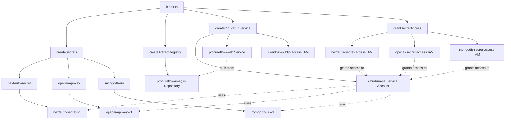

# Pulumi Infrastructure Inventory

**Project**: procureflow-gcp  
**Organization**: guiofsaints-org  
**Assessment Date**: 2025-11-11  
**Pulumi Version**: v3.205.0

---

## Executive Summary

This document provides a complete inventory of all Pulumi projects, stacks, resources, and configurations discovered in the ProcureFlow infrastructure.

**Quick Stats**:
- **Projects**: 1 (procureflow-gcp)
- **Stacks**: 1 (dev)
- **Resources Deployed**: 15
- **Providers**: 1 (GCP 8.41.1)
- **Cloud Platforms**: GCP (primary), MongoDB Atlas (existing, not managed)
- **Cost**: ~$0.30-0.50/month (Artifact Registry only)

---

## 1. Pulumi Projects

### 1.1 procureflow-gcp

**Location**: `packages/infra/pulumi/gcp`  
**Runtime**: nodejs  
**Description**: ProcureFlow infrastructure on Google Cloud Platform (FREE TIER)

**Project Metadata** (Pulumi.yaml):
```yaml
name: procureflow-gcp
runtime: nodejs
description: ProcureFlow infrastructure on Google Cloud Platform (FREE TIER)
```

**Dependencies** (package.json):
```json
{
  "name": "procureflow-gcp-infra",
  "version": "0.1.0",
  "dependencies": {
    "@pulumi/gcp": "^8.11.1",
    "@pulumi/mongodbatlas": "^3.19.0",
    "@pulumi/pulumi": "^3.140.0",
    "@pulumi/random": "^4.16.7"
  },
  "devDependencies": {
    "@types/node": "^22.10.1",
    "typescript": "^5.9.3"
  }
}
```

**Entrypoint**: `index.ts`  
**Module Structure**:
- `index.ts` - Main orchestration (171 lines)
- `cloudrun.ts` - Cloud Run + Artifact Registry (175 lines)
- `secrets.ts` - Secret Manager (109 lines)
- `mongodb-atlas.ts` - MongoDB Atlas (118 lines) ⚠️ **UNUSED**

---

## 2. Pulumi Stacks

### 2.1 Stack: dev

**Full Name**: `guiofsaints-org/procureflow-gcp/dev`  
**Backend**: Pulumi Cloud (https://app.pulumi.com/guiofsaints-org/procureflow-gcp/dev)  
**State**: Active, 15 resources deployed  
**Last Updated**: 2025-11-11 21:22:40 -03:00 (35 minutes before assessment)

**Configuration** (non-sensitive):
| Key | Value | Namespace |
|-----|-------|-----------|
| `gcp:project` | `procureflow-dev` | GCP Provider |
| `gcp:region` | `us-central1` | GCP Provider |
| `environment` | `dev` | Project |
| `image-tag` | `latest` | Project |
| `mongodb-project-id` | `6913b7cf8e8db76c8799c1ea` | Project |
| `mongodbatlas:publicKey` | `jmtgtaag` | MongoDB Atlas Provider |

**Configuration** (secrets):
| Key | Type | Namespace |
|-----|------|-----------|
| `nextauth-secret` | Encrypted | Project |
| `openai-api-key` | Encrypted | Project |
| `mongodb-connection-string` | Encrypted | Project |
| `mongodbatlas:privateKey` | Encrypted | MongoDB Atlas Provider |

**Stack Outputs**:
| Output | Value | Type |
|--------|-------|------|
| `artifactRegistryUrl` | `us-central1-docker.pkg.dev/procureflow-dev/procureflow` | String |
| `serviceUrl` | `https://procureflow-web-isvrapi6ma-uc.a.run.app` | String |
| `mongodbConnectionUri` | [secret] | Secret |
| `deploymentInstructions` | [multiline text] | String |
| `outputs` | [JSON object] | Object |

---

## 3. Deployed Resources (by Type)

### 3.1 Artifact Registry (1 resource)

#### procureflow-images
**Type**: `gcp:artifactregistry/repository:Repository`  
**URN**: `urn:pulumi:dev::procureflow-gcp::gcp:artifactregistry/repository:Repository::procureflow-images`  
**Purpose**: Docker image storage for Cloud Run deployment  
**Configuration**:
- **Repository ID**: `procureflow`
- **Location**: `us-central1`
- **Format**: DOCKER
- **Labels**: `environment: dev`, `managed_by: pulumi`

**Cost**: ~$0.30-0.50/month (0.5 GB storage estimate)

---

### 3.2 Secret Manager (9 resources)

#### 3.2.1 Secrets (3)

##### nextauth-secret
**Type**: `gcp:secretmanager/secret:Secret`  
**URN**: `urn:pulumi:dev::procureflow-gcp::gcp:secretmanager/secret:Secret::nextauth-secret`  
**Purpose**: NextAuth.js session encryption key  
**Configuration**:
- **Secret ID**: `nextauth-secret`
- **Replication**: Auto (multi-region)
- **Labels**: `environment: dev`, `managed_by: pulumi`

##### openai-api-key
**Type**: `gcp:secretmanager/secret:Secret`  
**URN**: `urn:pulumi:dev::procureflow-gcp::gcp:secretmanager/secret:Secret::openai-api-key`  
**Purpose**: OpenAI API key for AI agent features  
**Configuration**:
- **Secret ID**: `openai-api-key`
- **Replication**: Auto (multi-region)
- **Labels**: `environment: dev`, `managed_by: pulumi`

##### mongodb-uri
**Type**: `gcp:secretmanager/secret:Secret`  
**URN**: `urn:pulumi:dev::procureflow-gcp::gcp:secretmanager/secret:Secret::mongodb-uri`  
**Purpose**: MongoDB Atlas connection string  
**Configuration**:
- **Secret ID**: `mongodb-uri`
- **Replication**: Auto (multi-region)
- **Labels**: `environment: dev`, `managed_by: pulumi`

#### 3.2.2 Secret Versions (3)

##### nextauth-secret-v1
**Type**: `gcp:secretmanager/secretVersion:SecretVersion`  
**URN**: `urn:pulumi:dev::procureflow-gcp::gcp:secretmanager/secretVersion:SecretVersion::nextauth-secret-v1`  
**Parent**: `nextauth-secret`

##### openai-api-key-v1
**Type**: `gcp:secretmanager/secretVersion:SecretVersion`  
**URN**: `urn:pulumi:dev::procureflow-gcp::gcp:secretmanager/secretVersion:SecretVersion::openai-api-key-v1`  
**Parent**: `openai-api-key`

##### mongodb-uri-v1
**Type**: `gcp:secretmanager/secretVersion:SecretVersion`  
**URN**: `urn:pulumi:dev::procureflow-gcp::gcp:secretmanager/secretVersion:SecretVersion::mongodb-uri-v1`  
**Parent**: `mongodb-uri`

#### 3.2.3 IAM Bindings (3)

##### nextauth-secret-access
**Type**: `gcp:secretmanager/secretIamMember:SecretIamMember`  
**URN**: `urn:pulumi:dev::procureflow-gcp::gcp:secretmanager/secretIamMember:SecretIamMember::nextauth-secret-access`  
**Role**: `roles/secretmanager.secretAccessor`  
**Member**: `serviceAccount:procureflow-cloudrun@procureflow-dev.iam.gserviceaccount.com`

##### openai-secret-access
**Type**: `gcp:secretmanager/secretIamMember:SecretIamMember`  
**URN**: `urn:pulumi:dev::procureflow-gcp::gcp:secretmanager/secretIamMember:SecretIamMember::openai-secret-access`  
**Role**: `roles/secretmanager.secretAccessor`  
**Member**: `serviceAccount:procureflow-cloudrun@procureflow-dev.iam.gserviceaccount.com`

##### mongodb-secret-access
**Type**: `gcp:secretmanager/secretIamMember:SecretIamMember`  
**URN**: `urn:pulumi:dev::procureflow-gcp::gcp:secretmanager/secretIamMember:SecretIamMember::mongodb-secret-access`  
**Role**: `roles/secretmanager.secretAccessor`  
**Member**: `serviceAccount:procureflow-cloudrun@procureflow-dev.iam.gserviceaccount.com`

**Total Secret Manager Cost**: $0.00 (within free tier: 6 secrets, <10k accesses/month)

---

### 3.3 Cloud Run (2 resources)

#### procureflow-web
**Type**: `gcp:cloudrun/service:Service`  
**URN**: `urn:pulumi:dev::procureflow-gcp::gcp:cloudrun/service:Service::procureflow-web`  
**Purpose**: Next.js application hosting  
**Configuration**:
- **Service Name**: `procureflow-web`
- **Location**: `us-central1`
- **Image**: `us-central1-docker.pkg.dev/procureflow-dev/procureflow/web:latest`
- **Service Account**: `procureflow-cloudrun@procureflow-dev.iam.gserviceaccount.com`
- **Scaling**:
  - Min Instances: 0 (scale to zero)
  - Max Instances: 2
  - Concurrency: 80
- **Resources**:
  - CPU: 1000m (1 vCPU)
  - Memory: 512Mi
- **Environment Variables**:
  - `NODE_ENV`: production
  - `NEXT_TELEMETRY_DISABLED`: 1
  - Secrets mounted from Secret Manager (3)
- **Annotations**:
  - `autoscaling.knative.dev/minScale`: "0"
  - `autoscaling.knative.dev/maxScale`: "2"
  - `run.googleapis.com/cpu-throttling`: "true"
  - `run.googleapis.com/execution-environment`: "gen2"
- **Labels**: `environment: dev`, `managed-by: pulumi`, `app: procureflow`

**URL**: `https://procureflow-web-isvrapi6ma-uc.a.run.app` (Stack output, may be stale)  
**Actual URL** (from previous session): `https://procureflow-web-592353558869.us-central1.run.app`

**Cost**: $0.00/month (within free tier: 2M requests, 360k GB-sec, 180k vCPU-sec)

#### cloudrun-public-access
**Type**: `gcp:cloudrun/iamMember:IamMember`  
**URN**: `urn:pulumi:dev::procureflow-gcp::gcp:cloudrun/iamMember:IamMember::cloudrun-public-access`  
**Role**: `roles/run.invoker`  
**Member**: `allUsers` (public access, no authentication)

---

### 3.4 Service Account (1 resource)

#### cloudrun-sa
**Type**: `gcp:serviceaccount/account:Account`  
**URN**: `urn:pulumi:dev::procureflow-gcp::gcp:serviceaccount/account:Account::cloudrun-sa`  
**Purpose**: Dedicated service account for Cloud Run service  
**Configuration**:
- **Account ID**: `procureflow-cloudrun`
- **Display Name**: ProcureFlow Cloud Run Service Account
- **Email**: `procureflow-cloudrun@procureflow-dev.iam.gserviceaccount.com`

**Permissions** (granted via Secret Manager IAM bindings):
- `roles/secretmanager.secretAccessor` on 3 secrets

---

### 3.5 Pulumi Provider (1 resource)

#### default_8_41_1
**Type**: `pulumi:providers:gcp`  
**URN**: `urn:pulumi:dev::procureflow-gcp::pulumi:providers:gcp::default_8_41_1`  
**Version**: 8.41.1  
**Configuration**:
- **Project**: procureflow-dev
- **Region**: us-central1

---

## 4. External Resources (Not Managed by Pulumi)

### 4.1 MongoDB Atlas

**Cluster**: `procureflow-dev`  
**Tier**: M0 (FREE TIER - 512MB)  
**Project ID**: `6913b7cf8e8db76c8799c1ea`  
**Organization**: `mdb_sa_id_6913a69e0481c22a7cf47100`  
**State**: IDLE  
**Management**: Manually created, connection string stored in Pulumi config

**Why Not Managed**:
- Free tier limitation (1 M0 cluster per Atlas project)
- Existing cluster created before Pulumi setup
- Connection string passed to Pulumi via config secret

**Alternative** (not used):
- `mongodb-atlas.ts` contains code to create Atlas cluster via Pulumi
- Currently not imported in `index.ts`
- Kept as reference/documentation

---

## 5. Resource Dependencies



**Dependency Notes**:
- Cloud Run service depends on secrets being created first
- Secret IAM bindings depend on both secrets and service account
- Artifact Registry is independent (can be created in parallel)

---

## 6. GitHub Actions Service Account

**Account ID**: `github-actions`  
**Email**: `github-actions@procureflow-dev.iam.gserviceaccount.com`  
**Purpose**: CI/CD deployment from GitHub Actions  
**Created**: Via `setup-github-secrets.ps1` script

**IAM Roles Granted**:
1. `roles/run.admin` - Manage Cloud Run services
2. `roles/iam.serviceAccountUser` - Act as service accounts
3. `roles/artifactregistry.writer` - Push Docker images
4. `roles/secretmanager.admin` - Manage secrets
5. `roles/storage.admin` - Manage storage (if needed)

**Authentication**:
- Service account key exported as JSON
- Converted to Base64 and stored in GitHub Secret: `GCP_SA_KEY`

**Management**: Not in Pulumi state (manually created via gcloud CLI)

---

## 7. GitHub Secrets Inventory

**Total Secrets**: 9

| Secret Name | Description | Source |
|-------------|-------------|--------|
| `GCP_PROJECT_ID` | GCP Project ID | Hardcoded (procureflow-dev) |
| `GCP_SA_KEY` | Service Account Key (Base64) | Generated via gcloud CLI |
| `PULUMI_ACCESS_TOKEN` | Pulumi Cloud access token | Pulumi Cloud dashboard |
| `NEXTAUTH_SECRET` | NextAuth.js secret | Pulumi config |
| `OPENAI_API_KEY` | OpenAI API key | Pulumi config |
| `MONGODB_CONNECTION_STRING` | MongoDB connection string | Pulumi config |
| `MONGODB_ATLAS_PUBLIC_KEY` | MongoDB Atlas public API key | Pulumi config |
| `MONGODB_ATLAS_PRIVATE_KEY` | MongoDB Atlas private API key | Pulumi config |
| `MONGODB_PROJECT_ID` | MongoDB Atlas project ID | Pulumi config |

**Setup Script**: `setup-github-secrets.ps1`

---

## 8. Files Inventory

### 8.1 Infrastructure Code

| File | Lines | Purpose | Status |
|------|-------|---------|--------|
| `index.ts` | 171 | Main orchestration | ✅ Active |
| `cloudrun.ts` | 175 | Cloud Run + Artifact Registry | ✅ Active |
| `secrets.ts` | 109 | Secret Manager | ✅ Active |
| `mongodb-atlas.ts` | 118 | MongoDB Atlas provisioning | ❌ Unused |

### 8.2 Configuration

| File | Lines | Purpose | Status |
|------|-------|---------|--------|
| `Pulumi.yaml` | 4 | Project metadata | ✅ Active |
| `Pulumi.dev.yaml` | 12 | Stack config (encrypted) | ✅ Active |
| `package.json` | 26 | Dependencies + scripts | ✅ Active |
| `tsconfig.json` | 18 | TypeScript config | ✅ Active |

### 8.3 Scripts

| File | Lines | Purpose | Status |
|------|-------|---------|--------|
| `apply-pulumi-config.ps1` | 68 | Bootstrap Pulumi config | ⚠️ Contains secrets |
| `setup-github-secrets.ps1` | 231 | GitHub Actions setup | ✅ Active |

### 8.4 Documentation

| File | Lines (est.) | Purpose | Status |
|------|--------------|---------|--------|
| `README.md` | ~50 | Quick start guide | ✅ Active |
| `SETUP.md` | ~700 | Comprehensive setup | ✅ Active |
| `INFRAESTRUTURA_GCP_RELATORIO.md` | ~500 | Infrastructure report (PT) | ✅ Active |

### 8.5 Generated Artifacts

| File | Purpose | Gitignored? |
|------|---------|-------------|
| `dist/` | Compiled TypeScript | ❌ No (should be) |
| `node_modules/` | Dependencies | ✅ Yes |
| `stack-backup.json` | Stack export backup | ❌ No (should be) |
| `github-actions-key.json` | SA key (if generated) | ❌ No (should be deleted) |
| `github-secrets-output.txt` | Secrets export | ❌ No (should be deleted) |

---

## 9. Cross-References

### 9.1 Related GitHub Actions Workflows

**File**: `.github/workflows/deploy-gcp.yml` (in repo root)  
**Triggers**: Push to `main` branch  
**Jobs**:
1. **build-and-push**: Build Docker image, push to Artifact Registry
2. **deploy-infrastructure**: Run Pulumi up (deploy infrastructure)
3. **test-deployment**: Health check on deployed service

### 9.2 Related Application Code

**Web Application**: `packages/web/`  
**Docker Build Context**: Repo root (../..)  
**Dockerfile**: `packages/infra/docker/Dockerfile.web`

### 9.3 Related Documentation

**Main README**: `README.md` (repo root)  
**Copilot Instructions**: `.github/copilot-instructions.md`  
**Feature Docs**: `packages/web/src/features/*/README.md` (various)

---

## 10. Summary Statistics

| Category | Count | Notes |
|----------|-------|-------|
| **Pulumi Projects** | 1 | procureflow-gcp |
| **Pulumi Stacks** | 1 | dev only |
| **GCP Resources** | 14 | Excluding provider |
| **Secret Manager Secrets** | 3 | All within free tier |
| **Cloud Run Services** | 1 | procureflow-web |
| **Service Accounts** | 2 | cloudrun-sa + github-actions |
| **Artifact Repositories** | 1 | Docker images |
| **TypeScript Modules** | 4 | 1 unused (mongodb-atlas.ts) |
| **PowerShell Scripts** | 2 | Setup automation |
| **Monthly Cost** | ~$0.40 | Artifact Registry only |
| **Free Tier Usage** | 100% | Cloud Run, Secret Manager, MongoDB Atlas |

---

**Inventory Compiled By**: GitHub Copilot AI Agent  
**Date**: 2025-11-11  
**Version**: 1.0
