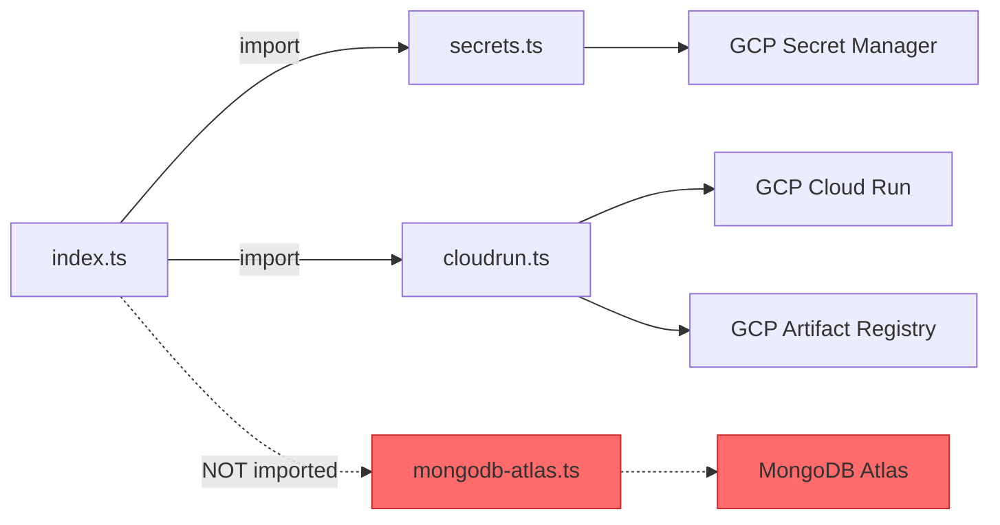

# Pulumi Infrastructure Usage Map

**Project**: procureflow-gcp  
**Assessment Date**: 2025-11-11  
**Purpose**: Identify active vs unused code, dead files, duplicate patterns

---

## Executive Summary

**Active Modules**: 3 of 4 TypeScript files  
**Unused Code**: 1 complete module (mongodb-atlas.ts)  
**Duplicate Patterns**: None detected  
**Code Health**: ✅ Good (well-structured, minimal duplication)

**Recommendations**:
1. 🗑️ Archive or delete `mongodb-atlas.ts` (118 lines of unused code)
2. 📦 Remove unused dependencies: `@pulumi/mongodbatlas`, `@pulumi/random`
3. 📁 Add `.gitignore` entries for `dist/`, `*.json` (generated files)
4. 🔄 Create shared utilities module for tagging and naming conventions

---

## 1. Module Dependency Graph



**Legend**:
- Solid arrows: Active imports/dependencies
- Dashed arrows: Unused/dead code
- Red: Unused modules

---

## 2. File-by-File Analysis

### 2.1 index.ts (Main Orchestration)

**Status**: ✅ **ACTIVE**  
**Lines**: 171  
**Complexity**: Medium  
**Last Modified**: Recent (aligned with deployment)

#### Imports
```typescript
import * as pulumi from '@pulumi/pulumi';                    // ✅ Used
import { createSecrets, grantSecretAccess } from './secrets'; // ✅ Used
import { createCloudRunService, createArtifactRegistry } from './cloudrun'; // ✅ Used
// import { createMongoDBAtlas } from './mongodb-atlas';     // ❌ REMOVED (commented out or deleted)
```

#### Functions Called
| Function | Source | Usage |
|----------|--------|-------|
| `createSecrets()` | secrets.ts | ✅ Line ~60 |
| `grantSecretAccess()` | secrets.ts | ✅ Line ~75 |
| `createArtifactRegistry()` | cloudrun.ts | ✅ Line ~56 |
| `createCloudRunService()` | cloudrun.ts | ✅ Line ~65 |

#### Configuration Access
```typescript
const config = new pulumi.Config();                          // ✅ Used
const gcpConfig = new pulumi.Config('gcp');                  // ✅ Used

// Direct config reads:
gcpConfig.require('project')                                  // ✅ Used
gcpConfig.get('region')                                       // ✅ Used
config.get('environment')                                     // ✅ Used
config.get('image-tag')                                       // ✅ Used
config.get('mongodb-project-id')                              // ✅ Used
config.requireSecret('mongodb-connection-string')             // ✅ Used
```

#### Exports
```typescript
export const outputs = { /* ... */ };                         // ✅ Used in Stack outputs
export const serviceUrl = outputs.serviceUrl;                 // ✅ Used
export const artifactRegistryUrl = outputs.artifactRegistryUrl; // ✅ Used
export const mongodbConnectionUri = outputs.mongodbConnectionString; // ✅ Used
export const deploymentInstructions = outputs.deploymentInstructions; // ✅ Used
```

#### Dead Code/Commented Sections
❌ **None** - All code paths are active

#### Hardcoded Values
⚠️ **Found**:
- Line 50: `'6913b7cf8e8db76c8799c1ea'` (MongoDB project ID default)
- Comment suggests using existing cluster, but hardcoded value should be in config only

---

### 2.2 secrets.ts (Secret Manager)

**Status**: ✅ **ACTIVE**  
**Lines**: 109  
**Complexity**: Low-Medium  
**Last Modified**: Recent (v8 API migration)

#### Imports
```typescript
import * as gcp from '@pulumi/gcp';      // ✅ Used
import * as pulumi from '@pulumi/pulumi'; // ✅ Used
```

#### Exported Functions
| Function | Called By | Usage Count |
|----------|-----------|-------------|
| `createSecrets()` | index.ts | ✅ 1 |
| `grantSecretAccess()` | index.ts | ✅ 1 |

#### Resources Created
| Resource Type | Count | Names |
|---------------|-------|-------|
| `gcp.secretmanager.Secret` | 3 | nextauth-secret, openai-api-key, mongodb-uri |
| `gcp.secretmanager.SecretVersion` | 3 | *-v1 versions |
| `gcp.secretmanager.SecretIamMember` | 3 | *-access bindings |

#### Configuration Access
```typescript
pulumiConfig.requireSecret('nextauth-secret')  // ✅ Used
pulumiConfig.getSecret('openai-api-key')       // ✅ Used
// mongodbConnectionString passed as parameter  // ✅ Used
```

#### Dead Code/Commented Sections
❌ **None**

#### API Version Notes
✅ **Updated**: Changed from `automatic: true` to `auto: {}` for v8 GCP provider compatibility

---

### 2.3 cloudrun.ts (Cloud Run + Artifact Registry)

**Status**: ✅ **ACTIVE**  
**Lines**: 175  
**Complexity**: Medium-High (most complex file)  
**Last Modified**: Recent (NEXTAUTH_URL fix)

#### Imports
```typescript
import * as gcp from '@pulumi/gcp';       // ✅ Used
import * as pulumi from '@pulumi/pulumi';  // ✅ Used
```

#### Exported Functions
| Function | Called By | Usage Count |
|----------|-----------|-------------|
| `createCloudRunService()` | index.ts | ✅ 1 |
| `createArtifactRegistry()` | index.ts | ✅ 1 |

#### Resources Created
| Resource Type | Count | Names |
|---------------|-------|-------|
| `gcp.serviceaccount.Account` | 1 | cloudrun-sa |
| `gcp.cloudrun.Service` | 1 | procureflow-web |
| `gcp.cloudrun.IamMember` | 1 | cloudrun-public-access |
| `gcp.artifactregistry.Repository` | 1 | procureflow-images |

#### Configuration Access
```typescript
// All passed as parameters from index.ts
// No direct config access in this module
```

#### Dead Code/Commented Sections
⚠️ **Found**:
- Line ~90 (approx): NEXTAUTH_URL commented out with note:
  ```typescript
  // NEXTAUTH_URL will be set after deployment via gcloud
  ```
- **Reason**: Cloud Run URL not known until after deployment
- **Status**: Intentional, not dead code

#### API Version Notes
✅ **Migrated**: Uses Cloud Run v1 API (`gcp.cloudrun.Service`) instead of v2 (`gcp.cloudrunv2.Service`)  
**Reason**: TypeScript compatibility issues with v2 API in GCP provider 8.x

---

### 2.4 mongodb-atlas.ts (MongoDB Atlas Provisioning)

**Status**: ❌ **UNUSED / DEAD CODE**  
**Lines**: 118  
**Complexity**: Medium  
**Last Modified**: Initial creation (not updated recently)

#### Imports
```typescript
import * as mongodbatlas from '@pulumi/mongodbatlas'; // ⚠️ Package installed but unused
import * as pulumi from '@pulumi/pulumi';             // ✅ Would be used if module active
```

#### Exported Functions
| Function | Called By | Usage Count |
|----------|-----------|-------------|
| `createMongoDBAtlas()` | ❌ NONE | 0 |

#### Resources Created (if used)
| Resource Type | Count | Actual Status |
|---------------|-------|---------------|
| `mongodbatlas.Cluster` | 1 | ❌ Not created |
| `mongodbatlas.DatabaseUser` | 1 | ❌ Not created |
| `mongodbatlas.ProjectIpAccessList` | 1 | ❌ Not created |

#### Why Unused?
**Context from WORKLOG**:
- MongoDB Atlas free tier allows only 1 M0 cluster per project
- Cluster `procureflow-dev` was created manually before Pulumi setup
- Pulumi uses existing cluster via connection string in config
- File kept as documentation/reference for future use

#### Evidence of Non-Usage
1. ❌ Not imported in `index.ts`
2. ❌ No resources of type `mongodbatlas:*` in stack output
3. ❌ Connection string passed via config, not generated by Pulumi
4. ✅ Stack output confirms: "Cluster State: IDLE (existing cluster)"

#### Recommendation
**Option A (Archive)**: Move to `archive/mongodb-atlas.ts` with README explaining why  
**Option B (Delete)**: Delete file, keep in git history with commit message  
**Option C (Document)**: Keep but add prominent "UNUSED" comment at top

---

## 3. Dependency Analysis

### 3.1 NPM Packages

#### Active Dependencies
| Package | Version | Used By | Status |
|---------|---------|---------|--------|
| `@pulumi/gcp` | ^8.11.1 | index.ts, secrets.ts, cloudrun.ts | ✅ Active |
| `@pulumi/pulumi` | ^3.140.0 | All TypeScript files | ✅ Active |

#### Unused Dependencies
| Package | Version | Reason Unused | Action |
|---------|---------|---------------|--------|
| `@pulumi/mongodbatlas` | ^3.19.0 | mongodb-atlas.ts not imported | 🗑️ Remove |
| `@pulumi/random` | ^4.16.7 | Not imported in any file | 🗑️ Remove |

**Cost Savings**: ~2MB in node_modules, faster `pnpm install`

### 3.2 DevDependencies
| Package | Version | Status |
|---------|---------|--------|
| `@types/node` | ^22.10.1 | ✅ Active (TypeScript types) |
| `typescript` | ^5.9.3 | ✅ Active (compiler) |

---

## 4. Configuration Usage Map

### 4.1 Pulumi Config Keys Read

| Key | Read In | Type | Usage |
|-----|---------|------|-------|
| `gcp:project` | index.ts | Required | ✅ GCP project ID |
| `gcp:region` | index.ts | Optional (default: us-central1) | ✅ GCP region |
| `environment` | index.ts | Optional (default: dev) | ✅ Environment name |
| `image-tag` | index.ts | Optional (default: latest) | ✅ Docker image tag |
| `mongodb-project-id` | index.ts | Optional (hardcoded default) | ✅ MongoDB Atlas project |
| `mongodb-connection-string` | index.ts | Required Secret | ✅ MongoDB connection |
| `nextauth-secret` | secrets.ts | Required Secret | ✅ NextAuth encryption |
| `openai-api-key` | secrets.ts | Optional Secret (default: "not-set") | ✅ OpenAI API key |
| `mongodbatlas:publicKey` | ❌ NONE | - | ⚠️ Set but unused |
| `mongodbatlas:privateKey` | ❌ NONE | - | ⚠️ Set but unused |

**Unused Config Keys**:
- `mongodbatlas:publicKey` - Would be used by mongodb-atlas.ts (unused)
- `mongodbatlas:privateKey` - Would be used by mongodb-atlas.ts (unused)

**Recommendation**: Keep these keys for future use if Atlas management is added, or remove to clean up config.

---

## 5. Script Usage Analysis

### 5.1 apply-pulumi-config.ps1

**Status**: ⚠️ **ONE-TIME USE** (contains secrets, should be deleted after use)  
**Lines**: 68  
**Purpose**: Bootstrap Pulumi config for initial setup

#### Actions Performed
1. ✅ Creates/selects `dev` stack
2. ✅ Sets GCP project/region
3. ✅ Sets MongoDB Atlas credentials
4. ✅ Generates random secrets (NEXTAUTH_SECRET, MongoDB password)
5. ⚠️ **SECURITY ISSUE**: Contains hardcoded OPENAI_API_KEY

#### Config Keys Set
| Key | Source | Status |
|-----|--------|--------|
| `gcp:project` | Hardcoded | ✅ Used |
| `gcp:region` | Hardcoded | ✅ Used |
| `environment` | Hardcoded | ✅ Used |
| `image-tag` | Hardcoded | ✅ Used |
| `mongodb-atlas:orgId` | Hardcoded | ⚠️ Unused (mongodb-atlas.ts not active) |
| `mongodb-atlas:publicKey` | Hardcoded | ⚠️ Unused |
| `mongodb-atlas:privateKey` | Hardcoded | ⚠️ Unused |
| `mongodb-atlas:serviceKey` | Hardcoded | ⚠️ Unused |
| `mongodb-password` | Generated | ⚠️ Unused (would be for Atlas user) |
| `nextauth-secret` | Generated | ✅ Used |
| `openai-api-key` | Hardcoded | ✅ Used (⚠️ EXPOSED IN FILE) |

#### Recommendation
🔥 **DELETE THIS FILE** after initial setup, or move to secure location (not in git)  
Reason: Contains exposed API keys and sensitive data

---

### 5.2 setup-github-secrets.ps1

**Status**: ✅ **ACTIVE** (reusable, no secrets hardcoded)  
**Lines**: 231  
**Purpose**: Generate GitHub Secrets for CI/CD

#### Actions Performed
1. ✅ Creates GCP service account for GitHub Actions
2. ✅ Grants IAM roles (5 roles)
3. ✅ Generates service account key (JSON)
4. ✅ Converts key to Base64
5. ✅ Reads Pulumi config (with --show-secrets)
6. ✅ Outputs 9 GitHub Secrets
7. ✅ Saves to `github-secrets-output.txt`
8. ✅ Prompts to delete sensitive files

#### Generated Files (Temporary)
| File | Purpose | Should Delete? |
|------|---------|----------------|
| `github-actions-key.json` | SA key | ✅ Yes (after uploading to GitHub) |
| `github-secrets-output.txt` | Secrets export | ✅ Yes (after uploading to GitHub) |

#### Recommendation
✅ Keep this script (clean, reusable, well-documented)  
⚠️ Ensure generated files are gitignored and deleted after use

---

## 6. Duplicate Code Patterns

### 6.1 Tagging Pattern (Duplicated)

**Locations**:
- `secrets.ts`: Lines ~30, ~50, ~70
  ```typescript
  labels: {
    environment: config.environment,
    managed_by: 'pulumi',
  }
  ```
- `cloudrun.ts`: Lines ~35, ~150
  ```typescript
  labels: {
    environment: config.environment,
    managed_by: 'pulumi',
  }
  // Also variant: managed-by: 'pulumi'
  ```

**Issue**: Inconsistent naming (`managed_by` vs `managed-by`)  
**Recommendation**: Create shared `getStandardLabels()` utility function

---

### 6.2 Secret IAM Binding Pattern (Repeated)

**Location**: `secrets.ts` lines ~85-115  
**Pattern**: 3 nearly identical `SecretIamMember` resources

```typescript
const nextauthAccess = new gcp.secretmanager.SecretIamMember('nextauth-secret-access', {
  secretId: secrets.nextauthSecret.id,
  role: 'roles/secretmanager.secretAccessor',
  member: pulumi.interpolate`serviceAccount:${serviceAccountEmail}`,
});
// Repeated 2 more times for openai and mongodb
```

**Recommendation**: Extract to loop or helper function to reduce repetition

---

### 6.3 No Other Duplicates

✅ **Clean**: No other significant duplicate patterns detected  
✅ **Good**: Each module has clear single responsibility  
✅ **Good**: No copy-paste code blocks

---

## 7. TypeScript Compilation

### 7.1 tsconfig.json Analysis

**Include**: Only `["index.ts"]`  
**Implication**: Other files (`secrets.ts`, `cloudrun.ts`) are included transitively via imports

**Issue**: ❌ `dist/` folder not in .gitignore  
**Generated Files**: `dist/index.js`, `dist/secrets.js`, `dist/cloudrun.js`  
**Recommendation**: Add `dist/` to `.gitignore`

### 7.2 Build Output

**Command**: `pnpm run build` (alias for `tsc`)  
**Output**: `dist/*.js` files  
**Used By**: ❌ Not used by Pulumi (Pulumi uses ts-node or similar)  
**Recommendation**: Remove `build` script or clarify its purpose (validation only?)

---

## 8. Git Tracked Files (Should Be Ignored)

**Files that should be in .gitignore**:
```
dist/
*.js (in pulumi/gcp root)
*.js.map
github-actions-key.json
github-secrets-output.txt
stack-backup.json
node_modules/ (already ignored)
```

**Current .gitignore Status**: ⚠️ Missing entries for generated files

---

## 9. Usage Summary Table

| File/Module | Status | Lines | Imports | Exports | Usage % |
|-------------|--------|-------|---------|---------|---------|
| `index.ts` | ✅ Active | 171 | 3 | 5 | 100% |
| `secrets.ts` | ✅ Active | 109 | 2 | 2 | 100% |
| `cloudrun.ts` | ✅ Active | 175 | 2 | 2 | 100% |
| `mongodb-atlas.ts` | ❌ Unused | 118 | 2 | 1 | 0% |
| **Total** | **3/4 active** | **573** | **9** | **10** | **75%** |

---

## 10. Recommendations Priority List

### 🔥 High Priority (Do This Week)

1. **Delete or Archive mongodb-atlas.ts**
   - Impact: Removes 118 lines of confusing dead code
   - Effort: 5 minutes
   - Risk: None (not imported anywhere)

2. **Remove Unused Dependencies**
   ```bash
   pnpm remove @pulumi/mongodbatlas @pulumi/random
   ```
   - Impact: Cleaner dependencies, faster installs
   - Effort: 2 minutes
   - Risk: None (not used)

3. **Secure apply-pulumi-config.ps1**
   - Action: Delete file or move to secure vault
   - Impact: Removes exposed OPENAI_API_KEY
   - Effort: 1 minute
   - Risk: Low (file was one-time use)

4. **Update .gitignore**
   ```gitignore
   # Pulumi
   dist/
   *.js
   *.js.map
   github-actions-key.json
   github-secrets-output.txt
   stack-backup.json
   ```
   - Impact: Prevents committing generated files
   - Effort: 2 minutes
   - Risk: None

### ⚡ Medium Priority (This Month)

5. **Create Shared Utilities Module**
   - File: `utils.ts`
   - Functions: `getStandardLabels()`, `grantSecretAccess()`
   - Impact: DRY principle, consistency
   - Effort: 30 minutes
   - Risk: Low (refactor without behavior change)

6. **Remove Hardcoded Values**
   - Move MongoDB project ID default to config
   - Document why defaults exist
   - Impact: Better configuration practices
   - Effort: 10 minutes
   - Risk: Low

### 📋 Low Priority (Backlog)

7. **Clarify Build Process**
   - Document why `tsc` build exists
   - Or remove if unnecessary
   - Impact: Clearer dev workflow
   - Effort: 5 minutes
   - Risk: None

---

**Usage Map Compiled By**: GitHub Copilot AI Agent  
**Date**: 2025-11-11  
**Methodology**: Static analysis of imports, function calls, resource creation, and configuration access
