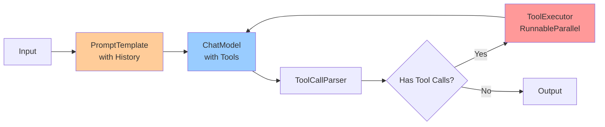

# LangChain Usage Overview

**Assessment Date**: 2025-11-10  
**LangChain Version**: 1.0.x  
**Scope**: Comprehensive inventory of LangChain components in ProcureFlow

---

## Executive Summary

ProcureFlow uses **LangChain as a minimal abstraction layer** for ChatModel APIs, NOT as a full agentic framework. The implementation leverages only the most basic LangChain primitives:

- ✅ ChatModel wrappers (`ChatOpenAI`, `ChatGoogleGenerativeAI`)
- ✅ Message types (`HumanMessage`, `AIMessage`, `SystemMessage`)
- ✅ Basic `.invoke()` pattern for synchronous calls
- ❌ No LCEL (LangChain Expression Language) chains
- ❌ No Agents framework (ReAct, Structured, etc)
- ❌ No Retrievers or VectorStores
- ❌ No Memory abstractions
- ❌ No Callbacks or LangSmith tracing

**Conclusion**: The agent logic is **custom-built in application code** (`agent.service.ts`). LangChain's value is limited to **provider normalization** (OpenAI vs Gemini) and basic message formatting.

---

## LangChain Components Inventory

### 1. Installed Packages

From `package.json`:

```json
{
  "@langchain/core": "1.0.3",
  "@langchain/google-genai": "^1.0.0",
  "@langchain/openai": "1.0.0"
}
```

**Notable Absences**:

- ❌ `langchain` (main package) - NOT installed
- ❌ `@langchain/community` - NOT installed
- ❌ `langsmith` - NOT installed

**Implication**: Only provider-specific packages are used, no community integrations or observability.

---

### 2. Imported Components

**File**: `lib/ai/langchainClient.ts`

```typescript
// Line 1-3: Message types
import {
  AIMessage,
  HumanMessage,
  SystemMessage,
} from '@langchain/core/messages';
import { ChatGoogleGenerativeAI } from '@langchain/google-genai';
import { ChatOpenAI } from '@langchain/openai';
```

**Usage**:

- `SystemMessage` - System prompt for agent behavior (line 369 in `agent.service.ts`)
- `HumanMessage` - User input (line 372 in `langchainClient.ts`)
- `AIMessage` - Assistant response in conversation history (line 368 in `langchainClient.ts`)

**NO imports of**:

- ❌ `Runnable` or `RunnableSequence` (LCEL)
- ❌ `LLMChain`, `ConversationChain`, etc (legacy chains)
- ❌ `AgentExecutor`, `initializeAgentExecutorWithOptions` (agents framework)
- ❌ `BufferMemory`, `ConversationSummaryMemory` (memory)
- ❌ `StructuredOutputParser`, `CommaSeparatedListOutputParser` (parsers)
- ❌ `VectorStore`, `Retriever` (RAG)

---

### 3. ChatModel Usage

#### OpenAI Integration

**File**: `lib/ai/langchainClient.ts:86-93`

```typescript
return new ChatOpenAI({
  apiKey: OPENAI_API_KEY,
  model: model || MODEL_CONFIG.openai.defaultModel,
  temperature: temperature ?? DEFAULT_TEMPERATURE,
  maxTokens: maxTokens ?? DEFAULT_MAX_TOKENS,
  timeout: 30000, // 30 seconds timeout
});
```

**Configuration**:

- **Model**: `gpt-4o-mini` (default)
- **Temperature**: 0.7
- **Max Tokens**: 1000
- **Timeout**: 30s (only for OpenAI, not Gemini)
- **Streaming**: ❌ Not enabled
- **Callbacks**: ❌ None

**API Call Pattern**:

```typescript
const response = await model.invoke(messages, invokeOptions);
```

**Observations**:

- ✅ Uses modern LangChain 1.0 API (`invoke()` instead of deprecated `call()`)
- ❌ No batching (`.batch()`)
- ❌ No streaming (`.stream()` or `.astream()`)
- ❌ No retries configured

---

#### Gemini Integration

**File**: `lib/ai/langchainClient.ts:67-75`

```typescript
return new ChatGoogleGenerativeAI({
  apiKey: GOOGLE_API_KEY,
  model: modelName,
  temperature: temperature ?? DEFAULT_TEMPERATURE,
  maxOutputTokens: maxTokens ?? DEFAULT_MAX_TOKENS,
});
```

**Configuration**:

- **Model**: `gemini-2.0-flash` (experimental)
- **Temperature**: 0.7
- **Max Output Tokens**: 1000
- **Timeout**: ❌ Not explicitly set
- **Streaming**: ❌ Not enabled
- **Callbacks**: ❌ None

**Free Tier Limits** (from `GEMINI_INTEGRATION.md`):

- **RPM**: 15 requests/minute
- **RPD**: 1500 requests/day
- **TPM**: 1,000,000 tokens/minute

**Observations**:

- ❌ No rate limiting enforcement in code
- ❌ No queue for request throttling
- ❌ Timeout not configured (unlike OpenAI)

---

### 4. Function Calling / Tool Calling

**Implementation**: Custom (not using LangChain's Agents framework)

**Tool Definition Format**:

```typescript
interface ToolDefinition {
  name: string;
  description: string;
  parameters: {
    type: 'object';
    properties: Record<string, unknown>;
    required: string[];
  };
}
```

**Conversion to LLM Format** (`langchainClient.ts:346-355`):

```typescript
formattedTools = options.tools.map((tool) => ({
  type: 'function' as const,
  function: {
    name: tool.name,
    description: tool.description,
    parameters: tool.parameters,
  },
}));
```

**Invocation**:

```typescript
const response = await model.invoke(messages, { tools: formattedTools });
```

**Response Parsing** (`langchainClient.ts:396-403`):

```typescript
if (response.additional_kwargs?.tool_calls) {
  for (const toolCall of response.additional_kwargs.tool_calls) {
    toolCalls.push({
      id: toolCall.id,
      name: toolCall.function.name,
      arguments: JSON.parse(toolCall.function.arguments),
    });
  }
}
```

**Observations**:

- ✅ Properly uses OpenAI function calling format
- ✅ Works with both OpenAI and Gemini (Gemini calls them "tools", but same API)
- ❌ No validation of tool call arguments against schema
- ❌ No retry on tool execution failure
- ❌ No parallel tool execution (sequential only)

---

### 5. Conversation History Management

**Pattern**: Manual message array construction

**File**: `features/agent/lib/agent.service.ts:365-380`

```typescript
const history = conversationHistory
  .slice(-10)  // Last 10 messages only
  .map((msg) => {
    let content = msg.content;

    // Append cart metadata to content for context
    if (msg.metadata?.cart) {
      const cart = msg.metadata.cart as { items: Array<{...}> };
      if (cart.items && cart.items.length > 0) {
        const cartInfo = cart.items
          .map((item) => `{itemId: "${item.itemId}", itemName: "${item.itemName}", quantity: ${item.quantity}}`)
          .join(', ');
        content += `\n[Cart Context: ${cartInfo}]`;
      }
    }

    return {
      role: msg.sender === 'user' ? 'user' : 'assistant',
      content,
    };
  });
```

**Observations**:

- ✅ Limits history to last 10 messages (prevents unbounded growth)
- ✅ Includes cart context in message content (clever workaround for stateless LLM)
- ❌ **NOT using LangChain Memory abstractions** (BufferMemory, etc)
- ❌ No token-based truncation (could exceed context window with long messages)
- ❌ No conversation summarization for long histories
- ❌ No semantic compression (embedding-based summarization)

**Missing**: LangChain's `BufferWindowMemory`, `ConversationSummaryMemory`, `VectorStoreRetrieverMemory`

---

### 6. NO LCEL (LangChain Expression Language)

**What is LCEL?**: LangChain 1.0's composable pipeline syntax (e.g., `chain = prompt | model | parser`)

**Status in ProcureFlow**: ❌ **NOT USED**

**What's missing**:

- No `.pipe()` composition
- No `RunnableSequence` or `RunnableBranch`
- No conditional flows (`RunnableLambda`)
- No parallel execution (`RunnableParallel`)
- No retry decorators (`RunnableRetry`)

**Implication**: Agent logic is imperative (procedural) instead of declarative (functional).

---

### 7. NO Agents Framework

**What is LangChain Agents?**: Built-in agent types (ReAct, Structured Chat, etc) with planning loops.

**Status in ProcureFlow**: ❌ **NOT USED**

**What's missing**:

- No `AgentExecutor`
- No `create_react_agent()` or `create_structured_chat_agent()`
- No `initializeAgentExecutorWithOptions()`
- No intermediate steps logging
- No stop conditions (max iterations, time limits)

**Current Implementation**: **Custom agent loop** in `generateAgentResponse()`:

1. Build tools + system prompt
2. Call LLM with function calling
3. Parse tool calls
4. Execute tool
5. Return result

**Single-turn only** (no multi-turn planning or self-correction).

---

### 8. NO Retrievers or VectorStores

**What are Retrievers?**: LangChain components for fetching relevant documents (e.g., semantic search with embeddings).

**Status in ProcureFlow**: ❌ **NOT USED**

**What's missing**:

- No `VectorStoreRetriever` (Pinecone, Chroma, FAISS)
- No embedding generation (`OpenAIEmbeddings`, etc)
- No similarity search
- No hybrid search (keyword + semantic)
- No reranking

**Current Implementation**: MongoDB text search (`$text` operator) in `catalog.service.ts:134-147`:

```typescript
const searchFilter = {
  $text: { $search: q },
  status: includeArchived ? undefined : ItemStatus.Active,
  ...(maxPrice !== undefined && { price: { $lte: maxPrice } }),
};
```

**Limitations**:

- Keyword-based only (no semantic understanding)
- No relevance scoring (uses MongoDB text score)
- No fuzzy matching (typos break search)
- No multi-lingual support

---

### 9. NO Output Parsers

**What are Output Parsers?**: LangChain components to structure LLM output (JSON, CSV, etc).

**Status in ProcureFlow**: ❌ **NOT USED**

**What's missing**:

- No `StructuredOutputParser`
- No `PydanticOutputParser`
- No `JsonOutputParser`
- No `CommaSeparatedListOutputParser`

**Current Implementation**: Manual parsing of `tool_calls` from `additional_kwargs`.

**Risk**: Fragile to LLM output format changes.

---

### 10. NO Callbacks or LangSmith

**What are Callbacks?**: LangChain's observability hooks for logging, tracing, debugging.

**Status in ProcureFlow**: ❌ **NOT USED**

**What's missing**:

- No `CallbackManager`
- No `LangChainTracer` (LangSmith integration)
- No custom callbacks
- No `verbose=True` logging
- No `BaseCallbackHandler` implementations

**Current Observability**: `console.log()` statements only.

**Example** (`langchainClient.ts:326`, `agent.service.ts:516`):

```typescript
console.log('[LangChain Debug] Starting chat completion:', {...});
console.log('[Agent Debug] LLM Response:', {...});
```

**Problems**:

- ❌ No structured logging (JSON logs)
- ❌ No distributed tracing (no trace IDs)
- ❌ No metrics collection (latency, tokens, cost)
- ❌ No error tracking (Sentry, etc)

---

### 11. NO Streaming

**What is Streaming?**: Incremental LLM output generation (token-by-token).

**Status in ProcureFlow**: ❌ **NOT USED**

**What's missing**:

- No `.stream()` or `.astream()` calls
- No Server-Sent Events (SSE) for UI updates
- No WebSocket streaming

**Current Implementation**: Blocking `.invoke()` waits for full response.

**Impact**:

- Poor UX for long responses (2-5s wait)
- No progress indicator
- No early cancellation

---

## LangChain Pipeline Diagram

### Current Implementation

```mermaid
graph LR
    UserMsg[User Message] --> BuildPrompt[Build Messages Array<br/>SystemMessage + History + HumanMessage]
    BuildPrompt --> FormatTools[Format Tool Definitions<br/>JSON Schema]
    FormatTools --> Invoke[model.invoke<br/>messages, tools]
    Invoke --> OpenAI[ChatOpenAI]
    Invoke --> Gemini[ChatGoogleGenerativeAI]
    OpenAI --> Parse[Parse response.additional_kwargs.tool_calls]
    Gemini --> Parse
    Parse --> ExecuteTool[Execute Tool<br/>Call Service Function]
    ExecuteTool --> FormatResponse[Format Response<br/>with Items/Cart]
    FormatResponse --> SaveDB[Save to MongoDB]
    SaveDB --> Return[Return to Client]

    style BuildPrompt fill:#ffcc99
    style Invoke fill:#99ccff
    style ExecuteTool fill:#ff9999
```



### Proposed LCEL Implementation



**Benefits of LCEL**:

- ✅ Declarative syntax (easier to read)
- ✅ Built-in parallelization (`.batch()`, `RunnableParallel`)
- ✅ Automatic retries (`RunnableRetry`)
- ✅ Built-in streaming support
- ✅ Easier to add callbacks/tracing

---

## Key Observations

### Strengths

1. ✅ **Correct use of LangChain 1.0 API** (`invoke()` instead of deprecated methods)
2. ✅ **Dual provider support** (OpenAI + Gemini) with same interface
3. ✅ **Clean abstraction** (`langchainClient.ts` isolates LangChain from business logic)
4. ✅ **Function calling properly implemented** (tool definitions + parsing)

### Weaknesses

1. ❌ **Underutilizing LangChain**: Only using ~5% of LangChain's capabilities
2. ❌ **No observability**: Missing callbacks, tracing, metrics
3. ❌ **No streaming**: Poor UX for long responses
4. ❌ **No memory abstractions**: Manual message array management
5. ❌ **No retries**: Single-shot LLM calls (fragile to transient errors)
6. ❌ **No LCEL**: Imperative code instead of composable pipelines
7. ❌ **No semantic search**: Keyword-only search (no embeddings)

---

## Recommendations

### Quick Wins (Low Effort, High Impact)

1. **Add LangSmith tracing** (1-2 hours)
   - Install `langsmith` package
   - Set `LANGCHAIN_TRACING_V2=true`
   - Get instant visibility into LLM calls

2. **Add streaming** (4-6 hours)
   - Use `.astream()` instead of `.invoke()`
   - Implement SSE endpoint (`/api/agent/chat/stream`)
   - Update UI to display tokens as they arrive

3. **Add retry logic** (2-3 hours)
   - Wrap `invoke()` in try-catch with exponential backoff
   - Retry on transient errors (429, 503, timeouts)

### Medium Effort (1-2 days)

4. **Migrate to LCEL** (8-12 hours)
   - Define `PromptTemplate` for system prompt
   - Use `RunnableSequence` for prompt → model → parser
   - Add `RunnableParallel` for multi-tool execution

5. **Add BufferWindowMemory** (4-6 hours)
   - Replace manual message array with `BufferWindowMemory`
   - Auto-truncate by token count (not message count)

6. **Add semantic search** (1-2 days)
   - Generate embeddings for catalog items
   - Store in vector DB (Pinecone, Chroma, or pgvector)
   - Use `VectorStoreRetriever` in search tool

### High Effort (3-5 days)

7. **Migrate to AgentExecutor** (16-24 hours)
   - Use `create_react_agent()` or `create_structured_chat_agent()`
   - Benefits: multi-turn planning, intermediate steps logging
   - Trade-off: Less control over agent loop

8. **Add prompt caching** (8-12 hours)
   - Cache system prompt + tool definitions
   - Implement with Redis or in-memory cache
   - Reduce token usage by 30-40%

---

## Document Version

**Version**: 1.0  
**Last Updated**: 2025-11-10  
**Next Review**: After LCEL migration or LangSmith integration
