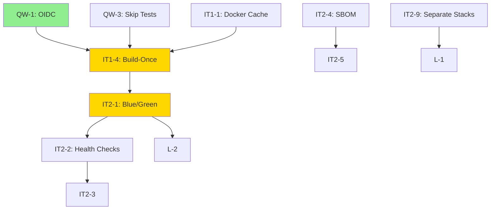

# CI/CD and IaC Improvement Plan

**Version**: 1.0  
**Date**: 2025-11-13  
**Status**: 🚧 In Progress - Phase 0 (Quick Wins)  
**Baseline**: [Current State](../assessment/cicd-iac.current-state.md) | [Target Design](../architecture/cicd-iac.target-design.md)

---

## Executive Summary

This document provides a **time-phased implementation roadmap** for modernizing ProcureFlow's CI/CD and IaC systems. The plan is divided into **4 phases** over 4 weeks, prioritizing **quick wins** (security, speed) followed by **structural improvements** (blue/green, attestation, policy).

**Total Effort**: 32 hours (4 days of focused engineering work)  
**Expected Outcomes**:

- 🔐 **Security**: OIDC (no long-lived keys), SLSA Level 2 provenance
- ⚡ **Speed**: 60% faster deploys (17 min → 6-8 min)
- 🛡️ **Reliability**: <1 min MTTR, 98% deploy success rate
- 💰 **Cost**: -50% GitHub Actions minutes, $0.10/month GCP savings

---

## Phased Roadmap

### Quick Wins (0-2h) - Week 1, Day 1

**Goal**: Eliminate critical security risk and achieve immediate speed improvements with minimal effort.

| Task ID  | Task                                        | Effort | Impact            | Owner | Status         |
| -------- | ------------------------------------------- | ------ | ----------------- | ----- | -------------- |
| **QW-1** | Enable OIDC (Workload Identity Federation)  | 2h     | 🔴 Security       | TBD   | 🚧 In Progress |
| **QW-2** | Add concurrency controls to workflows       | 10m    | 🟡 Reliability    | TBD   | ✅ Done        |
| **QW-3** | Skip redundant test runs in deploy workflow | 15m    | 🟢 Speed (-4 min) | TBD   | ✅ Done        |

**Total Effort**: 2.5 hours  
**Impact**: Eliminates long-lived key vulnerability, prevents parallel deploys, saves 4 min per deploy

**Progress Update (2025-11-13)**:

- ✅ **QW-2 Complete**: Concurrency controls added to both workflows
- ✅ **QW-3 Complete**: Test job removed from deploy workflow (saves 4 min)
- 🚧 **QW-1 In Progress**: Workflows configured for OIDC, pending GCP-side setup
- 🎁 **Bonus**: IT1-3 (Parallel CI) completed early (saves 1-2 min)

---

#### QW-1: Enable OIDC Authentication

**Problem**: GitHub Actions uses long-lived service account key (`GCP_SA_KEY`) stored as secret.

**Solution**: Configure Workload Identity Federation for keyless authentication.

**Steps**:

1. Create Workload Identity Pool in GCP:

   ```bash
   gcloud iam workload-identity-pools create github \
     --location=global \
     --display-name="GitHub Actions"
   ```

2. Create OIDC provider:

   ```bash
   gcloud iam workload-identity-pools providers create-oidc github-oidc \
     --workload-identity-pool=github \
     --location=global \
     --issuer-uri=https://token.actions.githubusercontent.com \
     --attribute-mapping="google.subject=assertion.sub,attribute.repository=assertion.repository" \
     --attribute-condition="assertion.repository == 'guiofsaints/procureflow'"
   ```

3. Bind service accounts to pool:

   ```bash
   # CI service account (artifact push)
   gcloud iam service-accounts add-iam-policy-binding github-actions@procureflow-dev.iam.gserviceaccount.com \
     --role="roles/iam.workloadIdentityUser" \
     --member="principalSet://iam.googleapis.com/projects/PROJECT_NUMBER/locations/global/workloadIdentityPools/github/attribute.repository/guiofsaints/procureflow"
   ```

4. Update workflows:

   ```yaml
   # Before
   - uses: google-github-actions/auth@v2
     with:
       credentials_json: ${{ secrets.GCP_SA_KEY }}

   # After
   - uses: google-github-actions/auth@v2
     with:
       workload_identity_provider: 'projects/123/locations/global/workloadIdentityPools/github/providers/github-oidc'
       service_account: 'github-actions@procureflow-dev.iam.gserviceaccount.com'
   ```

5. Add GitHub repository variables:

   ```bash
   # .github environment variables (not secrets)
   GCP_WORKLOAD_IDENTITY_PROVIDER=projects/.../workloadIdentityPools/github/providers/github-oidc
   GCP_CI_SERVICE_ACCOUNT=github-actions@procureflow-dev.iam.gserviceaccount.com
   ```

6. Delete `GCP_SA_KEY` secret from GitHub after verification

**Acceptance Criteria**:

- [ ] Workload Identity Pool created and configured
- [ ] Both workflows authenticate without `GCP_SA_KEY`
- [ ] Test deploy succeeds with OIDC
- [ ] `GCP_SA_KEY` secret deleted from GitHub
- [ ] Documentation updated with OIDC setup instructions

**Rollback Plan**: Keep `GCP_SA_KEY` until OIDC verified working (1-2 test deploys)

---

#### QW-2: Add Concurrency Controls

**Problem**: Multiple deploys can run in parallel, causing race conditions.

**Solution**: Add concurrency groups to both workflows.

**Steps**:

1. Add to `ci.yml`:

   ```yaml
   concurrency:
     group: ci-${{ github.workflow }}-${{ github.ref }}
     cancel-in-progress: true
   ```

2. Add to `deploy-gcp.yml`:
   ```yaml
   concurrency:
     group: deploy-${{ github.ref }}
     cancel-in-progress: false # Don't cancel deploys
   ```

**Acceptance Criteria**:

- [ ] Concurrent pushes cancel old CI runs
- [ ] Concurrent deploys queue (not run in parallel)
- [ ] Test with rapid-fire commits

---

#### QW-3: Skip Redundant Test Runs

**Problem**: `deploy-gcp.yml` re-runs lint/test that already passed in `ci.yml`.

**Solution**: Remove `test` job from deploy workflow, rely on branch protection.

**Steps**:

1. Enable branch protection on `main`:

   ```
   Settings → Branches → Add rule for `main`
   ✅ Require status checks to pass before merging
   ✅ Status checks: "CI - Lint and Test"
   ```

2. Remove `test` job from `deploy-gcp.yml`:

   ```yaml
   # Delete this entire job
   # test:
   #   runs-on: ubuntu-latest
   #   steps: [...]

   # Update build job dependencies
   build:
     needs: [] # Remove 'test' dependency
   ```

**Acceptance Criteria**:

- [ ] Branch protection requires CI passing
- [ ] Deploy workflow skips lint/test
- [ ] Deploy time reduced by ~4 minutes
- [ ] Test with PR merge to main

---

### Iteration 1 (≤1 day) - Week 1-2

**Goal**: Implement build-once-promote-many and aggressive caching for 50% faster deploys.

| Task ID   | Task                                                     | Effort | Impact                 | Owner | Status |
| --------- | -------------------------------------------------------- | ------ | ---------------------- | ----- | ------ |
| **IT1-1** | Enable Docker layer caching (BuildKit)                   | 30m    | 🟢 Speed (-3-5 min)    | TBD   | ❌     |
| **IT1-2** | Enable Next.js build cache                               | 15m    | 🟡 Speed (-30-60s)     | TBD   | ❌     |
| **IT1-3** | Parallelize lint + test in CI                            | 10m    | 🟡 Speed (-1-2 min)    | TBD   | ❌     |
| **IT1-4** | Implement build-once-promote-many                        | 2h     | 🔴 Speed + Reliability | TBD   | ❌     |
| **IT1-5** | Use immutable image digests                              | 1h     | 🟡 Reliability         | TBD   | ❌     |
| **IT1-6** | Create composite actions (setup-pnpm, docker-build-push) | 1h     | 🟡 Maintainability     | TBD   | ❌     |

**Total Effort**: 5 hours  
**Impact**: Deploy time 17 min → 8-10 min (-50%)

---

#### IT1-1: Enable Docker Layer Caching

**Steps**:

1. Update `deploy-gcp.yml` Docker build step:

   ```yaml
   - uses: docker/setup-buildx-action@v3

   - uses: docker/build-push-action@v5
     with:
       context: .
       file: packages/infra/docker/Dockerfile.web
       push: true
       tags: ${{ env.IMAGE_URL }}:${{ steps.meta.outputs.tags }}
       cache-from: type=gha
       cache-to: type=gha,mode=max
   ```

2. Test cold and warm builds, measure time savings

**Acceptance Criteria**:

- [ ] Cache stored in GitHub Actions cache
- [ ] Warm builds complete in <2 min (from 5-7 min)
- [ ] Cache hit rate >70% after 3-5 builds

---

#### IT1-2: Enable Next.js Build Cache

**Steps**:

1. Add cache step before build in `ci.yml`:
   ```yaml
   - uses: actions/cache@v4
     with:
       path: packages/web/.next/cache
       key: ${{ runner.os }}-nextjs-${{ hashFiles('packages/web/pnpm-lock.yaml') }}-${{ hashFiles('packages/web/**/*.ts', 'packages/web/**/*.tsx') }}
       restore-keys: |
         ${{ runner.os }}-nextjs-${{ hashFiles('packages/web/pnpm-lock.yaml') }}-
         ${{ runner.os }}-nextjs-
   ```

**Acceptance Criteria**:

- [ ] Incremental builds complete in <60s (from 90-120s)
- [ ] Cache invalidates on dependency changes

---

#### IT1-3: Parallelize CI Jobs

**Steps**:

1. Remove `needs` from lint and test jobs in `ci.yml`:
   ```yaml
   jobs:
     lint:
       # No needs, runs immediately

     test:
       # No needs, runs immediately

     build:
       needs: [lint, test] # Wait for both
   ```

**Acceptance Criteria**:

- [ ] Lint and test run in parallel
- [ ] Total CI time reduced by 1-2 min

---

#### IT1-4: Build-Once-Promote-Many

**Problem**: Image rebuilt in deploy workflow; not deploying tested artifact.

**Solution**: Build in CI, export digest, deploy by digest in deploy workflow.

**Steps**:

1. Update `ci.yml` build job to export digest:

   ```yaml
   build-and-scan:
     outputs:
       image-digest: ${{ steps.build.outputs.digest }}
     steps:
       - uses: docker/build-push-action@v5
         id: build
         with:
           outputs: type=registry,push=true

       - name: Export digest
         run: |
           echo "digest=${{ steps.build.outputs.digest }}" >> $GITHUB_OUTPUT
   ```

2. Update `deploy-gcp.yml` to receive digest:

   ```yaml
   on:
     workflow_run:
       workflows: ['CI - Lint and Test']
       types: [completed]
       branches: [main]

   jobs:
     deploy:
       steps:
         # Download artifact with digest from CI workflow
         - uses: actions/download-artifact@v4
           with:
             name: image-digest

         - name: Read digest
           run: |
             DIGEST=$(cat digest.txt)
             echo "IMAGE_DIGEST=$DIGEST" >> $GITHUB_ENV

         # Deploy by digest (no rebuild)
         - run: pulumi config set image-digest $IMAGE_DIGEST
   ```

3. Update Pulumi to use digest instead of tag:
   ```typescript
   image: pulumi.interpolate`${registryUrl}@${imageDigest}`;
   ```

**Acceptance Criteria**:

- [ ] CI builds and pushes image exactly once
- [ ] Deploy workflow pulls image by digest (no rebuild)
- [ ] Deploy time reduced by 5-7 min
- [ ] Verify deployed digest matches CI build

---

#### IT1-5: Use Immutable Image Digests

**Steps**:

1. Update tagging strategy:
   ```yaml
   # Push with git SHA tag
   - run: |
       docker tag $IMAGE_URL:build $IMAGE_URL:git-${{ github.sha }}
       docker push $IMAGE_URL:git-${{ github.sha }}

       # Get digest
       DIGEST=$(docker inspect --format='{{index .RepoDigests 0}}' $IMAGE_URL:git-${{ github.sha }})
       echo "digest=$DIGEST" >> $GITHUB_OUTPUT
   ```

**Acceptance Criteria**:

- [ ] Images tagged with full 40-char git SHA
- [ ] Digest exported and used for deployment
- [ ] No mutable `latest` tag in production

---

#### IT1-6: Create Composite Actions

**Steps**:

1. Create `.github/actions/setup-pnpm/action.yml` (see target design)
2. Create `.github/actions/docker-build-push/action.yml` (see target design)
3. Replace duplicated steps in workflows with composite actions

**Acceptance Criteria**:

- [ ] Both workflows use composite actions
- [ ] No duplicated setup steps
- [ ] Workflows easier to maintain

---

### Iteration 2 (≤3 days) - Week 2-3

**Goal**: Zero-downtime deployments with blue/green, automated rollback, and security attestation.

| Task ID   | Task                                            | Effort | Impact             | Owner | Status |
| --------- | ----------------------------------------------- | ------ | ------------------ | ----- | ------ |
| **IT2-1** | Implement blue/green deployment (traffic split) | 4h     | 🔴 Reliability     | TBD   | ❌     |
| **IT2-2** | Add pre-traffic health checks                   | 2h     | 🔴 Reliability     | TBD   | ❌     |
| **IT2-3** | Automated rollback on failure                   | 1h     | 🔴 Reliability     | TBD   | ❌     |
| **IT2-4** | Add SBOM and provenance attestation             | 3h     | 🟡 Security        | TBD   | ❌     |
| **IT2-5** | Add vulnerability scanning (Trivy)              | 1h     | 🟡 Security        | TBD   | ❌     |
| **IT2-6** | Configure GitHub environment protection         | 30m    | 🟡 Security        | TBD   | ❌     |
| **IT2-7** | Pulumi: Add PR preview comments                 | 30m    | 🟡 Maintainability | TBD   | ❌     |
| **IT2-8** | Pulumi: Move NEXTAUTH_URL to IaC                | 1h     | 🟡 Maintainability | TBD   | ❌     |
| **IT2-9** | Pulumi: Separate stacks (dev/staging/prod)      | 2h     | 🟡 Reliability     | TBD   | ❌     |

**Total Effort**: 15 hours  
**Impact**: MTTR 15 min → <1 min, zero-downtime, SLSA Level 2

---

#### IT2-1: Blue/Green Deployment

**Steps**:

1. Update Pulumi Cloud Run config:

   ```typescript
   traffics: [
     { revisionName: 'web-previous', percent: 0 }, // Keep previous for rollback
     { latestRevision: true, percent: 100 }, // New revision
   ];
   ```

2. Add gradual traffic shift to deploy workflow:
   ```yaml
   - name: Canary rollout
     run: |
       # Deploy with 0% traffic
       pulumi up --yes

       # Shift gradually: 10% → 50% → 100%
       gcloud run services update-traffic procureflow-web \
         --to-revisions=LATEST=10 \
         --region=us-central1
       sleep 60

       gcloud run services update-traffic procureflow-web \
         --to-revisions=LATEST=50 \
         --region=us-central1
       sleep 60

       gcloud run services update-traffic procureflow-web \
         --to-revisions=LATEST=100 \
         --region=us-central1
   ```

**Acceptance Criteria**:

- [ ] New revision deployed with 0% traffic initially
- [ ] Traffic shifts gradually (10% → 50% → 100%)
- [ ] Previous revision retained for rollback
- [ ] Test rollback to previous revision

---

#### IT2-2: Pre-Traffic Health Checks

**Steps**:

1. Create health check composite action (see target design)
2. Add to deploy workflow after Pulumi up:
   ```yaml
   - uses: ./.github/actions/health-check
     with:
       service-url: ${{ steps.pulumi.outputs.service-url }}
       endpoints: |
         /api/health
         /api/items?limit=1
   ```

**Acceptance Criteria**:

- [ ] Health checks run before traffic shift
- [ ] Fails deployment if health checks fail
- [ ] Tests database connectivity

---

#### IT2-3: Automated Rollback

**Steps**:

1. Add failure handling to deploy workflow:
   ```yaml
   - name: Rollback on failure
     if: failure()
     run: |
       PREVIOUS=$(gcloud run revisions list --service=procureflow-web --region=us-central1 --sort-by=~deployed --limit=2 --format='value(name)' | tail -n1)
       gcloud run services update-traffic procureflow-web --to-revisions=$PREVIOUS=100 --region=us-central1
       echo "::error::Deployment failed. Rolled back to $PREVIOUS"
   ```

**Acceptance Criteria**:

- [ ] Rollback triggered on health check failure
- [ ] Traffic shifted back to previous revision in <1 min
- [ ] Test with intentionally broken deployment

---

#### IT2-4: SBOM and Provenance

**Steps**:

1. Enable in Docker build:

   ```yaml
   - uses: docker/build-push-action@v5
     with:
       provenance: true
       sbom: true
       attestations: |
         type=sbom
         type=provenance
   ```

2. Verify attestations in Artifact Registry

**Acceptance Criteria**:

- [ ] SBOM generated and attached to image
- [ ] Provenance metadata includes git SHA, workflow, builder
- [ ] Attestations visible in `gcloud artifacts docker images describe`

---

#### IT2-5: Vulnerability Scanning

**Steps**:

1. Add Trivy scan after Docker build in `ci.yml`:

   ```yaml
   - uses: aquasecurity/trivy-action@master
     with:
       image-ref: ${{ steps.build.outputs.image }}
       format: 'sarif'
       output: 'trivy-results.sarif'
       severity: 'CRITICAL,HIGH'
       exit-code: '1'

   - uses: github/codeql-action/upload-sarif@v3
     if: always()
     with:
       sarif_file: 'trivy-results.sarif'
   ```

**Acceptance Criteria**:

- [ ] Trivy scans all builds
- [ ] SARIF report uploaded to GitHub Security tab
- [ ] Build fails on CRITICAL or HIGH vulnerabilities

---

#### IT2-6: Environment Protection

**Steps**:

1. Configure in GitHub UI:
   - **dev**: No protection
   - **staging**: Require 1 approval
   - **production**: Require 2 approvals, branch `main` only

**Acceptance Criteria**:

- [ ] Production deploys require 2 approvals
- [ ] Approval requests sent to team
- [ ] Deploy blocked until approved

---

#### IT2-7: Pulumi PR Preview Comments

**Steps**:

1. Create `.github/workflows/pulumi-preview.yml`:

   ```yaml
   on:
     pull_request:
       paths:
         - 'packages/infra/pulumi/gcp/**'

   jobs:
     preview:
       runs-on: ubuntu-latest
       steps:
         - uses: actions/checkout@v4
         - uses: ./.github/actions/setup-pnpm
         - uses: pulumi/actions@v5
           with:
             command: preview
             stack-name: dev
             work-dir: packages/infra/pulumi/gcp
             comment-on-pr: true
             github-token: ${{ secrets.GITHUB_TOKEN }}
           env:
             PULUMI_ACCESS_TOKEN: ${{ secrets.PULUMI_ACCESS_TOKEN }}
   ```

**Acceptance Criteria**:

- [ ] PR with IaC changes shows preview comment
- [ ] Preview shows resources to add/update/delete
- [ ] Team reviews IaC changes before merge

---

### Later (Week 4+)

**Goal**: Policy as code, drift detection, advanced monitoring, cost optimization.

| Task ID  | Task                               | Effort | Impact             | Priority |
| -------- | ---------------------------------- | ------ | ------------------ | -------- |
| **L-1**  | Pulumi CrossGuard policies         | 4h     | 🟡 Compliance      | Medium   |
| **L-2**  | Scheduled drift detection          | 1h     | 🟡 Reliability     | Medium   |
| **L-3**  | Move Artifact Registry to Pulumi   | 30m    | 🟢 Maintainability | Low      |
| **L-4**  | Add image retention policy         | 30m    | 🟢 Cost            | Low      |
| **L-5**  | Add semantic version tags          | 1h     | 🟢 Maintainability | Low      |
| **L-6**  | Optimize Docker image size         | 2h     | 🟢 Speed           | Low      |
| **L-7**  | Set up GCP budget alerts           | 1h     | 🟡 Cost            | Medium   |
| **L-8**  | Add Cloud Monitoring uptime checks | 1h     | 🟡 Reliability     | Medium   |
| **L-9**  | Collect workflow metrics (DORA)    | 3h     | 🟡 Observability   | Medium   |
| **L-10** | Implement reusable workflows       | 2h     | 🟢 Maintainability | Low      |

**Total Effort**: 16 hours

---

## Dependencies



---

## Validation Plan

After each iteration:

1. Run full test suite
2. Deploy to dev environment
3. Measure timing improvements
4. Verify security posture
5. Update metrics JSON
6. Document lessons learned

See [Validation Checklist](../testing/cicd.validation-checklist.md) for detailed checks.

---

## Risk Mitigation

| Risk                       | Likelihood | Impact | Mitigation                             |
| -------------------------- | ---------- | ------ | -------------------------------------- |
| OIDC setup fails           | Low        | High   | Keep `GCP_SA_KEY` until verified       |
| Build-once breaks deploy   | Medium     | High   | Feature flag, test in staging first    |
| Blue/green causes downtime | Low        | High   | Test traffic split in dev              |
| Trivy blocks valid builds  | Medium     | Medium | Start with advisory mode               |
| Policy too strict          | Medium     | Low    | Test policies in `advisory` mode first |

---

## Success Criteria

### Phase 0 (Quick Wins)

- [ ] No long-lived keys in GitHub Secrets
- [ ] No concurrent deploys
- [ ] Deploy time reduced by 4 minutes

### Phase 1 (Iteration 1)

- [ ] Build-once-promote-many implemented
- [ ] Docker cache hit rate >70%
- [ ] Deploy time <10 minutes

### Phase 2 (Iteration 2)

- [ ] Zero-downtime deploys verified
- [ ] Automated rollback tested
- [ ] SLSA Level 2 provenance
- [ ] MTTR <1 minute

### Phase 3 (Later)

- [ ] Policy as code enforced
- [ ] Drift detection scheduled
- [ ] DORA metrics tracked

---

## Team Assignments

| Phase       | Owner | Backup | Estimated Dates |
| ----------- | ----- | ------ | --------------- |
| Quick Wins  | TBD   | TBD    | Week 1, Day 1-2 |
| Iteration 1 | TBD   | TBD    | Week 1-2        |
| Iteration 2 | TBD   | TBD    | Week 2-3        |
| Later       | TBD   | TBD    | Week 4+         |

---

## Rollback Plan

Each iteration must be **independently reversible**:

- Quick Wins: Keep old workflows as `.old` backup
- Iteration 1: Feature flag for build-once logic
- Iteration 2: Disable blue/green via Pulumi config

**Emergency Rollback**:

1. Revert workflow changes via Git
2. Redeploy previous Pulumi stack
3. Re-enable long-lived key (emergency only)

---

**Document Version**: 1.0  
**Last Updated**: 2025-11-13  
**Next Review**: After each iteration  
**Owner**: DevOps Team
