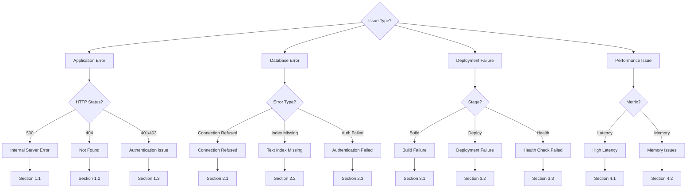

# Runbook: Troubleshooting

**Executive Summary**: Comprehensive troubleshooting guide for ProcureFlow covering 10 common failure scenarios across application errors (500/404/401), database issues (connection refused, text index missing, authentication), deployment failures (build errors, health checks, Pulumi), and performance problems (high latency, memory leaks). Each scenario includes symptoms, diagnostic commands, step-by-step solutions, and escalation paths. Average resolution time: 5-30 minutes depending on issue complexity. Use diagnostic flowchart to quickly identify issue category, then follow specific resolution procedure.

---

## Table of Contents

- [Diagnostic Flowchart](#diagnostic-flowchart)
- [Application Errors](#application-errors)
- [Database Issues](#database-issues)
- [Deployment Failures](#deployment-failures)
- [Performance Problems](#performance-problems)
- [Escalation Procedures](#escalation-procedures)
- [References](#references)

---

## Metadata

- **Estimated Duration**: 5-30 minutes (varies by issue)
- **Complexity**: 🟡 Medium
- **Last Verified**: 2025-11-13

---

## Diagnostic Flowchart



---

## Application Errors

### 1.1 Internal Server Error (500)

**Symptom**: API returns 500 status, application crashes, error in logs

**Diagnostic Commands**:

```powershell
# Check application logs
docker logs $(docker ps -q --filter name=procureflow-web) --tail 50

# For Cloud Run
gcloud run services logs read procureflow-web --limit 50 --region us-central1

# Check health endpoint
curl http://localhost:3000/api/health
```

**Common Causes**:

1. **MongoDB connection failed**
   - Solution: See Section 2.1
2. **Environment variable missing**
   ```powershell
   # Verify .env.local
   Get-Content packages/web/.env.local | Select-String "MONGODB_URI|NEXTAUTH_SECRET|OPENAI_API_KEY"
   ```
3. **Unhandled exception in service layer**
   - Check error stack trace in logs
   - Verify input validation in service functions

**Resolution Steps**:

1. Check logs for error stack trace
2. Identify failing service or route
3. Verify environment variables are set
4. Test locally with same inputs
5. If MongoDB-related, see Section 2
6. If persists, enable debug logging:
   ```powershell
   # Add to .env.local
   LOG_LEVEL=debug
   ```

**Escalation**: If unresolved after 15 minutes, escalate to Platform Team with logs

---

### 1.2 Not Found (404)

**Symptom**: Route returns 404, page not rendering

**Diagnostic Commands**:

```powershell
# List all API routes
Get-ChildItem -Path packages/web/src/app -Recurse -Filter "route.ts" | Select-Object FullName

# Check Next.js routing
pnpm --filter web build
```

**Common Causes**:

1. **Route file not in correct location**
   - Verify file at `app/(app)/api/<path>/route.ts`
2. **Missing export or incorrect HTTP method**
   ```typescript
   // Must export named function
   export async function GET(request: NextRequest) {}
   ```
3. **Next.js build cache issue**
   ```powershell
   Remove-Item -Recurse -Force packages/web/.next
   pnpm --filter web dev
   ```

**Resolution Steps**:

1. Verify route file exists and is named correctly
2. Check exported HTTP method matches request (GET, POST, etc.)
3. Clear `.next` cache and rebuild
4. Test route in isolation with curl/Postman

---

### 1.3 Authentication Error (401/403)

**Symptom**: `User must be authenticated`, redirected to login, session invalid

**Diagnostic Commands**:

```powershell
# Check NEXTAUTH_SECRET
Get-Content packages/web/.env.local | Select-String "NEXTAUTH_SECRET"

# Test session endpoint
curl http://localhost:3000/api/auth/session
```

**Common Causes**:

1. **NEXTAUTH_SECRET missing or changed**
   ```powershell
   # Generate new secret
   openssl rand -base64 32
   # Add to .env.local
   # NEXTAUTH_SECRET=<output>
   ```
2. **Session expired (>30 days)**
   - Clear cookies and sign in again
3. **NEXTAUTH_URL incorrect**
   ```powershell
   # Verify in .env.local
   NEXTAUTH_URL=http://localhost:3000
   ```

**Resolution Steps**:

1. Verify NEXTAUTH_SECRET exists and is at least 32 characters
2. Verify NEXTAUTH_URL matches actual URL
3. Clear browser cookies for localhost:3000
4. Sign in with demo credentials: `guilherme@procureflow.com` / `guigui123`
5. If Cloud Run, verify secret in Secret Manager

---

## Database Issues

### 2.1 MongoDB Connection Refused

**Symptom**: `Error: ECONNREFUSED 127.0.0.1:27017` or `MongooseServerSelectionError`

**Diagnostic Commands**:

```powershell
# Check MongoDB container
docker ps | Select-String "mongo"

# Check Docker Desktop
Get-Service -Name "Docker Desktop Service" | Format-List Status

# Test connection directly
docker exec -it $(docker ps -q --filter name=mongo) mongosh procureflow
```

**Resolution Steps**:

1. **Verify Docker Desktop is running**

   ```powershell
   Start-Service "Docker Desktop Service"
   ```

2. **Restart MongoDB container**

   ```powershell
   pnpm docker:down
   pnpm docker:up
   ```

3. **Verify connection string**

   ```powershell
   # In .env.local, should be:
   MONGODB_URI=mongodb://localhost:27017/procureflow
   ```

4. **Check port conflicts**

   ```powershell
   netstat -ano | Select-String ":27017"
   ```

5. **Recreate containers if needed**
   ```powershell
   docker compose -f packages/infra/compose.yaml down -v
   docker compose -f packages/infra/compose.yaml up -d
   ```

**Verification**:

```powershell
# Should see MongoDB container
docker ps --filter name=mongo

# Should connect successfully
mongosh mongodb://localhost:27017/procureflow --eval "db.adminCommand('ping')"
```

---

### 2.2 Text Index Missing

**Symptom**: Catalog search returns empty results, `IndexNotFound` error

**Diagnostic Commands**:

```powershell
# Check indexes
mongosh mongodb://localhost:27017/procureflow --eval "db.items.getIndexes()"
```

**Resolution Steps**:

1. **Create text index**

   ```powershell
   pnpm --filter web db:create-text-index
   ```

2. **Verify index creation**

   ```powershell
   mongosh mongodb://localhost:27017/procureflow --eval "db.items.getIndexes()" | Select-String "text"
   ```

3. **Test search**

   ```powershell
   mongosh mongodb://localhost:27017/procureflow --eval "db.items.find({`$text: {`$search: 'chair'}}).count()"
   ```

4. **If no items exist, seed database**
   ```powershell
   pnpm --filter web db:seed-office-items
   ```

**Expected Output**: Index with name `"name_text_category_text_description_text"`

---

### 2.3 Database Authentication Failed

**Symptom**: `MongoServerError: Authentication failed`

**Resolution Steps**:

1. **For local development** (no auth required):

   ```powershell
   # MONGODB_URI should NOT include username/password
   MONGODB_URI=mongodb://localhost:27017/procureflow
   ```

2. **For MongoDB Atlas** (production):
   - Verify credentials in Secret Manager
   - Check IP whitelist includes Cloud Run egress IPs
   - Regenerate password if needed in Atlas console

---

## Deployment Failures

### 3.1 Build Failure

**Symptom**: GitHub Actions workflow fails at build step, TypeScript errors

**Diagnostic Commands**:

```powershell
# Build locally
pnpm build

# Check TypeScript errors
pnpm --filter web tsc --noEmit

# Check linting
pnpm lint
```

**Common Causes**:

1. **TypeScript type errors**
   - Review error output from `tsc`
   - Fix type annotations or add `@ts-expect-error` with justification
2. **Import path errors**
   - Verify imports use `@/` aliases correctly
   - Check `tsconfig.json` paths configuration
3. **Missing dependencies**
   ```powershell
   Remove-Item -Recurse -Force node_modules, pnpm-lock.yaml
   pnpm install
   ```

**Resolution Steps**:

1. Run build locally: `pnpm build`
2. Fix all TypeScript errors
3. Commit and push fixes
4. Re-run GitHub Actions workflow

---

### 3.2 Deployment Failure

**Symptom**: Pulumi deployment fails, Cloud Run service not updated

**Diagnostic Commands**:

```powershell
# Check Pulumi state
cd packages/infra/pulumi/gcp
pulumi stack select dev
pulumi stack output

# Check Cloud Run service
gcloud run services describe procureflow-web --region us-central1
```

**Common Causes**:

1. **GCP permissions issue**
   - Verify service account has Cloud Run Admin role
   - Check OIDC authentication is configured
2. **Docker image build failed**
   - Check Artifact Registry for image
   - Verify Dockerfile builds locally
3. **Pulumi state out of sync**
   ```powershell
   pulumi refresh
   ```

**Resolution Steps**:

1. Check GitHub Actions logs for specific error
2. Verify GCP service account permissions
3. Test Pulumi deployment locally:
   ```powershell
   cd packages/infra/pulumi/gcp
   pulumi preview
   pulumi up
   ```
4. If state issues, run `pulumi refresh`

---

### 3.3 Health Check Failed

**Symptom**: Cloud Run reports unhealthy, traffic not served

**Diagnostic Commands**:

```powershell
# Check health endpoint locally
curl http://localhost:3000/api/health

# For Cloud Run
$SERVICE_URL = gcloud run services describe procureflow-web --region us-central1 --format='value(status.url)'
curl "$SERVICE_URL/api/health"

# Check Cloud Run logs
gcloud run services logs read procureflow-web --limit 100 --region us-central1
```

**Resolution Steps**:

1. **Verify health endpoint returns 200**
   - Should respond with `{ "status": "ok", "database": "connected" }`
2. **Check MongoDB connection in Cloud Run**
   - Verify MONGODB_URI secret is set correctly
   - Check MongoDB Atlas IP whitelist
3. **Check startup time**
   - Health check timeout is 30s
   - If slow, increase Cloud Run startup CPU
4. **Rollback if needed**
   - See [Rollback Runbook](./rollback.md)

---

## Performance Problems

### 4.1 High Latency

**Symptom**: API responses slow (>2s p95), timeouts

**Diagnostic Commands**:

```powershell
# Test endpoint latency
Measure-Command { curl http://localhost:3000/api/items?query=chair }

# Check Cloud Run metrics
gcloud run services describe procureflow-web --region us-central1 --format='value(status.latestReadyRevisionName)'
```

**Common Causes**:

1. **MongoDB query not using index**
   - Check query uses `$text` search for catalog
   - Add `.explain()` to query to verify index usage
2. **Cold start on Cloud Run**
   - First request after scale-to-zero takes 2-4s
   - Solution: Set min instances to 1 in production
3. **OpenAI API slow**
   - Agent responses may take 2-5s
   - This is expected behavior

**Resolution Steps**:

1. Profile slow endpoint with logging
2. Add database indexes if queries are slow
3. Implement caching for frequently accessed data
4. Consider increasing Cloud Run CPU allocation

---

### 4.2 Memory Issues

**Symptom**: Container crashes with OOM, `JavaScript heap out of memory`

**Diagnostic Commands**:

```powershell
# Check Cloud Run memory usage
gcloud run services describe procureflow-web --region us-central1 --format='value(spec.template.spec.containers[0].resources.limits.memory)'

# Monitor locally
docker stats
```

**Resolution Steps**:

1. **Increase Cloud Run memory limit**
   - Current: 512Mi (dev), 1Gi (prod)
   - Update in `packages/infra/pulumi/gcp/compute/service.ts`
2. **Check for memory leaks**
   - Profile with Node.js `--inspect` flag
   - Look for unbounded arrays or unclosed connections
3. **Optimize data loading**
   - Limit query results (`.limit(50)`)
   - Use pagination instead of loading all data
   - Close MongoDB connections properly

---

## Escalation Procedures

### When to Escalate

Escalate if:

- Issue unresolved after 30 minutes
- Data loss or corruption suspected
- Security vulnerability discovered
- Multiple systems affected
- Production outage

### Escalation Contacts

1. **Level 1 - Platform Team**
   - GitHub Issue with `incident` label
   - Include: symptoms, diagnostics run, attempted solutions
2. **Level 2 - Engineering Lead**
   - For critical production issues
   - Include incident timeline and impact assessment
3. **Level 3 - External Vendor Support**
   - GCP Support: For Cloud Run issues
   - MongoDB Atlas Support: For database issues
   - OpenAI Support: For API issues

### Incident Documentation

Document all incidents in `operation/incidents/`:

- Timestamp and duration
- Symptoms and impact
- Root cause analysis
- Resolution steps
- Prevention measures

---

## Assumptions and Limitations

### Assumptions

- Docker Desktop installed and running (local development)
- Access to GCP console and gcloud CLI (production issues)
- MongoDB connection string available
- Logs accessible via docker logs or gcloud

### Known Limitations

- Troubleshooting guide covers 80% of common issues
- Some issues may require deeper investigation
- Performance tuning may require load testing
- Incident response procedures not yet implemented

### Out of Scope

- Code-level debugging (use IDE debugger)
- Infrastructure provisioning issues (see Pulumi docs)
- Third-party API outages (check status pages)
- Feature requests or enhancements

---

## References

### Internal Documentation

- **[Local Development Runbook](./local-dev.md)** - Setup procedures
- **[Build and Deploy Runbook](./build-and-deploy.md)** - Deployment procedures
- **[Rollback Runbook](./rollback.md)** - Rollback execution
- **[Deployment Strategy](../../operations/deployment-strategy.md)** - Deployment architecture
- **[Infrastructure Documentation](../../architecture/infrastructure.md)** - System architecture

### External Resources

- **[Next.js Debugging](https://nextjs.org/docs/app/building-your-application/debugging)** - Framework debugging
- **[MongoDB Troubleshooting](https://www.mongodb.com/docs/manual/reference/connection-errors/)** - Database issues
- **[Cloud Run Troubleshooting](https://cloud.google.com/run/docs/troubleshooting)** - Platform issues
- **[Docker Debugging](https://docs.docker.com/config/containers/logging/)** - Container issues

### Monitoring Tools

- **MongoDB Compass**: Database inspection
- **Cloud Console**: Cloud Run metrics
- **Docker Desktop**: Container management
- **Browser DevTools**: Network and console inspection

---

**Last Updated**: 2025-11-13  
**Last Verified**: 2025-11-13  
**Version**: 1.0
