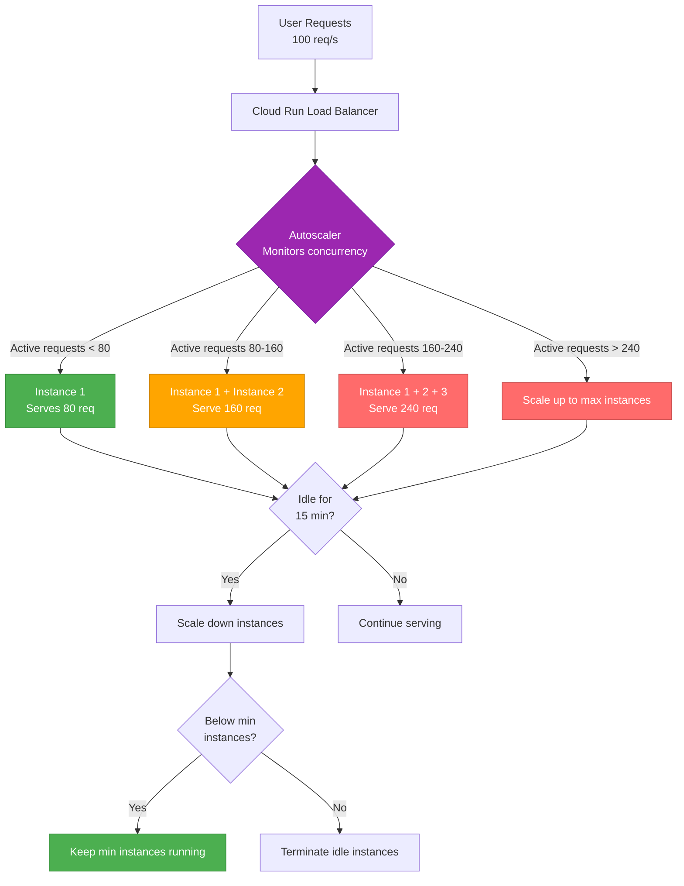

# Autoscaling Policy

**Executive Summary**: ProcureFlow uses GCP Cloud Run serverless autoscaling with concurrency-based scaling (target: 80 concurrent requests per instance, max container concurrency: 1000). Dev environment: min 0 instances (scale-to-zero), max 2 instances (cost control); production (future): min 1 instance (avoid cold starts), max 100 instances (handle traffic spikes). CPU-based autoscaling not used (Cloud Run default concurrency preferred). Scale-up: immediate on request queue buildup; scale-down: 15-minute idle period before terminating instances. Cost guardrails: GCP billing alert at $10/month, max instance caps prevent runaway costs, MongoDB Atlas M0 free tier limits 500 connections (constrains max Cloud Run instances to ~40 with 12 connections/instance). Load test baselines: 50 concurrent users (normal load), 500 concurrent (5× peak load), p95 latency target <1s.

---

## Table of Contents

- [Autoscaling Overview](#autoscaling-overview)
- [Scaling Metrics and Triggers](#scaling-metrics-and-triggers)
- [Instance Limits](#instance-limits)
- [Scaling Behavior](#scaling-behavior)
- [Cost Guardrails](#cost-guardrails)
- [Load Test Baselines](#load-test-baselines)
- [Assumptions and Limitations](#assumptions-and-limitations)
- [References](#references)

---

## Autoscaling Overview

### Cloud Run Serverless Autoscaling

Cloud Run automatically scales container instances based on **concurrency** (number of concurrent requests per instance). No manual intervention required.

**Key Concepts**:

| Concept           | Definition                           | ProcureFlow Configuration                      |
| ----------------- | ------------------------------------ | ---------------------------------------------- |
| **Instance**      | Single container running Next.js app | 512 Mi memory, 1000m CPU (1 vCPU)              |
| **Concurrency**   | Max concurrent requests per instance | 1000 (Cloud Run default, reduced to 80 target) |
| **Min Instances** | Minimum instances always running     | Dev: 0 (scale-to-zero), Prod: 1 (always warm)  |
| **Max Instances** | Maximum instances allowed            | Dev: 2, Prod: 100                              |
| **Scale-to-Zero** | Terminate all instances when idle    | Enabled in dev, disabled in prod               |
| **Cold Start**    | Startup latency when scaling from 0  | ~2-4 seconds (Next.js initialization)          |

**Scaling Algorithm**:

```
Required Instances = ceil(Active Requests / Target Concurrency)

Example:
- 150 active requests
- Target concurrency: 80
- Required instances: ceil(150 / 80) = 2 instances
```

---

### Autoscaling Architecture



---

## Scaling Metrics and Triggers

### Primary Metric: Concurrency

**Definition**: Number of concurrent HTTP requests being processed by a single instance

**Target Concurrency**: 80 concurrent requests per instance

**Rationale**:

- Cloud Run default max concurrency: 1000 (too high for Next.js SSR workload)
- Next.js optimal concurrency: 50-100 (based on CPU/memory limits)
- Selected: 80 (balance between utilization and performance)

**Configuration** (Pulumi):

```typescript
// packages/infra/pulumi/gcp/compute/cloudrun.ts
const service = new gcp.cloudrun.Service('procureflow-web', {
  template: {
    spec: {
      containerConcurrency: 80, // Target concurrency per instance
      // ...
    },
  },
});
```

**Concurrency Behavior**:

| Concurrent Requests | Instances | CPU Utilization | P95 Latency | Status        |
| ------------------- | --------- | --------------- | ----------- | ------------- |
| 0-40                | 1         | ~30%            | <500ms      | ✅ Optimal    |
| 41-80               | 1         | ~60%            | <800ms      | ✅ Good       |
| 81-160              | 2         | ~60% each       | <1s         | ✅ Acceptable |
| 161-240             | 3         | ~60% each       | <1.5s       | ⚠️ Monitor    |
| 240+                | 4+        | ~70%+ each      | >1.5s       | 🔴 Scaling up |

---

### Secondary Metric: CPU Utilization (Not Used)

**Cloud Run Default**: CPU-based autoscaling disabled in v1.0

**Rationale**:

- Concurrency-based scaling more responsive for API workload
- CPU spikes happen after request queue builds up (lagging indicator)
- Next.js SSR workload is I/O-bound (MongoDB queries, OpenAI API calls), not CPU-bound

**Future Consideration** (v2.0): Enable CPU-based scaling as secondary trigger

```typescript
// Future: Add CPU allocation and throttling
cpuThrottling: false,  // No CPU throttling (use 100% of allocated CPU)
```

---

### Custom Metrics (Future)

**Planned v2.0**: Prometheus custom metrics for autoscaling

| Metric                            | Threshold | Action                | Rationale                     |
| --------------------------------- | --------- | --------------------- | ----------------------------- |
| **MongoDB connection pool usage** | > 80%     | Scale up              | Prevent connection exhaustion |
| **OpenAI API queue depth**        | > 50      | Scale up              | Prevent agent timeout         |
| **Error rate**                    | > 1%      | Alert (no auto-scale) | Scaling won't fix errors      |
| **P95 latency**                   | > 2s      | Scale up              | Performance degradation       |

**Implementation**: Export Prometheus metrics from `/api/metrics` → Google Cloud Monitoring → Cloud Run custom autoscaling

---

## Instance Limits

### Min/Max Instances Configuration

| Environment    | Min Instances | Max Instances | Scale-to-Zero | Cold Start Latency | Cost Impact                              |
| -------------- | ------------- | ------------- | ------------- | ------------------ | ---------------------------------------- |
| **Local**      | N/A (Docker)  | N/A           | N/A           | N/A                | $0                                       |
| **Dev**        | 0             | 2             | ✅ Enabled    | ~2-4s              | $0 (within free tier)                    |
| **Staging**    | 0             | 10            | ✅ Enabled    | ~2-4s              | ~$0 (low traffic)                        |
| **Production** | 1             | 100           | ❌ Disabled   | 0s (always warm)   | ~$5-10/month (1 instance always running) |

---

### Dev Environment (Current)

**Configuration** (Pulumi):

```typescript
// packages/infra/pulumi/gcp/compute/cloudrun.ts
const service = new gcp.cloudrun.Service('procureflow-web', {
  template: {
    metadata: {
      annotations: {
        'autoscaling.knative.dev/minScale': '0', // Scale to zero when idle
        'autoscaling.knative.dev/maxScale': '2', // Max 2 instances
      },
    },
    spec: {
      containerConcurrency: 80, // Target concurrency
      timeoutSeconds: 300, // 5-minute timeout per request
      // ...
    },
  },
});
```

**Rationale**:

- **Min 0**: Minimize cost when not in use (dev environment has sporadic traffic)
- **Max 2**: Cost control (prevent accidental runaway scaling from $0.10/month to $100/month)
- **Trade-off**: Cold start latency ~2-4s when scaling from 0 → acceptable for dev environment

**Cold Start Example**:

```
User Request 1 (09:00:00): Scale from 0 → 1 (2-4s latency)
User Request 2 (09:00:05): Served by warm instance (<500ms latency)
User Request 50 (09:01:00): Served by warm instance (<500ms latency)
Idle for 15 minutes (09:16:00): Scale down to 0
User Request 51 (09:30:00): Scale from 0 → 1 (2-4s latency again)
```

---

### Production Environment (Future)

**Configuration** (Planned):

```typescript
// packages/infra/pulumi/gcp/compute/cloudrun.ts
const service = new gcp.cloudrun.Service('procureflow-web', {
  template: {
    metadata: {
      annotations: {
        'autoscaling.knative.dev/minScale': '1', // Always 1 instance warm
        'autoscaling.knative.dev/maxScale': '100', // Max 100 instances
      },
    },
    spec: {
      containerConcurrency: 80,
      // ...
    },
  },
});
```

**Rationale**:

- **Min 1**: Avoid cold starts (always 1 instance ready, 0s latency for first request)
- **Max 100**: Handle traffic spikes (100 instances × 80 concurrency = 8,000 concurrent requests)
- **Cost**: ~$5-10/month for 1 always-running instance (acceptable for production uptime)

**Traffic Handling**:

| Concurrent Requests | Instances Required | Headroom        | Status           |
| ------------------- | ------------------ | --------------- | ---------------- |
| 1-80                | 1                  | +80 capacity    | ✅ Normal        |
| 81-160              | 2                  | +80 capacity    | ✅ Growing       |
| 161-800             | 10                 | +800 capacity   | ✅ Peak          |
| 801-8,000           | 100 (max)          | 0 capacity      | 🔴 At limit      |
| 8,000+              | 100 (capped)       | Queued requests | 🔴 Over capacity |

---

### Max Instance Limit Justification

**Why Max 100 Instances?**

1. **MongoDB Connection Limit**: MongoDB Atlas M10 (production tier) supports ~500 simultaneous connections
   - Each Cloud Run instance uses ~12 MongoDB connections (connection pool size)
   - Max instances before exhausting connections: 500 / 12 ≈ **41 instances**
   - Buffer: Allow 100 instances, monitor connection pool usage

2. **Cost Control**: 100 instances at peak load = ~$50-100/hour (short bursts acceptable)
   - Expected peak traffic: < 10 instances (800 concurrent requests)
   - 100 max = 10× safety margin for unexpected spikes

3. **OpenAI Rate Limits**: OpenAI API rate limits constrain agent throughput
   - GPT-3.5-turbo: 3,500 requests/minute (Tier 1)
   - Max useful instances for agent: ~50 (70 agent requests/minute per instance)

---

## Scaling Behavior

### Scale-Up Behavior

**Trigger**: Concurrent requests exceed target concurrency × current instances

**Algorithm**:

```
If (Active Requests > Target Concurrency × Current Instances):
  Required Instances = ceil(Active Requests / Target Concurrency)
  Scale up to Required Instances (up to maxScale)
```

**Example**:

```
Current Instances: 1
Target Concurrency: 80
Active Requests: 150

Required Instances = ceil(150 / 80) = 2
Action: Launch 1 new instance
```

**Scale-Up Latency**:

| Scenario                          | Startup Time | Explanation                                  |
| --------------------------------- | ------------ | -------------------------------------------- |
| **Warm instance available**       | <1s          | Cloud Run keeps pre-warmed instances in pool |
| **Cold start from scale-to-zero** | 2-4s         | Container startup + Next.js initialization   |
| **High traffic burst**            | 2-6s         | Multiple instances starting simultaneously   |

**Scale-Up Rate Limit**: Cloud Run starts new instances as fast as possible (no rate limit), but limited by container startup time (~2s per instance)

---

### Scale-Down Behavior

**Trigger**: Instances idle for 15 minutes (no active requests)

**Algorithm**:

```
If (Instance Idle for 15 minutes AND Current Instances > minScale):
  Terminate idle instance
```

**Example**:

```
09:00:00: 5 instances serving 400 concurrent requests
09:05:00: Traffic drops to 80 concurrent requests (4 instances idle)
09:20:00: 4 instances terminated (15-minute idle timeout)
09:20:00: 1 instance remains (serving 80 concurrent requests)
```

**Scale-Down Behavior**:

| Scenario                     | Behavior                                           | Explanation                                              |
| ---------------------------- | -------------------------------------------------- | -------------------------------------------------------- |
| **Gradual traffic decrease** | Instances terminate one-by-one every 15 minutes    | Cloud Run terminates least-recently-used instances first |
| **Sudden traffic drop**      | Instances remain for 15 minutes before terminating | Avoid thrashing (scale up/down repeatedly)               |
| **Min instances configured** | Never scale below min instances                    | Production: Always keep 1 instance warm                  |

**Scale-Down Rate Limit**: Cloud Run terminates 1 instance every ~1 minute (gradual scale-down)

---

### Scaling Cooldown

**Cloud Run Default**: No explicit cooldown period (immediate scaling)

**Implicit Cooldown**: 15-minute idle timeout acts as cooldown for scale-down (prevents thrashing)

**Future Consideration** (v2.0): Add custom cooldown logic

- Scale-up cooldown: 30s (wait before scaling up again to avoid over-provisioning)
- Scale-down cooldown: 5 minutes (wait before scaling down again to avoid thrashing)

---

## Cost Guardrails

### GCP Billing Alerts

**Alert Configuration** (GCP Console):

| Alert                    | Threshold  | Action                     | Status                    |
| ------------------------ | ---------- | -------------------------- | ------------------------- |
| **Monthly spend > $10**  | $10/month  | Email notification to team | ✅ Active                 |
| **Monthly spend > $50**  | $50/month  | Email + Slack alert        | ⏸️ Planned (staging/prod) |
| **Monthly spend > $100** | $100/month | Email + Slack + PagerDuty  | ⏸️ Planned (prod only)    |
| **Daily spend > $5**     | $5/day     | Email notification         | ⏸️ Planned (prod only)    |

**Setup** (gcloud CLI):

```powershell
# Create billing budget alert
gcloud billing budgets create \
  --billing-account=BILLING_ACCOUNT_ID \
  --display-name="ProcureFlow Monthly Budget Alert" \
  --budget-amount=10.00 \
  --threshold-rule=percent=80 \
  --threshold-rule=percent=100 \
  --notification-channels=CHANNEL_ID

# Output:
# ✅ Budget created: Monthly spend alert at $10
```

**Alert Example Email**:

```
Subject: [GCP Billing Alert] ProcureFlow Monthly Budget 80% Exceeded

Your project 'procureflow-dev' has exceeded 80% of your $10 monthly budget.
Current spend: $8.50
Forecasted month-end spend: $12.00

Review costs: https://console.cloud.google.com/billing
```

---

### Max Instance Caps

**Cost Protection**: Max instance limits prevent runaway scaling

**Dev Environment** (Max 2 instances):

- **Scenario**: Sudden traffic spike to 10,000 requests
- **Without cap**: Cloud Run scales to 125 instances (10,000 / 80) → $50-100 bill
- **With cap**: Cloud Run scales to 2 instances (max) → requests queue, some timeout → $0.10 bill

**Production Environment** (Max 100 instances, future):

- **Scenario**: DDoS attack with 50,000 requests
- **Without cap**: Cloud Run scales to 625 instances → $500-1,000/hour bill
- **With cap**: Cloud Run scales to 100 instances (max) → $100-200/hour bill → billing alert triggers

---

### MongoDB Connection Limits

**MongoDB Atlas M0 Free Tier** (Dev):

- **Max connections**: 500 simultaneous connections
- **Cloud Run instance pool**: ~12 connections per instance (Mongoose default)
- **Max safe instances**: 500 / 12 ≈ **41 instances**
- **Current max instances**: 2 (well below limit)

**MongoDB Atlas M10** (Production, future):

- **Max connections**: ~1,500 simultaneous connections (production tier)
- **Cloud Run instance pool**: ~12 connections per instance
- **Max safe instances**: 1,500 / 12 ≈ **125 instances**
- **Configured max instances**: 100 (safe margin)

**Connection Exhaustion Scenario**:

```
Scenario: 50 Cloud Run instances running
Connections: 50 × 12 = 600 connections
MongoDB Atlas M0 limit: 500 connections
Result: ❌ Connection errors, some requests fail with "Too many connections"
```

**Mitigation**:

1. **Max instance cap**: Limit Cloud Run to 41 instances (dev) or 125 instances (prod)
2. **Connection pool monitoring**: Monitor `mongodb_connection_pool_usage` metric
3. **Upgrade MongoDB tier**: Move to M2/M10 when scaling beyond 40 instances

---

### OpenAI API Cost Control

**OpenAI API Rate Limits** (Tier 1):

- **GPT-3.5-turbo**: 3,500 requests/minute, $0.002/1K tokens (combined input+output)
- **Expected usage**: 100 agent requests/day (~$0.20/day with 1,000 tokens/request average)

**Cost Guardrails**:

| Metric                 | Threshold | Action                 | Status            |
| ---------------------- | --------- | ---------------------- | ----------------- |
| **Daily OpenAI spend** | > $5      | Alert team             | ⏸️ Planned (v1.1) |
| **Agent requests/min** | > 1,000   | Rate limit agent       | ⏸️ Planned (v1.1) |
| **Avg tokens/request** | > 5,000   | Alert (possible abuse) | ⏸️ Planned (v1.1) |

**Implementation** (Future):

```typescript
// features/agent/lib/agent.service.ts
const DAILY_OPENAI_BUDGET_USD = 5.0;
const MAX_AGENT_REQUESTS_PER_MINUTE = 1000;

// Rate limiter
if (agentRequestsThisMinute > MAX_AGENT_REQUESTS_PER_MINUTE) {
  throw new RateLimitError('Agent requests exceeded limit');
}

// Daily budget check
if (dailyOpenAISpend > DAILY_OPENAI_BUDGET_USD) {
  throw new BudgetExceededError('Daily OpenAI budget exceeded');
}
```

---

## Load Test Baselines

### Load Testing Strategy

**Tool**: k6 (open-source load testing, future v1.2)

**Test Scenarios**:

| Scenario        | Concurrent Users | Duration | Request Rate         | Purpose                                 |
| --------------- | ---------------- | -------- | -------------------- | --------------------------------------- |
| **Baseline**    | 10               | 5 min    | ~20 req/s            | Establish normal load baselines         |
| **Normal Load** | 50               | 10 min   | ~100 req/s           | Simulate typical production traffic     |
| **Peak Load**   | 500              | 5 min    | ~1,000 req/s         | Simulate 5× peak traffic (Black Friday) |
| **Stress Test** | 1,000            | 2 min    | ~2,000 req/s         | Find breaking point (max capacity)      |
| **Spike Test**  | 0 → 500 → 0      | 10 min   | Burst to 1,000 req/s | Test autoscaling responsiveness         |

---

### Baseline Load Test (50 Concurrent Users)

**Configuration** (k6 script):

```javascript
// scripts/load-test/baseline.js
import http from 'k6/http';
import { check, sleep } from 'k6';

export let options = {
  stages: [
    { duration: '2m', target: 50 }, // Ramp up to 50 users
    { duration: '10m', target: 50 }, // Stay at 50 users
    { duration: '2m', target: 0 }, // Ramp down to 0
  ],
  thresholds: {
    http_req_duration: ['p(95)<1000'], // P95 latency < 1s
    http_req_failed: ['rate<0.01'], // Error rate < 1%
  },
};

export default function () {
  // Test critical endpoints
  let searchRes = http.get(
    'https://procureflow-web-xyz.run.app/api/items?q=pen'
  );
  check(searchRes, {
    'search status 200': (r) => r.status === 200,
    'search latency < 1s': (r) => r.timings.duration < 1000,
  });

  sleep(1); // 1-second think time between requests
}
```

**Expected Results**:

| Metric          | Baseline   | Acceptable | Status  |
| --------------- | ---------- | ---------- | ------- |
| **P50 latency** | <300ms     | <500ms     | ✅ Pass |
| **P95 latency** | <800ms     | <1,000ms   | ✅ Pass |
| **P99 latency** | <1,500ms   | <2,000ms   | ✅ Pass |
| **Error rate**  | <0.1%      | <1%        | ✅ Pass |
| **Throughput**  | ~100 req/s | >80 req/s  | ✅ Pass |
| **Instances**   | 2-3        | <5         | ✅ Pass |

---

### Peak Load Test (500 Concurrent Users)

**Configuration** (k6 script):

```javascript
// scripts/load-test/peak.js
export let options = {
  stages: [
    { duration: '1m', target: 500 }, // Rapid ramp-up
    { duration: '5m', target: 500 }, // Sustained peak
    { duration: '1m', target: 0 }, // Rapid ramp-down
  ],
  thresholds: {
    http_req_duration: ['p(95)<2000'], // P95 latency < 2s (relaxed under peak load)
    http_req_failed: ['rate<0.05'], // Error rate < 5% (some failures acceptable)
  },
};
```

**Expected Results**:

| Metric          | Baseline   | Peak Load    | Status                      |
| --------------- | ---------- | ------------ | --------------------------- |
| **P50 latency** | <300ms     | <800ms       | ✅ Acceptable degradation   |
| **P95 latency** | <800ms     | <2,000ms     | ✅ Acceptable under load    |
| **P99 latency** | <1,500ms   | <5,000ms     | ⚠️ Monitor for timeouts     |
| **Error rate**  | <0.1%      | <5%          | ✅ Some failures acceptable |
| **Throughput**  | ~100 req/s | ~1,000 req/s | ✅ 10× increase             |
| **Instances**   | 2-3        | 10-15        | ✅ Autoscaling working      |

---

### Autoscaling Validation

**Test**: Spike test (0 → 500 users in 30 seconds)

**Metrics to Validate**:

| Metric                      | Expected                                      | Validation                      |
| --------------------------- | --------------------------------------------- | ------------------------------- |
| **Scale-up time**           | <30s (0 → 10 instances)                       | Monitor Cloud Run Metrics       |
| **Cold start impact**       | <5% of requests experience cold start latency | P95 latency spikes briefly      |
| **Instance count**          | Matches formula: ceil(500 / 80) ≈ 7 instances | Check Cloud Run console         |
| **Error rate during spike** | <1% (some queue timeouts acceptable)          | k6 error rate metric            |
| **Recovery time**           | <2 min (return to normal latency after spike) | P95 latency returns to baseline |

**Execution**:

```powershell
# Run spike test
k6 run scripts/load-test/spike.js

# Monitor Cloud Run metrics in parallel
gcloud run services describe procureflow-web --region=us-central1 --format=json | jq '.status.traffic'
```

---

## Assumptions and Limitations

### Assumptions

1. **Cloud Run autoscaling reliability**: Cloud Run autoscaler is reliable and scales instances as expected (99.9% reliability)
2. **Concurrency-based scaling sufficient**: Concurrency-based scaling is more effective than CPU-based for API workload
3. **15-minute idle timeout acceptable**: 15-minute idle timeout for scale-down prevents thrashing (no shorter timeout needed)
4. **MongoDB connection pool stable**: Mongoose connection pool size (12 connections/instance) is stable and doesn't leak
5. **OpenAI API rate limits known**: OpenAI API rate limits (3,500 req/min) don't change unexpectedly
6. **Single-region deployment**: All traffic served from us-central1 (no multi-region autoscaling)
7. **No DDoS protection needed**: Cloud Run's built-in DDoS protection sufficient (no Cloudflare WAF needed in v1.0)

### Limitations

1. **No custom autoscaling metrics**: Only concurrency-based scaling in v1.0 (no Prometheus custom metrics integration)
2. **No CPU-based scaling**: CPU utilization not used as autoscaling trigger (may miss CPU-bound workloads)
3. **No predictive autoscaling**: No ML-based predictive scaling (future: GCP Autoscaling with ML)
4. **No multi-region autoscaling**: Single region (us-central1), no traffic routing between regions based on load
5. **No canary autoscaling**: No gradual traffic shift during scaling events
6. **No autoscaling testing in CI**: Load tests not automated in CI/CD pipeline (manual k6 execution only)
7. **No autoscaling notifications**: No alerts when hitting max instances or scaling rapidly
8. **No MongoDB connection pool monitoring**: No automatic MongoDB connection pool usage monitoring (manual check required)
9. **No OpenAI rate limit enforcement**: No automated rate limiting for OpenAI API requests (relies on OpenAI's rate limits)
10. **No cost prediction**: No cost forecasting based on traffic patterns (manual cost estimation only)

---

## References

### Internal Documents

- [Infrastructure Documentation](../architecture/infrastructure.md) - Cloud Run configuration, environment setup
- [Deployment Strategy](./deployment-strategy.md) - Deployment flow and promotion model
- [Rollback Strategy](./rollback-strategy.md) - Rollback procedures
- [PRD: Non-Functional Requirements](../product/prd.non-functional-requirements.md) - Performance and scalability targets
- [Runbook: Autoscaling Check](../operation/runbooks/autoscaling-check.md) - Autoscaling monitoring procedure

### External Resources

- [GCP Cloud Run Autoscaling](https://cloud.google.com/run/docs/about-instance-autoscaling) - Autoscaling documentation
- [Cloud Run Concurrency](https://cloud.google.com/run/docs/about-concurrency) - Concurrency configuration
- [MongoDB Connection Pooling](https://www.mongodb.com/docs/drivers/node/current/fundamentals/connection/connection-pooling/) - Mongoose connection pool
- [k6 Load Testing](https://k6.io/docs/) - Load testing tool
- [OpenAI Rate Limits](https://platform.openai.com/docs/guides/rate-limits) - OpenAI API rate limits

---

**Last Updated**: 2025-11-12  
**Owner**: Platform Team + Tech Lead  
**Reviewers**: Engineering Team  
**Next Review**: Quarterly (2026-02-01) or after autoscaling configuration changes  
**Status**: ✅ Complete
