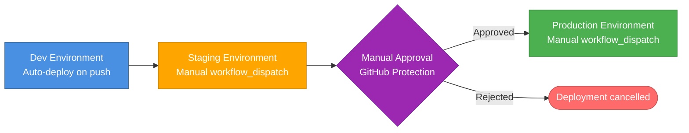

# Deployment Strategy

**Executive Summary**: ProcureFlow deploys to GCP Cloud Run via GitHub Actions CI/CD triggered on push to `main` branch with path filters (`packages/web/**`, `packages/infra/**`). Deployment uses Pulumi IaC (TypeScript) to provision containerized services with Docker images built from `Dockerfile.web` and stored in Artifact Registry. Only dev environment configured in v1.0; staging/production require manual `workflow_dispatch` trigger (future). Required checks: Pulumi preview clean, Docker build success, health check 200, no critical vulnerabilities. Smoke tests verify `/api/health` returns 200 and root endpoint returns 200 or 302. Deployment takes ~5-8 minutes end-to-end.

---

## Table of Contents

- [Deployment Targets](#deployment-targets)
- [Environments](#environments)
- [Deployment Flow](#deployment-flow)
- [Promotion Model](#promotion-model)
- [Required Pre-Deployment Checks](#required-pre-deployment-checks)
- [Smoke Tests](#smoke-tests)
- [Assumptions and Limitations](#assumptions-and-limitations)
- [References](#references)

---

## Deployment Targets

### Platform Overview

| Platform | Status | Use Case | Cost | Rationale |
|----------|--------|----------|------|-----------|
| **GCP Cloud Run** | ✅ Active (dev only) | Serverless container platform | Free tier (~2M requests/month) + $0.10/month storage | Serverless auto-scaling, zero ops, pay-per-use, HTTPS out-of-box |
| **Vercel** | ⏸️ Not Used | Next.js hosting platform | Free tier (100 GB bandwidth/month) | ❌ Rejected: No MongoDB in Vercel Edge, limited API route control, vendor lock-in |
| **Docker Compose** | ✅ Active (local only) | Local development | $0 | Docker Desktop for dev/test, not for production |

**Decision**: Cloud Run selected for production deployment (see [Decision Log](../architecture/stack-and-patterns.md#decision-log) ADR-006).

---

## Environments

### Environment Configuration

| Environment | Status | Deploy Target | URL | Auto-Deploy | Approval Required | Database | Cost/Month |
|-------------|--------|---------------|-----|-------------|-------------------|----------|------------|
| **Local** | ✅ Active | Docker Compose (developer workstation) | http://localhost:3000 | ❌ Manual (`pnpm docker:up`) | No | MongoDB 8.10.6 (local container) | $0 |
| **Dev** | ✅ Active | GCP Cloud Run (us-central1) | https://procureflow-web-*.run.app | ✅ On push to `main` | No | MongoDB Atlas M0 (free tier) | ~$2.10 |
| **Staging** | ⏸️ Not Configured | GCP Cloud Run (us-central1) | TBD | ❌ Manual `workflow_dispatch` | No | MongoDB Atlas M2 | ~$15 (estimated) |
| **Production** | ⏸️ Not Configured | GCP Cloud Run (us-central1) | TBD | ❌ Manual `workflow_dispatch` | ✅ Yes (GitHub environment protection) | MongoDB Atlas M10 | ~$50 (estimated) |

**Note**: Only **dev environment** is fully configured in v1.0. Staging and production require:
1. Create Pulumi stacks (`staging`, `production`)
2. Configure GitHub environments with protection rules
3. Provision MongoDB Atlas clusters (M2, M10)
4. Update GitHub secrets with environment-specific values

---

### Environment Variables

**Required Secrets** (GitHub Secrets → GCP Secret Manager):

| Secret | Dev | Staging | Production | Rotation Policy | Storage |
|--------|-----|---------|------------|-----------------|---------|
| `NEXTAUTH_SECRET` | ✅ Set | ⏸️ Required | ⏸️ Required | Annually or on compromise | GCP Secret Manager |
| `OPENAI_API_KEY` | ✅ Set (or `not-set`) | ⏸️ Required | ⏸️ Required | On API key compromise | GCP Secret Manager |
| `MONGODB_CONNECTION_STRING` | ✅ Set (Atlas M0) | ⏸️ Required (Atlas M2) | ⏸️ Required (Atlas M10) | On password compromise | GCP Secret Manager |
| `GCP_SA_KEY` | ✅ Set | ⏸️ Same SA | ⏸️ Dedicated SA | 90 days (GCP best practice) | GitHub Secrets |
| `PULUMI_ACCESS_TOKEN` | ✅ Set | ⏸️ Same token | ⏸️ Same token | On compromise | GitHub Secrets |

**Configuration Secrets** (Pulumi Config):

```typescript
// packages/infra/pulumi/gcp/index.ts
const config = new pulumi.Config();
const environment = config.require("environment");  // dev | staging | production
const imageTag = config.require("image-tag");      // sha-abc123f
const nextauthSecret = config.requireSecret("nextauth-secret");
const openaiApiKey = config.requireSecret("openai-api-key");
const mongoConnectionString = config.requireSecret("mongodb-connection-string");
```

**Public Environment Variables** (deployed to Cloud Run):

```bash
NODE_ENV=production  # production for all deployed environments
NEXT_TELEMETRY_DISABLED=1
NEXTAUTH_URL=https://procureflow-web-*.run.app  # Auto-updated after deployment
```

---

## Deployment Flow

### GitHub Actions Workflow

**Trigger**: Push to `main` branch OR manual `workflow_dispatch`

**Path Filters**:
```yaml
paths:
  - 'packages/web/**'        # Next.js application code changes
  - 'packages/infra/**'      # Infrastructure/Dockerfile changes
  - '.github/workflows/deploy-gcp.yml'  # Workflow changes
```

**Workflow File**: `.github/workflows/deploy-gcp.yml`

---

### Deployment Pipeline (3 Jobs)

```mermaid
graph TD
    Start([Push to main]) --> PathCheck{Path filters<br/>match?}
    PathCheck -->|No match| Skip([Skip deployment])
    PathCheck -->|Match| Job1[Job 1: Build]
    
    Job1 --> Auth1[Authenticate to GCP]
    Auth1 --> GenTag[Generate image tag<br/>sha-abc123f]
    GenTag --> BuildDocker[Build Docker image<br/>Dockerfile.web]
    BuildDocker --> PushAR[Push to Artifact Registry<br/>tag: sha-abc123f, latest]
    PushAR --> Job2[Job 2: Deploy]
    
    Job2 --> Auth2[Authenticate to GCP]
    Auth2 --> InstallPulumi[Install Pulumi CLI]
    InstallPulumi --> SelectStack[Select Pulumi stack<br/>dev/staging/production]
    SelectStack --> ConfigStack[Configure stack<br/>secrets, image tag]
    ConfigStack --> PulumiPreview[Pulumi preview]
    PulumiPreview --> PreviewCheck{Preview<br/>clean?}
    PreviewCheck -->|Errors| FailDeploy([Fail deployment])
    PreviewCheck -->|Clean| PulumiUp[Pulumi up --yes]
    PulumiUp --> UpdateURL[Update NEXTAUTH_URL<br/>in Cloud Run]
    UpdateURL --> ExportURL[Export service URL]
    ExportURL --> Job3[Job 3: Health Check]
    
    Job3 --> Wait[Wait 30 seconds<br/>service startup]
    Wait --> HealthAPI[GET /api/health]
    HealthAPI --> HealthCheck{HTTP 200?}
    HealthCheck -->|No| FailHealth([Fail health check])
    HealthCheck -->|Yes| RootAPI[GET /]
    RootAPI --> RootCheck{HTTP 200<br/>or 302?}
    RootCheck -->|No| WarnRoot([⚠️ Warning: root endpoint issue])
    RootCheck -->|Yes| Success([✅ Deployment successful])
    
    FailDeploy --> Notify[Notify team<br/>GitHub issue comment]
    FailHealth --> Notify
    WarnRoot --> Success

    style Job1 fill:#4A90E2,stroke:#2E5C8A,color:#fff
    style Job2 fill:#4A90E2,stroke:#2E5C8A,color:#fff
    style Job3 fill:#4A90E2,stroke:#2E5C8A,color:#fff
    style Success fill:#4CAF50,stroke:#388E3C,color:#fff
    style FailDeploy fill:#FF6B6B,stroke:#CC5555,color:#fff
    style FailHealth fill:#FF6B6B,stroke:#CC5555,color:#fff
    style WarnRoot fill:#FFA500,stroke:#CC8400,color:#fff
```



---

### Job 1: Build Docker Image

**Purpose**: Build containerized Next.js application and push to Artifact Registry

**Steps**:

1. **Checkout code** (`actions/checkout@v4`)
2. **Authenticate to GCP** (`google-github-actions/auth@v2`)
   - Uses service account key from `GCP_SA_KEY` GitHub secret
3. **Configure Docker for Artifact Registry**
   ```bash
   gcloud auth configure-docker us-central1-docker.pkg.dev
   ```
4. **Generate image tag**
   ```bash
   TAG="sha-$(git rev-parse --short HEAD)"  # e.g., sha-abc123f
   ```
5. **Build Docker image**
   ```bash
   docker build \
     -f packages/infra/docker/Dockerfile.web \
     --build-arg GIT_COMMIT_SHA=$(git rev-parse HEAD) \
     --build-arg BUILD_DATE=$(date -u +"%Y-%m-%dT%H:%M:%SZ") \
     --build-arg VERSION=$TAG \
     -t us-central1-docker.pkg.dev/PROJECT_ID/procureflow/web:$TAG \
     -t us-central1-docker.pkg.dev/PROJECT_ID/procureflow/web:latest \
     .
   ```
6. **Push Docker image** to Artifact Registry (2 tags: `sha-abc123f` and `latest`)

**Output**: `image-tag` (e.g., `sha-abc123f`) passed to Job 2

**Duration**: ~3-4 minutes (Docker build + push)

---

### Job 2: Deploy with Pulumi

**Purpose**: Provision/update GCP infrastructure using Pulumi IaC

**Steps**:

1. **Setup Node.js and pnpm**
2. **Install Pulumi dependencies** (`packages/infra/pulumi/gcp`)
3. **Authenticate to GCP** (same service account as Job 1)
4. **Install Pulumi CLI** (`pulumi/actions@v5`)
5. **Select Pulumi stack**
   ```bash
   pulumi stack select dev  # or staging, production
   ```
6. **Configure Pulumi stack**
   ```bash
   pulumi config set gcp:project $GCP_PROJECT_ID
   pulumi config set gcp:region us-central1
   pulumi config set environment dev
   pulumi config set image-tag $IMAGE_TAG  # from Job 1 output
   pulumi config set --secret nextauth-secret "$NEXTAUTH_SECRET"
   pulumi config set --secret openai-api-key "$OPENAI_API_KEY"
   pulumi config set --secret mongodb-connection-string "$MONGODB_CONNECTION_STRING"
   ```
7. **Pulumi Preview** (dry-run to detect issues)
   ```bash
   pulumi preview
   ```
8. **Pulumi Up** (apply infrastructure changes)
   ```bash
   pulumi up --yes  # auto-approve
   ```
9. **Export service URL**
   ```bash
   SERVICE_URL=$(pulumi stack output serviceUrl)
   ```
10. **Update NEXTAUTH_URL** in Cloud Run environment variables
    ```bash
    gcloud run services update procureflow-web \
      --region=us-central1 \
      --update-env-vars="NEXTAUTH_URL=$SERVICE_URL"
    ```

**Pulumi Resources Provisioned**:
- Cloud Run service (`procureflow-web`)
- Artifact Registry repository (`procureflow`)
- Secret Manager secrets (6 secrets)
- IAM bindings (Cloud Run service account → Secret Manager access)

**Output**: `serviceUrl` (e.g., `https://procureflow-web-xyz.run.app`) passed to Job 3

**Duration**: ~2-3 minutes (Pulumi up + Cloud Run deployment)

---

### Job 3: Health Check

**Purpose**: Verify deployed service is healthy and accessible

**Steps**:

1. **Wait 30 seconds** for Cloud Run service to finish startup
2. **Check health endpoint**
   ```bash
   curl -s -o /dev/null -w "%{http_code}" "$SERVICE_URL/api/health"
   # Expected: 200
   ```
3. **Check root endpoint**
   ```bash
   curl -s -o /dev/null -w "%{http_code}" "$SERVICE_URL"
   # Expected: 200 (authenticated) or 302 (redirect to login)
   ```

**Success Criteria**:
- ✅ Health endpoint returns HTTP 200
- ✅ Root endpoint returns HTTP 200 or 302
- ❌ Health endpoint returns non-200 → **Fail deployment**
- ⚠️ Root endpoint returns non-200/302 → **Warning** (may be expected behavior)

**Output**: Deployment status (success/failure)

**Duration**: ~30 seconds (wait time + 2 HTTP requests)

---

### Total Deployment Time

| Job | Duration | Parallelization |
|-----|----------|-----------------|
| Job 1: Build | ~3-4 min | Serial |
| Job 2: Deploy | ~2-3 min | Serial (depends on Job 1) |
| Job 3: Health Check | ~30 sec | Serial (depends on Job 2) |
| **Total** | **~5-8 min** | **Serial pipeline** |

**Optimization Opportunities** (Future):
- ❌ Parallel: Jobs 1 and 2 cannot run in parallel (Job 2 needs image tag from Job 1)
- ✅ Caching: Docker layer caching with `docker buildx` (reduces build time to ~1-2 min)
- ✅ Warm starts: Cloud Run min instances > 0 (reduces health check startup time)

---

## Promotion Model

### Environment Promotion Strategy



---

### Dev → Staging Promotion

**Trigger**: Manual `workflow_dispatch` in GitHub Actions

**Prerequisites**:
- ✅ Staging environment configured (Pulumi stack, MongoDB Atlas M2)
- ✅ GitHub environment `staging` created
- ✅ Staging secrets configured in GitHub

**Process**:
1. Navigate to: `https://github.com/USER/REPO/actions/workflows/deploy-gcp.yml`
2. Click "Run workflow"
3. Select environment: `staging`
4. Click "Run workflow" button
5. Monitor deployment progress (5-8 minutes)
6. Verify staging URL: `https://procureflow-web-staging-*.run.app`

**Validation** (Manual):
- ✅ Login with test user
- ✅ Search catalog and verify results
- ✅ Add items to cart
- ✅ Complete checkout flow
- ✅ Verify agent chat functionality
- ✅ Check health endpoint: `GET /api/health`

**Rollback**: Use [Rollback Strategy](./rollback-strategy.md) if issues detected

---

### Staging → Production Promotion

**Trigger**: Manual `workflow_dispatch` with approval

**Prerequisites**:
- ✅ Production environment configured (Pulumi stack, MongoDB Atlas M10)
- ✅ GitHub environment `production` created with protection rules:
  - Required reviewers: Tech Lead or Senior Engineer
  - Wait timer: 5 minutes (gives reviewers time to inspect)
- ✅ Production secrets configured in GitHub
- ✅ Staging validation passed (see above)

**Process**:
1. Navigate to: `https://github.com/USER/REPO/actions/workflows/deploy-gcp.yml`
2. Click "Run workflow"
3. Select environment: `production`
4. Click "Run workflow" button
5. **Approval step**: GitHub pauses workflow, notifies reviewers
6. Reviewer inspects:
   - Recent changes in `git log`
   - Staging environment validation results
   - No critical issues in monitoring/logs
7. Reviewer approves or rejects deployment
8. If approved: Deployment proceeds (5-8 minutes)
9. If rejected: Workflow cancelled

**Validation** (Automated):
- ✅ Health check passes (Job 3)
- ✅ Root endpoint accessible
- ⏸️ Error rate < baseline (future: Prometheus metrics check)
- ⏸️ P95 latency < baseline (future: performance check)

**Validation** (Manual):
- ✅ Login with production user
- ✅ Smoke test critical flows (search → add to cart → checkout)
- ✅ Monitor error logs for 1 hour post-deployment
- ✅ Verify OpenAI API usage doesn't spike unexpectedly

**Rollback**: Use [Rollback Strategy](./rollback-strategy.md) if issues detected within 24 hours

---

### Rollback During Promotion

**Scenario**: Deployment to staging or production fails health check

**Automatic Rollback**: ❌ Not implemented in v1.0

**Manual Rollback**:
1. Cloud Run automatically serves previous revision if new revision crashes
2. If health check fails: No traffic routed to new revision (zero downtime)
3. If manual rollback needed: See [Rollback Strategy](./rollback-strategy.md)

---

## Required Pre-Deployment Checks

### Automated Checks (CI/CD)

| Check | Enforcement | Failure Action | Status |
|-------|-------------|----------------|--------|
| **Pulumi Preview Clean** | ✅ Enforced (Job 2) | Block deployment | ✅ Active |
| **Docker Build Success** | ✅ Enforced (Job 1) | Block deployment | ✅ Active |
| **Health Check HTTP 200** | ✅ Enforced (Job 3) | Fail deployment | ✅ Active |
| **Root Endpoint Accessible** | ⚠️ Warning only | Log warning | ✅ Active |
| **No Critical Vulnerabilities** | ⏸️ Planned (Snyk/Trivy) | Block deployment | ⏸️ Future |
| **Unit Tests Pass** | ⏸️ Planned (Vitest) | Block deployment | ⏸️ Future |
| **Coverage ≥ 60%** | ⏸️ Planned (Codecov) | Block deployment | ⏸️ Future |
| **Linter Clean** | ⏸️ Planned (ESLint) | Block deployment | ⏸️ Future |

---

### Manual Checks (Pre-Production Only)

**For Production Deployments** (manual approval gate):

1. **Code Review**: All PRs merged to `main` reviewed by tech lead
2. **Staging Validation**: All critical user flows tested in staging
3. **Change Log Review**: Reviewer reads `git log --since="last-deployment-date"`
4. **Dependency Audit**: Check `pnpm audit` for high/critical vulnerabilities
5. **Database Migration Verification** (if applicable):
   - Migration scripts tested in staging
   - Rollback scripts prepared
   - Backup verified recent (< 24 hours old)
6. **Secrets Rotation Check**: No secrets expired or compromised
7. **Cost Alert Check**: GCP billing alerts configured, no unexpected spikes

**Checklist** (saved in GitHub issue template for production deployments):

```markdown
## Pre-Production Deployment Checklist

- [ ] All PRs have code review approval
- [ ] Staging validation passed (all critical flows tested)
- [ ] Change log reviewed (no breaking changes detected)
- [ ] Dependency audit clean (`pnpm audit`)
- [ ] Database migrations tested in staging (if applicable)
- [ ] Backup verified recent (< 24 hours old)
- [ ] Secrets rotation check (no expired secrets)
- [ ] Cost alerts configured (GCP billing alerts active)
- [ ] Incident response team notified (post-deployment monitoring)
```

---

## Smoke Tests

### Automated Smoke Tests (Post-Deployment)

**Executed by**: Job 3 (Health Check) in GitHub Actions workflow

**Tests**:

| Test | Endpoint | Expected Response | Timeout | Status |
|------|----------|-------------------|---------|--------|
| **Health Check** | `GET /api/health` | `{ "status": "ok", "timestamp": "..." }` HTTP 200 | 10s | ✅ Active |
| **Root Endpoint** | `GET /` | HTTP 200 (authenticated) or 302 (redirect to login) | 10s | ✅ Active |

**Implementation** (`.github/workflows/deploy-gcp.yml`):

```bash
# Job 3: Health Check
- name: Check service health
  run: |
    SERVICE_URL="${{ needs.deploy.outputs.serviceUrl }}"
    HTTP_CODE=$(curl -s -o /dev/null -w "%{http_code}" "$SERVICE_URL/api/health")
    
    if [ $HTTP_CODE -eq 200 ]; then
      echo "✅ Health check passed (HTTP $HTTP_CODE)"
    else
      echo "❌ Health check failed (HTTP $HTTP_CODE)"
      exit 1
    fi

- name: Test root endpoint
  run: |
    SERVICE_URL="${{ needs.deploy.outputs.serviceUrl }}"
    HTTP_CODE=$(curl -s -o /dev/null -w "%{http_code}" "$SERVICE_URL")
    
    if [ $HTTP_CODE -eq 200 ] || [ $HTTP_CODE -eq 302 ]; then
      echo "✅ Root endpoint accessible (HTTP $HTTP_CODE)"
    else
      echo "⚠️ Root endpoint returned HTTP $HTTP_CODE (may be expected)"
    fi
```

---

### Manual Smoke Tests (Post-Production Deployment)

**Executed by**: Tech lead or on-call engineer within 10 minutes of production deployment

**Tests**:

| Test | Description | Expected Outcome | Priority |
|------|-------------|------------------|----------|
| **Login Flow** | Navigate to production URL, login with test account | Redirect to `/catalog`, no errors | 🔴 Critical |
| **Catalog Search** | Search for "pen" in catalog | 5+ results displayed, p95 latency < 1s | 🔴 Critical |
| **Add to Cart** | Add 1 item to cart with quantity 5 | Cart displays item, total cost correct | 🔴 Critical |
| **Checkout** | Complete checkout flow from cart | PR number displayed, cart cleared, purchase saved | 🔴 Critical |
| **Agent Chat** | Send message "search for notebooks" | Agent responds with search results, no errors | 🟡 High |
| **API Direct** | `GET /api/items?q=pen` with auth token | JSON response with items array | 🟢 Low |

**Execution Time**: ~5 minutes for all tests

**Failure Action**:
- 🔴 Critical test fails → **Immediate rollback** (see [Rollback Strategy](./rollback-strategy.md))
- 🟡 High test fails → Investigate within 30 minutes, rollback if no fix available
- 🟢 Low test fails → Create bug ticket, monitor for 1 hour

---

### Future Smoke Tests (Planned)

**Automated E2E Tests** (Playwright, v1.2):

```typescript
// packages/web/src/test/e2e/smoke.e2e.test.ts
test('critical user flow: search → add to cart → checkout', async ({ page }) => {
  await page.goto(process.env.SERVICE_URL);
  await page.fill('input[name="email"]', 'test@procureflow.com');
  await page.fill('input[name="password"]', 'test123');
  await page.click('button[type="submit"]');
  
  await page.fill('input[placeholder="Search catalog..."]', 'pen');
  await page.press('input[placeholder="Search catalog..."]', 'Enter');
  await expect(page.locator('text=Red Ballpoint Pen')).toBeVisible();
  
  await page.click('button:has-text("Add to Cart")').first();
  await page.fill('input[name="quantity"]', '5');
  await page.click('button:has-text("Confirm")');
  
  await page.click('a[href="/cart"]');
  await page.click('button:has-text("Checkout")');
  await expect(page.locator('text=Purchase request submitted')).toBeVisible();
});
```

**Deployment Integration** (GitHub Actions):

```yaml
# .github/workflows/deploy-gcp.yml
- name: Run E2E smoke tests
  run: |
    export SERVICE_URL="${{ needs.deploy.outputs.serviceUrl }}"
    pnpm --filter web test:e2e
```

---

## Assumptions and Limitations

### Assumptions

1. **GitHub Actions availability**: GitHub Actions service is available and reliable (99.9% uptime SLA)
2. **GCP Cloud Run stability**: Cloud Run is stable and auto-scaling works as expected
3. **Single region deployment**: All environments deployed to `us-central1` (single region, no multi-region failover)
4. **Pulumi state persistence**: Pulumi state stored in Pulumi Cloud (not lost, not corrupted)
5. **Secret Manager reliability**: GCP Secret Manager is available and secrets are accessible
6. **MongoDB Atlas uptime**: MongoDB Atlas M0/M2/M10 clusters meet 99.5% uptime SLA
7. **Docker build determinism**: Docker builds are deterministic (same source → same image)
8. **No database migrations in v1.0**: No schema changes require data migration (future: migration scripts)

### Limitations

1. **No staging/production environments**: Only dev environment configured in v1.0; staging/production require manual setup
2. **No blue-green deployment**: Cloud Run deploys new revision and gradually shifts traffic (not instant blue-green swap)
3. **No canary deployment**: No gradual traffic shift to new revision (future: Cloud Run traffic splitting)
4. **No automated rollback**: If deployment fails health check, manual rollback required (Cloud Run auto-serves previous revision if crash)
5. **No pre-deployment tests**: No unit tests, integration tests, or linter in CI pipeline (planned v1.1)
6. **No vulnerability scanning**: No Docker image scanning for CVEs (future: Snyk, Trivy)
7. **No performance testing**: No load testing, stress testing before production deployment (future: k6, Locust)
8. **No database migration automation**: No automated database schema migrations (future: Prisma Migrate, migrate-mongo)
9. **No feature flags**: No feature toggle system for gradual rollout (future: LaunchDarkly, env vars)
10. **No deployment notifications**: No Slack/email notifications on deployment success/failure (future: GitHub Actions → Slack webhook)
11. **No deployment metrics**: No deployment frequency, lead time, MTTR tracking (future: DORA metrics in Grafana)

---

## References

### Internal Documents

- [Infrastructure Documentation](../architecture/infrastructure.md) - Environment details, secrets management, observability
- [Rollback Strategy](./rollback-strategy.md) - Rollback procedures and decision tree
- [Autoscaling Policy](./autoscaling-policy.md) - Cloud Run autoscaling configuration
- [C4 Container Diagram](../architecture/c4.container.md) - Container-level architecture
- [Stack and Patterns](../architecture/stack-and-patterns.md) - Technology decisions (ADR-006: Cloud Run selection)

### External Resources

- [GCP Cloud Run Documentation](https://cloud.google.com/run/docs) - Platform reference
- [Pulumi GCP Provider](https://www.pulumi.com/registry/packages/gcp/) - IaC API reference
- [GitHub Actions Workflow Syntax](https://docs.github.com/en/actions/using-workflows/workflow-syntax-for-github-actions) - CI/CD syntax
- [Docker Multi-Stage Builds](https://docs.docker.com/build/building/multi-stage/) - Dockerfile optimization
- [MongoDB Atlas Deployment](https://www.mongodb.com/docs/atlas/) - Database platform

### Runbooks

- [Build and Deploy Runbook](../operation/runbooks/build-and-deploy.md) - Step-by-step deployment procedure
- [Rollback Runbook](../operation/runbooks/rollback.md) - Step-by-step rollback procedure

---

**Last Updated**: 2025-11-12  
**Owner**: Platform Team + Tech Lead  
**Reviewers**: Engineering Team  
**Next Review**: Quarterly (2026-02-01) or when environments change  
**Status**: ✅ Complete
