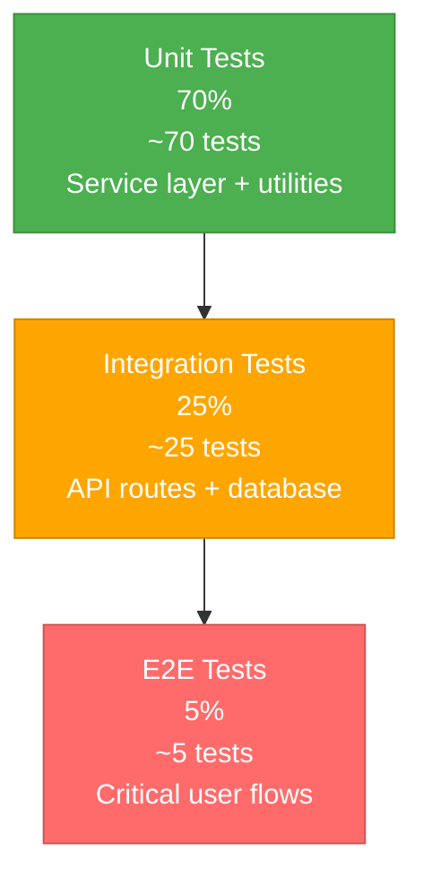

# Testing Strategy

**Executive Summary**: ProcureFlow uses Vitest 4.0.8 for unit and integration testing with 60% coverage thresholds (lines/functions/branches/statements), Testing Library for component testing, jsdom for DOM simulation, and mongodb-memory-server for isolated database tests. Testing pyramid: 70% unit tests (service layer, utilities), 25% integration tests (API routes + database), 5% e2e tests (critical user flows, future Playwright). Current state has 1 test file (errorHandler.test.ts); expansion plan targets 50+ test files covering all 28 functional requirements by Q2 2025. CI gates include test execution before deployment, coverage upload to Codecov (future), and no failing tests policy.

---

## Table of Contents

- [Testing Philosophy](#testing-philosophy)
- [Testing Layers](#testing-layers)
- [Testing Tools and Frameworks](#testing-tools-and-frameworks)
- [Test Coverage Goals](#test-coverage-goals)
- [Test Organization](#test-organization)
- [CI/CD Integration](#cicd-integration)
- [Test Data and Fixtures](#test-data-and-fixtures)
- [Flakiness Mitigation](#flakiness-mitigation)
- [Assumptions and Limitations](#assumptions-and-limitations)
- [References](#references)

---

## Testing Philosophy

### Principles

1. **Test behavior, not implementation**: Focus on user-visible behavior and API contracts, not internal implementation details
2. **Fast feedback loops**: Unit tests run in < 1s, integration tests in < 10s, e2e tests in < 2min
3. **Isolation**: Tests don't depend on external services (MongoDB in-memory, OpenAI mocked)
4. **Deterministic**: Tests produce same results every run (no flakiness, no random data)
5. **Readable**: Tests are self-documenting with clear arrange-act-assert structure

### Testing Pyramid



**Rationale**:

- **70% unit tests**: Fast, isolated, test business logic in service layer
- **25% integration tests**: Test API routes + database interactions, verify end-to-end flows
- **5% e2e tests**: Test critical user journeys (login → search → add to cart → checkout), slower but high confidence

---

## Testing Layers

### Layer 1: Unit Tests (70%)

**Scope**: Service layer functions, utility functions, domain entity validators

**Test Subjects**:

- `features/catalog/lib/catalog.service.ts`
- `features/cart/lib/cart.service.ts`
- `features/checkout/lib/checkout.service.ts`
- `features/agent/lib/agent.service.ts`
- `features/auth/lib/auth.service.ts`
- `lib/utils/*.ts` (retry logic, logger, validators)

**Characteristics**:

- ✅ No database (mock Mongoose models)
- ✅ No HTTP server (direct function calls)
- ✅ No external APIs (mock OpenAI)
- ✅ Fast (< 1s per test file)
- ✅ Deterministic (no random data, no timestamps)

**Example Test** (`catalog.service.test.ts`):

```typescript
import { describe, it, expect, vi, beforeEach } from 'vitest';
import { searchItems } from '@/features/catalog';
import { ItemModel } from '@/lib/db/models';

vi.mock('@/lib/db/models');

describe('catalogService.searchItems', () => {
  beforeEach(() => {
    vi.clearAllMocks();
  });

  it('should return items matching query', async () => {
    // Arrange
    const mockItems = [
      { _id: '1', name: 'Red Pen', category: 'Office Supplies', price: 2.5 },
      { _id: '2', name: 'Blue Pen', category: 'Office Supplies', price: 2.5 },
    ];
    vi.mocked(ItemModel.find).mockReturnValue({
      sort: vi.fn().mockReturnValue({
        limit: vi.fn().mockResolvedValue(mockItems),
      }),
    } as any);

    // Act
    const result = await searchItems({ query: 'pen' });

    // Assert
    expect(result).toHaveLength(2);
    expect(result[0].name).toBe('Red Pen');
    expect(ItemModel.find).toHaveBeenCalledWith(
      { $text: { $search: 'pen' } },
      { score: { $meta: 'textScore' } }
    );
  });

  it('should throw ValidationError for empty query', async () => {
    // Act & Assert
    await expect(searchItems({ query: '' })).rejects.toThrow(
      'Search query cannot be empty'
    );
  });
});
```

**Target Coverage**: 80% (service layer is critical)

---

### Layer 2: Integration Tests (25%)

**Scope**: API routes + database interactions, multi-layer flows

**Test Subjects**:

- `app/api/catalog/search/route.ts`
- `app/api/cart/items/route.ts`
- `app/api/checkout/route.ts`
- `app/api/agent/chat/route.ts`

**Characteristics**:

- ✅ Real database (mongodb-memory-server in-memory)
- ✅ HTTP server (Next.js test server or supertest)
- ❌ No external APIs (mock OpenAI with fixtures)
- ✅ Moderate speed (< 10s per test file)
- ✅ Isolated (each test uses fresh database)

**Example Test** (`cart.integration.test.ts`):

```typescript
import { describe, it, expect, beforeAll, afterAll, beforeEach } from 'vitest';
import { MongoMemoryServer } from 'mongodb-memory-server';
import mongoose from 'mongoose';
import request from 'supertest';
import { createServer } from 'http';
import { NextRequest } from 'next/server';
import { POST as addToCart } from '@/app/api/cart/items/route';

let mongoServer: MongoMemoryServer;

beforeAll(async () => {
  mongoServer = await MongoMemoryServer.create();
  await mongoose.connect(mongoServer.getUri());
});

afterAll(async () => {
  await mongoose.disconnect();
  await mongoServer.stop();
});

beforeEach(async () => {
  // Clear database before each test
  await mongoose.connection.dropDatabase();
});

describe('POST /api/cart/items', () => {
  it('should add item to cart', async () => {
    // Arrange: Create test user and item
    const user = await UserModel.create({
      name: 'Test User',
      email: 'test@example.com',
    });
    const item = await ItemModel.create({
      name: 'Test Pen',
      category: 'Office Supplies',
      price: 2.5,
      unit: 'piece',
    });

    const request = new NextRequest('http://localhost/api/cart/items', {
      method: 'POST',
      body: JSON.stringify({ itemId: item._id.toString(), quantity: 5 }),
      headers: { 'Content-Type': 'application/json' },
    });

    // Mock session
    vi.mock('next-auth/next', () => ({
      getServerSession: vi.fn().mockResolvedValue({
        user: { id: user._id.toString() },
      }),
    }));

    // Act
    const response = await addToCart(request);
    const data = await response.json();

    // Assert
    expect(response.status).toBe(200);
    expect(data.cart.items).toHaveLength(1);
    expect(data.cart.items[0].itemId).toBe(item._id.toString());
    expect(data.cart.items[0].quantity).toBe(5);
    expect(data.cart.totalCost).toBe(12.5); // 2.5 × 5
  });

  it('should return 401 if not authenticated', async () => {
    // Arrange
    vi.mock('next-auth/next', () => ({
      getServerSession: vi.fn().mockResolvedValue(null),
    }));

    const request = new NextRequest('http://localhost/api/cart/items', {
      method: 'POST',
      body: JSON.stringify({ itemId: '123', quantity: 5 }),
    });

    // Act
    const response = await addToCart(request);

    // Assert
    expect(response.status).toBe(401);
  });
});
```

**Target Coverage**: 60% (API routes + database flows)

---

### Layer 3: End-to-End Tests (5%)

**Scope**: Critical user journeys through full application stack

**Test Subjects**:

- Login → Search → Add to Cart → Checkout (happy path)
- Agent conversation flow (search → confirm → add to cart)
- Item registration with duplicate detection

**Characteristics**:

- ✅ Real browser (Playwright headless Chromium)
- ✅ Real database (test MongoDB instance or in-memory)
- ❌ Mock external APIs (OpenAI with fixture responses)
- ❌ Slow (< 2min per test file)
- ✅ High confidence (tests entire stack)

**Example Test** (`checkout.e2e.test.ts`):

```typescript
import { test, expect } from '@playwright/test';

test.describe('Checkout Flow', () => {
  test.beforeEach(async ({ page }) => {
    // Login
    await page.goto('http://localhost:3000');
    await page.fill('input[name="email"]', 'guilherme@procureflow.com');
    await page.fill('input[name="password"]', 'guigui123');
    await page.click('button[type="submit"]');
    await expect(page).toHaveURL('http://localhost:3000/catalog');
  });

  test('should complete checkout from search to PR submission', async ({
    page,
  }) => {
    // 1. Search for item
    await page.fill('input[placeholder="Search catalog..."]', 'pen');
    await page.press('input[placeholder="Search catalog..."]', 'Enter');
    await expect(page.locator('text=Red Ballpoint Pen')).toBeVisible();

    // 2. Add to cart
    await page.click('button:has-text("Add to Cart")').first();
    await page.fill('input[name="quantity"]', '5');
    await page.click('button:has-text("Confirm")');
    await expect(page.locator('text=Added to cart')).toBeVisible();

    // 3. Navigate to cart
    await page.click('a[href="/cart"]');
    await expect(page).toHaveURL('http://localhost:3000/cart');
    await expect(page.locator('text=Red Ballpoint Pen')).toBeVisible();
    await expect(page.locator('text=Quantity: 5')).toBeVisible();

    // 4. Checkout
    await page.click('button:has-text("Checkout")');
    await expect(page.locator('text=Purchase request submitted')).toBeVisible();
    await expect(page.locator('text=PR-')).toBeVisible(); // PR number displayed

    // 5. Verify cart cleared
    await page.click('a[href="/cart"]');
    await expect(page.locator('text=Your cart is empty')).toBeVisible();
  });
});
```

**Target Coverage**: 100% of critical user journeys (5 flows)

**Planned E2E Tests** (Future):

1. ✅ Login → Search → Add to Cart → Checkout
2. ✅ Agent: Search via chat → Confirm → Add to cart
3. ✅ Item registration with duplicate detection
4. ⏸️ Purchase request list and detail view
5. ⏸️ Settings: Update user profile

---

## Testing Tools and Frameworks

### Core Testing Framework

| Tool                            | Version | Purpose                     | Rationale                                                                |
| ------------------------------- | ------- | --------------------------- | ------------------------------------------------------------------------ |
| **Vitest**                      | 4.0.8   | Test runner                 | Native ESM, TypeScript native, 10× faster than Jest, Jest-compatible API |
| **@testing-library/react**      | 16.3.0  | Component testing           | User-centric queries (getByRole, getByText), encourages accessibility    |
| **@testing-library/user-event** | 14.6.1  | User interaction simulation | Simulates real user events (click, type, keyboard)                       |
| **jsdom**                       | 27.1.0  | DOM simulation              | Headless DOM for unit/integration tests, faster than real browser        |
| **mongodb-memory-server**       | 10.3.0  | In-memory MongoDB           | Isolated integration tests, no external MongoDB dependency, fast startup |

---

### Mocking and Fixtures

| Tool                          | Version  | Purpose          | Rationale                                                      |
| ----------------------------- | -------- | ---------------- | -------------------------------------------------------------- |
| **Vitest mocks**              | Built-in | Function mocking | `vi.mock()`, `vi.fn()`, `vi.spyOn()` for service/API mocking   |
| **MSW (Mock Service Worker)** | Future   | HTTP mocking     | Intercept fetch/axios requests for OpenAI API mocking (future) |

**Mocking Patterns**:

**Service Layer Mocking** (Unit Tests):

```typescript
// Mock Mongoose models
vi.mock('@/lib/db/models', () => ({
  ItemModel: {
    find: vi.fn(),
    findById: vi.fn(),
    create: vi.fn(),
  },
  CartModel: {
    findOne: vi.fn(),
    updateOne: vi.fn(),
  },
}));
```

**OpenAI API Mocking** (Agent Tests):

```typescript
// Mock OpenAI client
vi.mock('openai', () => ({
  default: class OpenAI {
    chat = {
      completions: {
        create: vi.fn().mockResolvedValue({
          choices: [
            {
              message: {
                role: 'assistant',
                content: 'I found 5 pens matching your query.',
                tool_calls: [
                  {
                    function: {
                      name: 'search_catalog',
                      arguments: '{"query": "pen"}',
                    },
                  },
                ],
              },
            },
          ],
        }),
      },
    };
  },
}));
```

---

### E2E Testing (Future)

| Tool           | Version                  | Purpose            | Rationale                                                                |
| -------------- | ------------------------ | ------------------ | ------------------------------------------------------------------------ |
| **Playwright** | Future (planned Q2 2025) | Browser automation | Cross-browser (Chromium, Firefox, WebKit), headless mode, fast, reliable |

**Alternatives Considered**:

- Cypress: Slower, Electron-based, less reliable for multi-tab flows
- Puppeteer: Chromium-only, less features than Playwright

---

## Test Coverage Goals

### Current Coverage (v1.0)

**Coverage Report** (`pnpm test:coverage`):

| Metric         | Current | Threshold | Status                                            |
| -------------- | ------- | --------- | ------------------------------------------------- |
| **Lines**      | ~5%     | 60%       | ❌ Below threshold (enforcement disabled in v1.0) |
| **Functions**  | ~5%     | 60%       | ❌ Below threshold                                |
| **Branches**   | ~5%     | 60%       | ❌ Below threshold                                |
| **Statements** | ~5%     | 60%       | ❌ Below threshold                                |

**Files with Tests**: 1 of 100+ source files  
**Test Files**: 1 (`src/lib/api/errorHandler.test.ts`)  
**Total Tests**: 6 tests

**Coverage by Layer**:

- Service Layer: 0% (0 tests)
- API Routes: 0% (0 tests)
- Components: 0% (0 tests)
- Utilities: ~30% (1 test file: errorHandler)

---

### Target Coverage (v1.1 - Q1 2025)

**Goal**: Achieve 60% threshold across all metrics

**Prioritized Coverage Plan**:

| Layer             | Current | Target | Priority    | Effort            | Status     |
| ----------------- | ------- | ------ | ----------- | ----------------- | ---------- |
| **Service Layer** | 0%      | 80%    | 🔴 Critical | High (70 tests)   | ⏸️ Planned |
| **API Routes**    | 0%      | 60%    | 🟡 High     | Medium (25 tests) | ⏸️ Planned |
| **Components**    | 0%      | 40%    | 🟢 Low      | Medium (20 tests) | ⏸️ Planned |
| **Utilities**     | 30%     | 80%    | 🟡 High     | Low (5 tests)     | ⏸️ Planned |

**Test File Expansion**:

```
src/test/
  unit/
    catalog.service.test.ts         # 10 tests (search, create, duplicate detection)
    cart.service.test.ts            # 12 tests (add, remove, update, clear, get)
    checkout.service.test.ts        # 6 tests (create PR, list, get by ID)
    agent.service.test.ts           # 15 tests (8 tools + conversation flow)
    auth.service.test.ts            # 8 tests (register, login, validation)
    settings.service.test.ts        # 4 tests (get, update)
    utils/retry.test.ts             # 5 tests (exponential backoff, failure modes)
    utils/logger.test.ts            # 3 tests (log levels, correlation IDs)
  integration/
    catalog.integration.test.ts     # 8 tests (search with text index, create with duplicates)
    cart.integration.test.ts        # 10 tests (add to cart, update quantity, clear)
    checkout.integration.test.ts    # 6 tests (checkout flow, PR generation)
    agent.integration.test.ts       # 8 tests (agent chat with tool execution)
    auth.integration.test.ts        # 4 tests (registration, login with session)
  e2e/
    checkout.e2e.test.ts            # 3 tests (happy path, validation errors, auth)
    agent.e2e.test.ts               # 2 tests (search + add to cart, multi-turn conversation)
```

**Total**: ~100 tests (70 unit + 25 integration + 5 e2e)

---

### Coverage Enforcement

**Vitest Configuration** (`vitest.config.ts`):

```typescript
coverage: {
  thresholds: {
    lines: 60,
    functions: 60,
    branches: 60,
    statements: 60,
  },
}
```

**CI Enforcement** (Future):

```yaml
# .github/workflows/ci.yml
- name: Run tests with coverage
  run: pnpm test:coverage

- name: Upload coverage to Codecov
  uses: codecov/codecov-action@v3
  with:
    files: ./coverage/lcov.info

- name: Fail if below threshold
  run: |
    if [ $(jq '.total.lines.pct' coverage/coverage-summary.json) -lt 60 ]; then
      echo "❌ Coverage below 60% threshold"
      exit 1
    fi
```

---

## Test Organization

### Directory Structure

```
packages/web/src/test/
  setup.ts                        # Vitest setup (global mocks, test utilities)
  utils/
    testHelpers.ts                # Test factories, assertion helpers
    mockData.ts                   # Fixture data (users, items, carts)
  mocks/
    mongoose.ts                   # Mongoose model mocks
    openai.ts                     # OpenAI API mocks
    nextauth.ts                   # NextAuth session mocks
  unit/                           # Unit tests (service layer, utilities)
    catalog.service.test.ts
    cart.service.test.ts
    checkout.service.test.ts
    agent.service.test.ts
    auth.service.test.ts
  integration/                    # Integration tests (API routes + database)
    catalog.integration.test.ts
    cart.integration.test.ts
    checkout.integration.test.ts
  e2e/                           # End-to-end tests (Playwright, future)
    checkout.e2e.test.ts
    agent.e2e.test.ts
```

---

### Naming Conventions

**Test Files**:

- Unit tests: `<feature>.service.test.ts` (e.g., `catalog.service.test.ts`)
- Integration tests: `<feature>.integration.test.ts`
- E2E tests: `<feature>.e2e.test.ts`
- Component tests: `<Component>.test.tsx`

**Test Suites** (describe blocks):

```typescript
describe('catalogService.searchItems', () => {
  describe('when query is valid', () => {
    it('should return matching items sorted by relevance', async () => { ... });
    it('should limit results to specified limit', async () => { ... });
  });

  describe('when query is empty', () => {
    it('should throw ValidationError', async () => { ... });
  });
});
```

---

## CI/CD Integration

### GitHub Actions Workflow

**CI Pipeline** (`.github/workflows/ci.yml`):

```yaml
name: CI

on:
  push:
    branches: [main]
  pull_request:
    branches: [main]

jobs:
  test:
    runs-on: ubuntu-latest
    steps:
      - uses: actions/checkout@v4

      - name: Setup Node.js
        uses: actions/setup-node@v4
        with:
          node-version: 20

      - name: Setup pnpm
        uses: pnpm/action-setup@v4
        with:
          version: 10.21.0

      - name: Install dependencies
        run: pnpm install

      - name: Run linter
        run: pnpm lint

      - name: Run type check
        run: pnpm type-check

      - name: Run unit tests
        run: pnpm --filter web test:run

      - name: Run integration tests
        run: pnpm --filter web test:integration

      - name: Generate coverage report
        run: pnpm --filter web test:coverage

      - name: Upload coverage to Codecov
        uses: codecov/codecov-action@v3
        with:
          files: ./packages/web/coverage/lcov.info
          flags: unittests
          name: codecov-umbrella
```

---

### Required CI Gates

**Pre-Deployment Checks**:

| Gate                    | Enforcement       | Failure Action   | Status    |
| ----------------------- | ----------------- | ---------------- | --------- |
| **All tests pass**      | ✅ Enforced       | Block deployment | ✅ Active |
| **Coverage ≥ 60%**      | ⏸️ Planned (v1.1) | Block deployment | ⏸️ Future |
| **No linter errors**    | ✅ Enforced       | Block deployment | ✅ Active |
| **TypeScript compiles** | ✅ Enforced       | Block deployment | ✅ Active |
| **OpenAPI spec valid**  | ⏸️ Planned (v1.1) | Block deployment | ⏸️ Future |

**Pull Request Checks**:

- ✅ All CI jobs pass (tests, lint, type-check)
- ✅ No merge conflicts
- ⏸️ Code review approval required (future: 1 approval from tech lead)
- ⏸️ Coverage doesn't decrease (future: Codecov comment on PR)

---

## Test Data and Fixtures

### Fixture Management

**Mock Data** (`src/test/utils/mockData.ts`):

```typescript
import { Item, User, Cart } from '@/domain';

export const mockUsers = {
  demoUser: {
    _id: '507f1f77bcf86cd799439011',
    name: 'Demo User',
    email: 'guilherme@procureflow.com',
    password: '<hashed>',
    createdAt: new Date('2025-01-01T00:00:00Z'),
  } as User,

  adminUser: {
    _id: '507f1f77bcf86cd799439012',
    name: 'Admin User',
    email: 'admin@procureflow.com',
    password: '<hashed>',
    createdAt: new Date('2025-01-01T00:00:00Z'),
  } as User,
};

export const mockItems = {
  redPen: {
    _id: '507f1f77bcf86cd799439013',
    name: 'Red Ballpoint Pen',
    description: 'High-quality ballpoint pen with red ink',
    category: 'Office Supplies',
    price: 2.5,
    unit: 'piece',
    supplier: 'Acme Corp',
    createdBy: mockUsers.adminUser._id,
    createdAt: new Date('2025-01-01T00:00:00Z'),
  } as Item,

  bluePen: {
    _id: '507f1f77bcf86cd799439014',
    name: 'Blue Ballpoint Pen',
    description: 'High-quality ballpoint pen with blue ink',
    category: 'Office Supplies',
    price: 2.5,
    unit: 'piece',
    supplier: 'Acme Corp',
    createdBy: mockUsers.adminUser._id,
    createdAt: new Date('2025-01-01T00:00:00Z'),
  } as Item,
};

export const mockCarts = {
  demoUserCart: {
    _id: '507f1f77bcf86cd799439015',
    userId: mockUsers.demoUser._id,
    items: [
      {
        itemId: mockItems.redPen._id,
        name: mockItems.redPen.name,
        price: mockItems.redPen.price,
        quantity: 5,
        addedAt: new Date('2025-01-02T10:00:00Z'),
      },
    ],
    totalCost: 12.5,
    updatedAt: new Date('2025-01-02T10:00:00Z'),
  } as Cart,
};
```

---

### Database Seeding (Integration Tests)

**Seeding Pattern**:

```typescript
// src/test/utils/testHelpers.ts
export async function seedDatabase() {
  await UserModel.create([mockUsers.demoUser, mockUsers.adminUser]);
  await ItemModel.create([mockItems.redPen, mockItems.bluePen]);
}

export async function clearDatabase() {
  await UserModel.deleteMany({});
  await ItemModel.deleteMany({});
  await CartModel.deleteMany({});
  await PurchaseRequestModel.deleteMany({});
}
```

**Usage in Tests**:

```typescript
beforeEach(async () => {
  await clearDatabase();
  await seedDatabase();
});
```

---

## Flakiness Mitigation

### Common Causes and Solutions

| Cause                     | Symptom                                | Solution                                                 | Status         |
| ------------------------- | -------------------------------------- | -------------------------------------------------------- | -------------- |
| **Shared database state** | Tests pass individually, fail in suite | Use mongodb-memory-server with `beforeEach` cleanup      | ✅ Implemented |
| **Async race conditions** | Intermittent failures in CI            | Use `await` consistently, `waitFor()` in component tests | ✅ Implemented |
| **Random test data**      | Non-deterministic failures             | Use fixed timestamps, predictable IDs in fixtures        | ✅ Implemented |
| **External API calls**    | Tests fail when API down               | Mock OpenAI, MongoDB Atlas (use in-memory)               | ✅ Implemented |
| **Test timeouts**         | Slow tests fail in CI                  | Set generous timeouts (30s integration, 2min e2e)        | ⏸️ Planned     |
| **Test order dependency** | Tests pass in isolation, fail in suite | Ensure each test is independent with `beforeEach` setup  | ✅ Implemented |

---

### Retry Logic (Future)

**Vitest Retry Configuration**:

```typescript
// vitest.config.ts
test: {
  retry: 2,  // Retry flaky tests up to 2 times
  testTimeout: 30000,  // 30s timeout for integration tests
}
```

**Playwright Retry Configuration** (Future):

```typescript
// playwright.config.ts
retries: 2,  // Retry e2e tests up to 2 times
timeout: 120000,  // 2min timeout for e2e tests
```

---

## Assumptions and Limitations

### Assumptions

1. **Vitest maturity**: Vitest 4.0.8 is stable and production-ready (less battle-tested than Jest)
2. **60% coverage sufficient**: 60% threshold balances quality and velocity (80%+ coverage has diminishing returns)
3. **E2E tests not critical for v1.0**: Can defer Playwright e2e tests to v1.1 (integration tests provide sufficient coverage)
4. **No performance testing**: Load testing, stress testing not required for v1.0 (< 10,000 req/month)
5. **No security testing**: Penetration testing, OWASP ZAP scans deferred to v2.0
6. **No accessibility testing**: Automated a11y tests (axe-core) deferred to v1.2

### Limitations

1. **Low current coverage**: Only 1 test file in v1.0, requires significant expansion to reach 60% threshold
2. **No e2e tests**: No Playwright setup, critical user flows not tested end-to-end
3. **No CI coverage enforcement**: Coverage thresholds defined but not enforced in CI (planned v1.1)
4. **No visual regression testing**: No screenshot comparison for UI changes (future: Percy, Chromatic)
5. **No contract testing**: No Pact or similar for API contract validation with frontend
6. **No mutation testing**: No Stryker for test quality validation (detects weak tests)
7. **No load testing**: No k6, Locust, or similar for performance under load
8. **No test parallelization**: Vitest runs tests sequentially (future: `--pool=threads` for parallelization)

---

## References

### Internal Documents

- [PRD: Functional Requirements](../product/prd.functional-requirements.md) - 28 FRs to test
- [PRD: Non-Functional Requirements](../product/prd.non-functional-requirements.md) - Performance, security targets
- [OpenAPI Status and Plan](./openapi.status-and-plan.md) - API testing with OpenAPI validation
- [Infrastructure Documentation](../architecture/infrastructure.md) - CI/CD pipeline integration

### External Resources

- [Vitest Documentation](https://vitest.dev/) - Test runner and configuration
- [Testing Library](https://testing-library.com/) - Component testing best practices
- [mongodb-memory-server](https://github.com/nodkz/mongodb-memory-server) - In-memory MongoDB for tests
- [Playwright](https://playwright.dev/) - E2E testing framework (future)
- [Codecov](https://about.codecov.io/) - Coverage reporting and CI integration
- [Martin Fowler: Test Pyramid](https://martinfowler.com/articles/practical-test-pyramid.html) - Testing strategy

---

**Last Updated**: 2025-11-12  
**Owner**: QA Team + Tech Lead  
**Reviewers**: Engineering Team  
**Next Review**: Quarterly (2026-02-01) or when reaching 60% coverage threshold  
**Status**: ✅ Complete
