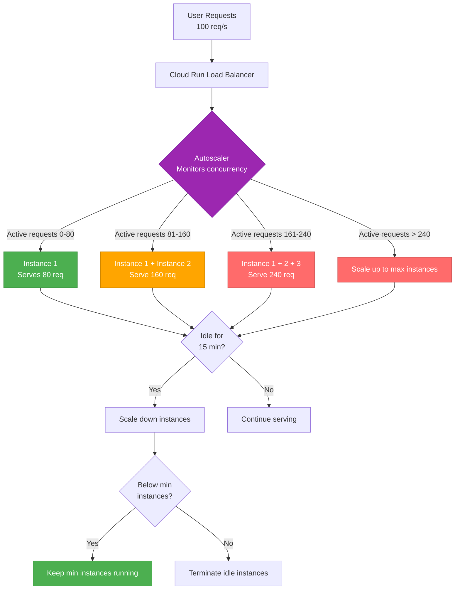

# Autoscaling Policy

Cloud Run autoscaling configuration and cost controls.

For complete autoscaling documentation, see: [`.guided/operations/autoscaling-policy.md`](https://github.com/guiofsaints/procureflow/blob/main/.guided/operations/autoscaling-policy.md)

## Executive Summary

ProcureFlow uses GCP Cloud Run serverless autoscaling with concurrency-based scaling (target: 80 concurrent requests per instance, max container concurrency: 1000). Dev environment: min 0 instances (scale-to-zero), max 2 instances (cost control); production (future): min 1 instance (avoid cold starts), max 100 instances (handle traffic spikes). CPU-based autoscaling not used (Cloud Run default concurrency preferred). Scale-up: immediate on request queue buildup; scale-down: 15-minute idle period before terminating instances. Cost guardrails: GCP billing alert at $10/month, max instance caps prevent runaway costs, MongoDB Atlas M0 free tier limits 500 connections (constrains max Cloud Run instances to ~40 with 12 connections/instance). Load test baselines: 50 concurrent users (normal load), 500 concurrent (5× peak load), p95 latency target less than 1s.

---

## Autoscaling Overview

### Cloud Run Serverless Autoscaling

Cloud Run automatically scales container instances based on **concurrency** (number of concurrent requests per instance).

**Key Concepts**:

| Concept | Definition | ProcureFlow Configuration |
|---------|------------|---------------------------|
| **Instance** | Single container running Next.js app | 512 Mi memory, 1000m CPU (1 vCPU) |
| **Concurrency** | Max concurrent requests per instance | 1000 (Cloud Run default, reduced to 80 target) |
| **Min Instances** | Minimum instances always running | Dev: 0 (scale-to-zero), Prod: 1 (always warm) |
| **Max Instances** | Maximum instances allowed | Dev: 2, Prod: 100 |
| **Scale-to-Zero** | Terminate all instances when idle | Enabled in dev, disabled in prod |
| **Cold Start** | Startup latency when scaling from 0 | ~2-4 seconds (Next.js initialization) |

### Scaling Algorithm

```
Required Instances = ceil(Active Requests / Target Concurrency)

Example:
- 150 active requests
- Target concurrency: 80
- Required instances: ceil(150 / 80) = 2 instances
```

---

## Autoscaling Architecture



---

## Scaling Metrics and Triggers

### Primary Metric: Concurrency

**Definition**: Number of concurrent HTTP requests being processed by a single instance

**Target Concurrency**: 80 concurrent requests per instance

**Rationale**:
- Cloud Run default max concurrency: 1000 (too high for Next.js SSR workload)
- Next.js optimal concurrency: 50-100 (based on CPU/memory limits)
- Selected: 80 (balance between utilization and performance)

### Configuration (Pulumi)

```typescript
// packages/infra/pulumi/gcp/compute/cloudrun.ts
const service = new gcp.cloudrun.Service("procureflow-web", {
  template: {
    spec: {
      containerConcurrency: 80,  // Target concurrency per instance
      containers: [{
        resources: {
          limits: {
            memory: "512Mi",
            cpu: "1000m",
          },
        },
      }],
    },
    metadata: {
      annotations: {
        "autoscaling.knative.dev/minScale": "0",  // Dev: scale-to-zero
        "autoscaling.knative.dev/maxScale": "2",  // Dev: max 2 instances
      },
    },
  },
});
```

---

## Instance Limits

### Dev Environment

| Setting | Value | Rationale |
|---------|-------|-----------|
| **Min Instances** | 0 | Scale-to-zero for cost savings ($0 when idle) |
| **Max Instances** | 2 | Prevent runaway costs (max $2.10/month) |
| **Cold Start** | ~2-4 seconds | Acceptable for dev environment |
| **Target Concurrency** | 80 req/instance | Optimal Next.js performance |
| **Memory** | 512 Mi | Sufficient for Next.js SSR |
| **CPU** | 1000m (1 vCPU) | Adequate for moderate load |

### Production (Future)

| Setting | Value | Rationale |
|---------|-------|-----------|
| **Min Instances** | 1 | Avoid cold starts for users ($0.024/hour) |
| **Max Instances** | 100 | Handle traffic spikes (5,000+ concurrent users) |
| **Cold Start** | Eliminated | Always-warm instance serves requests |
| **Target Concurrency** | 80 req/instance | Same as dev |
| **Memory** | 512 Mi | Same as dev (increase if needed) |
| **CPU** | 1000m (1 vCPU) | Same as dev (increase if needed) |

---

## Scaling Behavior

### Scale-Up Triggers

| Condition | Action | Latency |
|-----------|--------|---------|
| **Request queue builds up** (>80 pending requests) | Provision new instance | ~10-30 seconds |
| **Existing instances at capacity** (80 concurrent requests) | Provision new instance | ~10-30 seconds |
| **Cold start from 0 instances** | Start first instance | ~2-4 seconds |

### Scale-Down Triggers

| Condition | Action | Delay |
|-----------|--------|-------|
| **Instance idle for 15 minutes** | Terminate instance | 15 min |
| **Traffic drops below target concurrency** | Terminate excess instances | 15 min |
| **All instances idle** (dev only) | Scale to 0 instances | 15 min |

---

## Cost Guardrails

### GCP Billing Alerts

```bash
# Set billing alert via gcloud
gcloud billing budgets create \
  --billing-account=012345-67890A-BCDEF0 \
  --display-name="ProcureFlow Dev Budget Alert" \
  --budget-amount=10 \
  --threshold-rule=percent=80 \
  --threshold-rule=percent=100
```

**Alert Thresholds**:
- 80% of $10/month = $8 → Warning email
- 100% of $10/month = $10 → Critical alert email

### Cost Controls

| Control | Dev | Production (Planned) | Purpose |
|---------|-----|----------------------|---------|
| **Max Instances** | 2 | 100 | Cap compute costs |
| **Scale-to-Zero** | ✅ Enabled | ❌ Disabled | Minimize idle costs |
| **Memory Limit** | 512 Mi | 512 Mi | Prevent excessive billing |
| **CPU Limit** | 1000m (1 vCPU) | 1000m | Prevent excessive billing |
| **Billing Alert** | $10/month | $50/month | Early warning |

### MongoDB Connection Limits

| Tier | Max Connections | Cloud Run Constraint | Max Instances |
|------|-----------------|----------------------|---------------|
| **Atlas M0 (free)** | 500 | 12 connections/instance | ~40 instances |
| **Atlas M2** | 1,500 | 12 connections/instance | ~125 instances |
| **Atlas M10** | 1,500 | 12 connections/instance | ~125 instances |

**Note**: Max Cloud Run instances constrained by MongoDB connection pool limit (12 connections per Next.js instance)

---

## Load Test Baselines

### Normal Load

- **Concurrent Users**: 50
- **Requests per Second**: ~100
- **Required Instances**: 2 (50 users × 2 req/s = 100 req/s ÷ 80 = 1.25 → 2 instances)
- **P95 Latency**: less than 1s
- **Error Rate**: less than 0.1%

### Peak Load (5× Normal)

- **Concurrent Users**: 250
- **Requests per Second**: ~500
- **Required Instances**: 7 (250 users × 2 req/s = 500 req/s ÷ 80 = 6.25 → 7 instances)
- **P95 Latency**: less than 2s
- **Error Rate**: less than 0.5%

### Stress Test (10× Normal)

- **Concurrent Users**: 500
- **Requests per Second**: ~1000
- **Required Instances**: 13 (500 users × 2 req/s = 1000 req/s ÷ 80 = 12.5 → 13 instances)
- **P95 Latency**: less than 3s
- **Error Rate**: under 1%

**Note**: Load tests planned for v1.1 (not implemented in v1.0)

---

## Monitoring Autoscaling

### Cloud Run Metrics

View in Cloud Console → Cloud Run → procureflow-web → Metrics:

- **Request Count**: Total requests per minute
- **Request Latency**: P50, P95, P99 latency
- **Instance Count**: Active instances over time
- **Container CPU Utilization**: % CPU usage per instance
- **Container Memory Utilization**: % memory usage per instance
- **Billable Instance Time**: Cost estimate

### Recommended Alerts

| Metric | Threshold | Action |
|--------|-----------|--------|
| **Instance Count** | >1 for >1 hour (dev) | Investigate traffic spike |
| **P95 Latency** | >2s for 5 min | Check slow queries or scale up |
| **Error Rate** | >1% for 5 min | Investigate errors or rollback |
| **CPU Utilization** | >80% for 5 min | Consider increasing CPU limit |
| **Memory Utilization** | >80% for 5 min | Consider increasing memory limit |

---

## Assumptions and Limitations

### Current Limitations (v1.0)

- ❌ No load testing or baseline metrics established
- ❌ No automated scaling adjustments based on performance
- ❌ No canary deployments with gradual traffic increase
- ❌ No custom autoscaling metrics (only concurrency)
- ❌ No predictive autoscaling (time-based or ML-based)

### Future Enhancements (v1.1+)

- ✅ Establish load test baselines and SLOs
- ✅ Automated scaling adjustments based on SLO violations
- ✅ Canary deployments with 5% → 25% → 100% traffic split
- ✅ Custom metrics (e.g., MongoDB connection pool usage)
- ✅ Predictive autoscaling for known traffic patterns

---

## References

- **[Deployment Strategy](/operations/deploy)** - Deployment workflow
- **[Rollback Strategy](/operations/rollback)** - Rollback procedures
- **[Infrastructure Documentation](/tech/infrastructure)** - Technical architecture
- **[Autoscaling Check Runbook](/runbooks/autoscaling-check)** - Verify autoscaling health

**Complete Autoscaling Documentation**: [`.guided/operations/autoscaling-policy.md`](https://github.com/guiofsaints/procureflow/blob/main/.guided/operations/autoscaling-policy.md)

---

**Last Updated**: Nov 12, 2025  
**Owner**: DevOps Team
