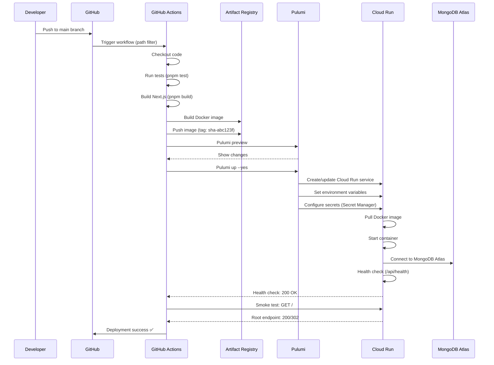

# Deployment Strategy

Complete CI/CD deployment workflow for ProcureFlow.

For complete deployment documentation, see: [`.guided/operations/deployment-strategy.md`](https://github.com/guiofsaints/procureflow/blob/main/.guided/operations/deployment-strategy.md)

## Executive Summary

ProcureFlow deploys to GCP Cloud Run via GitHub Actions CI/CD triggered on push to `main` branch with path filters (`packages/web/**`, `packages/infra/**`). Deployment uses Pulumi IaC (TypeScript) to provision containerized services with Docker images built from `Dockerfile.web` and stored in Artifact Registry. Only dev environment configured in v1.0; staging/production require manual `workflow_dispatch` trigger (future). Required checks: Pulumi preview clean, Docker build success, health check 200, no critical vulnerabilities. Smoke tests verify `/api/health` returns 200 and root endpoint returns 200 or 302. Deployment takes ~5-8 minutes end-to-end.

---

## Deployment Targets

| Platform | Status | Use Case | Cost | Rationale |
|----------|--------|----------|------|-----------|
| **GCP Cloud Run** | ✅ Active (dev only) | Serverless container platform | Free tier (~2M requests/month) + $0.10/month storage | Serverless auto-scaling, zero ops, pay-per-use, HTTPS out-of-box |
| **Docker Compose** | ✅ Active (local only) | Local development | $0 | Docker Desktop for dev/test, not for production |

---

## Environments

| Environment | Status | Deploy Target | URL | Auto-Deploy | Database | Cost/Month |
|-------------|--------|---------------|-----|-------------|----------|------------|
| **Local** | ✅ Active | Docker Compose | http://localhost:3000 | ❌ Manual (`pnpm docker:up`) | MongoDB 8.10.6 (local container) | $0 |
| **Dev** | ✅ Active | GCP Cloud Run (us-central1) | https://procureflow-web-*.run.app | ✅ On push to `main` | MongoDB Atlas M0 (free tier) | ~$2.10 |
| **Staging** | ⏸️ Not Configured | GCP Cloud Run (us-central1) | TBD | ❌ Manual `workflow_dispatch` | MongoDB Atlas M2 | ~$15 (estimated) |
| **Production** | ⏸️ Not Configured | GCP Cloud Run (us-central1) | TBD | ❌ Manual `workflow_dispatch` | MongoDB Atlas M10 | ~$50 (estimated) |

**Note**: Only **dev environment** is fully configured in v1.0.

---

## Deployment Flow



**Duration**: ~5-8 minutes end-to-end

---

## GitHub Actions Workflow

### Trigger Conditions

**Automatic Trigger**:
```yaml
on:
  push:
    branches: [main]
    paths:
      - 'packages/web/**'        # Next.js application code
      - 'packages/infra/**'      # Infrastructure/Dockerfile
      - '.github/workflows/deploy-gcp.yml'
```

**Manual Trigger**:
```yaml
on:
  workflow_dispatch:
    inputs:
      environment:
        description: 'Target environment'
        required: true
        default: 'dev'
        type: choice
        options: [dev, staging, production]
```

### Workflow Steps

1. **Checkout Code**: Clone repository
2. **Setup Node.js**: Install pnpm, cache dependencies
3. **Run Tests**: `pnpm test` (unit + integration tests)
4. **Build Application**: `pnpm build` (TypeScript + Next.js)
5. **Build Docker Image**: Use `Dockerfile.web`, tag with commit SHA
6. **Push to Artifact Registry**: GCP container registry
7. **Pulumi Preview**: Show infrastructure changes
8. **Pulumi Up**: Deploy to Cloud Run
9. **Health Check**: Verify `/api/health` returns 200
10. **Smoke Tests**: Verify root endpoint returns 200 or 302

---

## Required Pre-Deployment Checks

### CI Gates

| Check | Tool | Threshold | Blocks Deploy? |
|-------|------|-----------|----------------|
| **Unit Tests** | Vitest | All pass | ✅ Yes |
| **Linting** | ESLint | No errors | ✅ Yes |
| **Type Check** | TypeScript | No errors | ✅ Yes |
| **Build Success** | Next.js | Exit code 0 | ✅ Yes |
| **Docker Build** | Docker | Exit code 0 | ✅ Yes |
| **Pulumi Preview** | Pulumi | No errors | ✅ Yes |
| **Vulnerability Scan** | npm audit | No critical | ⚠️ Warning only |

### Environment Variables Validation

**Required Secrets**:
- `NEXTAUTH_SECRET`: NextAuth.js session encryption
- `MONGODB_CONNECTION_STRING`: MongoDB Atlas connection
- `OPENAI_API_KEY`: OpenAI API access (or `not-set`)
- `GCP_SA_KEY`: GCP service account JSON
- `PULUMI_ACCESS_TOKEN`: Pulumi Cloud access

**Missing secrets** → Deployment fails with error message

---

## Smoke Tests

### Health Check

```bash
# Verify API health endpoint
curl -f https://procureflow-web-*.run.app/api/health

# Expected response: 200 OK
{
  "status": "ok",
  "timestamp": "2025-11-12T10:30:45.123Z",
  "version": "1.0.0",
  "checks": {
    "database": "connected",
    "memory": "ok"
  }
}
```

### Root Endpoint

```bash
# Verify root endpoint redirects or serves page
curl -I https://procureflow-web-*.run.app/

# Expected: 200 OK or 302 Found (redirect to /catalog)
```

### Agent Endpoint (Optional)

```bash
# Verify AI agent API responds
curl -X POST https://procureflow-web-*.run.app/api/agent/message \
  -H "Content-Type: application/json" \
  -d '{"message": "hello"}'

# Expected: 200 OK with agent response
```

**Smoke test failure** → Automatic rollback to previous revision

---

## Deployment Commands

### Manual Local Deployment

```bash
# Build and run locally with Docker Compose
pnpm docker:up

# Access at http://localhost:3000
```

### Manual GCP Deployment

```bash
# From packages/infra/pulumi/gcp/
cd packages/infra/pulumi/gcp

# Preview changes
pulumi preview

# Deploy to dev
pulumi up --yes

# Deploy to specific stack (future)
pulumi up --stack staging --yes
```

---

## Rollback Procedure

If deployment fails or issues detected:

1. **Automatic Rollback**: Cloud Run serves previous revision if health check fails
2. **Manual Rollback**: See [Rollback Strategy](/operations/rollback)

---

## Assumptions and Limitations

### Current Limitations (v1.0)

- ❌ No staging/production environments configured
- ❌ No automated rollback for failed deployments (manual only)
- ❌ No blue/green or canary deployments
- ❌ No database migration automation (manual `mongosh` required)
- ❌ No performance testing in CI/CD

### Future Enhancements (v1.1+)

- ✅ Staging/production environments with approval workflows
- ✅ Automated rollback on error rate threshold
- ✅ Blue/green deployments with traffic splitting
- ✅ Database migration automation (Prisma Migrate or Atlas)
- ✅ Load testing in CI/CD pipeline

---

## References

- **[Rollback Strategy](/operations/rollback)** - Rollback procedures
- **[Autoscaling Policy](/operations/autoscaling)** - Scaling configuration
- **[Infrastructure Documentation](/tech/infrastructure)** - Technical architecture
- **[CI Gates](/testing/ci-gates)** - Quality checks

**Complete Deployment Documentation**: [`.guided/operations/deployment-strategy.md`](https://github.com/guiofsaints/procureflow/blob/main/.guided/operations/deployment-strategy.md)

---

**Last Updated**: Nov 12, 2025  
**Owner**: DevOps Team
