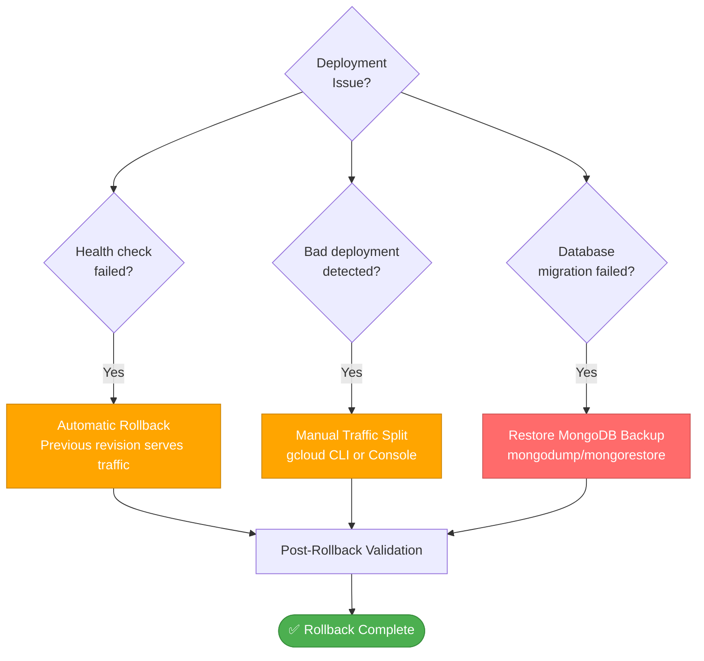

# Operations

Deployment, rollback, and autoscaling strategies for ProcureFlow.

For complete operations documentation, see: [`.guided/operations/`](https://github.com/guiofsaints/procureflow/tree/main/.guided/operations)

## Executive Summary

ProcureFlow deploys to GCP Cloud Run via GitHub Actions CI/CD with Pulumi IaC. Only dev environment configured in v1.0 (auto-deploy on push to main). Rollback uses Cloud Run revision traffic splitting (instant zero-downtime) or Pulumi state rollback for infrastructure changes. Autoscaling based on concurrency (target: 80 concurrent requests/instance), dev: 0-2 instances (scale-to-zero), production (future): 1-100 instances. Cost guardrails: GCP billing alert at $10/month, MongoDB Atlas M0 free tier limits. Deployment time: ~5-8 minutes, rollback time: ~2-5 minutes.

---

## Quick Links

- **[Deployment Strategy](/operations/deploy)** - CI/CD workflow, environments, smoke tests
- **[Rollback Strategy](/operations/rollback)** - Revision rollback, decision tree, validation
- **[Autoscaling Policy](/operations/autoscaling)** - Metrics, triggers, cost guardrails

---

## Environments Overview

| Environment | Status | Platform | URL | Auto-Deploy | Database | Cost/Month |
|-------------|--------|----------|-----|-------------|----------|------------|
| **Local** | ✅ Active | Docker Compose | http://localhost:3000 | ❌ Manual | MongoDB 8.10.6 (local) | $0 |
| **Dev** | ✅ Active | GCP Cloud Run | https://procureflow-web-*.run.app | ✅ On push to main | MongoDB Atlas M0 (free) | ~$2.10 |
| **Staging** | ⏸️ Not Configured | GCP Cloud Run | TBD | ❌ Manual | MongoDB Atlas M2 | ~$15 (planned) |
| **Production** | ⏸️ Not Configured | GCP Cloud Run | TBD | ❌ Manual | MongoDB Atlas M10 | ~$50 (planned) |

---

## Deployment Flow

```mermaid
flowchart LR
    Push[Push to main] --> Trigger{Path filter?}
    Trigger -->|packages/web/**| BuildTest[Build & Test]
    Trigger -->|packages/infra/**| BuildTest
    Trigger -->|Other paths| Skip[Skip deployment]
    
    BuildTest --> Docker[Build Docker Image]
    Docker --> Push2[Push to Artifact Registry]
    Push2 --> Pulumi[Pulumi Preview & Up]
    Pulumi --> Deploy[Deploy to Cloud Run]
    Deploy --> Health[Health Check]
    Health -->|200 OK| Smoke[Smoke Tests]
    Health -->|Failed| Rollback[Automatic Rollback]
    Smoke -->|Pass| Success([✅ Deployment Complete])
    Smoke -->|Fail| Rollback
    Rollback --> PrevRevision[Previous Revision Serves Traffic]
    
    style BuildTest fill:#9C27B0,stroke:#7B1FA2,color:#fff
    style Deploy fill:#4CAF50,stroke:#388E3C,color:#fff
    style Success fill:#4CAF50,stroke:#388E3C,color:#fff
    style Rollback fill:#FF6B6B,stroke:#CC5555,color:#fff
```

**Duration**: ~5-8 minutes end-to-end

---

## Rollback Decision Tree

**Rollback Time**: ~2-5 minutes (traffic split), ~10-30 minutes (full Pulumi rollback)

---

## Autoscaling Configuration

### Dev Environment

- **Min Instances**: 0 (scale-to-zero for cost savings)
- **Max Instances**: 2 (cost control)
- **Target Concurrency**: 80 concurrent requests/instance
- **Scale-up**: Immediate on request queue buildup
- **Scale-down**: 15-minute idle period before termination

### Production (Future)

- **Min Instances**: 1 (avoid cold starts)
- **Max Instances**: 100 (handle traffic spikes)
- **Target Concurrency**: 80 concurrent requests/instance
- **Cold Start**: ~2-4 seconds (Next.js initialization)

---

## Cost Guardrails

| Control | Dev | Production (Planned) | Purpose |
|---------|-----|----------------------|---------|
| **GCP Billing Alert** | $10/month threshold | $50/month threshold | Prevent cost overruns |
| **Max Instances** | 2 | 100 | Cap compute costs |
| **MongoDB Connections** | 500 limit (Atlas M0) | 1500 limit (Atlas M10) | Prevent connection exhaustion |
| **Scale-to-Zero** | ✅ Enabled | ❌ Disabled | Minimize idle costs |

---

## Key Metrics

### Deployment Success

- **Build Time**: less than 3 minutes
- **Deploy Time**: less than 5 minutes
- **Health Check**: 200 status required
- **Smoke Tests**: All pass required

### Rollback Criteria

| Metric | Threshold | Action |
|--------|-----------|--------|
| **Error Rate** | >1% for 5 min | Manual rollback |
| **P95 Latency** | >3s for 5 min | Investigate or rollback |
| **Health Check** | Non-200 status | Automatic rollback |
| **Critical Bug** | Checkout fails | Manual rollback |

### Autoscaling Targets

- **Target Concurrency**: 80 requests/instance
- **Scale-up Latency**: less than 30 seconds
- **Scale-down Delay**: 15 minutes idle
- **P95 Latency**: less than 1s under normal load

---

## References

- **[Deployment Strategy](/operations/deploy)** - Complete deployment workflow
- **[Rollback Strategy](/operations/rollback)** - Rollback procedures and validation
- **[Autoscaling Policy](/operations/autoscaling)** - Scaling configuration and cost controls
- **[Infrastructure Documentation](/tech/infrastructure)** - Technical architecture
- **[Runbooks](/runbooks)** - Operational procedures

**Complete Operations Documentation**: [`.guided/operations/`](https://github.com/guiofsaints/procureflow/tree/main/.guided/operations)

---

**Last Updated**: Nov 12, 2025  
**Owner**: DevOps Team
