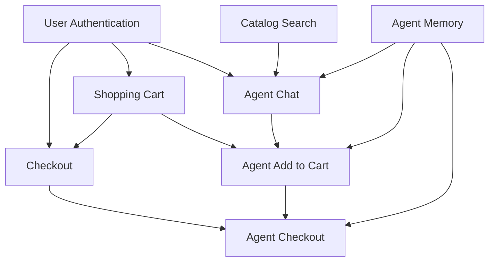

# Features

## Executive Summary

ProcureFlow v1.0 MVP includes 12 must-have features across 5 domains: Catalog Management (search, registration), Shopping Cart (CRUD, analytics), Checkout (PR generation, history), AI Agent (conversational search/cart/checkout, memory), and Authentication (NextAuth.js, sessions). Future releases add approval workflows (v1.1-1.2), advanced intelligence (v2.0+), and enterprise features (v3.0+).

---

## Must-Have Features (MVP - v1.0)

### Catalog Management

| Feature ID | Feature Name | Description | Acceptance Criteria |
|------------|--------------|-------------|---------------------|
| **F-CAT-001** | Catalog Search | Full-text search across name, description, category with MongoDB text index | Results in < 500ms, relevance scoring, handles empty queries |
| **F-CAT-002** | Item Registration | Add new catalog items with duplicate detection before creation | Warns on potential duplicates, requires confirmation, snapshots price |

### Shopping Cart

| Feature ID | Feature Name | Description | Acceptance Criteria |
|------------|--------------|-------------|---------------------|
| **F-CART-001** | Shopping Cart CRUD | Add, update quantity, remove items with real-time subtotal | Combines quantities for duplicate adds, persists to MongoDB |
| **F-CART-002** | Cart Analytics | Display item count, unique items, total cost, average price | Accurate calculations, handles empty cart (0 values) |

### Checkout

| Feature ID | Feature Name | Description | Acceptance Criteria |
|------------|--------------|-------------|---------------------|
| **F-CHECK-001** | Checkout Flow | Submit purchase request with unique PR number (PR-YYYY-NNNN) | Generates PR in < 2s, clears cart atomically, immutable snapshots |
| **F-CHECK-002** | Purchase History | List all user purchase requests with filters by date, status | Sorted by creation date (newest first), own PRs only |

### AI Agent

| Feature ID | Feature Name | Description | Acceptance Criteria |
|------------|--------------|-------------|---------------------|
| **F-AGENT-001** | Conversational Search | Natural language item discovery ("Find office chairs under $200") | Extracts intent, calls search tool, returns formatted results |
| **F-AGENT-002** | Conversational Add to Cart | Add items via chat with confirmation | Requires explicit confirmation, shows item name/price/quantity |
| **F-AGENT-003** | Conversational Checkout | Complete purchase via chat with confirmation | Two confirmations (intent + final), provides PR number |
| **F-AGENT-004** | Agent Memory | Context across messages, remembers cart contents and actions | Persists conversation history, maintains context for 50 messages |

### Authentication

| Feature ID | Feature Name | Description | Acceptance Criteria |
|------------|--------------|-------------|---------------------|
| **F-AUTH-001** | User Authentication | NextAuth.js with email/password login | bcrypt password hashing, secure session cookies |
| **F-AUTH-002** | Session Management | JWT-based sessions with 30-day expiration | HTTP-only cookies, auto-refresh, HTTPS in production |

---

## Nice-to-Have Features (Future Releases)

### Phase 2: Enhanced Workflows (v1.1 - v1.2)

| Feature ID | Feature Name | Business Value | Estimated Effort |
|------------|--------------|----------------|------------------|
| **F-APPR-001** | Approval Workflows | Buyer oversight for high-value purchases | High (3-4 sprints) |
| **F-APPR-002** | Auto-Approval Rules | Reduce buyer workload for < $500 purchases | Medium (2 sprints) |
| **F-CAT-003** | Item Status Workflow | PendingReview → Active → Inactive lifecycle | Medium (2 sprints) |
| **F-CART-003** | Saved Cart Drafts | Resume interrupted purchasing sessions | Low (1 sprint) |
| **F-NOTIF-001** | Email Notifications | Status updates for PR approval/rejection | Medium (2 sprints) |
| **F-ANALYTICS-001** | Spending Dashboard | Identify cost savings by category/department | High (3 sprints) |

### Phase 3: Advanced Intelligence (v2.0+)

| Feature ID | Feature Name | Business Value | Estimated Effort |
|------------|--------------|----------------|------------------|
| **F-AGENT-005** | Multi-Turn Negotiation | Complex purchasing scenarios with back-and-forth | High (4-5 sprints) |
| **F-AGENT-006** | Proactive Suggestions | Recommend items based on purchase history | Medium (2-3 sprints) |
| **F-AGENT-007** | Budget Awareness | Warn about department budget limits before checkout | Medium (2 sprints) |
| **F-CAT-004** | Smart Categorization | ML-based category suggestions during registration | Medium (2-3 sprints) |
| **F-INT-001** | ERP Integration | Submit real purchase orders to SAP/Oracle | High (4-6 sprints) |
| **F-INT-002** | Supplier API Integration | Real-time pricing and availability from vendors | High (4-6 sprints) |

### Phase 4: Enterprise Features (v3.0+)

| Feature ID | Feature Name | Business Value | Estimated Effort |
|------------|--------------|----------------|------------------|
| **F-MULTI-001** | Multi-Tenancy | Support multiple organizations in single instance | Very High (6-8 sprints) |
| **F-RBAC-001** | Role-Based Access Control | Granular permissions (requester, buyer, admin) | Medium (2-3 sprints) |
| **F-AUDIT-001** | Audit Trail | Compliance and forensics for all actions | Medium (2 sprints) |
| **F-REPORT-001** | Advanced Reporting | Executive dashboards with BI integration | High (3-4 sprints) |
| **F-MOBILE-001** | Mobile App | Procurement on the go (iOS/Android) | Very High (8-10 sprints) |

---

## Explicitly Out of Scope

### v1.0 Exclusions

The following are intentionally not included in MVP to maintain focus and meet timeline:

1. **Approval Workflows**: All purchase requests auto-submit to "Submitted" status without buyer approval gates
2. **Item Status Transitions**: All catalog items default to "Active" status with no review workflow
3. **Real ERP Integration**: Purchase requests are simulated (logged to MongoDB) rather than submitted to SAP/Oracle
4. **Budget Enforcement**: No budget checking or spending limits enforced by the system
5. **Supplier Management**: No supplier profiles, contracts, or relationship tracking
6. **Advanced Analytics**: No dashboards, reports, or spending visualization
7. **Email Notifications**: No automated emails for PR status changes or approvals
8. **Mobile Applications**: Web-only, no native iOS/Android apps
9. **Multi-Language Support**: English only, no localization
10. **Accessibility Compliance**: No WCAG 2.1 AA compliance requirements

### Permanent Exclusions

The following will never be implemented as they are outside the product scope:

1. **Inventory Management**: Not a warehouse or stock management system
2. **Accounts Payable**: Not an invoice or payment processing system
3. **Supplier Onboarding**: Not a vendor management or RFP platform
4. **Contract Lifecycle Management**: Not a contract authoring or negotiation tool

---

## Feature Dependencies

### Critical Dependencies

### Implementation Order

**Sprint 1-2** (Foundation):
1. F-AUTH-001, F-AUTH-002 (Authentication)
2. F-CAT-001, F-CAT-002 (Catalog)
3. F-CART-001, F-CART-002 (Cart)

**Sprint 3-4** (Core Flows):
4. F-CHECK-001, F-CHECK-002 (Checkout)
5. F-AGENT-004 (Agent Memory foundation)
6. F-AGENT-001 (Conversational Search)

**Sprint 5-6** (AI Agent):
7. F-AGENT-002 (Conversational Add to Cart)
8. F-AGENT-003 (Conversational Checkout)
9. Integration testing and polish

---

## Success Criteria for MVP

### Functional Completeness

- [ ] All 12 must-have features implemented and tested
- [ ] OpenAPI 3.0 spec covers all 13 API endpoints
- [ ] AI agent successfully executes 8 integrated tools
- [ ] Local development via Docker Compose works with single command
- [ ] GCP deployment via Pulumi completes in < 15 minutes

### Performance Benchmarks

- [ ] Catalog search returns results in < 500ms (p95)
- [ ] Agent response latency < 3 seconds (p95) excluding LLM API time
- [ ] Checkout completes in < 2 seconds (p95)
- [ ] Health check endpoint responds in < 100ms (p95)

### Quality Gates

- [ ] Test coverage ≥ 60% (lines, functions, branches, statements)
- [ ] Zero critical security vulnerabilities (Snyk scan)
- [ ] Prettier and ESLint pass with no errors
- [ ] Next.js build completes without TypeScript errors

---

## References

- **[Objective & Vision](/prd/objective)** - Problem statement and success metrics
- **[Functional Requirements](/prd/functional-requirements)** - Detailed FR specifications
- **[Non-Functional Requirements](/prd/non-functional-requirements)** - Performance and security targets
- **[C4 Container Diagram](/tech/c4/container)** - Technical architecture
- **[GitHub Project](https://github.com/guiofsaints/procureflow/projects)** - Feature tracking

---

**Last Updated**: 2025-11-12  
**Owner**: Product Team  
**Next Review**: Per release
