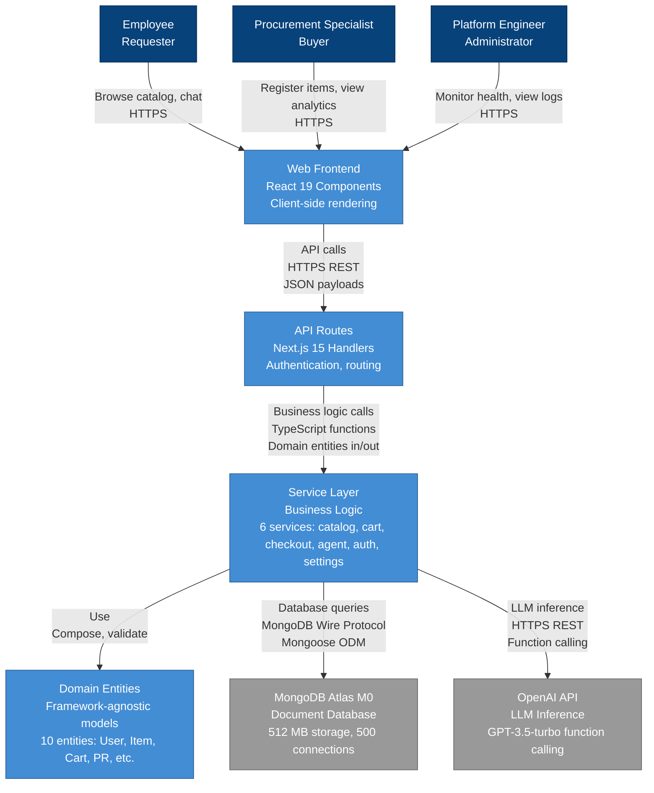
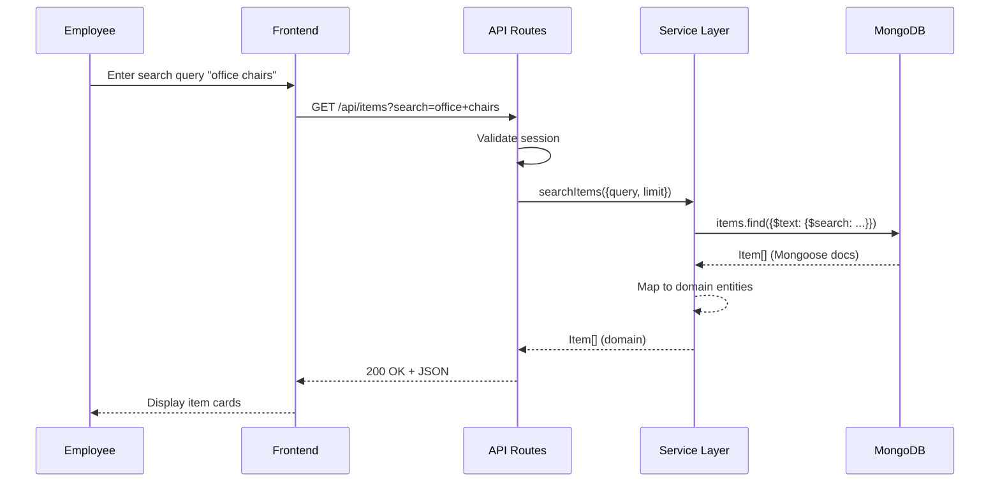
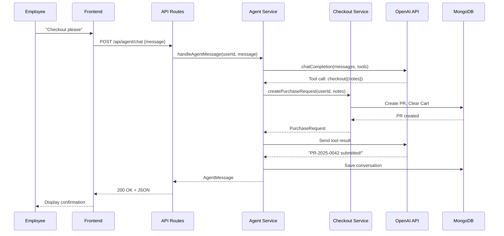

# C2 — Container Diagram

## Executive Summary

ProcureFlow system decomposed into runtime containers: Web Frontend (React), API Layer (Next.js routes), Service Layer (business logic), Domain Entities (framework-agnostic models), MongoDB Atlas (persistence), and OpenAI API (LLM inference). Architecture enforces separation of concerns with service-layer business logic isolated from framework code. Data flows via HTTP/HTTPS, MongoDB Wire Protocol, and REST APIs.

---

## Container Diagram



---

## Container Responsibilities

### Web Frontend

**Technology**: React 19.2.0, TypeScript, Tailwind CSS, Radix UI

**Responsibilities**:

- Render catalog, cart, agent, settings pages
- Handle user input (search, cart operations, chat)
- Display API data in responsive layouts
- Manage client state with React Context
- Provide real-time feedback (loading, errors, success)

**Key Components**:

- Catalog page with search and item cards
- Cart page with quantity updates
- Agent chat with streaming responses
- Settings page for user profile

### API Routes

**Technology**: Next.js 15 App Router API Routes

**Responsibilities**:

- Accept HTTP requests, parse JSON payloads
- Validate authentication with NextAuth.js sessions
- Call service layer functions with domain entities
- Return formatted responses (200, 400, 401, 404, 500)
- Handle errors and map to HTTP status codes

**Endpoints** (13 total):

- `/api/items` (GET, POST)
- `/api/cart` (GET, POST, PATCH, DELETE)
- `/api/purchase` (GET, POST)
- `/api/agent/chat` (POST)
- `/api/auth/*` (NextAuth.js)
- `/api/health` (GET)
- `/api/openapi` (GET)

### Service Layer

**Technology**: TypeScript, framework-agnostic

**Responsibilities**:

- Implement business logic (validation, calculations, workflows)
- Return domain entities (not Mongoose documents)
- Throw typed errors (ValidationError, DuplicateItemError)
- Call database via Mongoose models
- Call OpenAI via LangChain client

**Services** (6 total):

1. `catalog.service.ts`: Search, register, get items
2. `cart.service.ts`: Add, update, remove, view cart
3. `checkout.service.ts`: Validate, create PR, get history
4. `agent.service.ts`: Handle chat, execute tools
5. `auth.service.ts`: Register, login, validate sessions
6. `settings.service.ts`: User profile management

### Domain Entities

**Technology**: TypeScript interfaces (framework-agnostic)

**Purpose**: Represent business concepts independent of database/framework

**Entities** (10 total):

- `User`: id, email, name, hashedPassword, createdAt
- `Item`: id, name, category, description, price, status
- `Cart`: id, userId, items[], totalCost
- `CartItem`: itemId, name, unitPrice, quantity, subtotal
- `PurchaseRequest`: id, userId, requestNumber, items[], total
- `Conversation`: id, userId, messages[], createdAt
- `Message`: role, content, items, cart
- `AgentTool`: name, description, parameters
- And more...

### MongoDB Atlas M0

**Technology**: MongoDB 6.x, Mongoose 8.9.4 ODM

**Responsibilities**:

- Persist all application data
- Execute full-text searches with text indexes
- Maintain 3-node replica set for durability
- Enforce schema validation via Mongoose

**Collections** (6 total):

- `users`: User accounts
- `items`: Catalog items
- `carts`: Shopping carts
- `purchaserequests`: Purchase requests
- `agentconversations`: Agent chats
- `sessions`: NextAuth.js sessions (future)

### OpenAI API

**Technology**: OpenAI GPT-3.5-turbo, LangChain 0.3.19

**Responsibilities**:

- Process natural language messages
- Decide which tools to call (function calling)
- Generate conversational responses
- Maintain conversation context

**Integration Pattern**:

1. Agent service sends message + conversation history
2. OpenAI returns tool calls (e.g., `search_catalog`)
3. Agent service executes tools via other services
4. Agent service sends tool results back to OpenAI
5. OpenAI returns final response
6. Agent service saves message to conversation

---

## Data Flows

### Catalog Search Flow



### Agent Checkout Flow



---

## Technology Choices

### Why Next.js 15?

- **App Router**: File-based routing with server components
- **API Routes**: Serverless functions for backend
- **React 19**: Latest concurrent features
- **TypeScript**: Type safety and IDE support
- **Vercel/GCP**: Easy deployment options

### Why MongoDB?

- **Schema Flexibility**: Catalog items have varying fields
- **Text Search**: Built-in full-text search for catalog
- **Document Model**: Natural fit for nested cart items, PR snapshots
- **Atlas M0**: Free tier with 512 MB storage
- **Mongoose ODM**: Schema validation and migrations

### Why Service Layer Pattern?

- **Testability**: Business logic testable without HTTP
- **Reusability**: Services usable in API routes, server components, jobs
- **Framework Independence**: Easy to migrate to Express/Fastify if needed
- **Clear Separation**: Routes handle HTTP, services handle business logic

---

## Deployment Architecture

### Development

```
Docker Compose:
  - Web App (Next.js): localhost:3000
  - MongoDB: localhost:27017
  - mongo-express (UI): localhost:8081
```

### Production

```
GCP Cloud Run:
  - Container: Next.js app (Docker)
  - Scaling: 0-10 instances (auto)
  - MongoDB Atlas M0: Cloud-hosted
  - Secrets: GCP Secret Manager
```

---

## References

- **[C1 Context Diagram](/tech/c4/context)** - System boundary
- **[Technology Stack](/tech/stack)** - Complete tech list
- **[Design Patterns](/tech/patterns)** - Architectural patterns
- **[Infrastructure](/tech/infrastructure)** - Deployment details

**Complete C2 Details**: [`.guided/architecture/c4.container.md`](https://github.com/guiofsaints/procureflow/blob/main/.guided/architecture/c4.container.md)

---

**Last Updated**: 2025-11-12  
**Owner**: Architecture Team
