# C1 — Context Diagram

## Executive Summary

System context for ProcureFlow showing interactions between three primary actors (Employee, Procurement Specialist, Platform Engineer) and the web application, which depends on two external systems (MongoDB Atlas, OpenAI API). Scope: AI-native procurement platform for corporate purchasing workflows. Boundary: Web application owns business logic, UI, and AI orchestration; MongoDB provides persistence; OpenAI provides LLM capabilities.

---

## Context Diagram

```mermaid
graph TD
    %% Actors
    Employee[👤 Employee/Requester<br/>Internal user purchasing<br/>materials and services]
    Buyer[👤 Procurement Specialist<br/>Buyer managing catalog<br/>quality and approvals]
    Engineer[👤 Platform Engineer<br/>DevOps/SRE deploying<br/>and monitoring system]
    
    %% System Boundary
    ProcureFlow[🎯 ProcureFlow Web App<br/>Next.js 15 / React 19<br/>AI-native procurement platform]
    
    %% External Systems
    MongoDB[(🗄️ MongoDB Atlas M0<br/>Document database<br/>512 MB free tier)]
    OpenAI[🤖 OpenAI API<br/>GPT-3.5-turbo<br/>LLM for agent]
    
    %% Interactions
    Employee -->|HTTP/HTTPS<br/>Browse catalog, chat with agent| ProcureFlow
    Buyer -->|HTTP/HTTPS<br/>Register items, view analytics| ProcureFlow
    Engineer -->|Pulumi/Docker<br/>Deploy and monitor| ProcureFlow
    
    ProcureFlow -->|MongoDB Wire Protocol<br/>Store/retrieve data| MongoDB
    ProcureFlow -->|HTTPS REST API<br/>LLM inference| OpenAI
    
    %% Styling
    classDef actor fill:#E1F5FE,stroke:#01579B,stroke-width:2px
    classDef system fill:#FFF3E0,stroke:#E65100,stroke-width:3px
    classDef external fill:#F3E5F5,stroke:#4A148C,stroke-width:2px
    
    class Employee,Buyer,Engineer actor
    class ProcureFlow system
    class MongoDB,OpenAI external
```



---

## Actors

### 1. Employee (Requester)

**Primary User**: Internal employees purchasing materials/services

**Interactions**:
- Browse catalog with full-text search
- Chat with AI agent for natural language procurement
- Add items to shopping cart
- Submit purchase requests via checkout
- Track purchase request history

**Entry Points**: Web browser (HTTPS)

### 2. Procurement Specialist (Buyer)

**Power User**: Manages catalog quality and purchasing workflows

**Interactions**:
- Register new catalog items with duplicate detection
- Review and approve purchase requests (future)
- View spending analytics (future)
- Monitor catalog health

**Entry Points**: Web browser (HTTPS)

### 3. Platform Engineer (Operator)

**Administrator**: Deploys and maintains the system

**Interactions**:
- Deploy infrastructure via Pulumi
- Monitor health checks and metrics
- Execute rollbacks on failures
- Manage secrets and configuration

**Entry Points**: CLI (Pulumi), Docker, GitHub Actions

---

## System Boundary

### ProcureFlow Web Application

**Technology**: Next.js 15.1.4 with React 19.2.0, TypeScript 5.7.3

**Core Responsibilities**:
1. **Catalog Management**: Search, registration, duplicate detection
2. **Shopping Cart**: CRUD operations, analytics
3. **Checkout**: Purchase request generation with immutable snapshots
4. **AI Agent**: Conversational procurement with 8 integrated tools
5. **Authentication**: User registration, login, session management

**Not Responsible For**:
- Data persistence (delegated to MongoDB)
- LLM inference (delegated to OpenAI API)
- Email delivery (out of scope for v1.0)
- Real ERP integration (out of scope for v1.0)

---

## External Systems

### MongoDB Atlas M0

**Purpose**: Primary data store for all application entities

**Capabilities**:
- Document storage with 512 MB limit (free tier)
- Full-text search with text indexes
- 500 concurrent connections max
- 3-node replica set for durability

**Data Stored**:
- Users (authentication credentials, profiles)
- Catalog items (name, category, description, price, status)
- Shopping carts (items, quantities, snapshots)
- Purchase requests (immutable item snapshots, status, notes)
- Agent conversations (messages, tool execution logs)

**Failure Mode**: Service degraded (catalog/cart unavailable), agent depends on conversation history

### OpenAI API

**Purpose**: LLM inference for AI agent capabilities

**Capabilities**:
- GPT-3.5-turbo model (fast, cost-effective)
- Function calling for tool integration
- Natural language understanding

**Usage**:
- Extract search keywords from natural language
- Generate conversational responses
- Decide which tools to call (search, add_to_cart, checkout, etc.)
- Maintain conversation context

**Failure Mode**: Agent feature unavailable, fallback to catalog UI with graceful error messages

**Cost Control**:
- Rate limiting: 60 requests/minute per user
- Context window: Last 50 messages
- Monthly budget alerts at $5

---

## Data Flows

### 1. Employee Search Flow

```
Employee → [HTTPS] → ProcureFlow (Catalog Search)
ProcureFlow → [MongoDB Wire] → MongoDB (Full-text Query)
MongoDB → [Results] → ProcureFlow
ProcureFlow → [HTTPS] → Employee (Catalog Items)
```

### 2. Agent Chat Flow

```
Employee → [HTTPS] → ProcureFlow (Agent Message)
ProcureFlow → [HTTPS REST] → OpenAI (LLM Inference)
OpenAI → [Function Call] → ProcureFlow (Tool: search_catalog)
ProcureFlow → [MongoDB Wire] → MongoDB (Execute Search)
MongoDB → [Results] → ProcureFlow
ProcureFlow → [Response] → Employee (Agent Message + Items)
```

### 3. Checkout Flow

```
Employee → [HTTPS] → ProcureFlow (Checkout Request)
ProcureFlow → [MongoDB Wire] → MongoDB (Create Purchase Request)
ProcureFlow → [MongoDB Wire] → MongoDB (Clear Cart)
MongoDB → [Success] → ProcureFlow
ProcureFlow → [HTTPS] → Employee (PR Confirmation)
```

---

## Scope

### In Scope (v1.0)

✅ Catalog search with MongoDB full-text indexing  
✅ Item registration with duplicate detection  
✅ Shopping cart management (add, update, remove, analytics)  
✅ Purchase request submission and history tracking  
✅ AI agent with 8 integrated tools  
✅ User authentication and session management  

### Out of Scope (v1.0)

❌ Approval workflows (auto-submit to "Submitted")  
❌ Real ERP integration (PRs logged to MongoDB only)  
❌ Email notifications (no status change emails)  
❌ Advanced analytics (no dashboards/reports)  
❌ Multi-tenancy (single organization only)  
❌ Mobile native apps (web-only)  

---

## Assumptions

1. **Internet Connectivity**: Users have reliable internet access (web app only)
2. **OpenAI API Availability**: Agent features require API access; fallback to Gemini possible
3. **MongoDB M0 Sufficient**: 512 MB storage adequate for MVP (< 10k items, < 1k users)
4. **Single Region**: US-based deployment acceptable (no multi-region redundancy)
5. **Browser Support**: Modern browsers (Chrome, Firefox, Safari, Edge) within last 2 versions
6. **Cost Budget**: < $50/month infrastructure cost maintainable with free tiers

---

## Limitations

1. **Cold Start Latency**: 2-3 seconds when scaling from zero (Cloud Run inherent)
2. **MongoDB Connections**: 500 max limits horizontal scaling to ~10 instances
3. **No Offline Mode**: Requires internet connectivity
4. **No Real-Time Collaboration**: No WebSockets or real-time updates
5. **Single Point of Failure**: MongoDB M0 has no multi-region replication
6. **LLM Rate Limits**: OpenAI free tier limits agent throughput

---

## References

- **[C2 Container Diagram](/tech/c4/container)** - Next level of detail
- **[Technology Stack](/tech/stack)** - Tech choices and versions
- **[Infrastructure](/tech/infrastructure)** - Deployment architecture
- **[PRD Objective](/prd/objective)** - User personas and goals

**Complete C1 Details**: [`.guided/architecture/c4.context.md`](https://github.com/guiofsaints/procureflow/blob/main/.guided/architecture/c4.context.md)

---

**Last Updated**: 2025-11-12  
**Owner**: Architecture Team
