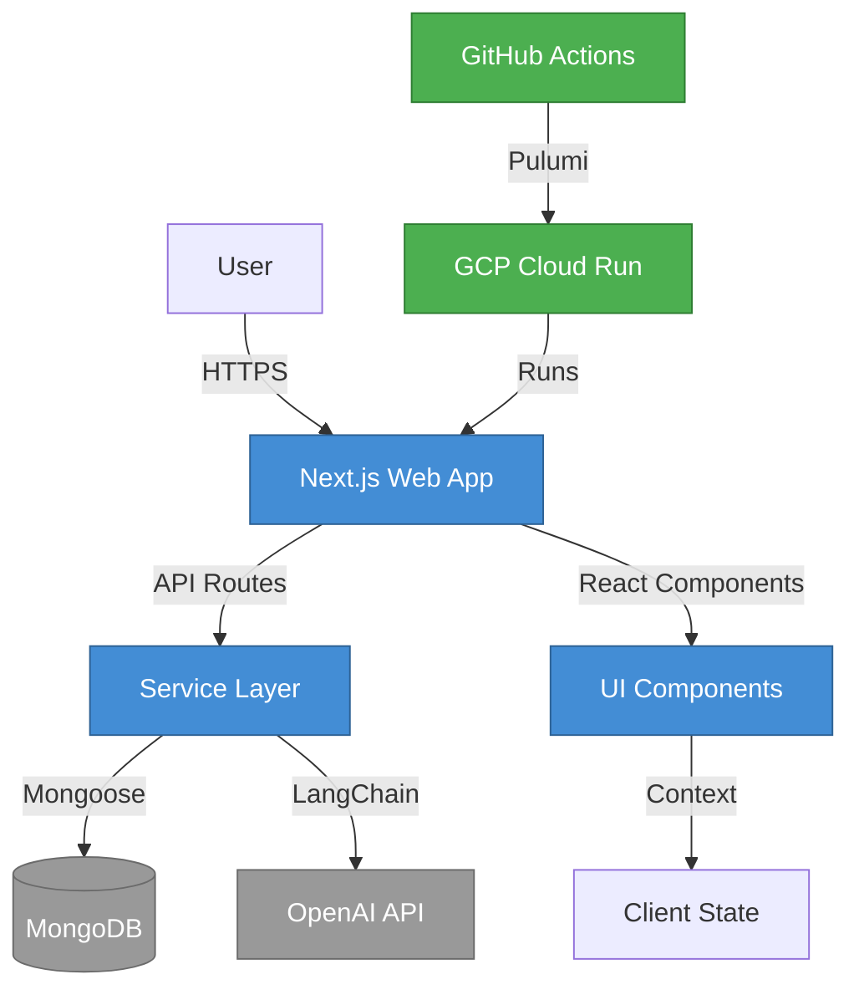

# Technical Architecture

## Executive Summary

ProcureFlow technical architecture built on Next.js 15 (App Router), TypeScript, MongoDB/Mongoose, and LangChain/OpenAI. Architecture follows feature-based structure with service layer pattern, domain-driven design, and agent-first interaction model. Deployment via Docker Compose (local) and GCP Cloud Run (production). Infrastructure as Code with Pulumi, CI/CD with GitHub Actions. System designed for horizontal scaling, stateless operation, and cost optimization (< $50/month).

---

## Architecture Overview

This section documents the complete technical architecture organized into focused subsections:

| Page                                       | Description                                              | Last Updated |
| ------------------------------------------ | -------------------------------------------------------- | ------------ |
| **[C4 Model](/tech/c4)**                   | Architecture diagrams (Context, Container, Component)    | Nov 12, 2025 |
| **[Technology Stack](/tech/stack)**        | Tech stack with versions, decision rationale, trade-offs | Nov 12, 2025 |
| **[Design Patterns](/tech/patterns)**      | Architectural patterns and decision log                  | Nov 12, 2025 |
| **[Infrastructure](/tech/infrastructure)** | Deployment, environments, CI/CD, observability           | Nov 12, 2025 |

---

## Quick Navigation

### For New Developers

1. **Understand System Context**: Start with [C4 Context Diagram](/tech/c4/context)
2. **Learn Container Architecture**: Review [C4 Container Diagram](/tech/c4/container)
3. **Study Technology Stack**: Read [Technology Stack](/tech/stack)
4. **Review Patterns**: Understand [Design Patterns](/tech/patterns)
5. **Setup Infrastructure**: Follow [Infrastructure Guide](/tech/infrastructure)

### For Architects

1. **System Boundary**: [C4 Context Diagram](/tech/c4/context)
2. **Component Responsibilities**: [C4 Container Diagram](/tech/c4/container)
3. **Technical Decisions**: [Decision Log](/tech/patterns#decision-log)
4. **Constraints**: [Stack Trade-offs](/tech/stack#constraints)

### For DevOps/SRE

1. **Deployment Architecture**: [Infrastructure](/tech/infrastructure)
2. **Environments Configuration**: [Environments](/tech/infrastructure#environments)
3. **CI/CD Pipeline**: [Deployment Pipeline](/tech/infrastructure#ci-cd)
4. **Monitoring Setup**: [Observability](/tech/infrastructure#observability)

---

## Key Architecture Principles

### 1. Feature-Based Structure

All business logic organized in `packages/web/src/features/` with isolated, self-contained features:

```
features/
  <feature-name>/
    components/        # React UI components
    lib/              # Service layer (*.service.ts)
    index.ts          # Public API exports
    types.ts          # Feature-specific types
```

### 2. Service Layer Pattern

Business logic always in `*.service.ts` files, never in route handlers:

- Database-agnostic interfaces (domain entities in/out)
- Framework-agnostic (usable in API routes, server components, background jobs)
- Validated with custom error classes

### 3. Domain-Driven Design

TypeScript interfaces in `domain/entities.ts` represent business concepts:

- Framework-agnostic domain models
- Services return domain entities, not Mongoose documents
- Clear separation from database schemas

### 4. Agent-First Interaction

AI agent as primary interaction model:

- LangChain integration with OpenAI function calling
- 8 integrated tools (search, register, cart operations, checkout)
- Conversation persistence for context

### 5. Reliability Patterns

- MongoDB connection retry with exponential backoff
- Circuit breaker for OpenAI API (5-failure threshold)
- Graceful degradation (agent unavailable → catalog UI)
- Health checks for monitoring

---

## Architecture Diagram (Simplified)



---

## Technology Stack Highlights

### Core Framework

- **Next.js 15.1.4**: App Router, React Server Components, API Routes
- **React 19.2.0**: UI library with concurrent features
- **TypeScript 5.7.3**: Strict mode enabled

### Backend & Data

- **MongoDB 6.x**: Document database (Atlas M0 free tier)
- **Mongoose 8.9.4**: ODM with schema validation
- **NextAuth.js 4.24.11**: Authentication with JWT sessions

### AI & Agent

- **LangChain 0.3.19**: AI orchestration framework
- **OpenAI SDK 4.77.0**: LLM API client (GPT-3.5-turbo)
- **Function Calling**: 8 tools for procurement workflows

### Infrastructure

- **GCP Cloud Run**: Serverless container platform
- **Pulumi 3.145.0**: Infrastructure as Code
- **Docker**: Container runtime (Compose for local dev)
- **GitHub Actions**: CI/CD pipeline

---

## Deployment Environments

| Environment    | Purpose                   | Hosting              | Database            | Auto-Scaling             |
| -------------- | ------------------------- | -------------------- | ------------------- | ------------------------ |
| **Local**      | Development               | Docker Compose       | MongoDB (container) | No                       |
| **Dev**        | Integration testing       | GCP Cloud Run (dev)  | MongoDB Atlas M0    | 0-10 instances           |
| **Staging**    | Pre-production validation | GCP Cloud Run (dev)  | MongoDB Atlas M0    | 0-10 instances           |
| **Production** | Live service              | GCP Cloud Run (prod) | MongoDB Atlas M0    | 1-100 instances (future) |

---

## Cross-References

### Related Documentation

- **Product**: [PRD Overview](/prd), [Features](/prd/features)
- **API**: [OpenAPI Specification](/openapi/specification)
- **Testing**: [Testing Strategy](/testing)
- **Operations**: [Deployment Strategy](/operations/deploy), [Rollback](/operations/rollback)
- **Runbooks**: [Local Development](/runbooks/local-dev), [Troubleshooting](/runbooks/troubleshooting)

---

**Need more detail?** Navigate to specific sections using the table above or the sidebar navigation.

**Last Updated**: 2025-11-12
