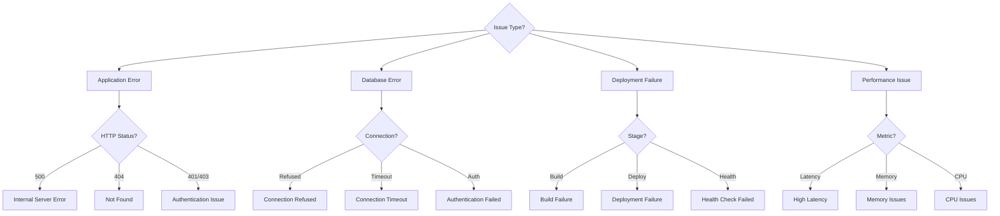

# Runbook: Troubleshooting

Diagnose and resolve common ProcureFlow failures.

## Metadata

- **Owner**: Platform Team
- **Estimated Duration**: 5-30 minutes (varies by issue)
- **Complexity**: 🟡 Medium
- **Last Verified**: Nov 12, 2025

---

## Diagnostic Flowchart



---

## Common Issues

### 1. MongoDB Connection Refused

**Symptom**: `Error: ECONNREFUSED 127.0.0.1:27017`

**Diagnosis**:
```powershell
# Check if MongoDB container running
docker ps | Select-String "mongo"

# Check Docker Desktop status
Get-Service -Name "Docker Desktop Service"
```

**Solution**:
```powershell
# Restart MongoDB
pnpm docker:down
pnpm docker:up

# Verify connection
mongosh mongodb://localhost:27017/procureflow
```

---

### 2. Text Index Not Found

**Symptom**: Catalog search returns empty results

**Diagnosis**:
```powershell
# Check if text index exists
mongosh mongodb://localhost:27017/procureflow --eval "db.items.getIndexes()"
```

**Solution**:
```powershell
# Create text index
pnpm --filter web db:create-text-index

# Verify
mongosh mongodb://localhost:27017/procureflow --eval "db.items.find({$text: {$search: 'chair'}}).count()"
```

---

### 3. NextAuth Session Invalid

**Symptom**: `Error: Invalid session` or redirected to login repeatedly

**Diagnosis**:
```powershell
# Check NEXTAUTH_SECRET in .env.local
cat packages\web\.env.local | Select-String "NEXTAUTH_SECRET"

# Verify NEXTAUTH_URL matches your local URL
cat packages\web\.env.local | Select-String "NEXTAUTH_URL"
```

**Solution**:
```powershell
# Generate new secret
openssl rand -base64 32

# Update .env.local
NEXTAUTH_SECRET=<generated-secret>
NEXTAUTH_URL=http://localhost:3000

# Restart dev server
```

---

### 4. Port Already in Use

**Symptom**: `Error: Port 3000 is already in use`

**Diagnosis**:
```powershell
# Find process using port 3000
Get-NetTCPConnection -LocalPort 3000 | Select-Object OwningProcess
```

**Solution**:
```powershell
# Kill process
Get-Process -Id (Get-NetTCPConnection -LocalPort 3000).OwningProcess | Stop-Process -Force

# Or use different port
pnpm dev -- -p 3001
```

---

### 5. Agent Not Responding

**Symptom**: Agent chat returns errors or no response

**Diagnosis**:
```powershell
# Check OPENAI_API_KEY
cat packages\web\.env.local | Select-String "OPENAI_API_KEY"

# Test OpenAI API
curl https://api.openai.com/v1/models `
  -H "Authorization: Bearer YOUR_API_KEY"
```

**Solution**:
```powershell
# Option 1: Set valid API key
OPENAI_API_KEY=sk-...

# Option 2: Disable AI features
OPENAI_API_KEY=not-set

# Restart dev server
```

---

### 6. Cloud Run Deployment Failed

**Symptom**: GitHub Actions workflow fails at deploy step

**Diagnosis**:
1. Check GitHub Actions logs
2. Look for Pulumi errors
3. Verify GCP quotas and permissions

**Solution**:
```powershell
# Manual deployment
cd packages\infra\pulumi\gcp
pulumi preview  # Check for errors
pulumi up --yes

# Check Cloud Run logs
gcloud run services logs read procureflow-web --region=us-central1
```

---

### 7. Health Check Failing

**Symptom**: `/api/health` returns non-200 status

**Diagnosis**:
```powershell
# Test health endpoint
curl http://localhost:3000/api/health -v

# Check MongoDB connection
curl http://localhost:3000/api/health -v
```

**Solution**:
- If database check fails → Fix MongoDB connection
- If service unhealthy → Check application logs
- If route not found → Verify API routes exist

---

### 8. High Memory Usage

**Symptom**: Application slow, memory growing over time

**Diagnosis**:
```powershell
# Check memory usage (local)
Get-Process node | Select-Object WS, PM

# Check Cloud Run metrics
gcloud monitoring time-series list \
  --filter='metric.type="run.googleapis.com/container/memory/utilizations"'
```

**Solution**:
1. Restart application (clears memory)
2. Check for memory leaks in code
3. Increase Cloud Run memory limit
4. Review MongoDB connection pooling

---

### 9. Slow Catalog Search

**Symptom**: Search takes >2 seconds

**Diagnosis**:
```powershell
# Test search performance
Measure-Command {
  curl "http://localhost:3000/api/items?query=chair"
}

# Check if text index exists
mongosh --eval "db.items.getIndexes()"
```

**Solution**:
```powershell
# Ensure text index exists
pnpm --filter web db:create-text-index

# Check index usage
mongosh --eval "db.items.find({$text: {$search: 'chair'}}).explain()"
```

---

### 10. Build Failures

**Symptom**: `pnpm build` fails with errors

**Diagnosis**:
```powershell
# Check TypeScript errors
pnpm --filter web build

# Check ESLint errors
pnpm --filter web lint
```

**Solution**:
```powershell
# Fix TypeScript errors
# (Check error messages and fix code)

# Auto-fix ESLint issues
pnpm --filter web lint:fix

# Clean and rebuild
Remove-Item -Recurse -Force packages\web\.next
pnpm --filter web build
```

---

## Escalation Matrix

| Issue Severity | Response Time | Escalation Path |
|----------------|---------------|-----------------|
| 🟢 **Low** (dev only) | 24 hours | #dev-support Slack |
| 🟡 **Medium** (affects dev) | 4 hours | Platform Team lead |
| 🔴 **High** (affects prod) | 1 hour | Tech Lead + on-call |
| 🔴 **Critical** (service down) | 15 minutes | Page on-call engineer |

---

## Diagnostic Commands Reference

```powershell
# Check application status
curl http://localhost:3000/api/health

# Check MongoDB status
docker ps | Select-String "mongo"
mongosh mongodb://localhost:27017/procureflow

# Check logs
docker logs procureflow-mongo --tail 50
Get-Content packages\web\.next\trace | Select-Object -Last 50

# Check processes
Get-Process node
Get-NetTCPConnection -LocalPort 3000

# Check Cloud Run
gcloud run services describe procureflow-web --region=us-central1
gcloud run services logs read procureflow-web --region=us-central1 --limit=50
```

---

## References

- **[Local Development](/runbooks/local-dev)** - Setup procedures
- **[Deployment](/runbooks/build-and-deploy)** - Deployment procedures
- **[Rollback](/runbooks/rollback)** - Rollback procedures
- **[Infrastructure](/tech/infrastructure)** - Technical architecture

---

**Last Updated**: Nov 12, 2025  
**Status**: ✅ Verified
