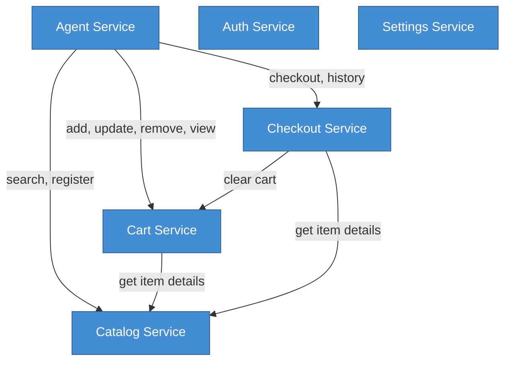

# C3 — Component Diagram

## Note

The C3 (Component) level diagram is optional for ProcureFlow v1.0 as the [C2 Container Diagram](/tech/c4/container) already provides sufficient detail for the current system scope.

## When to Add C3

A Component diagram would be valuable when:

1. **Service Layer Complexity Increases**: Currently 6 services; if this grows to 15+ with complex interactions
2. **Microservices Migration**: If we split into separate deployment units
3. **Team Growth**: When multiple teams own different components
4. **Internal API Contracts**: When services need formal API boundaries

## Current Component Structure

The Service Layer container is organized into 6 components (services):

### 1. Catalog Service

**Responsibilities**:
- Search catalog items with full-text index
- Register new items with duplicate detection
- Retrieve single items by ID

**Methods**:
- `searchItems(query, limit)`
- `createItem(data, userId, confirmDuplicate?)`
- `getItemById(id)`

### 2. Cart Service

**Responsibilities**:
- Add items to cart with price snapshots
- Update item quantities
- Remove items from cart
- Retrieve cart with analytics
- Clear cart (called by checkout service)

**Methods**:
- `addToCart(userId, itemId, quantity)`
- `updateCartItem(userId, itemId, quantity)`
- `removeFromCart(userId, itemId)`
- `getCart(userId)`
- `clearCart(userId)`

### 3. Checkout Service

**Responsibilities**:
- Validate cart before checkout
- Generate purchase requests with immutable snapshots
- Retrieve purchase request list and details

**Methods**:
- `createPurchaseRequest(userId, notes?)`
- `getPurchaseRequests(userId)`
- `getPurchaseRequestById(userId, id)`

### 4. Agent Service

**Responsibilities**:
- Handle agent chat messages
- Execute tools (search, register, add_to_cart, etc.)
- Manage conversation persistence
- Integrate with OpenAI via LangChain

**Methods**:
- `handleAgentMessage(userId, message, conversationId?)`
- `getConversations(userId)`
- `deleteConversation(userId, conversationId)`

**Tool Execution**:
- Calls catalog service for `search_catalog`, `register_item`
- Calls cart service for `add_to_cart`, `view_cart`, `remove_from_cart`
- Calls checkout service for `checkout`, `get_purchase_history`

### 5. Auth Service

**Responsibilities**:
- Register new users with bcrypt hashing
- Validate login credentials
- Create NextAuth.js sessions

**Methods**:
- `registerUser(email, password, name)`
- `validateCredentials(email, password)`
- `createSession(userId)`

### 6. Settings Service

**Responsibilities**:
- Retrieve user profile
- Update user settings (future)

**Methods**:
- `getUserProfile(userId)`
- `updateUserProfile(userId, updates)` (future)

---

## Service Dependencies

---

## Future Component Breakdown (v2.0+)

If we add C3-level detail, potential components:

### Approval Engine Component

- Auto-approval rule evaluation
- Workflow state machine
- Notification triggers

### Analytics Engine Component

- Spending aggregation
- Category analysis
- Supplier consolidation recommendations

### Notification Component

- Email template rendering
- Notification queue management
- Delivery tracking

### Integration Adapter Component

- ERP API clients (SAP, Oracle)
- Supplier API clients
- Data transformation layers

---

## References

- **[C2 Container Diagram](/tech/c4/container)** - Container-level architecture
- **[Design Patterns](/tech/patterns)** - Service layer pattern details
- **[Project Structure](https://github.com/guiofsaints/procureflow#project-structure)** - Code organization

---

**Last Updated**: 2025-11-12  
**Owner**: Architecture Team  
**Status**: Optional (deferred to v2.0+)
